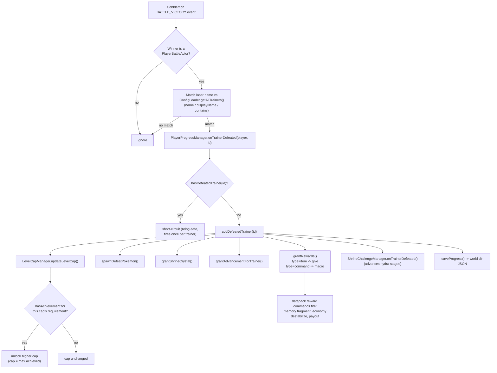
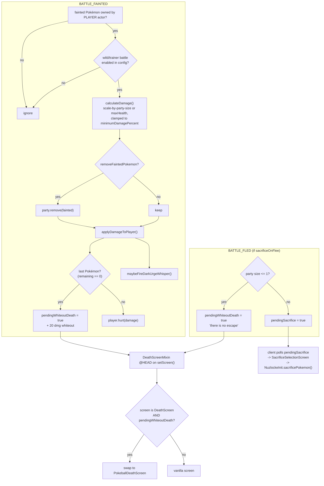
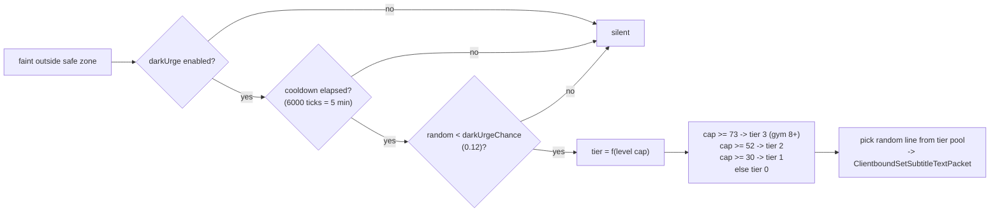
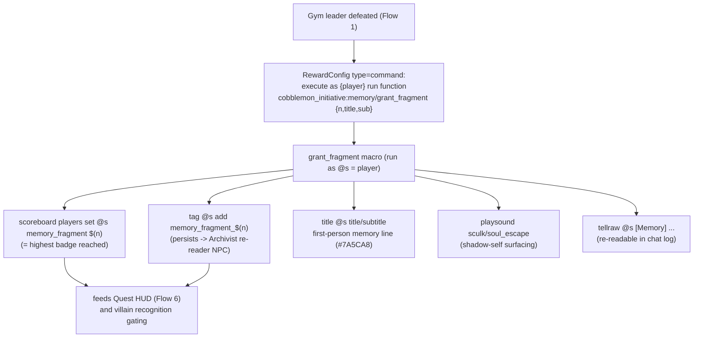
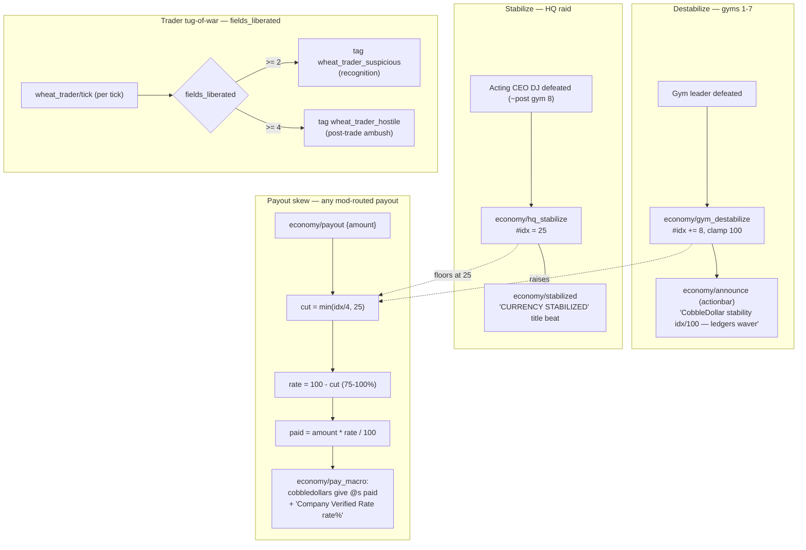
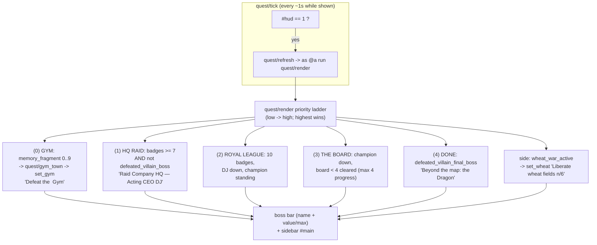

This page traces the **runtime workflows** that connect the mod's Java event handlers to its datapack functions and on-screen player experience. Each flow is shown as a Mermaid diagram followed by a short walk-through.

For the static picture — subsystems, entrypoints, persistence — see [[Architecture Overview]]. This page is the *dynamic* counterpart: what actually happens when the player wins a battle, faints, walks past an NPC, or earns a badge.

A recurring pattern ties almost every flow together:

> **Java decides, the datapack performs.** Java event handlers detect game events and resolve state (who was defeated, is the player in a safe zone, what tier is the whisper). They then hand off player-facing *theatre* — titles, sounds, scoreboards, boss bars, currency payouts — to `.mcfunction` macros via the `command` reward type. The two layers talk through **scoreboards, tags, and command storage**, never through tight coupling.

---

## 1. Battle Victory → Badge Progression → Level Cap

When the player wins a battle, Cobblemon fires `BATTLE_VICTORY`. The mod matches the loser against the trainer database and, on a match, runs the full defeat pipeline exactly once.



**How it reads in play.** The handler iterates winners; only a `PlayerBattleActor` counts. For each loser it scans every loaded `TrainerConfig` and matches on `name`, `displayName`, or a substring of the loser's display name. The first match calls `onTrainerDefeated`, which is **idempotent** — `hasDefeatedTrainer` short-circuits a re-defeat, so a gym leader's rewards, memory fragment, and economy beat each fire exactly once per world even across relogs.

**Rewards are the bridge to the datapack.** A reward of `type:"item"` becomes a `give`. A reward of `type:"command"` is the hook for everything narrative: `{player}` and `{uuid}` are substituted and the command runs at permission level 4. This is how a single gym victory triggers the memory fragment (Flow 4) and the economy destabilize/payout (Flow 5).

**Level caps are gated on achievements, not on the raw victory.** `updateLevelCap` walks `levelcaps.json` and unlocks a tier only when the player *has* the matching achievement. The cap is always the **maximum achieved** — it never regresses. The route ladder runs 30 (Takehara/Bug) up to 85 (Scorchspire/Fire), then 100 on the Royal League Champion.

---

## 2. Pokémon Faint → Nuzlocke Damage / Sacrifice → Pokéball Death Screen + Dark Urge

Two Cobblemon events drive the Nuzlocke layer: `BATTLE_FAINTED` (a party Pokémon goes down) and `BATTLE_FLED` (the player ran). Both can end in the custom Pokéball death screen; faints can also surface a Dark Urge whisper.





**The damage half.** Only faints owned by the **player** actor count, and only if the battle category (wild vs trainer) is enabled in config. Damage is `health / partySize` when scaling is on, otherwise full max-health, clamped up to a configurable minimum. If `removeFaintedPokemon` is set, the Pokémon is released from the party — true Nuzlocke. When the last Pokémon falls, `pendingWhiteoutDeath` is latched.

**The death screen is a mixin swap.** `DeathScreenMixin` injects at the head of `Minecraft.setScreen()`. When vanilla tries to show the `DeathScreen` and `pendingWhiteoutDeath` is set, it consumes the flag and substitutes the custom `PokeballDeathScreen` — the in-fiction "you whited out" panel rather than the generic death overlay.

**Flee is split server/client.** `BATTLE_FLED` (when `sacrificeOnFlee` is on) either kills outright (one Pokémon left — *"there is no escape"*) or sets `pendingSacrifice`. The client tick polls that flag, shows `SacrificeSelectionScreen`, and routes the chosen Pokémon back through `NuzlockeInit.sacrificePokemon()`. See [[Architecture Overview]] for why this hop exists.

**The Dark Urge whisper** rides on a faint *outside a safe zone*. It is triple-gated: the feature must be enabled, the per-player 5-minute cooldown must have elapsed, and a 12% roll must hit. The **tier escalates with the level cap** — tier 3 (the plainest shadow-self voice) is reserved for cap ≥ 73, i.e. **after the gym-7 "you signed this charter" fragment**. The chosen line is sent as a subtitle packet — quiet, first-person, unsettled, never naming the truth before the post-League reveal.

---

## 3. NPC Sight → `can_see_player` Scoreboard → Datapack Reaction

NPC Sight is a per-tick raycaster that publishes a single fact — *can this NPC currently see a player?* — to a scoreboard objective. It never triggers gameplay itself; datapacks observe the objective and decide what to do.

```mermaid
sequenceDiagram
  participant Tick as ServerTick (END)
  participant Mgr as NpcSightManager
  participant Store as NpcSightStorage
  participant SB as Scoreboard can_see_player
  participant DP as Datapack (wheat_trader/tick)

  Tick->>Mgr: tick(server)
  Note over Mgr: throttle — every TICK_INTERVAL (~4x/sec)
  Mgr->>Store: snapshot getAll()
  loop each registered NPC (by UUID)
    Mgr->>Mgr: findEntity(uuid); alive?
    Mgr->>Mgr: findNearestPlayer(range+1)
    Mgr->>Mgr: checkSight() — eye->eye raycast<br/>+ FOV dot >= cos(60°)
    Mgr->>SB: updateScoreboard(npc, canSee ? 1 : 0)
    alt mode = PURSUE
      Mgr->>Mgr: FOLLOW_PLAYER objective
    else mode = APPROACH_ONCE
      Mgr->>Mgr: one-shot approach (latched until reset)
    else mode = DIALOG (default)
      Mgr->>Mgr: open dialog once per "seen session"
    end
  end
  DP->>SB: @e[scores={can_see_player=1}]
  DP->>DP: gate recognition / pursue / ambush logic
```

**What the manager computes.** On a throttled server tick it snapshots the registered NPCs (so commands can mutate storage safely mid-iteration), then for each one finds the entity by UUID, picks the nearest player within the NPC's effective range, and runs `checkSight()` — a raw eye-to-eye raycast combined with a field-of-view test (the player must be within a ~60° cone). The boolean result is written to `can_see_player` for that NPC's entity.

**Three behaviour modes** layer on top of the same sight result: `DIALOG` opens an Easy NPC dialog once per "seen session" (re-armed when sight is lost), `PURSUE` attaches a `FOLLOW_PLAYER` objective, and `APPROACH_ONCE` is a latched one-shot that needs `/npcsight reset` to fire again. Optional `meetTag`/`stopTag` let a sighting apply or be suppressed by scoreboard tags.

**Scoreboard as IPC.** Datapacks query `@e[scores={can_see_player=1}]` and react however they like — the villain-recognition dialogue and the wheat-trader poller both read this objective. The Java side stays oblivious to those reactions. See the [[Commands]] page for the full `/npcsight` surface.

---

## 4. Memory Fragments — Gym Defeat → `grant_fragment` Macro → Title / Tag / Score

Each gym leader carries a `type:"command"` reward that runs the badge-gated memory drip. Because it rides the once-per-trainer defeat pipeline from Flow 1, every fragment fires exactly once and survives relogs.



**One macro, three durable effects.** `memory/grant_fragment` writes a persistent **PLAYER_TAG** `memory_fragment_<n>` (the town Archivist NPC reads this to let the player re-read the line later), sets the **`memory_fragment` score** to `n` (the canonical "badges beaten" counter), and delivers the **cinematic title + subtitle + chat echo** with a low sculk/soul sound.

**The narrative ramp lives in the JSON arguments.** Fragment 1 is the faintest unease (*"...have we met before?"*); gym 7 is the inflection — *"you signed this charter"* — and the outright reveal is held for the post-Royal-League beat. The score and tag set here are what gate the **Dark Urge tier** (Flow 2), the **villain recognition dialogue** (do-I-know-you → closed-file → compelled), and the **Quest HUD objective ladder** (Flow 6).

---

## 5. Wheat War Economy — Destabilize / Stabilize / Payout Skew / Trader Tug-of-War

The economy is a single 0–100 index, `cd_instability`, that the gym journey pushes up and the HQ raid + field liberation push back down. It also skews mod-routed payouts and arms the wheat-trader recognition/ambush escalation.



**Rise.** Each gym 1–7 victory runs `economy/gym_destabilize`: `cd_instability += 8` (clamped to 100), then `economy/announce` narrates the slip on the action bar — *"the Company's ledgers waver."* The index is seeded to 0 only when unset, so it persists as world data across relogs.

**Stabilize.** Defeating **Acting CEO DJ** in the HQ raid (around gym 8) runs `economy/hq_stabilize`, which hard-sets the index to the post-raid floor of **25** and plays the earned *"CURRENCY STABILIZED"* title beat with a beacon-activate chime. This is the single biggest economic turning point in the run.

**Payout skew.** Mod-routed CobbleDollar payouts go through `economy/payout`, which computes a haircut: `cut = min(idx/4, 25)`, `rate = 100 - cut`. At peak instability the player still receives **75%** of face value; once DJ stabilizes the index to 25, the worst case is ~6% off. `pay_macro` then does the actual `cobbledollars give @s` and shows the "Company Verified Rate". Battle prizes paid directly by TBCS stay flat — only mod-routed payouts skew.

**Trader tug-of-war.** `wheat_trader/tick` reads the shared `fields_liberated` counter and escalates traders in one-way, relog-safe tiers: 0–1 fields → trade only; **2+ → recognition** (`wheat_trader_suspicious`); **4+ → hostile** (`wheat_trader_hostile`) — at which point the trader's dialog offers the battle directly (`tbcs battle … vs wheat_trader_ambush`). **Field Liberation** increments the counter: a field guard's command reward fires `liberation/free_field {field:"<id>"}`, which (idempotently, via the per-field `field_freed` latch) bumps `fields_liberated`, claws `cd_instability` back **−6**, tags `wheat_war_active` (lighting the HUD wheat line, Flow 6), and — for FARM zones gated with `activeWhenObjective` — flips the occupied field into active safe farmland.

**The Granary (wheat retail).** The Company Granary sells goods **for wheat**, item-for-item. Its offers are baked per shop tier (`scripts/generate_granary_tiers` → `granary_keeper_<tier>.npc.snbt`) on a **bell curve**: wheat cost = `baseWheat × (1 + (56 − instability) × 0.012)`, so wheat buys the most at the gym-7 instability peak and less on either side. `ShopTierManager.applyTier` fires `granary/apply_<tier>` after every CobbleDollars shop swap, re-importing the tier preset onto every recorded Granary NPC — the two catalogs move in lockstep. At hostile tier the keeper still trades but arms `granary_ambush_armed`; `granary/tick` counts ~15s and fires the one-shot post-trade ambush (`tbcs battle … vs granary_ambush`, latched by `defeated_granary_ambush`).

---

## 6. Quest HUD — Derive State → Render Ladder → Boss Bar + Sidebar

The Quest HUD invents **no new quest state**. It re-derives the current objective every second from data the other flows already wrote — `memory_fragment` (badges), `defeated_*` tags, and `fields_liberated` — and paints a boss bar plus a sidebar line.



**The poller.** `quest/tick` (bound to `#minecraft:tick`) throttles itself to once per second and only recomputes while `#hud == 1`. `quest/refresh` runs `quest/render` as the player.

**The priority ladder.** `render` evaluates branches **low priority first so the highest wins**: the gym objective (next town derived from `memory_fragment` 0–9) is the floor; once 7 badges are in, the **HQ raid outranks gyms 8–10** until DJ falls; then the Royal League; then hunting the Board (with the boss bar repurposed to a 0–4 board-cleared counter); and finally the post-game *"Beyond the map: the Dragon"* line once The Founder is down. A wheat-war side line appears separately when `wheat_war_active` is tagged, showing `Liberate wheat fields n/6`.

**Toggle.** `/ca quest show|hide|refresh` flips `#hud` and the sidebar display. `quest/load` is relog-safe — it guards one-time defaults with `#init` so a `/reload` respects the player's current show/hide choice. The HUD logic lives entirely in the datapack; the command just dispatches to `quest/{show,hide,refresh}`. Full command details are on the [[Commands]] page.

---

### See also

- [[Architecture Overview]] — subsystems, entrypoints, persistence, and the static structure these flows move through.
- [[Commands]] — the admin/player command surface that drives and inspects these systems.
- [[Guidebook Overview]] — where each of these beats lands along the campaign route.
