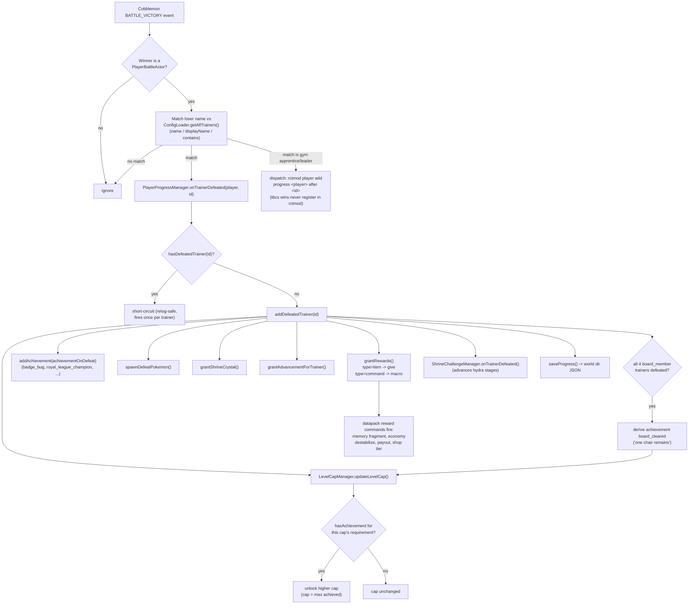
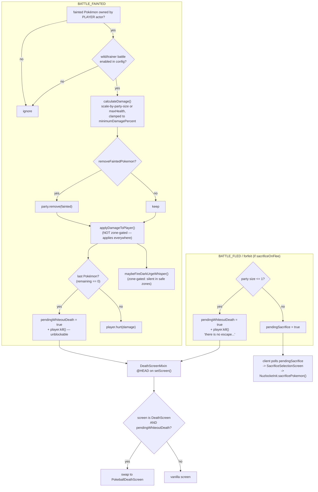
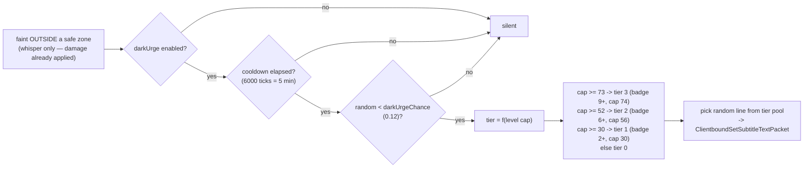
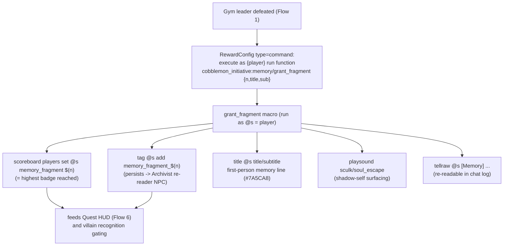
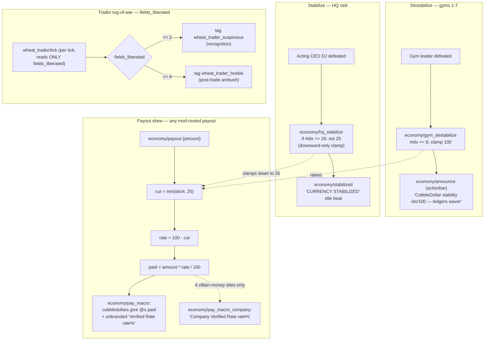
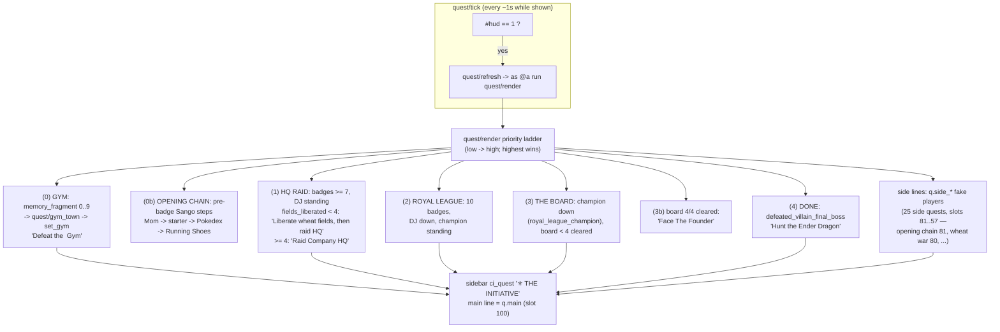
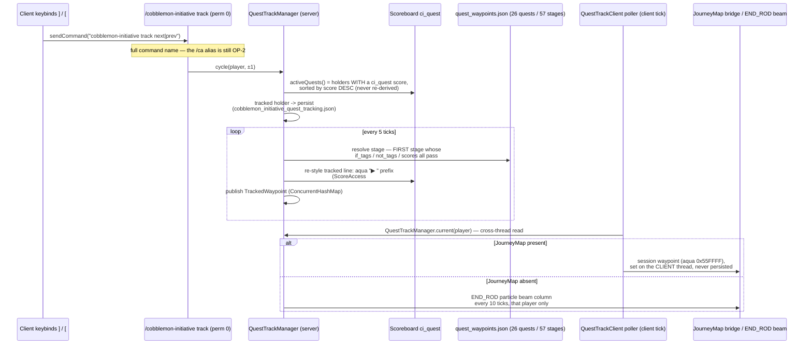
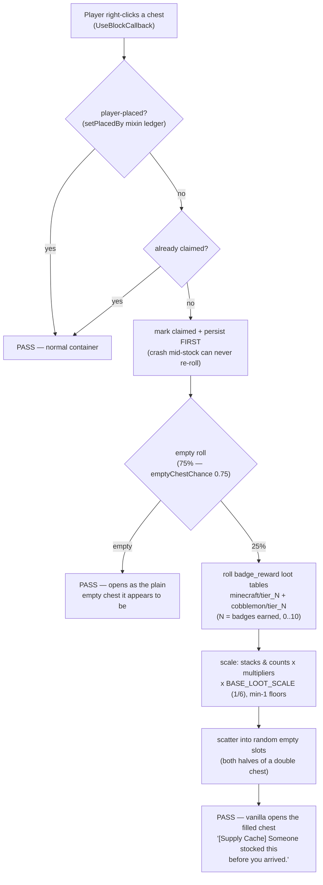
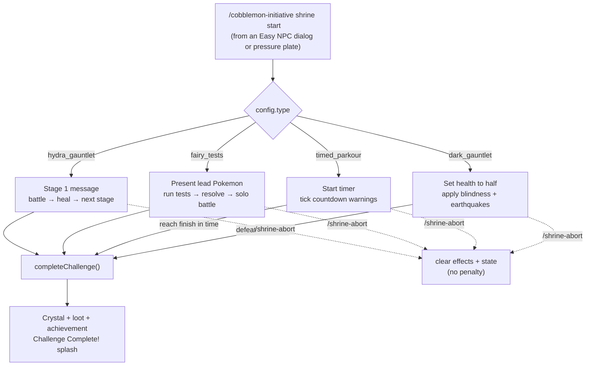

This page traces the **runtime workflows** that connect the mod's Java event handlers to its datapack functions and on-screen player experience. Each flow is shown as a Mermaid diagram followed by a short walk-through.

> [!WARNING]
> **Spoilers — Acts II and III.** These flows document the villain-plot machinery end to end: the HQ raid, the Board of Directors, and the Founder reveal. If you are playing blind, stick to [[Guidebook Act I]].

For the static picture — subsystems, entrypoints, persistence — see [[Architecture Overview]]. This page is the *dynamic* counterpart: what actually happens when the player wins a battle, faints, walks past an NPC, earns a badge, tracks a quest, opens a chest, or starts a shrine trial.

A recurring pattern ties almost every flow together:

> **Java decides, the datapack performs.** Java event handlers detect game events and resolve state (who was defeated, is the player in a safe zone, what tier is the whisper). They then hand off player-facing *theatre* — titles, sounds, scoreboards, boss bars, currency payouts — to `.mcfunction` macros via the `command` reward type. The two layers talk through **scoreboards, tags, and command storage**, never through tight coupling.

---

## 1. Battle Victory → Badge Progression → Level Cap

When the player wins a battle, Cobblemon fires `BATTLE_VICTORY`. The mod matches the loser against the trainer database and, on a match, runs the full defeat pipeline exactly once.



**How it reads in play.** The handler iterates winners; only a `PlayerBattleActor` counts. For each loser it scans every loaded `TrainerConfig` and matches on `name`, `displayName`, or a substring of the loser's display name. The first match calls `onTrainerDefeated`, which is **idempotent** — `hasDefeatedTrainer` short-circuits a re-defeat, so a gym leader's rewards, memory fragment, and economy beat each fire exactly once per world even across relogs. For gym **apprentice/leader** wins the handler also dispatches `rctmod player add progress <player> after <id>` — tbcs battles bypass rctmod's defeat memory entirely, so this is the only bridge that keeps rctmod's series graph in step.

**Rewards are the bridge to the datapack.** A reward of `type:"item"` becomes a `give`. A reward of `type:"command"` is the hook for everything narrative: `{player}` and `{uuid}` are substituted and the command runs at permission level 4. This is how a single gym victory triggers the memory fragment (Flow 4) and the economy destabilize/payout (Flow 5). Crucially, `onTrainerDefeated` also writes the trainer's **`achievementOnDefeat`** into the earned-achievements set — the level caps are dead without it.

**Level caps are gated on achievements, not on the raw victory.** `updateLevelCap` walks `levelcaps.json` and unlocks a tier only when the player *has* the matching achievement. The cap is always the **maximum achieved** — it never regresses. The ladder runs **15** (start) / **22** / **30** / **37** / **44** / **50** / **56** / **62** / **68** / **74** / **80** (gym 10), then **85** on `royal_league_champion` and **100** on `board_cleared` — a *derived* achievement granted the moment all four `board_member` trainers are defeated (Board members carry no per-trainer achievement), and the gate right before the Founder.

**Prerequisite chains gate encounter *availability* the same way.** `TrainerConfig.prerequisites` lists what must already be beaten before an encounter opens: the villain grunt ladder steps up with badges (`villain_grunt_3` — the Act I "Contractors" — unlocks on the Grass badge, `badge_grass`), the Royal League chains each member on the previous, and every Board member requires `prerequisites: ["villain_boss", "royal_champion"]` — Acting CEO DJ and the Champion. Board and Founder display names ship `§k`-obfuscated (the "static" nameplates the guidebook describes); the Founder (`villain_final_boss`) never de-obfuscates — its defeat grants the canon `company_overthrown` flag, and only the defeat line speaks a name.

**The cap is enforced by the mod itself.** An `EXPERIENCE_GAINED_EVENT_PRE` subscriber clamps every XP gain at experience-to-cap (Cobblemon auto-refunds candies when the applied gain is 0, and the player gets an actionbar notice), backed by a `LEVEL_UP_EVENT` floor for paths that adjust the level directly. rctmod's competing clamp is held off by the `RctmodServerConfig` self-heal — see [[Architecture Overview]].

---

## 2. Pokémon Faint → Nuzlocke Damage / Sacrifice → Pokéball Death Screen + Dark Urge

Two Cobblemon events drive the Nuzlocke layer: `BATTLE_FAINTED` (a party Pokémon goes down) and `BATTLE_FLED` (the player ran). Both can end in the custom Pokéball death screen; faints can also surface a Dark Urge whisper.





**The damage half.** Only faints owned by the **player** actor count, and only if the battle category (wild vs trainer) is enabled in config. Damage is `health / partySize` when scaling is on, otherwise full max-health, clamped up to a configurable minimum. If `removeFaintedPokemon` is set, the Pokémon is released from the party — true Nuzlocke. **There is no safe-zone gate on any of this** — faint damage and party removal apply everywhere, towns included; only the whisper (below) and hostile mob spawns are zone-aware.

**A whiteout is a kill, not a damage number.** When the last Pokémon falls, the mod latches `pendingWhiteoutDeath` and calls `player.kill()` — a guaranteed, unblockable death that bypasses armor, absorption, and Resistance. (The "20 damage" figure floating around belongs *only* to the `/nuzlocke deathscreen` test command.)

**The death screen is a mixin swap.** `DeathScreenMixin` injects at the head of `Minecraft.setScreen()`. When vanilla tries to show the `DeathScreen` and `pendingWhiteoutDeath` is set, it consumes the flag and substitutes the custom `PokeballDeathScreen` — the in-fiction "you whited out" panel rather than the generic death overlay.

**Flee is split server/client.** `BATTLE_FLED` (when `sacrificeOnFlee` is on) either **kills outright and immediately** — one Pokémon left means `pendingWhiteoutDeath` *and* `player.kill()` in the same breath (*"You fled with only one Pokémon! There is no escape..."*), and forfeiting a trainer battle gets the same treatment — or sets `pendingSacrifice`. The client tick polls that flag, shows `SacrificeSelectionScreen`, and routes the chosen Pokémon back through `NuzlockeInit.sacrificePokemon()`. See [[Architecture Overview]] for why this hop exists.

**The Dark Urge whisper** rides on a faint *outside a safe zone* — the one part of the faint pipeline that *is* zone-gated. It is triple-gated: the feature must be enabled, the per-player 5-minute cooldown must have elapsed, and a 12% roll must hit. The **tier escalates with the level cap** — the thresholds are 30 / 52 / 73 (`NuzlockeConfig` defaults), which under the current ladder map to **tier 1 from badge 2** (cap 30), **tier 2 from badge 6** (cap 56), and **tier 3 from badge 9** (cap 74 — note gym 8's cap is 68, so tier 3 is *not* a gym-8 beat). The chosen line is sent as a subtitle packet — quiet, first-person, unsettled, never naming the truth before the post-League reveal.

---

## 3. NPC Sight → `can_see_player` Scoreboard → Datapack Reaction

NPC Sight is a throttled-tick raycaster that publishes a single fact — *can this NPC currently see a player?* — to a scoreboard objective. It never triggers gameplay itself; datapacks observe the objective and decide what to do.

```mermaid
sequenceDiagram
  participant Tick as ServerTick (END)
  participant Mgr as NpcSightManager
  participant Store as NpcSightStorage
  participant SB as Scoreboard can_see_player
  participant DP as Datapack consumers

  Tick->>Mgr: tick(server)
  Note over Mgr: throttle — every tickInterval ticks (default 5, ~4x/sec)
  Mgr->>Store: snapshot getAll()
  loop each registered NPC (by UUID)
    Mgr->>Mgr: findEntity(uuid); alive?
    Mgr->>Mgr: findNearestPlayer(range+1)
    Mgr->>Mgr: checkSight() — eye->eye raycast<br/>+ FOV dot >= cos(120°/2)
    Mgr->>SB: updateScoreboard(npc, canSee ? 1 : 0)
    alt mode = PURSUE
      Mgr->>Mgr: FOLLOW_PLAYER objective
    else mode = APPROACH_ONCE
      Mgr->>Mgr: one-shot approach (latched until reset)
    else mode = DIALOG (default)
      Mgr->>Mgr: open dialog once per "seen session"
    end
  end
  DP->>SB: @e[scores={can_see_player=1}]
  DP->>DP: stealth sightlines / pursuit / walk-ups
```

**What the manager computes.** On a throttled server tick it snapshots the registered NPCs (so commands can mutate storage safely mid-iteration), then for each one finds the entity by UUID, picks the nearest player within the NPC's effective range, and runs `checkSight()` — a raw eye-to-eye raycast combined with a field-of-view test (the player must be within a **120° cone**: `dot ≥ cos(fov/2)`, `fovDegrees` default 120). The boolean result is written to `can_see_player` for that NPC's entity.

**Three behaviour modes** layer on top of the same sight result: `DIALOG` opens an Easy NPC dialog once per "seen session" (re-armed when sight is lost), `PURSUE` attaches a `FOLLOW_PLAYER` objective, and `APPROACH_ONCE` is a latched one-shot that needs `/npcsight reset` to fire again. Optional `meetTag`/`stopTag` let a sighting apply or be suppressed by scoreboard tags.

**Scoreboard as IPC — and who actually reads it.** Datapacks query `@e[scores={can_see_player=1}]` and react however they like; the Java side stays oblivious. The consumers are the **11 sight-registered NPCs** shipped by `dialog/register_sight` — Mom's opening walk-up, the auditors' stealth sightlines, and the pursue trainers. Note the **wheat traders are *not* sight-registered**: their escalation (`wheat_trader/tick`, Flow 5) reads only the `fields_liberated` score — pure tag escalation, no eyes involved. See the [[Commands]] page for the full `/npcsight` surface.

---

## 4. Memory Fragments — Gym Defeat → `grant_fragment` Macro → Title / Tag / Score

Each gym leader carries a `type:"command"` reward that runs the badge-gated memory drip. Because it rides the once-per-trainer defeat pipeline from Flow 1, every fragment fires exactly once and survives relogs.



**One macro, three durable effects.** `memory/grant_fragment` writes a persistent **PLAYER_TAG** `memory_fragment_<n>` (the town Archivist NPC reads this to let the player re-read the line later), sets the **`memory_fragment` score** to `n` (the canonical "badges beaten" counter), and delivers the **cinematic title + subtitle + chat echo** with a low sculk/soul sound.

**The narrative ramp lives in the JSON arguments.** Fragment 1 is the faintest unease (*"...have we met before?"*); gym 7 is the inflection — *"you signed this charter"* — and the outright reveal is held for the post-Royal-League beat. The score and tag set here are what gate the **Dark Urge tier** (Flow 2), the **villain recognition dialogue** (do-I-know-you → closed-file → compelled), and the **Quest HUD objective ladder** (Flow 6).

---

## 5. Wheat War Economy — Destabilize / Stabilize / Payout Skew / Trader Tug-of-War

The economy is a single 0–100 index, `cd_instability`, that the gym journey pushes up and the HQ raid + field liberation push back down. It also skews mod-routed payouts and arms the wheat-trader recognition/ambush escalation.



**Rise.** Each gym 1–7 victory runs `economy/gym_destabilize`: `cd_instability += 8` (clamped to 100), then `economy/announce` narrates the slip on the action bar — *"the Company's ledgers waver."* The index is seeded to 0 only when unset, so it persists as world data across relogs. Seven gyms of +8 put the natural peak at **56**.

**Stabilize.** Defeating **Acting CEO DJ** in the HQ raid runs `economy/hq_stabilize` — a **downward-only clamp**: `execute if score #idx cd_instability matches 26.. run … set 25`. It never *raises* an index that a full-liberation player has already pushed below 25, and it is idempotent under the reward + onwin double fire. The earned *"CURRENCY STABILIZED"* title beat plays with a beacon-activate chime. This is the single biggest economic turning point in the run.

**Payout skew.** Mod-routed CobbleDollar payouts go through `economy/payout`, which computes a haircut: `cut = min(idx/4, 25)`, `rate = 100 − cut`. At the actual gym-7 peak (idx 56) the cut is **14%** — the player receives **86%** of face value; the 25% floor only binds at idx 100, which normal play never reaches. Once DJ clamps the index to 25, the worst case is ~6% off. `pay_macro` then does the actual `cobbledollars give @s` and shows the **unbranded** *"Verified Rate N%"* receipt — the default rail (tone rule: civilians pay for almost every quest, and stamping the villain's name on their money made the whole map read as Company payroll). The **branded** *"Company Verified Rate"* receipt (`pay_macro_company` / `payout_company`) fires **only at 4 deliberate villain-money sites**: the census sign fork, the courier sell fork, the Invitational purse, and Adjusted Retail — the branding *is* the tell. Battle prizes paid directly by TBCS stay flat — only mod-routed payouts skew.

**Trader tug-of-war.** `wheat_trader/tick` reads the shared `fields_liberated` counter — *only* that counter; traders are not NPC-Sight-registered — and escalates traders in one-way, relog-safe tiers: 0–1 fields → trade only; **2+ → recognition** (`wheat_trader_suspicious`); **4+ → hostile** (`wheat_trader_hostile`) — at which point the trader's dialog offers the battle directly. **Field Liberation** increments the counter: a field guard's win fires `liberation/free_field {field:"<id>"}`, which (idempotently, via the per-field `field_freed` latch) bumps `fields_liberated`, claws `cd_instability` back **−6** (floored at 0), tags `wheat_war_active` (lighting the HUD wheat line — *"Liberate the occupied fields n/6"*, Flow 6), flips the field's FARM zone into active safe farmland (`activeWhenObjective` on `field_freed`), and runs **`cobblemon-initiative shop refresh`** so the liberation-relief shop/granary tier (`<tier>_relief1/2`, one level per 2 fields) applies immediately.

> [!IMPORTANT]
> **Wiring status (0.5.0-alpha.1):** the liberation *machinery* is fully live, and **10 FARM zones** exist (`farm_1` Firstfurrow … `farm_10`) — but only **`farm_1`** has a wired guard today (the Firstfurrow site manager's win is the sole `free_field` caller). Until more field guards are placed, `fields_liberated` maxes at **1**: the 4-field HQ gate, trader tiers 2+/4+, the granary ambush, and the relief catalogs are designed-but-unreachable.

**The Granary (wheat retail).** The Company Granary sells goods **for wheat**, item-for-item. Its offers are baked per shop tier (`scripts/generate_granary_tiers` → `granary_keeper_<tier>.npc.snbt`) on a **bell curve**: wheat cost = `baseWheat × (1 + (56 − instability) × 0.012)`, so wheat buys the most at the gym-7 instability peak and less on either side. `ShopTierManager.applyTier` fires `granary/apply_<tier>` after every CobbleDollars shop swap, re-importing the tier preset onto every recorded Granary NPC — the two catalogs move in lockstep. At hostile tier the keeper still trades but arms `granary_ambush_armed`; `granary/tick` counts ~15s and fires the one-shot post-trade ambush (latched by `defeated_granary_ambush`).

---

## 6. Quest HUD — Derive State → Render Ladder → Sidebar

The Quest HUD invents **no new quest state**. It re-derives the current objective every second from data the other flows already wrote — `memory_fragment` (badges), `defeated_*` tags, and `fields_liberated` — and paints the sidebar: one main story line plus the active side-quest lines. (The old top "Objective" **boss bar was removed** on 2026-07-04 — a showrunner call; `quest/load` runs `bossbar remove cobblemon_initiative:objective` so it also disappears from existing worlds.)



**The poller.** `quest/tick` (bound to `#minecraft:tick`) throttles itself to once per second and only recomputes while `#hud == 1`. `quest/refresh` runs `quest/render` as the player.

**The priority ladder.** `render` evaluates branches **low priority first so the highest wins**: the gym objective (next town derived from `memory_fragment` 0–9) is the floor, overridden pre-badge-1 by the Sango opening chain; once 7 badges are in, the **HQ raid outranks gyms 8–10** until DJ falls — hard-gated on **4 liberated fields** (*"Liberate wheat fields, then raid HQ"* until then); then the Royal League (latched by `royal_league_champion` — the champion's `defeat_tag` override, **not** the `defeated_<id>` default); then hunting the Board; then *"Face The Founder"* once all 4 Board members are cleared; and finally the post-game *"Hunt the Ender Dragon"* line once The Founder is down (`defeated_villain_final_boss` — granted by `reveal/founder_defeated` alongside the canon `company_overthrown` flag).

**The sidebar mechanics.** Every displayed row rides a `q.*` fake player (`q.main` plus per-quest `q.side_*` holders) — vanilla 1.21.1 **hides `#`-prefixed holders from the sidebar**, so `#` names stay scratch-only (the `quest_hud` objective). The side list tracks **25 side quests** via their accept/complete tags across **slots 81..57** (75 is vacant; 57 is the Preferred Provider clinic list): the opening chain rides slot 81, the wheat-war line 80 (`set_wheat`, gated on `wheat_war_active` + `heard_wheat_pitch`), the dex-unlock partners and the greenhouse tour share 79, the Four Gardens pilgrimage 78, the quarterly minutes 77, the miller's grain survey 76, the price check 74, and the remaining quests run one slot each down through 73..57. The sidebar caps at **15 visible rows**; the slot scores (100, 81..57) rank which lines survive when many are active.

**Toggle.** `/ca quest show|hide|refresh` flips `#hud` and the sidebar display. `quest/load` is relog-safe — it guards one-time defaults with `#init` so a `/reload` respects the player's current show/hide choice, and it deletes the retired `cobblemon_initiative:objective` boss bar on every load (side-quest countdowns therefore use their own dedicated bossbar ids — the `sidequest/sprint` pattern — never that id). The HUD logic lives entirely in the datapack; the command just dispatches to `quest/{show,hide,refresh}`. Full command details are on the [[Commands]] page.

---

## 7. Quest Tracker — Keybind → `track` Command → Sidebar Highlight → JourneyMap Waypoint

New in 0.5.0. The tracker sits *on top of* the Quest HUD (Flow 6): the datapack still owns which quests are active; the tracker only decides which one is *highlighted* and *waypointed*. It is the one flow that runs on both sides of the integrated server.



**Cycling.** `]` / `[` are registered client keybinds (`key.category.cobblemon-initiative`) that send the **permission-0** `/cobblemon-initiative track next|prev` commands — they use the full command name because the `/ca` alias still carries OP-2 on its redirect. `next` from untracked enters the active list at the top (sidebar order — `q.main` first); cycling past the end turns tracking off. `track clear|status` complete the surface, and tracking persists per world. When a tracked quest completes and its holder's score is reset by `quest/render`, the tracker auto-untracks with an actionbar notice.

**The active list is the scoreboard, verbatim.** A quest is "active" iff its registry holder currently has a `ci_quest` score — the presence of the score *is* the signal (Flow 6's `render` owns those scores); the manager never re-derives quest conditions to build the list, only to resolve the tracked quest's *stage*.

**Stage resolution.** The tracked quest's current objective is the **first** stage in `quest_waypoints.json` whose `if_tags` are all on the player, whose `not_tags` are all absent, and whose score checks pass (`gte`/`lte`/`eq`, against the player or a fixed scratch holder like `#board`). Stages may be deliberately waypointless (no coordinates) — the quest stays tracked, highlight-only.

**The highlight is a display re-style, not a new line.** Every 5 ticks the manager re-applies an aqua **`▶ `** prefix to the tracked holder's sidebar line via `ScoreAccess#display`, preserving the existing component verbatim — macro-rendered lines keep their live numbers, `render`'s own rewrites win any race and are simply re-highlighted next pass, and lines already starting with `▶ ` (i.e. `q.main`) are left untouched, so tracking the main objective changes the map, not the sidebar. On save/stop the pre-highlight displays are handed back before the scoreboard is written out.

**The waypoint hop is the sacrifice-screen pattern in reverse.** In single player, `QuestTrackClient` polls the integrated server directly each client tick (`QuestTrackManager.current()` — a `ConcurrentHashMap` read across threads) and, on change, pushes the tracked objective into `JourneyMapWaypointBridge` **on the client thread** — exactly where the JourneyMap API requires its calls. The JM plugin (loaded via the dedicated `journeymap` entrypoint) maintains a single **session-only waypoint** (aqua `0x55FFFF`, `persistent=false` — never written to the player's waypoint file). Without JourneyMap, the bridge's NOOP sink swallows the call and the server instead renders a vertical **END_ROD particle beam** over the target every 10 ticks, visible only to that player.

---

## 8. Loot Chests — First Open → Badge-Tier Roll → Stock in Place

Every chest on the map that the player did **not** place with their own hands is a potential one-time supply cache, scaled to badge progress. The flow runs entirely inside a `UseBlockCallback` that always lets the vanilla chest screen open afterward.



**Placement tracking is the whole trick.** A `setPlacedBy` mixin (`ChestPlacementMixin`) records every chest a player places by hand; those stay ordinary containers forever. Chests that shipped with the map — structures, worldedit, `/setblock` — are untracked, so their *first* open triggers the roll. Breaking a chest forgets its position so it can be reused.

**Crash-safe by ordering.** The claimed latch is persisted **before** stocking — a crash mid-stock leaves a claimed, unstocked chest rather than a re-rollable one. Double chests are claimed and stocked as a unit (both halves, full 54-slot spread).

**Most chests are empty — on purpose.** The **75% empty roll** (`LootChestConfig.emptyChestChance = 0.75`, a 0.5.0-alpha.1 showrunner change) sells the fiction that the map's chests were cleaned out long ago: an empty hit stays claimed and simply opens as the plain container it appears to be, no message. The winners roll the `badge_reward` `minecraft`/`cobblemon` pools for the player's badge tier (`tier_0`–`tier_10`), scaled lean by a fixed `BASE_LOOT_SCALE` of **1/6** under the user-facing stack/item multipliers, with min-1 floors so a stocked chest never rolls to nothing.

---

## 9. Shrine Challenges — Start → Type Dispatch → Tick or Battle Advancement → Completion

All five shrines run on **one polymorphic config model** — `ShrineChallengeConfig` — and one runtime manager, `ShrineChallengeManager`. Each shrine is a small JSON file with a `type` field; the manager branches on that type to apply the right start behaviour, per-tick logic, and completion check. Adding or retuning a shrine is a data edit, not a code change.

There are **four challenge types** across the five shrines:

| Type | Shrines | What the engine does |
|------|---------|----------------------|
| `hydra_gauntlet` | Dragon | Sequential trainer battles — the staged ids `dragon_hydra_1` → `2` → `3`; **full party heal between stages** |
| `fairy_tests` | Fairy | Five stat-checks on the lead Pokémon, then a solo battle |
| `timed_parkour` | Ice, Fire | Wall-clock countdown; reach the finish line in time |
| `dark_gauntlet` | Ground | Half health + perpetual blindness + periodic earthquake teleports; win by defeating `ground_shrine_leader` |



**Tick vs battle advancement.** The manager runs once per server tick, but it only does live work for the two "live" types — `timed_parkour` (counts down the clock, fires warnings, resets on timeout) and `dark_gauntlet` (refreshes blindness every 5 seconds, runs the 45-second earthquake timer). The other two advance off **battle-victory events** — Flow 1's `ShrineChallengeManager.onTrainerDefeated()` hook steps the hydra stages — not the tick loop.

**The dark gauntlet's start behaviour is literal.** On start it calls `setHealth(maxHealth / 2)`, applies blindness (re-applied so it never fades), and every 45 seconds fires an earthquake — explosion sound, brief nausea, and a random horizontal teleport of up to 20 blocks with Y unchanged.

**Completion.** `completeChallenge()` pays the crystal trophy item (`cobblemon-initiative:<element>_shrine_crystal`, e.g. `cobblemon-initiative:fire_shrine_crystal`), the leader's bonus loot stack, and the per-shrine `<element>_shrine_complete` achievement, with the `§6§l` *"Challenge Complete!"* title splash. `/shrine-abort` clears the active state and every applied effect with zero penalty; starting a shrine while another is active simply resets the old one.

Player-facing detail — rewards, gating, and the hardcore safety notes — lives on [[Guidebook Shrines]]. The Ice shrine's floor hazard and safe-path authoring (`ShrinePathStorage`) are covered under subsystem 5 on [[Architecture Overview]].

---

### See also

- [[Architecture Overview]] — subsystems, entrypoints, persistence, and the static structure these flows move through.
- [[Commands]] — the admin/player command surface that drives and inspects these systems.
- [[Guidebook Overview]] — where each of these beats lands along the campaign route.
