_The Cobblemon Initiative_ is a single-player Fabric mod for Minecraft 1.21.1 + Cobblemon 1.7.3, built exclusively for the hand-made UPM 2 map and played as a live hardcore + Nuzlocke production. This page maps the codebase at altitude: the nine subsystems, how Fabric boots them, how the mod leans on co-installed runtime mods, and the four design patterns that recur throughout.

For the actual event-driven workflows (battle victory, faint, NPC sight, economy, quest tracking), see [[Architecture Data Flows]]. For the full command surface, see [[Commands]]. To get oriented, start at [[Home]].

---

## The Mod in One Diagram

The mod is split into independent subsystems, each with its own `Init` entrypoint, its own persistence, and its own command tree. Fabric loads them through **four entrypoint channels** declared in `fabric.mod.json`; configuration loads at `onInitialize`, and per-world state loads on `SERVER_STARTED` / saves on `SERVER_STOPPING`.

```mermaid
flowchart TD
    subgraph FMJ["fabric.mod.json entrypoints"]
        MAIN["main (server)"]
        CLIENT["client"]
        JMEP["journeymap"]
        MODMENU["modmenu"]
    end

    MAIN --> II["InitiativeInit"]
    MAIN --> NZ["NuzlockeInit"]
    MAIN --> NS["NpcSightInit"]
    MAIN --> NM["NpcMapInit (dev)"]
    MAIN --> ZT["ZoneTraceInit (dev)"]
    MAIN --> FM["FieldMarkInit (dev)"]
    CLIENT --> NZC["NuzlockeClientInit<br/>(also boots QuestTrackClient)"]
    JMEP --> JMP["CobblemonInitiativeJmPlugin"]
    MODMENU --> MM["ModMenuIntegration"]

    II --> CL["ConfigLoader.loadAllConfigs()"]
    II --> PPM["PlayerProgressManager"]
    II --> LCM["LevelCapManager<br/>+ XP-gain clamp"]
    II --> SCM["ShrineChallengeManager"]
    II --> LTC["LootChestManager"]
    II --> QTM["QuestTrackManager"]
    II --> DEX["DexScoreManager"]
    II --> AI["AutoInstall (pack marker)"]
    NZ --> NZCFG["NuzlockeConfig.load()"]
    NS --> NSS["NpcSightConfig / Storage / Manager"]

    subgraph LIFECYCLE["Server lifecycle"]
        START["SERVER_STARTED → load progress + storages<br/>+ RctmodServerConfig self-heal"]
        STOP["SERVER_STOPPING → save progress + storages"]
    end

    PPM -.-> START
    NSS -.-> START
    START -.-> STOP

    subgraph RUNTIME["Runtime mods (suggests, not depends)"]
        ENPC["Easy NPC"]
        RCT["RCTAPI / TBCS / rctmod"]
        JM["JourneyMap / MapFrontiers"]
        CD["CobbleDollars"]
    end

    NS -. "findEntity(uuid)" .-> ENPC
    NM -. "preset import" .-> ENPC
    CL -. "RCTAPI team format" .-> RCT
    PPM -. "type=command rewards" .-> CD
    QTM -. "session waypoint (bridge)" .-> JM
    II -. "MapFrontiersBridge (install run)" .-> JM
```

---

## The Nine Subsystems

Each subsystem owns one slice of the game and persists independently. The last three of the six server entrypoints are dev-only authoring tools, flagged for removal at 1.0.0.

### 1. Initiative — badge progression & level caps
**Entrypoint:** `InitiativeInit` (server)
**Key classes:** `ConfigLoader`, `PlayerProgressManager`, `LevelCapManager`, `ShrineChallengeManager`, `LootChestManager`, `DexScoreManager`, `ShopTierManager`, `AutoInstall`

The backbone. On init it calls `ConfigLoader.loadAllConfigs()`, which reads every trainer and level-cap JSON into memory. At runtime it listens for Cobblemon's `BATTLE_VICTORY` event, matches the defeated trainer against the config database, and routes the win through `PlayerProgressManager.onTrainerDefeated()` — granting rewards **and the trainer's `achievementOnDefeat`**, unlocking the next level cap, advancing shrine state, and firing memory fragments. For gym apprentice/leader wins it also dispatches `rctmod player add progress <player> after <id>` to keep rctmod's series graph in step (tbcs battles never register there natively). **The level cap is enforced by the mod itself**: an `EXPERIENCE_GAINED_EVENT_PRE` clamp caps XP gain at experience-to-cap (Cobblemon auto-refunds candies when the applied gain is 0) plus a `LEVEL_UP_EVENT` floor — rctmod's competing clamp is disabled by the `RctmodServerConfig` self-heal below. Also registers the `/cobblemon-initiative` (alias `/ca`) command tree.

Initiative also boots the managers added in 0.5.0:

- **`LootChestManager`** (`lootchest/`) — turns chests the player did *not* place into progress-scaled loot caches. Player-placed chests are tracked via a `setPlacedBy` mixin (`ChestPlacementMixin`) and left alone; anything that shipped with the map is stocked **once, in place, on first open** from the `badge_reward` loot tables for the player's badge tier (`tier_0`–`tier_10`). The claimed latch is persisted **before** stocking so a crash mid-stock can never re-roll a chest, and **75% of first opens roll empty** (`LootChestConfig.emptyChestChance = 0.75`, a 0.5.0-alpha.1 showrunner change — most map chests were "cleaned out long ago"). Loot volume rides a fixed `BASE_LOOT_SCALE` of 1/6 under the user-facing stack/item multipliers, with a min-1 floor.
- **`DexScoreManager`** (`dex/`) — mirrors the player's Cobblemon Pokédex **CAUGHT** count into the `dex_caught` scoreboard objective every 40 ticks; the dex-unlock starter gates (band tags `dex_gte_15` / `dex_gte_30`) read it.
- **`ShopTierManager`** (`economy/`) — 12 pre-baked CobbleDollars shop tiers in journey order (`badge_0`…`badge_7`, `post_hq`, `badge_8`…`badge_10`). `applyTier` copies the tier catalog over `config/cobbledollars/default_shop.json`, runs `cobbledollars reload` (hot-swaps the live shop GUI), and retiers the Company Granary in lockstep. Base tiers auto-resolve to their **liberation-relief** variant (`<tier>_relief1/2` — one relief level per 2 liberated fields).
- **`AutoInstall`** (`install/`) — the pack-only marker pattern: when `config/cobblemon-initiative-autoinstall.json` (dropped by the mrpack build) is present, `install run` auto-runs **once per fresh world** (the latch is written before dispatch so it can never loop). Bare-mod installs have no marker, so nothing auto-runs.
- **Compat self-heals** (`compat/`) — `EasyNpcSecurityConfig` patches the `ExecAsUser` allowlist in `config/easy_npc/security.cfg` at `onInitialize` (Easy NPC reads that file lazily on the first button press, so patching at init always wins); `RctmodServerConfig` forces `allowOverLeveling=true`, `initialSeries=cobblemon-initiative`, and a global trainer-spawn chance of 0 into rctmod's live config cache at `SERVER_STARTED` **by reflection**, and places joining players into the series — so the badge-ladder caps hold on *any* world, mrpack or not.

### 2. Nuzlocke — death mechanics & Dark Urge
**Entrypoint:** `NuzlockeInit` (server), `NuzlockeClientInit` (client)
**Key classes:** `NuzlockeConfig`, `DeathScreenMixin`, `PokeballDeathScreen`, `SacrificeSelectionScreen`, `MobSpawnMixin`

Implements the run rules. On Cobblemon's `BATTLE_FAINTED` event it applies faint damage (optionally scaled by party size) and can remove the fainted Pokémon — **faint penalties are *not* safe-zone gated; they apply everywhere, towns included.** Only two things are zone-aware: the low-chance **Dark Urge whisper** (suppressed inside safe zones) and **hostile mob spawning** (`MobSpawnMixin` cancels spawns in zones with `mobsSpawn=false`). A whiteout latches `pendingWhiteoutDeath` and kills the player outright; `DeathScreenMixin` intercepts the vanilla death screen client-side and swaps in the custom Pokéball death screen. The zone system now spans **58 `install.json` zones**: TOWN (13), ROUTE (19 — announced on entry, but hostile spawns stay on), FARM (10 — liberation-gated via `activeWhenObjective` on `field_freed`, flipping occupied fields into safe farmland once freed), SHRINE (5), BATTLE_FRONTIER (7), LANDMARK (3), and VILLAIN (1).

### 3. NPC Sight — line-of-sight raycasting
**Entrypoint:** `NpcSightInit` (server) — `npcsight/` package
**Key classes:** `NpcSightManager`, `NpcSightStorage`, `NpcSightConfig`, `NpcSightData`, `NpcSightCommand`

Registers a server tick handler (throttled by the config `tickInterval`, default every 5 ticks ≈ 4×/sec) that raycasts from each registered NPC's eyes toward nearby players, applying an FOV dot-product threshold (default 120° cone). The result is written to the `can_see_player` scoreboard objective. The Java code never triggers game actions itself — datapacks read the scoreboard. Modes: `DIALOG`, `PURSUE`, `APPROACH_ONCE`.

### 4. Quest Track — the sidebar quest tracker *(new in 0.5.0)*
**Entrypoint:** booted by `InitiativeInit` (server) and `NuzlockeClientInit` (client) — `questtrack/` package
**Key classes:** `QuestTrackManager`, `QuestTrackClient`, `JourneyMapWaypointBridge`, `CobblemonInitiativeJmPlugin`

The `]` / `[` client keybinds send the permission-0 `/cobblemon-initiative track next|prev` commands (see [[Commands]]). The **active quest list is never re-derived from quest conditions** — a quest is active iff its holder currently has a score on the `ci_quest` objective (the datapack's `quest/render` owns those scores), ordered by score descending, i.e. sidebar order. Every 5 ticks the manager re-styles the tracked holder's sidebar line with an aqua **`▶ `** prefix via `ScoreAccess#display` — the existing component is preserved verbatim, so macro-rendered lines keep their live numbers (and `q.main` already starts with `▶`, so tracking the main line changes nothing by design). The tracked quest's *current stage* — the first stage in `quest_waypoints.json` (26 quests / 57 stages: names, `if_tags`/`not_tags`/score conditions, coordinates) whose conditions all pass — is published as a **JourneyMap session waypoint** (aqua, `0x55FFFF`) through a client-tick poller into `JourneyMapWaypointBridge`; when JourneyMap is absent, a vertical **END_ROD particle beam** (every 10 ticks, sent to that player only) marks the target instead. `track clear|status` complete the surface. Tracking persists per world in `cobblemon_initiative_quest_tracking.json`.

### 5. Shrine — elemental challenges
**Key classes:** `ShrineChallengeManager`, `ShrineChallengeConfig`, `ShrineChallengeState`, `ShrinePathStorage`

Five shrine challenges driven by a single polymorphic config keyed on a `type` field: `hydra_gauntlet`, `fairy_tests`, `timed_parkour`, and `dark_gauntlet`. `startChallenge()` builds a per-player `ShrineChallengeState`; the manager's `tick()` applies type-specific logic each tick (gauntlet stage polling, blindness + earthquakes, timer countdowns). `timed_parkour` shrines can additionally layer a **floor hazard** (the Ice shrine: `iceFloorEnabled` + `iceHazardBlocks` ice/packed_ice/blue_ice/frosted_ice) — standing on a hazard block **not** on the recorded safe path deals freeze damage, halts momentum, and teleports the player back to the start tile (the start tile is always implicitly safe, preventing a hardcore death loop). Safe paths are authored with `/ca shrine <id> path record|here|clear|show|export` and persist per world in `data/shrine_paths.json` (`ShrinePathStorage`); a global master toggle lives in `ShrineConfig`/ModMenu. State clears on completion or `/shrine-abort`. See [[Guidebook Shrines]].

### 6. Config — JSON data layer
**Key classes:** `ConfigLoader`, `TrainerConfig`, `LevelCapConfig`, `NuzlockeConfig`, `LootChestConfig`, `ShrineConfig`, `ProgressionConfig`

There is no database. `ConfigLoader` reads trainer JSON from `data/cobblemon_initiative/trainers/{gyms,shrines,royal_league,battle_frontier,villain_team,shrine_challenges}/` into a `Map` keyed by `trainer.id`, plus `levelcaps.json` into `List<LevelCapConfig>`. `LevelCapManager` walks the level caps and unlocks the next tier when its linked achievement is held — the cap is the max achieved.

### 7. Screen — client-side UI
**Entrypoint:** `NuzlockeClientInit` (client) — `screen/` package
**Key classes:** `PokeballDeathScreen`, `SacrificeSelectionScreen`

Holds the two custom screens. Sacrifice selection is deliberately split: the server flags `pendingSacrifice` from a Cobblemon event, the client polls it and shows the picker, and the chosen Pokémon is sent back to the server. (The quest tracker's client-side waypoint poller reuses this same client-poll precedent.)

### 8. Advancement — custom Cobblemon criteria
**Key classes:** `CobblemonInitiativeCriteria`, `TrainerDefeatedCriterion`

Registers the custom `cobblemon-initiative:trainer_defeated` criterion once via `CriteriaTriggers.register()`. `PlayerProgressManager.grantAdvancementForTrainer()` fires the trigger on defeat; advancement JSON declares this criterion, which in turn gates level-cap unlocks and memory fragments.

### 9. Install — idempotent world setup
**Entrypoint:** invoked via command — `install/InstallCommand` (plus `AutoInstall` for pack installs)
**Key classes:** `InstallCommand`, `AutoInstall`, `LevelSettingsAccessor`, `PrimaryLevelDataAccessor`, `MapFrontiersBridge`

`/cobblemon-initiative install run` applies gamerules, difficulty, hardcore mode, safe zones, and MapFrontiers boundaries from `install.json`, strips the map-authored infinite Speed effect, arms a full `NpcPresetRefreshManager` refresh (each mapped NPC re-imports its preset as its chunk loads — a one-shot import can only reach loaded NPCs), **seeds the CobbleDollars shop to the opening `badge_0` catalog**, then disconnects players **only when hardcore is newly flipped** so the world reloads in hardcore. `install check` reports current-vs-target without changing anything, and `install verify` is a separate read-only deep check. Hardcore is flipped via the accessor mixins on the level data. Modpack installs auto-run the whole thing once per fresh world via the `AutoInstall` marker.

### Dev-only entrypoints (removed at 1.0.0)

| Entrypoint | Package | Purpose |
|---|---|---|
| `NpcMapInit` | `npcmap/` | UUID ↔ Easy NPC preset mapping for batch preset application |
| `ZoneTraceInit` | `zonetrace/` | In-world wand tool that traces zone polygons and exports `install.json` fragments |
| `FieldMarkInit` | `fieldmark/` | Marks wheat fields (center + radius) for the Wheat War field-liberation system |

These are authoring scaffolds — their commands live under `/cobblemon-initiative npc-map`, `zone-trace`, and `field-mark`, all OP-only, all slated for deletion before 1.0.0.

---

## Fabric Init & Lifecycle Flow

Fabric loads **four** entrypoint channels from `fabric.mod.json`:

- **`main` (server):** `InitiativeInit`, `NuzlockeInit`, `NpcSightInit`, `NpcMapInit` *(dev)*, `ZoneTraceInit` *(dev)*, `FieldMarkInit` *(dev)*
- **`client`:** `NuzlockeClientInit` (which also boots `QuestTrackClient` — the `]` / `[` keybinds and the waypoint poller)
- **`journeymap`:** `compat.journeymap.CobblemonInitiativeJmPlugin` — the JourneyMap v2 client plugin that receives quest-tracker waypoints; this channel simply never loads when JourneyMap is absent
- **`modmenu`:** `ModMenuIntegration`

The lifecycle is consistent across subsystems:

1. **`onInitialize()`** — each subsystem loads its config (Gson from bundled resources or the `config/` dir), registers its Cobblemon/Fabric event handlers, and registers its command tree. `EasyNpcSecurityConfig` also patches the Easy NPC allowlist here.
2. **`SERVER_STARTED`** — per-world state loads: `PlayerProgressManager.loadProgress()` and each storage's `load(MinecraftServer)` read JSON from the world root (progress, NPC sight, NPC map, preset-refresh state, shrine paths, quest tracking, loot-chest ledger); `RctmodServerConfig.healServerConfig()` runs here too, after the per-world serverconfig loads and before any player joins.
3. **`SERVER_STOPPING`** — every storage flushes back to JSON (the quest tracker also hands the un-highlighted sidebar lines back to the scoreboard before it is written out).

Configuration is environment-independent; **player and NPC state is per-world**, which is why it loads on server start rather than at init.

---

## Runtime Mod Integrations

These mods ship with UPM 2 and are assumed present at runtime, but they are **`suggests`, not `depends`** in `fabric.mod.json` — the mod compiles and loads without them, and integrations degrade gracefully (e.g. a failed CobbleDollars command logs and continues).

| Mod | How this mod uses it |
|---|---|
| **Easy NPC** | Supplies the physical, UUID-tracked NPC entities. `NpcSightManager.findEntity(server, uuid)` looks them up for raycasting; `NpcPresetRefreshManager` keeps every placed NPC on the current shipped preset content — a bundled uuid→preset map with a content-hash version, re-imported per NPC as its chunk loads, with sticky per-NPC overrides (the Granary trade tier, queued by `ShopTierManager` for unloaded keepers). `/ca install run` arms a full refresh; a one-shot import can only reach currently-loaded NPCs. |
| **RCTAPI / TBCS / rctmod** | Radical Cobblemon Trainers provides the battle API. Trainer team JSON uses the RCTAPI format, but the `tbcs` command (TBCS mod) calls RCTAPI's `BattleManager` **directly, bypassing rctmod's requirement/defeat tracking** — so battle gating lives in Easy NPC action Conditions (`EQUALS` on the derived `no_defeated_<id>` tags) and one-time rewards in the `tbcs` onwin lists. **TBCS command ids MUST be namespace-prefixed** — TBCS mirrors every rctmod-registered trainer under `rctmod:<id>`, and its registry lookup is an exact `Map.get`: `tbcs attach rctmod:<id>` / `tbcs battle … vs rctmod:<id>`. A bare id throws *"No such trainer registered"* and the dialog falls through to the beaten line — this was the root cause of every dialog battle silently failing in builds ≤ 0.4.3-alpha.17. Tag names (`defeated_<id>`) and `rctmod player add progress` ids stay **bare**. Because tbcs wins never register in rctmod, `BATTLE_VICTORY` dispatches `rctmod player add progress <player> after <id>` on gym apprentice/leader wins — while cap *enforcement* stays with the mod's own XP clamp (see subsystem 1), with rctmod's clamp held off by the `RctmodServerConfig` self-heal (`allowOverLeveling=true`, `initialSeries=cobblemon-initiative`) on any world. Onwin `@1`/`@2` tokens substitute **winners first**: in the win list `@1` = player / `@2` = NPC, but in the lose list `@1` = NPC / `@2` = player — lose-side commands are mirrored (e.g. `cobbledollars remove @2`, `@1 say <taunt>`). |
| **JourneyMap / MapFrontiers** | Now a **soft compile dependency** (`modCompileOnly("info.journeymap:journeymap-api-fabric:2.0.0-1.21.1")` in `build.gradle.kts`) — still `suggests`-only at runtime. The dedicated `journeymap` entrypoint loads `CobblemonInitiativeJmPlugin`, the *only* class with JourneyMap imports; it installs a sink into `JourneyMapWaypointBridge` (zero JM imports, safe to reference anywhere — `MapFrontiersBridge` is the precedent). The quest tracker pushes the tracked objective through the bridge as a **session (non-persistent) waypoint from the client thread**, exactly where JM requires its calls; without JourneyMap the NOOP sink swallows everything and the particle-beam fallback covers in-world display. `MapFrontiersBridge` is still lazily applied during `install run` to draw zone boundaries. |
| **CobbleDollars** | The in-world currency. The full grammar is `pay \| query \| give \| remove \| set \| reload \| leaderboard [update]`, plus the `/cd` alias — there is **no `add` subcommand**. `type=command` trainer rewards pay via `cobbledollars give` — flat in tbcs onwin strings, skew-aware via the economy payout macro. Paid heals are a **two-step gate**: `execute store result … cobbledollars pay @s 100` is a *net-zero balance probe* (a self-pay deducts, re-reads, and re-adds on the same live field; its fail path soft-fails, so `store result` is the only reliable signal) — the actual charge is a following `cobbledollars remove @s 100`. The default payout receipt is the **unbranded** *"Verified Rate N%"* (`economy/pay_macro`, tone rule 2026-07-06); the branded *"Company Verified Rate"* (`pay_macro_company`/`payout_company`) fires **only at 4 deliberate villain-money sites** — the census sign fork, the courier sell fork, the Invitational purse, and Adjusted Retail. CobbleDollars is also the narrative spine of the villain plot. |

### Easy NPC 6.25 engine caveats

All dialog content is authored against these bytecode-verified quirks of the shipped Easy NPC 6.25:

- **`PLAYER_TAG` conditions ignore the Operation field** — the engine only ever runs `contains()`, so every gate is effectively `EQUALS` on a tag. "not tag" gates therefore compile to `EQUALS` on derived inverse tags `no_<X>`, maintained every tick by `function/dialog/band_tags.mcfunction` (auto-generated; it currently maintains **112 unique `no_defeated_<id>` tags** — the 95 shipped rctmod team files plus additional battle ids).
- **Action-level gates need the DOUBLED key `ConditionDataSet:{ConditionDataSet:[…]}`** — `ActionDataEntry.load` reads *only* that key; a bare `Conditions` list on an **action** is silently ignored (only dialog ENTRIES and BUTTONS read bare `Conditions` — which is why entry/button gating always worked while action gates fired unconditionally until it was caught). `content_compile` emits the doubled key for action gates.
- **All `execute`-rooted ExecAsUser dialog commands are silently blocked** (a redirect-parse quirk). `as_player` commands compile to bare commands — under ExecAsUser, `@s` *is* the interacting player. Entity-path commands may use `execute`, but `@initiator` substitutes to the player **name**, which is never valid inside selector brackets.
- Every dialog entry gets an **auto-appended "Goodbye" close button** unless it already has one or sets `"no_goodbye": true`.
- **DATA presets must live at `easy_npc:preset/<type>/<name>.npc.snbt`** (PresetSecurity rejects other paths). Import grammar: `preset import data <loc> [<x y z> [<uuid>]]` — the canonical template is `execute as <uuid> at @s run easy_npc preset import data <loc> ~ ~ ~ <uuid>`.

---

## Signature Design Patterns

Four patterns recur across the codebase. Recognizing them makes the rest of the architecture predictable.

### Config-driven trainers
Every trainer — gym leaders, shrine bosses, Elite Four, villains — is a JSON file under `data/cobblemon_initiative/trainers/`, loaded into memory keyed by `id`. `TrainerConfig` carries identity, category, coordinates, prerequisites, rewards, `spawnOnDefeat`, team, and AI. **Adding a trainer needs only a JSON file plus a sprite — no Java changes.** Level caps work the same way through `levelcaps.json`, and the quest tracker's stage registry through `quest_waypoints.json`.

### Scoreboard-as-IPC
NPC Sight never triggers game actions directly. It writes a single scoreboard objective, `can_see_player`, and datapacks query `@e[scores={can_see_player=1}]` to drive dialogue, pursuit, or ambushes. This keeps the Java mod loosely coupled from datapack responses — the same boundary used by the economy (`cd_instability`, `fields_liberated`), memory (`memory_fragment`), the dex gates (`dex_caught`), and the quest tracker, which reads the datapack-owned `ci_quest` scores as its *activity signal* rather than re-deriving quest state.

### Datapack function tags + `type=command` rewards
The mod is the event engine; the datapack is the content layer. On defeat, `RewardConfig` entries of `type=command` are macro-substituted (`{player}`, `{uuid}`) and run, jumping into datapack functions for the economy payout skew, memory fragments, and gym destabilization. Datapack systems register through `#minecraft:load` / `#minecraft:tick` tags (memory, economy, quest HUD), so the heavier display and economy formulas live in `.mcfunction` files rather than Java.

### Load-on-start / save-on-stop persistence
`PlayerProgressManager`, `NpcSightStorage`, `NpcMapStorage`, `NpcPresetRefreshManager`, `ShrinePathStorage`, `QuestTrackManager`, and `LootChestStorage` all follow one shape: `load()` on `SERVER_STARTED`, `save()` on `SERVER_STOPPING`, Gson JSON in the world directory — `cobblemon_initiative_progress.json`, `_npcsight.json`, `_npcmap.json`, `data/npc_preset_refresh.json`, `data/shrine_paths.json`, `cobblemon_initiative_quest_tracking.json`, and the loot-chest claimed/player-placed ledger. `NuzlockeConfig` is the exception — it persists modpack-wide to `config/cobblemon-initiative.json` rather than per-world, since the run rules are global.

---

## Where to Go Next

- **[[Architecture Data Flows]]** — the event-driven workflows in detail: battle victory → badge progression, faint → death screen, NPC sight raycast, the Wheat War economy, the Quest HUD, the quest tracker, the loot-chest roll, and the shrine challenge engine.
- **[[Commands]]** — the complete command reference, permission levels, and dev-tool tree.
- **[[Home]]** — project overview and the campaign guidebook entry points.
