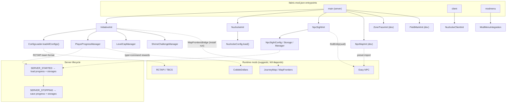

_The Cobblemon Initiative_ is a single-player Fabric mod for Minecraft 1.21.1 + Cobblemon 1.7.3, built exclusively for the hand-made UPM 2 map and played as a live hardcore + Nuzlocke production. This page maps the codebase at altitude: the eight subsystems, how Fabric boots them, how the mod leans on co-installed runtime mods, and the four design patterns that recur throughout.

For the actual event-driven workflows (battle victory, faint, NPC sight, economy), see [[Architecture Data Flows]]. For the full command surface, see [[Commands]]. To get oriented, start at [[Home]].

---

## The Mod in One Diagram

The mod is split into independent subsystems, each with its own `Init` entrypoint, its own persistence, and its own command tree. Fabric loads them through three entrypoint channels declared in `fabric.mod.json`; configuration loads at `onInitialize`, and per-world state loads on `SERVER_STARTED` / saves on `SERVER_STOPPING`.

---

## The Eight Subsystems

Each subsystem owns one slice of the game and persists independently. The first four are shipping features; the last two of the six server entrypoints are dev-only authoring tools, flagged for removal at 1.0.0.

### 1. Initiative — badge progression & level caps
**Entrypoint:** `InitiativeInit` (server)
**Key classes:** `ConfigLoader`, `PlayerProgressManager`, `LevelCapManager`, `ShrineChallengeManager`

The backbone. On init it calls `ConfigLoader.loadAllConfigs()`, which reads every trainer and level-cap JSON into memory. At runtime it listens for Cobblemon's `BATTLE_VICTORY` event, matches the defeated trainer against the config database, and routes the win through `PlayerProgressManager.onTrainerDefeated()` — granting rewards, unlocking the next level cap, advancing shrine state, and firing memory fragments. Also registers the `/cobblemon-initiative` (alias `/ca`) command tree.

### 2. Nuzlocke — death mechanics & Dark Urge
**Entrypoint:** `NuzlockeInit` (server), `NuzlockeClientInit` (client)
**Key classes:** `NuzlockeConfig`, `DeathScreenMixin`, `PokeballDeathScreen`, `SacrificeSelectionScreen`

Implements the run rules. On Cobblemon's `BATTLE_FAINTED` event, it checks whether the player is inside a safe zone; if not, it applies faint damage (optionally scaled by party size), can remove the fainted Pokémon, and may emit a low-chance Dark Urge whisper. A KO sets `pendingWhiteoutDeath`; `DeathScreenMixin` intercepts the vanilla death screen client-side and swaps in the custom Pokéball death screen. Safe zones additionally suppress hostile mob spawns via `MobSpawnMixin`.

### 3. NPC Sight — line-of-sight raycasting
**Entrypoint:** `NpcSightInit` (server) — `npcsight/` package
**Key classes:** `NpcSightManager`, `NpcSightStorage`, `NpcSightConfig`, `NpcSightData`, `NpcSightCommand`

Registers a server tick handler (every 5 ticks, ~4×/sec) that raycasts from each registered NPC's eyes toward nearby players, applying an FOV dot-product threshold. The result is written to the `can_see_player` scoreboard objective. The Java code never triggers game actions itself — datapacks read the scoreboard. Modes: `DIALOG`, `PURSUE`, `APPROACH_ONCE`.

### 4. Shrine — elemental challenges
**Key classes:** `ShrineChallengeManager`, `ShrineChallengeConfig`, `ShrineChallengeState`

Five shrine challenges driven by a single polymorphic config keyed on a `type` field: `hydra_gauntlet`, `fairy_tests`, `timed_parkour`, and `dark_gauntlet`. `startChallenge()` builds a per-player `ShrineChallengeState`; the manager's `tick()` applies type-specific logic each tick (gauntlet stage polling, blindness + earthquakes, timer countdowns). State clears on completion or `/shrine-abort`. See [[Guidebook Shrines]].

### 5. Config — JSON data layer
**Key classes:** `ConfigLoader`, `TrainerConfig`, `LevelCapConfig`, `NuzlockeConfig`

There is no database. `ConfigLoader` reads trainer JSON from `data/cobblemon_initiative/trainers/{gyms,shrines,royal_league,battle_frontier,villain_team,shrine_challenges}/` into a `Map` keyed by `trainer.id`, plus `levelcaps.json` into `List<LevelCapConfig>`. `LevelCapManager` walks the level caps and unlocks the next tier when its linked achievement is held — the cap is the max achieved.

### 6. Screen — client-side UI
**Entrypoint:** `NuzlockeClientInit` (client) — `screen/` package
**Key classes:** `PokeballDeathScreen`, `SacrificeSelectionScreen`

Holds the two custom screens. Sacrifice selection is deliberately split: the server flags `pendingSacrifice` from a Cobblemon event, the client polls it and shows the picker, and the chosen Pokémon is sent back to the server.

### 7. Advancement — custom Cobblemon criteria
**Key classes:** `CobblemonInitiativeCriteria`, `TrainerDefeatedCriterion`

Registers the custom `cobblemon-initiative:trainer_defeated` criterion once via `CriteriaTriggers.register()`. `PlayerProgressManager.grantAdvancementForTrainer()` fires the trigger on defeat; advancement JSON declares this criterion, which in turn gates level-cap unlocks and memory fragments.

### 8. Install — idempotent world setup
**Entrypoint:** invoked via command — `install/InstallCommand`
**Key classes:** `InstallCommand`, `LevelSettingsAccessor`, `PrimaryLevelDataAccessor`, `MapFrontiersBridge`

`/cobblemon-initiative install run` applies gamerules, difficulty, hardcore mode, safe zones, and MapFrontiers boundaries from `install.json`, arms a full `NpcPresetRefreshManager` refresh (each mapped NPC re-imports its preset as its chunk loads — a one-shot import can only reach loaded NPCs), then disconnects players so the world reloads in hardcore. `install check` reports current-vs-target without changing anything. Hardcore is flipped via the accessor mixins on the level data.

### Dev-only entrypoints (removed at 1.0.0)

| Entrypoint | Package | Purpose |
|---|---|---|
| `NpcMapInit` | `npcmap/` | UUID ↔ Easy NPC preset mapping for batch preset application |
| `ZoneTraceInit` | `zonetrace/` | In-world wand tool that traces zone polygons and exports `install.json` fragments |
| `FieldMarkInit` | `fieldmark/` | Marks wheat fields (center + radius) for the Wheat War field-liberation system |

These are authoring scaffolds — their commands live under `/cobblemon-initiative npc-map`, `zone-trace`, and `field-mark`, all OP-only, all slated for deletion before 1.0.0.

---

## Fabric Init & Lifecycle Flow

Fabric loads three entrypoint channels from `fabric.mod.json`:

- **`main` (server):** `InitiativeInit`, `NuzlockeInit`, `NpcSightInit`, `NpcMapInit` *(dev)*, `ZoneTraceInit` *(dev)*, `FieldMarkInit` *(dev)*
- **`client`:** `NuzlockeClientInit`
- **`modmenu`:** `ModMenuIntegration`

The lifecycle is consistent across subsystems:

1. **`onInitialize()`** — each subsystem loads its config (Gson from bundled resources or the `config/` dir), registers its Cobblemon/Fabric event handlers, and registers its command tree.
2. **`SERVER_STARTED`** — per-world state loads: `PlayerProgressManager.loadProgress()` and each storage's `load(MinecraftServer)` read JSON from the world root.
3. **`SERVER_STOPPING`** — every storage flushes back to JSON.

Configuration is environment-independent; **player and NPC state is per-world**, which is why it loads on server start rather than at init.

---

## Runtime Mod Integrations

These mods ship with UPM 2 and are assumed present at runtime, but they are **`suggests`, not `depends`** in `fabric.mod.json` — the mod compiles and loads without them, and integrations degrade gracefully (e.g. a failed CobbleDollars command logs and continues).

| Mod | How this mod uses it |
|---|---|
| **Easy NPC** | Supplies the physical, UUID-tracked NPC entities. `NpcSightManager.findEntity(server, uuid)` looks them up for raycasting; `NpcPresetRefreshManager` keeps every placed NPC on the current shipped preset content — a bundled uuid→preset map with a content-hash version, re-imported per NPC as its chunk loads, with sticky per-NPC overrides (the Granary trade tier). `/ca install run` arms a full refresh; a one-shot import can only reach currently-loaded NPCs. |
| **RCTAPI / TBCS** | Radical Cobblemon Trainers provides the battle API. Trainer team JSON uses the RCTAPI format, but the `tbcs` command (TBCS mod) calls RCTAPI's `BattleManager` **directly, bypassing rctmod's requirement/defeat tracking** — so battle gating lives in Easy NPC action Conditions (`EQUALS` on the derived `no_defeated_<id>` tags) and one-time rewards in the `tbcs` onwin lists. Onwin `@1`/`@2` tokens substitute **winners first**: in the win list `@1` = player / `@2` = NPC, but in the lose list `@1` = NPC / `@2` = player — lose-side commands are mirrored (e.g. `cobbledollars remove @2`, `@1 say <taunt>`). |
| **JourneyMap / MapFrontiers** | No init-time Java coupling. `MapFrontiersBridge` is lazily applied during `install run` to draw zone boundaries; JourneyMap markers may be set via datapack/commands. |
| **CobbleDollars** | The in-world currency. The full grammar is `give/remove/set/pay/query/reload` — there is **no `add` subcommand**. `type=command` trainer rewards pay via `cobbledollars give` — flat in tbcs onwin strings, skew-aware via the economy payout macro. Paid heals gate on `execute store result … cobbledollars pay @s 100` (`pay` soft-fails on an empty wallet, so `store result` works where `store success` would not). CobbleDollars is also the narrative spine of the villain plot. |

### Easy NPC 6.25 engine caveats

All dialog content is authored against these bytecode-verified quirks of the shipped Easy NPC 6.25:

- **`PLAYER_TAG` conditions ignore the Operation field** — the engine only ever runs `contains()`, so every gate is effectively `EQUALS` on a tag. "not tag" gates therefore compile to `EQUALS` on derived inverse tags `no_<X>`, maintained every tick by `function/dialog/band_tags.mcfunction` (auto-generated; it also maintains `no_defeated_<id>` for all 95 shipped trainers).
- **All `execute`-rooted ExecAsUser dialog commands are silently blocked** (a redirect-parse quirk). `as_player` commands compile to bare commands — under ExecAsUser, `@s` *is* the interacting player. Entity-path commands may use `execute`, but `@initiator` substitutes to the player **name**, which is never valid inside selector brackets.
- Every dialog entry gets an **auto-appended "Goodbye" close button** unless it already has one or sets `"no_goodbye": true`.
- **DATA presets must live at `easy_npc:preset/<type>/<name>.npc.snbt`** (PresetSecurity rejects other paths). Import grammar: `preset import data <loc> [<x y z> [<uuid>]]` — the canonical template is `execute as <uuid> at @s run easy_npc preset import data <loc> ~ ~ ~ <uuid>`.

---

## Signature Design Patterns

Four patterns recur across the codebase. Recognizing them makes the rest of the architecture predictable.

### Config-driven trainers
Every trainer — gym leaders, shrine bosses, Elite Four, villains — is a JSON file under `data/cobblemon_initiative/trainers/`, loaded into memory keyed by `id`. `TrainerConfig` carries identity, category, coordinates, prerequisites, rewards, `spawnOnDefeat`, team, and AI. **Adding a trainer needs only a JSON file plus a sprite — no Java changes.** Level caps work the same way through `levelcaps.json`.

### Scoreboard-as-IPC
NPC Sight never triggers game actions directly. It writes a single scoreboard objective, `can_see_player`, and datapacks query `@e[scores={can_see_player=1}]` to drive dialogue, pursuit, or ambushes (e.g. the wheat-trader logic). This keeps the Java mod loosely coupled from datapack responses — the same boundary used by the economy (`cd_instability`) and memory (`memory_fragment`) objectives.

### Datapack function tags + `type=command` rewards
The mod is the event engine; the datapack is the content layer. On defeat, `RewardConfig` entries of `type=command` are macro-substituted (`{player}`, `{uuid}`) and run, jumping into datapack functions for the economy payout skew, memory fragments, and gym destabilization. Datapack systems register through `#minecraft:load` / `#minecraft:tick` tags (memory, economy, quest HUD), so the heavier display and economy formulas live in `.mcfunction` files rather than Java.

### Load-on-start / save-on-stop persistence
`PlayerProgressManager`, `NpcSightStorage`, and `NpcMapStorage` all follow one shape: `load()` on `SERVER_STARTED`, `save()` on `SERVER_STOPPING`, pretty-printed Gson JSON in the world root (`cobblemon_initiative_progress.json`, `_npcsight.json`, `_npcmap.json`). `NuzlockeConfig` is the exception — it persists modpack-wide to `config/cobblemon-initiative.json` rather than per-world, since the run rules are global.

---

## Where to Go Next

- **[[Architecture Data Flows]]** — the event-driven workflows in detail: battle victory → badge progression, faint → death screen, NPC sight raycast, and the Wheat War economy.
- **[[Commands]]** — the complete command reference, permission levels, and dev-tool tree.
- **[[Home]]** — project overview and the campaign guidebook entry points.
