# Commands

Complete command reference for **The Cobblemon Initiative**. Every command below is verified against the mod source (incl. the alpha.14 player-facing `daycare` / `stadium` / `safari` trees and `/cutscene-skip`). For how these commands fit into the wider mod, see [Architecture Overview](https://github.com/The-Company-Inc-Nerds/the-cobblemon-initiative/blob/main/docs/ARCHITECTURE_OVERVIEW.md). To return to the landing page, see [[Home]].

> [!NOTE]
> This is a **single-player** mod built for UPM 2. "Admin" simply means the command requires operator privileges (permission level 2+), which the host player has in their own world. "Player-facing" commands need no permission.

---

## Permission levels at a glance

Minecraft permission levels run 0–4. This mod uses three of them:

| Level | Meaning | Used by |
|-------|---------|---------|
| **0** | Anyone (no OP) | `/shrine-abort`, `/noble-abort`, `/cutscene-skip`, and the `/cobblemon-initiative` player subtrees: `track …`, `daycare …`, `stadium …`, `safari enter\|exit\|status` |
| **2** | Operator | Every admin subtree under `/cobblemon-initiative` (incl. `safari bait\|scatter\|info`), plus `/noble`, `/nuzlocke` (all of it — `deathscreen`/`sacrifice`/`reload`), `/cutscene`, `/safezone`, most of `/npcsight` |
| **3** | Operator+ | `/npcsight reload` only |

> [!IMPORTANT]
> The `/cobblemon-initiative` **root has no permission gate**. Instead, every admin subtree (`progress`, `shrine`, `install`, `dev`, …) carries its **own** OP-2 `requires` — brigadier keeps the first-registered node's requirement on merge, so this is the only structure that lets the player-facing **`track`** subtree work at permission 0 (it mirrors `/shrine-abort`). Watch the alias, though: **`/ca` still carries `hasPermission(2)` on its redirect**, so `/ca track` will *not* work for a non-OP player — the `]` / `[` keybinds send the full `cobblemon-initiative track …` command for exactly this reason. In single-player you are OP, so both forms work.

---

## Command surface

```mermaid
flowchart TD
  ROOT["/cobblemon-initiative  — root ungated<br/>(alias /ca — the alias itself is OP 2)"]
  ROOT --> TRK["track next|prev|clear|status  — perm 0, player-only"]
  ROOT --> DAY["daycare deposit|withdraw &lt;1-2&gt;|status  — perm 0"]
  ROOT --> STAD["stadium start 25|50|75|100 · abort · status  — perm 0"]
  ROOT --> SAF["safari enter|exit|status (0) · bait|scatter|info (2)"]
  ROOT --> PROG["progress  — OP 2"]
  ROOT --> LCAP["levelcap  — OP 2"]
  ROOT --> RST["reset  — OP 2"]
  ROOT --> INFO["info &lt;trainer&gt;  — OP 2"]
  ROOT --> LIST["list gyms|shrines|groups|all  — OP 2"]
  ROOT --> DEF["defeat &lt;trainer&gt;  — OP 2"]
  ROOT --> SHR["shrine &lt;id&gt; start|stop|test|complete<br/>+ path record|here|clear|show|export  — OP 2"]
  ROOT --> QST["quest show|hide|refresh  — OP 2"]
  ROOT --> SHOP["shop refresh|&lt;tier&gt;  — OP 2"]
  ROOT --> RLD["reload  — OP 2"]
  ROOT --> INST["install check|verify|run  — OP 2"]
  ROOT --> DEV["DEV-ONLY (devtools/): dev goto|badges|grant|kit|team|stage|place · npcnote · pos · smoke · gym-mark · npc-map — OP 2"]

  NUZ["/nuzlocke deathscreen|sacrifice|reload  — all OP 2"]
  CUT["/cutscene play|stop|list|reload|record  — OP 2<br/>/cutscene-skip  — perm 0"]
  SZ["/safezone add|remove|list  — OP 2"]
  NS["/npcsight …  — OP 2 (reload: 3)"]
  NB["/noble start|stop|list  — OP 2"]
  ABORT["/shrine-abort  — no permission"]
  NABORT["/noble-abort  — no permission"]

  classDef dev fill:#3a2a2a,stroke:#a55,color:#fcc;
  class DEV dev;
  classDef player fill:#1e3a2a,stroke:#5a5,color:#cfc;
  class TRK,DAY,STAD,SAF,ABORT,NABORT,CUT player;
```

---

# Player-facing commands

## `/cobblemon-initiative track` — the quest tracker

**Permission 0, player-only.** Cycles which sidebar quest you are *tracking*. The tracked line gets an aqua **▶** prefix on the Quest HUD, and the quest's current objective is published as a **JourneyMap waypoint** (aqua, session-only — it never pollutes your saved waypoint list). Without JourneyMap installed, a vertical **beam of light** marks the objective in-world instead.

| Command | Description |
|---------|-------------|
| `/cobblemon-initiative track next` | Track the next active quest (sidebar order, main objective first). Cycling past the last quest turns tracking off. |
| `/cobblemon-initiative track prev` | Track the previous active quest; the mirror of `next`. |
| `/cobblemon-initiative track clear` | Stop tracking. |
| `/cobblemon-initiative track status` | Chat list of every active quest, with the tracked one marked `▶`. |

**Default keybinds:** **`]`** = track next, **`[`** = track previous — rebindable under the **Cobblemon Initiative** category in Controls. The keybinds simply send the `track next`/`track prev` commands above.

> [!NOTE]
> Tracking persists per world across relogs. When a tracked quest completes and leaves the sidebar, tracking auto-clears with a *"Quest tracking cleared — objective complete."* notice. Some quest stages are informational and have no map position — the tracker will say *"(no waypoint for this objective)"* and just keep the sidebar highlight. The main objective line already carries its own `▶`, so tracking it changes the map, not the sidebar.

## `/cobblemon-initiative daycare` — the Daycare (Gaviota Port)

**Permission 0, player-facing** (dialog-button-ready — the Daycare Keeper runs these for you). Two
custody slots; a boarded Pokémon trains itself with a cap-clamped XP drip. See [[Guidebook Facilities]].

| Command | Description |
|---------|-------------|
| `/cobblemon-initiative daycare deposit` | Opens the party-picker screen (multi-select up to 2; never takes your last Pokémon). |
| `/cobblemon-initiative daycare withdraw <slot>` | Withdraws slot **1** or **2**. Fee = 100 CD + 100/level gained; routes to party or PC. |
| `/cobblemon-initiative daycare status` | Shows what's boarded and the standing withdraw fee. |

## `/cobblemon-initiative stadium` — Exhibition Circuits (Cyber City)

**Permission 0, player-facing.** Level-locked wager brackets fought against Company exhibition waves.
**Nuzlocke stakes are suspended** in the Stadium (cloned parties). See [[Guidebook Facilities]].

| Command | Description |
|---------|-------------|
| `/cobblemon-initiative stadium start 25\|50\|75\|100` | Registers and starts the bracket (every Pokémon locked to that level). |
| `/cobblemon-initiative stadium status` | Current wave / bracket state. |
| `/cobblemon-initiative stadium abort` | Ends the run cleanly (no purse). |

## `/cobblemon-initiative safari` — the Baiting Yards (a Company Preserve)

**`enter` / `exit` / `status` are permission 0**; `bait` / `scatter` / `info` are OP-2 (the kiosk NPC
and the bait right-click drive `bait` for you in normal play). Opens after Badge 3. See
[[Guidebook Facilities]].

| Command | Description | Permission |
|---------|-------------|------------|
| `/cobblemon-initiative safari enter` | Starts a visit where you stand (buys the Day Permit, issues balls + the clock). | 0 |
| `/cobblemon-initiative safari status` | Time left, balls left, current catches. | 0 |
| `/cobblemon-initiative safari exit` | Ends the visit early — clawback + catch ledger. | 0 |
| `/cobblemon-initiative safari bait <type>` | Scatters a typed bait to draw species (kiosk-driven in play). | 2 |
| `/cobblemon-initiative safari scatter` / `info` | Dev/test hooks for the scatter path and session inspection. | 2 |

## `/cutscene-skip`

| Command | Description | Permission |
|---------|-------------|------------|
| `/cutscene-skip` | Player-facing skip for the currently-playing story cutscene (opening flyover, reveals). Bindable to a key. The authoring/playback tree `/cutscene play\|stop\|list\|reload\|record` is **OP-2** (admin + dialog trigger surface). | 0 (anyone) |

## `/shrine-abort`

| Command | Description | Permission |
|---------|-------------|------------|
| `/shrine-abort` | Player-facing escape hatch — aborts the active shrine challenge with no penalty. Equivalent to `/ca shrine <id> stop` but **requires no permission**. | 0 (anyone) |

## `/noble-abort`

| Command | Description | Permission |
|---------|-------------|------------|
| `/noble-abort` | Player-facing withdrawal from an active noble encounter (see [[Guidebook Nobles]]) — tears the arena down cleanly (boss bar, body, music loop, fake sky) with **no penalty**. The noble encounter's `/shrine-abort` twin. | 0 (anyone) |

## `/nuzlocke` (OP-only test triggers)

**All three are OP-2.** `deathscreen` and `sacrifice` end (or nearly end) a hardcore run outright, so
they are **gated to operators** — they are dev/test hooks, not player commands. (Moved to OP-2 in the
2026-07-13 pass; previously ungated.)

| Command | Description | Permission |
|---------|-------------|------------|
| `/nuzlocke deathscreen` | Forces the Pokéball whiteout screen (a real whiteout is an unblockable kill; see [Architecture Data Flows](https://github.com/The-Company-Inc-Nerds/the-cobblemon-initiative/blob/main/docs/ARCHITECTURE_DATA_FLOWS.md)). | 2 (OP) |
| `/nuzlocke sacrifice` | Opens the sacrifice-selection screen (or forces a whiteout if the player has one Pokémon). | 2 (OP) |
| `/nuzlocke reload` | Reloads the Nuzlocke config from disk. | 2 (OP) |

---

# Admin commands

## `/cobblemon-initiative` &nbsp;(alias `/ca`)

Root command for all Cobblemon Initiative features. `/ca` is a literal redirect to the same tree (`/ca progress` ≡ `/cobblemon-initiative progress`), but the **alias itself is gated at OP 2** — use the full command name for the permission-0 `track` subtree on a non-OP account. Every subtree below requires **OP level 2**.

### Progress & level cap

| Command | Description | Args |
|---------|-------------|------|
| `/ca progress` | Shows trainers defeated, achievements earned, current level cap, and gym badges earned (n/10). | — |
| `/ca levelcap` | Displays the current level cap (unlocked by defeating gym leaders; the cap = highest achieved). | — |
| `/ca reset` | Clears defeated trainers, clears earned achievements, and resets the level cap. | — |

> [!WARNING]
> `/ca reset` wipes campaign progress for the executing player. On a live hardcore run this is destructive — treat it as a debug/setup tool only.

> [!CAUTION]
> **Known inconsistency:** `/ca reset` hard-sets the level cap to **20**, but the actual starting cap defined by `levelcaps.json` (and `ProgressionConfig.baseLevelCap`) is **15**. The 20 is a stale hardcode from an older ladder — after a reset, the first cap recalculation (any badge grant, or `/ca dev badges 0`) restores the true base. Do not read the post-reset `20` as the intended starting cap.

### Trainer inspection

| Command | Description | Args |
|---------|-------------|------|
| `/ca info <trainer>` | Detailed trainer readout: ID, category, location, type, group, coordinates, prerequisites, spawn-on-defeat Pokémon, and team size. | `<trainer>` — trainer ID (autocomplete) |
| `/ca list <gyms\|shrines\|groups\|all>` | Lists trainers by category. `gyms` = gym trainers, `shrines` = shrine challenges, `groups` = trainer groups, `all` = every trainer. | one of `gyms`, `shrines`, `groups`, `all` |

### Progress control

| Command | Description | Args |
|---------|-------------|------|
| `/ca defeat <trainer>` | Manually marks a trainer defeated — advances progress, unlocks level caps, fires memory fragments, and escalates villain dialogue exactly as a real battle win would. Must be run **as the player** so progress saves to their record. | `<trainer>` — trainer ID (autocomplete) |

### Shrine challenges

Shrine flow is phased: **start → (parkour) complete → optional Fairy tests**. `start`/`stop` are typically wired to Easy NPC dialogs or pressure plates; `complete`/`test` are typically called from command blocks in the world. `<shrine>` autocompletes to registered shrine IDs.

| Command | Description | Returns |
|---------|-------------|---------|
| `/ca shrine <shrine> start` | Starts the shrine challenge for the player. | `1` success / `0` fail |
| `/ca shrine <shrine> stop` | Aborts the active challenge with **no penalty**. (Also exposed as the no-permission `/shrine-abort`.) | — |
| `/ca shrine <shrine> complete` | Marks the **parkour phase** complete. Wired from a finish-line command block, e.g. `execute as @a[distance=..3] run cobblemon-initiative shrine <shrine> complete`. | `1` success / `0` fail |
| `/ca shrine <shrine> test <testName>` | Runs one individual **Fairy shrine** test. `<testName>` ∈ `friendship`, `fullness`, `nickname`, `shiny`, `resolve`. Wired from altar dialogs / command blocks. | `1` pass / `0` fail |

#### Safe-path authoring (`shrine … path`)

Authors the **ice-floor safe path** for parkour shrines with the floor hazard enabled (standing on hazard ice off the recorded path deals freeze damage and teleports the player back to the start). Paths persist **per world** in `data/shrine_paths.json`.

| Command | Description |
|---------|-------------|
| `/ca shrine <shrine> path record` | Toggle continuous recording — every block you walk over is marked safe. |
| `/ca shrine <shrine> path here` | Add the single block underfoot to the safe path. |
| `/ca shrine <shrine> path clear` | Wipe the recorded path for this shrine. |
| `/ca shrine <shrine> path show` | Particle-highlight the currently recorded safe blocks. |
| `/ca shrine <shrine> path export` | Print a `safePositions` config snippet for baking into the shrine JSON. |

### Quest HUD

The Quest HUD (a togglable sidebar — the main line shows the current story objective, with side-quest lines beneath it) is rendered by the datapack. These commands are thin wrappers that dispatch `cobblemon_initiative:quest/{show,hide,refresh}`. For *tracking* a specific quest, see the permission-0 [`track` command](#cobblemon-initiative-track--the-quest-tracker) above.

| Command | Description |
|---------|-------------|
| `/ca quest show` | Displays the Quest HUD. |
| `/ca quest hide` | Hides the Quest HUD. |
| `/ca quest refresh` | Redraws / recomputes the HUD from current state. |

### Shop tiers

The Pokémart runs a badge-tier catalog managed by `ShopTierManager` — gym leaders and the HQ raid fire these automatically as rewards; the command is also a manual admin/test lever. Applying a tier copies the pre-baked catalog over CobbleDollars' `default_shop.json`, hot-reloads it live, and retiers the Company Granary in lockstep. Base tiers are automatically upgraded to their **liberation-relief** variant (one relief level per 2 liberated fields).

| Command | Description | Args |
|---------|-------------|------|
| `/ca shop refresh` | Re-applies the executing player's *current* base tier so the liberation-relief level is re-resolved from `fields_liberated`. Fired by the field-liberation function; safe to run any time. Needs a player source. | — |
| `/ca shop <tier>` | Applies a specific tier and reloads CobbleDollars. | `tier` ∈ `badge_0` … `badge_7`, `post_hq`, `badge_8` … `badge_10` (autocomplete) |

### Quest helpers (dialog commands) *(new in 0.5.0-alpha.4)*

Reusable, OP-2 commands meant to be called from NPC **dialog buttons** (which run at OP-2). They use the Cobblemon API / real inventory scans and are **safe no-ops on failure**, so a quest can't half-complete. All three are backed by species/item verification — no fixed party slot or trust in Easy NPC's (broken) `has_item` gate. `cobblemon-initiative`'s root must be on Easy NPC's `security.cfg` allowlist (shipped + self-healed on launch) or dialogs silently can't call them.

| Command | Description | Args |
|---------|-------------|------|
| `/ca trade <take> <give> [level] [tag]` | Removes the **first party Pokémon** whose species matches `<take>` (any slot) and gives a `<give>` at `[level]` (default = the traded mon's level). Sets `[tag]` **only on a completed trade**. No `<take>` → "you have no …" no-op. Backs Old Sefu's Magikarp→Feebas trade. | species, species, 1–100, tag |
| `/ca turnin <item> <count> [tag]` | Counts `<item>` in the player's inventory; if ≥ `<count>`, removes exactly that many and sets `[tag]`. Else a "you need N" no-op. The fix for the item hand-in pattern (Raan, Dr. Asha). | item id, ≥1, tag |
| `/ca givemon <properties>` | Parses a full Cobblemon property string (species + any of `level=` / `shiny=` / `gender=` / `hisuian=` …) and adds the result to the party, resolving the player from the command **source** (so it works from both dialog buttons and inside `.mcfunction`s). As of 0.5.0-alpha.5 every Pokémon gift routes through this rather than `givepokemonother` — that command works in dialog buttons but a raw `@s` call inside a function failed ("no pokemon was specified"), so gifts were unified on the source-based command. e.g. `givemon eevee level=5 shiny=true`. | property string |

### Reload

| Command | Description |
|---------|-------------|
| `/ca reload` | Re-reads trainers, level caps, shrine challenges, and every runtime config (Nuzlocke, NPC Sight, shrine, loot-chest, progression) without a relaunch. **Reads built resources** — in the dev client run `gradle processResources` first; a packaged jar needs a rebuild. |

### Dev helpers (`dev`)

Warps and progression levers for testing — all OP-2.

| Command | Description | Args |
|---------|-------------|------|
| `/ca dev goto <trainer>` | Teleport to a trainer's configured coordinates. | trainer ID (autocompletes only trainers that have coordinates) |
| `/ca dev badges <n>` | Set progression to **exactly** N gym badges: grants/removes the badge achievements *and* their gym leaders' defeated flags, then recalculates the level cap. | `n` 0–10 |
| `/ca dev grant <achievement>` | Grant a single achievement and refresh the level cap. | achievement ID (autocompletes the level-cap achievement ids, e.g. `badge_fire`, `royal_league_champion`, `board_cleared`) |
| `/ca dev kit` | Gives the 5 shrine crystals + 16 Rare Candy + 16 Potions. | — |
| `/ca dev team <stage>` | Banks your party to the PC and provisions the bundled counter team for the stage: level = era entry cap, perfect 31 IVs, EV spreads, authored against the real enemy team files (deliberately overpowered — a lost test is a permadeath). | stage ∈ `gym_1..gym_10`, `shrine_fairy/ground/dragon/ice/fire`, `hq`, `royal`, `board`, `founder` |
| `/ca dev stage <stage>` | One-shot progression setup for the same stage names: badges (cap follows), gate scores (`fields_liberated`), champion/board defeat tags + achievements, and a teleport to the stage anchor when its coords are authored. | same stage ids |
| `/ca dev place next\|prev\|goto <id>` | Guided placement walk: teleport through the bundled 51-proposal plan (surface-height tp) and print each NPC's name, purpose, and ideal-spot direction. | plan id (autocompletes) |
| `/ca dev tool` | **The Producer's Tool** (one item for the whole walk = placement plan + gym-mark slots): hold = fly + invulnerable (airborne-grace on unhold); left-click = set primary (block = stand-spot, NPC = adopt); right-click = secondary (box corners; air = feet); F (swap-hands) = primary at your feet; shift+left/right = confirm; **Q = skip**; chat after a set = notes on the current stop; the item **glints** when the current stop already has anything recorded. Writes the same files as `dev place` / `gym-mark`. | — |
| `/ca dev place here\|adopt\|skip [id]` | `here` records your feet as the NPC's latch placement; `adopt` records the builder body you are **looking at** as a uuid takeover; `skip` defers. Defaults to the current walk entry. Results accumulate in `{world}/data/npc_placements.json` (`list`/`export` show progress / the handoff). | optional plan id |

The **GymMark wand** (`/ca gym-mark wand|set|start|stop|list|export`) is the gym-gimmick
coordinate pass — see the TODO gym-gimmicks section for the 33-slot walkthrough; it exports
`{world}/data/gym_marks.json`.

### Install

Applies the packaged world configuration in `install.json`. See [Architecture Overview](https://github.com/The-Company-Inc-Nerds/the-cobblemon-initiative/blob/main/docs/ARCHITECTURE_OVERVIEW.md) for the install flow.

| Command | Description |
|---------|-------------|
| `/ca install check` | Reports current vs. target state for gamerules, difficulty, hardcore mode, NPC preset mappings, and zones — read-only. |
| `/ca install verify` | A separate **read-only deep check** — inspects the applied world state in detail without changing anything. |
| `/ca install run` | Applies all gamerules, difficulty, and hardcore mode from `install.json`; applies NPC presets (arming a full preset refresh); creates safe zones and Map Frontiers boundaries; strips the map-authored infinite Speed effect; **seeds the CobbleDollars shop to the opening `badge_0` catalog**; and **disconnects players only when hardcore is newly flipped** so the world reloads in hardcore mode. |

> [!IMPORTANT]
> `/ca install run` is idempotent and safe to re-run. It only kicks players when it actually flips hardcore on — relog to continue. Run `/ca install check` first to preview what will change. **Modpack installs auto-run `install run` once per fresh world** via a pack-only marker file (`config/cobblemon-initiative-autoinstall.json`); bare-mod installs never auto-run.

---

## `/noble`

Drives the noble boss encounters (see [[Guidebook Nobles]]). **All subcommands require OP level 2** — the player-facing escape is the no-permission `/noble-abort` above. Until arenas are placed on the map, `start` opens the encounter at the caller's position; the intended endgame is dialog-button or item triggers running `noble start <id>` (the `noble` root must be added to the Easy NPC command allowlist for that — an open TODO).

| Command | Description |
|---------|-------------|
| `/noble start <id>` | Begins the encounter for the calling player. `<id>` ∈ `groudon`, `kyogre`, `rayquaza`, `articuno`, `zapdos`, `moltres`, `mew`. Restarting while one is active resets the old one penalty-free. |
| `/noble stop` | Aborts the caller's active encounter (the OP twin of `/noble-abort`). |
| `/noble list` | Lists the registered noble ids. |

Per-noble tuning lives in the jar-baked `noble_encounters/<id>.json` (reloaded by `/ca reload`); global feel/difficulty knobs live in `config/cobblemon-initiative-noble.json` (ModMenu-editable).

## `/safezone`

Manage zone regions. Zones drive on-entry announcements, hostile-mob suppression, and Dark Urge whisper suppression. **All subcommands require OP level 2.**

| Command | Description | Args |
|---------|-------------|------|
| `/safezone add <name> <radius> <hostileOnly> <cylindrical>` | Creates a safe zone centred on the player's current position. | `name` word; `radius` 1–500 blocks; `hostileOnly` `true\|false` (true = only block hostile mobs); `cylindrical` `true\|false` (cylinder vs. sphere) |
| `/safezone remove <name>` | Removes a safe zone by name. | `name` word |
| `/safezone list` | Lists all safe zones: name, centre coords, radius, dimension, hostile-only flag, cylindrical flag. | — |

---

## `/npcsight`

Configure NPC line-of-sight tracking. The NPC Sight system raycasts from each registered NPC's eyes to nearby players on a throttled tick and writes a `can_see_player` scoreboard objective that datapacks query — it does **not** run game logic directly. **OP level 2 for all subcommands except `reload` (level 3).** UUID arguments autocomplete (the entity you are currently looking at, or already-registered UUIDs).

| Command | Description | Args |
|---------|-------------|------|
| `/npcsight add <uuid> [range] [dialog]` | Registers an NPC for sight tracking. | `uuid` (req.); `range` 1–512, `-1` = global default; `dialog` Easy NPC dialog to trigger on sight |
| `/npcsight remove <uuid>` | Unregisters an NPC. | `uuid` (registered) |
| `/npcsight range <uuid> <blocks>` | Sets per-NPC sight range. | `blocks` `-1` (global) or 1–512 |
| `/npcsight dialog <uuid> <name\|clear>` | Sets / clears the Easy NPC dialog trigger. | `name`, or `clear`/`none` |
| `/npcsight mode <uuid> <dialog\|pursue\|approach_once>` | Sets sight behaviour. `dialog` = fire dialog; `pursue` = NPC approaches; `approach_once` = one-shot approach (needs `reset` to fire again). | mode literal |
| `/npcsight meettag <uuid> <tag\|clear>` | Scoreboard tag applied to the player **when sighted**. | `tag`, or `clear`/`none` |
| `/npcsight stoptag <uuid> <tag\|clear>` | Scoreboard tag that **suppresses** sight if the player already has it. | `tag`, or `clear`/`none` |
| `/npcsight reset <uuid>` | Resets the `approach_once` one-shot latch so the NPC can trigger again. | `uuid` (registered) |
| `/npcsight list` | Lists all registered NPCs: uuid, mode, range, dialog, meetTag, stopTag, fired status, canSeePlayer status. | — |
| `/npcsight info <uuid>` | Detailed readout for one registered NPC. | `uuid` (registered) |
| `/npcsight reload` | Reloads the NPC Sight config from disk. | — &nbsp; **(permission level 3)** |

---

# Dev-only commands

> [!CAUTION]
> The commands in this section are **authoring/editor tools** registered under the `/cobblemon-initiative` tree (OP level 2). They are scheduled for **removal at 1.0.0** once world content is finalized. Do not document them as player-facing features; they exist to build `install.json` / `fields.json` data and to wire NPC presets during development.

## `/cobblemon-initiative` dev tooling (`devtools/`) &nbsp;— *removed at 1.0.0*

Playtest aids added while smoke-testing content. All dev tooling now lives in the single `devtools/` package behind one `DevToolsInit` entrypoint (2026-07-11 consolidation); zone-trace and field-mark were deleted outright (superseded by the browser zone-mapper — all 58 zones + farm polygons are baked into `install.json`).

| Command | Description | Args |
|---------|-------------|------|
| `/ca pos ["title"] [note…]` | Prints your x/y/z to chat and records it, with an optional quoted title + trailing note — used to capture placement coords in-world (paste the `npcnote log` dump back to the author). | title, note |
| `/ca npcnote stick` | Gives the "NPC Noter" stick: whack an NPC to select it (no damage), then `note <text>` / `move` (or right-click a block) to record a comment / relocation. | — |
| `/ca npcnote log \| clear \| undo` | `log` dumps every recorded note + position to chat (copy-pasteable); `clear`/`undo` manage them. Persists to `<world>/data/npc_notes.json` (survives a relog). | — |
| `/ca smoke list \| next \| show \| pass \| comment \| fail \| log \| reset` | In-world checklist compiled from `SMOKETEST.md` R-items: mark each pass/comment/fail with a note, then `log` dumps them copy-pasteable to fill back into the file. | id, note |
| `/ca debug victini` | Prints the **Victini gate** for you: ✔/✗ per condition (`victor_hint`, `docs_filed`, `lane_done`, `census_refused`) plus the overall verdict (VALID / not-yet / TRANSFORMED / JOINED). Reads your tags live. | — |

## `/cobblemon-initiative npc-map` &nbsp;— *removed at 1.0.0*

Bidirectional NPC-UUID ↔ Easy NPC preset mapping, used to batch-apply presets during NPC setup.

| Command | Description | Args |
|---------|-------------|------|
| `/ca npc-map add <uuid> <preset> [label]` | Maps an NPC UUID to an Easy NPC preset. | `uuid` (looked-at entity, autocomplete); `preset` (autocomplete from the shipped `data/easy_npc/preset/` DATA presets); `label` optional friendly name |
| `/ca npc-map remove <uuid>` | Removes a mapping. | `uuid` (stored, autocomplete) |
| `/ca npc-map list` | Lists all stored mappings (uuid, preset, label). | — |
| `/ca npc-map apply` | Applies every stored mapping to its NPC via Easy NPC preset import. | — |

## See also

- [Architecture Overview](https://github.com/The-Company-Inc-Nerds/the-cobblemon-initiative/blob/main/docs/ARCHITECTURE_OVERVIEW.md) — how these commands hook into subsystems and data flows.
- [Architecture Data Flows](https://github.com/The-Company-Inc-Nerds/the-cobblemon-initiative/blob/main/docs/ARCHITECTURE_DATA_FLOWS.md) — the quest-tracker and economy workflows these commands drive.
- [[Home]] — wiki landing page.
