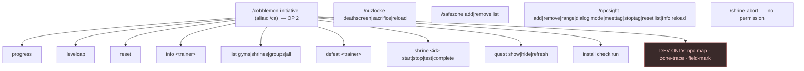

# Commands

Complete command reference for **The Cobblemon Initiative**. Every command below is verified against the mod source. For how these commands fit into the wider mod, see [[Architecture Overview]]. To return to the landing page, see [[Home]].

> [!NOTE]
> This is a **single-player** mod built for UPM 2. "Admin" simply means the command requires operator privileges (permission level 2+), which the host player has in their own world. "Player-facing" commands need no permission.

---

## Permission levels at a glance

Minecraft permission levels run 0–4. This mod uses three of them:

| Level | Meaning | Used by |
|-------|---------|---------|
| **0** | Anyone (no OP) | `/shrine-abort`, `/nuzlocke deathscreen`, `/nuzlocke sacrifice` |
| **2** | Operator | Almost all admin commands; the entire `/cobblemon-initiative` tree |
| **3** | Operator+ | `/npcsight reload` only |

> [!IMPORTANT]
> The **entire** `/cobblemon-initiative` command tree (and its `/ca` alias) requires permission level **2**. This includes player-style readouts like `progress` and `levelcap` — in single-player you are OP, so they "just work." `/shrine-abort` is the deliberate exception: it is registered separately with no permission gate so a player can always escape a stuck shrine.

---

## Command surface

---

# Gameplay commands

## `/cobblemon-initiative` &nbsp;(alias `/ca`)

Root command for all Cobblemon Initiative features. `/ca` is a literal redirect to the same tree, so `/ca progress` and `/cobblemon-initiative progress` are identical. **Whole tree requires OP level 2.**

### Progress & level cap

| Command | Description | Args |
|---------|-------------|------|
| `/ca progress` | Shows trainers defeated, achievements earned, current level cap, and gym badges earned. | — |
| `/ca levelcap` | Displays the current level cap (unlocked by defeating gym leaders; the cap = highest achieved). | — |
| `/ca reset` | Clears defeated trainers, clears earned achievements, and resets the level cap to **20**. | — |

> [!WARNING]
> `/ca reset` wipes campaign progress for the executing player. On a live hardcore run this is destructive — treat it as a debug/setup tool only.

### Trainer inspection

| Command | Description | Args |
|---------|-------------|------|
| `/ca info <trainer>` | Detailed trainer readout: ID, category, location, type, group, coordinates, prerequisites, spawn-on-defeat Pokémon, and team size. | `<trainer>` — trainer ID (autocomplete) |
| `/ca list <gyms\|shrines\|groups\|all>` | Lists trainers by category. `gyms` = gym leaders, `shrines` = shrine challenges, `groups` = trainer groups, `all` = every trainer. | one of `gyms`, `shrines`, `groups`, `all` |

### Progress control

| Command | Description | Args |
|---------|-------------|------|
| `/ca defeat <trainer>` | Manually marks a trainer defeated — advances progress, unlocks level caps, fires memory fragments, and escalates villain dialogue exactly as a real battle win would. Must be run **as the player** so progress saves to their record. | `<trainer>` — trainer ID (autocomplete) |

### Shrine challenges

Shrine flow is phased: **start → (parkour) complete → optional Fairy tests**. `start`/`stop` are typically wired to Easy NPC dialogs or pressure plates; `complete`/`test` are typically called from command blocks in the world. `<shrine>` autocompletes to registered shrine IDs.

| Command | Description | Returns |
|---------|-------------|---------|
| `/ca shrine <shrine> start` | Starts the shrine challenge for the player. | `1` success / `0` fail |
| `/ca shrine <shrine> stop` | Aborts the active challenge with **no penalty**. (Also exposed as the no-permission `/shrine-abort`.) | — |
| `/ca shrine <shrine> complete` | Marks the **parkour phase** complete. Wired from a finish-line command block, e.g. `execute as @a[distance=..3] run cobblemon-initiative shrine <shrine> complete`. | `1` success / `0` fail |
| `/ca shrine <shrine> test <testName>` | Runs one individual **Fairy shrine** test. `<testName>` ∈ `friendship`, `fullness`, `nickname`, `shiny`, `resolve`. Wired from altar dialogs / command blocks. | `1` pass / `0` fail |

### Quest HUD

The Quest HUD (a togglable sidebar — the main line shows the current story objective, with side-quest lines beneath it) is rendered by the datapack. These commands are thin wrappers that dispatch `cobblemon_initiative:quest/{show,hide,refresh}`.

| Command | Description |
|---------|-------------|
| `/ca quest show` | Displays the Quest HUD. |
| `/ca quest hide` | Hides the Quest HUD. |
| `/ca quest refresh` | Redraws / recomputes the HUD from current state. |

### Install

Applies the packaged world configuration in `install.json`. See [[Architecture Overview]] for the install flow.

| Command | Description |
|---------|-------------|
| `/ca install check` | Reports current vs. target state for gamerules, difficulty, hardcore mode, NPC preset mappings, and zones — read-only. |
| `/ca install run` | Applies all gamerules, difficulty, and hardcore mode from `install.json`; applies NPC presets; creates safe zones and Map Frontiers boundaries; **disconnects players** so the world reloads in hardcore mode when hardcore is newly enabled. |

> [!IMPORTANT]
> `/ca install run` kicks players to reload the world if it flips hardcore on. This is expected — relog to continue. Run `/ca install check` first to preview exactly what will change.

---

## `/nuzlocke`

Nuzlocke death-mechanic controls. The first two are **player-facing test triggers (no permission)**; `reload` is admin-only.

| Command | Description | Permission |
|---------|-------------|------------|
| `/nuzlocke deathscreen` | Triggers the Pokéball faint death screen for testing. Applies **20 damage** to the player. | 0 (anyone) |
| `/nuzlocke sacrifice` | Triggers the sacrifice-selection screen for testing. If the player has only one Pokémon, triggers death instead. | 0 (anyone) |
| `/nuzlocke reload` | Reloads the Nuzlocke config from disk. | 2 (OP) |

---

## `/safezone`

Manage safe-zone regions. Inside a safe zone, Pokémon-faint (Nuzlocke) damage is suppressed and mob spawning can be cancelled. **All subcommands require OP level 2.**

| Command | Description | Args |
|---------|-------------|------|
| `/safezone add <name> <radius> <hostileOnly> <cylindrical>` | Creates a safe zone centred on the player's current position. | `name` word; `radius` 1–500 blocks; `hostileOnly` `true\|false` (true = only block hostile mobs); `cylindrical` `true\|false` (cylinder vs. sphere) |
| `/safezone remove <name>` | Removes a safe zone by name. | `name` word |
| `/safezone list` | Lists all safe zones: name, centre coords, radius, dimension, hostile-only flag, cylindrical flag. | — |

---

## `/npcsight`

Configure NPC line-of-sight tracking. The NPC Sight system raycasts from each registered NPC's eyes to nearby players each tick and writes a `can_see_player` scoreboard objective that datapacks query — it does **not** run game logic directly. **OP level 2 for all subcommands except `reload` (level 3).** UUID arguments autocomplete (the entity you are currently looking at, or already-registered UUIDs).

| Command | Description | Args |
|---------|-------------|------|
| `/npcsight add <uuid> [range] [dialog]` | Registers an NPC for sight tracking. | `uuid` (req.); `range` 1–512, `-1` = global default; `dialog` Easy NPC dialog to trigger on sight |
| `/npcsight remove <uuid>` | Unregisters an NPC. | `uuid` (registered) |
| `/npcsight range <uuid> <blocks>` | Sets per-NPC sight range. | `blocks` `-1` (global) or 1–512 |
| `/npcsight dialog <uuid> <name\|clear>` | Sets / clears the Easy NPC dialog trigger. | `name`, or `clear`/`none` |
| `/npcsight mode <uuid> <dialog\|pursue\|approach_once>` | Sets sight behaviour. `dialog` = fire dialog; `pursue` = NPC approaches; `approach_once` = one-shot approach (needs `reset` to fire again). | mode literal |
| `/npcsight meettag <uuid> <tag\|clear>` | Scoreboard tag applied to the player **when sighted**. | `tag`, or `clear`/`none` |
| `/npcsight stoptag <uuid> <tag\|clear>` | Scoreboard tag that **suppresses** sight if the player already has it. | `tag`, or `clear`/`none` |
| `/npcsight reset <uuid>` | Resets the `approach_once` one-shot latch so the NPC can trigger again. | `uuid` (registered) |
| `/npcsight list` | Lists all registered NPCs: uuid, mode, range, dialog, meetTag, stopTag, fired status, canSeePlayer status. | — |
| `/npcsight info <uuid>` | Detailed readout for one registered NPC. | `uuid` (registered) |
| `/npcsight reload` | Reloads the NPC Sight config from disk. | — &nbsp; **(permission level 3)** |

---

## `/shrine-abort`

| Command | Description | Permission |
|---------|-------------|------------|
| `/shrine-abort` | Player-facing escape hatch — aborts the active shrine challenge with no penalty. Equivalent to `/ca shrine <id> stop` but **requires no permission**. | 0 (anyone) |

---

# Dev-only commands

> [!CAUTION]
> The commands in this section are **authoring/editor tools** registered under the `/cobblemon-initiative` tree (OP level 2). They are scheduled for **removal at 1.0.0** once world content is finalized. Do not document them as player-facing features; they exist to build `install.json` / `fields.json` data and to wire NPC presets during development.

## `/cobblemon-initiative npc-map` &nbsp;— *removed at 1.0.0*

Bidirectional NPC-UUID ↔ Easy NPC preset mapping, used to batch-apply presets during NPC setup.

| Command | Description | Args |
|---------|-------------|------|
| `/ca npc-map add <uuid> <preset> [label]` | Maps an NPC UUID to an Easy NPC preset. | `uuid` (looked-at entity, autocomplete); `preset` (autocomplete from the shipped `data/easy_npc/preset/` DATA presets); `label` optional friendly name |
| `/ca npc-map remove <uuid>` | Removes a mapping. | `uuid` (stored, autocomplete) |
| `/ca npc-map list` | Lists all stored mappings (uuid, preset, label). | — |
| `/ca npc-map apply` | Applies every stored mapping to its NPC via Easy NPC preset import. | — |

## `/cobblemon-initiative zone-trace` &nbsp;— *removed at 1.0.0*

Polygon zone editor. `begin` gives a Zone Tracer wand; right-click blocks to add vertices. `export` dumps an `install.json` fragment to the server log.

| Command | Description |
|---------|-------------|
| `/ca zone-trace begin <name>` | Starts a session and gives the Zone Tracer wand. `name` = greedy string. |
| `/ca zone-trace point` | Records the player's current foot position as a vertex. |
| `/ca zone-trace undo` | Removes the last vertex. |
| `/ca zone-trace type <value>` | Sets zone type: `TOWN`, `ROUTE`, `SHRINE`, `VILLAIN`, `BATTLE_FRONTIER`, `LANDMARK` (autocomplete). |
| `/ca zone-trace color <hex>` | Sets zone colour, e.g. `FF0000` or `#FF0000`. |
| `/ca zone-trace subtitle <text>` | Sets the on-entry subtitle (greedy string). |
| `/ca zone-trace announce <true\|false>` | Toggles entry announcement. |
| `/ca zone-trace hostile <true\|false>` | Toggles hostile-only mob suppression for the zone. |
| `/ca zone-trace finish` | Saves the zone (needs ≥ 3 vertices) and removes the wand. |
| `/ca zone-trace status` | Shows the active session: name, type, colour, announce, hostileOnly, vertices. |
| `/ca zone-trace list` | Lists saved zones (type, name, vertex count, colour). |
| `/ca zone-trace delete <name>` | Deletes a saved zone (greedy string, autocomplete). |
| `/ca zone-trace export` | Dumps all saved zones as an `install.json` JSON array to the server log. |

## `/cobblemon-initiative field-mark` &nbsp;— *removed at 1.0.0*

Wheat-field editor for the Wheat War / field-liberation economy work. Fields are circular (centre + radius). `export` dumps a `fields.json` fragment to the server log.

| Command | Description | Args |
|---------|-------------|------|
| `/ca field-mark add <id> <region>` | Marks a wheat field at the player's position. | `id` word; `region` ∈ `takehara`, `hua_zhan`, `mystic_marsh`, `deepcore`, `gaviota`, `kalahar`, `cyber`, `ryujin`, `nifl`, `scorchspire` (autocomplete) |
| `/ca field-mark radius <id> <blocks>` | Sets the field radius. | `blocks` 1–256 |
| `/ca field-mark setpiece <id> <true\|false>` | `true` = set-piece field, `false` = scattered minor field. | `id`, value |
| `/ca field-mark list` | Lists marked fields: type (`set-piece`/`minor`), id, region, coords, radius. | — |
| `/ca field-mark delete <id>` | Deletes a marked field. | `id` word (autocomplete) |
| `/ca field-mark export` | Dumps all marked fields as a `fields.json` JSON array to the server log. | — |

---

## See also

- [[Architecture Overview]] — how these commands hook into subsystems and data flows.
- [[Home]] — wiki landing page.
