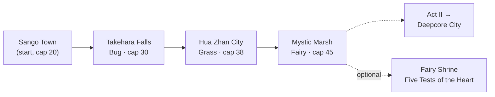

# Guidebook: Act I — The Journey Begins

> *You woke with nothing. A name you do not trust, a road you do not remember, and a region that watches you a little too closely. Take the badge challenge like any trainer would. The world will fill in the blanks faster than you do.*

**Act I** covers your first steps out of **Sango Town** and the first three gyms of the fixed route — **Takehara Falls (Bug)**, **Hua Zhan City (Grass)**, and **Mystic Marsh (Fairy)** — plus the routes between them and the **Fairy Shrine** that shares the marsh. This is the *stable* stretch of the run: the economy still feels honest, The Company still smiles, and the first cracks are barely visible.

For the campaign-wide structure, see **[[Guidebook Overview]]**. When you topple the Fairy gym you are at the doorstep of **[[Guidebook Act II]]**.

> [!IMPORTANT]
> This is a **hardcore + Nuzlocke** run. Faints are permanent, your own death ends the world, and the route between safe zones has full mob spawns. Read the **Nuzlocke & Dark Urge Cautions** section at the bottom before you leave Sango.

---

## Act I at a Glance

| # | Town | Type | Leader | Level Cap | Memory Fragment | Economy |
|:-:|------|------|--------|:---------:|-----------------|:-------:|
| — | Sango Town | *(start)* | — | 20 *(default)* | — | stable |
| 1 | Takehara Falls | Bug 🐞 | Cicada | **30** | `frag_1` — formless unease | `cd_instability → 8` |
| 2 | Hua Zhan City | Grass 🌿 | Blossom | **38** | `frag_2` | `cd_instability → 16` |
| 3 | Mystic Marsh | Fairy ✨ | Titania | **45** | `frag_3` — end of the "stable" feel | `cd_instability → 24` |

> The **level cap** is unlocked the moment you defeat that gym's leader — it is the maximum level your Pokémon may reach, enforced by the mod. Before your first badge you are capped at **20**.

---

## Sango Town — The Start (No Gym)

- **Role:** Starting town. No gym leader, no badge. This is your tutorial ground and your first **safe zone**.
- **Safe zone:** Sango is a cylindrical safe zone (hostile-only). Inside it, mob spawns are suppressed and **Nuzlocke faint penalties are suspended** — it is a true rest stop. Treat every town and shrine the same way.
- **Level cap:** **20** by default until you earn your first badge.

### What to expect
- **Get your bearings, not a fight.** Sango is where you set your party, learn the controls of a Nuzlocke run, and meet the first NPCs who give you that *odd look* — the one you will learn to dread.
- **The Archivist.** A town NPC who can **re-read your collected memory fragments** on request. You have none yet, so for now they simply note that your file is "incomplete." Remember where they stand — you will come back as the fragments mount.
- **The Company's first face.** Sango carries early Company propaganda in its **glossy, warm Act-I register**: *"The Company: Verified Trust, Verified Value."* It reads as civic-minded sponsorship. It is not.
- **Quest HUD.** Your objective tracker (a boss bar plus an optional sidebar log) lives here too. Toggle it with `/ca quest show`, `/ca quest hide`, and `/ca quest refresh`. In Act I it will simply point you down the road to Takehara Falls.

> [!NOTE]
> **Recognition flickers start at zero.** Pre-gym NPCs are mostly unaware of who you are. The double-takes ("...have we met?") begin in earnest once you start collecting badges and your `memory_fragment` count climbs.

---

## Gym 1 — Takehara Falls (Bug 🐞)

> **Leader Cicada** · Level cap on defeat: **30** · Badge: `badge_bug` · Memory: `frag_1`

A waterfall town and the gentlest gym on the route — the right place to learn what a gym run *is* before the stakes rise. The gym is a ladder: four trainers, then a Jr. Apprentice, then an Apprentice, then the Leader. Each rung gates the next.

### The gym ladder
| Stage | Trainer | Notable team | Cap |
|-------|---------|--------------|:---:|
| Trainer 1 | Bug Catcher Koji | Caterpie, Weedle | Lv 10 |
| Trainer 2 | Entomologist Yuki | Spinarak, Ledyba | Lv 10 |
| Trainer 3 | Bug Maniac Shin | Nincada, Surskit | Lv 11 |
| Trainer 4 | Youngster Taro | Burmy, Combee | Lv 11 |
| Jr. Apprentice | Hachi | Beedrill, Beautifly | Lv 13 |
| Apprentice | Hana *(doubles)* | Butterfree, Beedrill, Yanma, Ninjask | Lv 15–16 |
| **Leader** | **Cicada** | **Scolipede, Heracross, Vespiquen, Yanmega** | **Lv 17–18** |

### What to expect
- **Type primer.** A clean Bug gym. Cicada's Heracross (Bug/Fighting) and Yanmega (Bug/Flying) punish a one-note answer — bring coverage rather than a single Fire stick. He carries **3× Full Restore**, so chip damage alone won't close it.
- **Reward & cap.** Beating Cicada grants the **Bug badge**, **5 emeralds**, and unlocks **level cap 30** — your party can finally breathe past 20.
- **Memory beat — `frag_1`:** your first memory fragment fires on his defeat. It is **formless unease**: a first-person flash with no shape to it yet, the faint sense that this road is *familiar* in a way it should not be. The Archivist back in Sango will now read this one back to you.
- **Economy beat:** Cicada's defeat also runs `economy/gym_destabilize` — `cd_instability` ticks up to **8**. You won't feel much yet; the money still mostly behaves.

> [!TIP]
> This is the safest place to learn the **payout-skew** behaviour: trainer prize money is routed through The Company and skewed by the instability index (rate = `100 − min(idx ÷ 4, 25)`%). At idx 8 the skew is negligible — but watch the per-payout line, because it only grows from here.

---

## Route: Takehara Falls → Hua Zhan City

> The **Blossom Path** connects Takehara to Sango; the road on to Hua Zhan runs through **wheat country**.

### What to expect
- **First Company grunts in the open.** Outside the gyms, **Field Agents** (`villain_grunt_1`, `villain_grunt_2`) and **Contractors** (`villain_grunt_4`, gated behind the Bug badge) work the routes and regional offices. Their teams are low-rent thugs — Zubat, Rattata, Poochyena, Grimer, Sneasel, Mightyena. They drop Great Balls when beaten.
- **Recognition: the first flicker.** Early grunts are *almost* unaware — but a Contractor who has seen your file may do a confused double-take. Nothing lands yet. File it away.
- **Wheat traders appear.** As you enter wheat country, **Company wheat traders** begin offering you an "alternative" to CobbleDollars. In Act I they are polite and harmless — a friendly pitch for a wheat-backed currency. They have not recognised you, and they will not ambush you this early. (Fields aren't liberated yet; that tug-of-war belongs to later acts.)
- **Full mob spawns.** You are out of Sango's safe zone. Hostile mobs spawn freely on the route. A whiteout here is a *dead run*, not a setback — play it like the world is trying to kill you, because it is.

---

## Gym 2 — Hua Zhan City (Grass 🌿)

> **Leader Blossom** · Level cap on defeat: **38** · Badge: `badge_grass` · Memory: `frag_2`

A garden city in the heart of the wheat belt. The gym leans hard on Grass, but Blossom's bench has the type's classic answers to its own weaknesses (Synthesis, Aerial Ace coverage, status spores).

### The gym ladder
| Stage | Trainer | Notable team | Cap |
|-------|---------|--------------|:---:|
| Trainers 1–4 | Gardener Lin · Botanist Mei · Horticulturist Fang · Ranger Xiu | Oddish/Tangela, Budew/Chikorita, Seedot/Bellsprout, Sunkern/Lotad | Lv 19–21 |
| Jr. Apprentice | Lian | Gloom, Weepinbell | Lv 23 |
| Apprentice | Sakura *(doubles)* | Roselia, Bayleef, Jumpluff, Leafeon | Lv 25–26 |
| **Leader** | **Blossom** | **Tropius, Leafeon, Roserade, Venusaur** | **Lv 27–29** |

### What to expect
- **Status pressure.** Roserade and Venusaur carry **Sleep Powder** and **Sludge Bomb**; Blossom will try to put a key Pokémon to sleep and grind. In a Nuzlocke, a slept lead is a liability — lead into it carefully. She runs **3× Full Restore**.
- **Reward & cap.** The **Grass badge** grants **5 emeralds** and unlocks **level cap 38**.
- **Memory beat — `frag_2`:** a second fragment fires. Still vague, but the unease is taking on edges — a place, a phrase, a face that *means* something. The Archivist now has two to re-read.
- **Economy beat:** `cd_instability → 16`. The skew is starting to bite (rate ≈ 96%). Spokes-NPCs begin the **nervous reassurance** register — over-explaining why prices are "adjusting." That's the plot leaking into the dialogue.

> [!NOTE]
> Hua Zhan is **wheat country**, which is why the wheat traders are thickest here. The fields you walk past are the literal stakes of the whole story — The Company occupies them to anchor the currency they want to replace CobbleDollars with.

---

## Route: Hua Zhan City → Mystic Marsh

### What to expect
- **Operatives enter the rotation.** Once you clear Hua Zhan, the grunt tier escalates: **Contractors** with Golbat/Koffing (`villain_grunt_3`, gated on the Grass badge) and, just over the threshold of the next gym, the first **Operatives**. Their teams hit harder (Golbat, Koffing's risky **Self-Destruct**, Murkrow's priority).
- **Recognition warms.** With two badges in hand, the double-takes are more frequent and less deniable. NPCs aren't alarmed yet — but the question *"do I know you?"* is now being asked out loud.
- **Marsh terrain.** Mystic Marsh sits low and wet (z-band around y 65). Watch your footing and your light levels — wetlands at night are a Nuzlocke killing floor.

---

## Gym 3 — Mystic Marsh (Fairy ✨)

> **Leader Titania** · Level cap on defeat: **45** · Badge: `badge_fairy` · Memory: `frag_3` — *the end of the "stable" feeling*

The last gym of Act I, and the narrative hinge of the early game. Titania fields a polished Fairy team built around setup and recovery.

### The gym ladder
| Stage | Trainer | Notable team | Cap |
|-------|---------|--------------|:---:|
| Trainers 1–4 | Fairy Tale Girl Luna · Hex Maniac Stella · Ranger Lyra · Artist Viola | Clefairy/Snubbull, Jigglypuff/Togetic, Marill/Ralts, Cottonee/Spritzee | Lv 26–27 |
| Jr. Apprentice | Fae | Kirlia, Granbull | Lv 30 |
| Apprentice | Faye *(doubles)* | Clefable, Mawile, Togetic, Sylveon | Lv 32–33 |
| **Leader** | **Titania** | **Sylveon, Gardevoir, Togekiss, Clefable** | **Lv 34–36** |

### What to expect
- **Setup sweepers.** Titania's Sylveon (Choice Specs, Pixilate Hyper Voice) and Gardevoir (Life Orb) hit like trucks; Clefable with **Calm Mind + Soft-Boiled** can stall you out of a winnable game. Bring Steel or Poison coverage and don't let Clefable snowball. **3× Full Restore** as usual.
- **Reward & cap.** The **Fairy badge** grants **5 emeralds** and unlocks **level cap 45** — a big jump that opens up the back half of the route.
- **Memory beat — `frag_3`:** the third fragment fires. This is **where the "stable" feeling ends.** The flashes are no longer abstract dread — they begin to *cohere*, and the unease curdles into something that knows your name even if you don't.
- **Economy beat:** `cd_instability → 24`. You're at the top of the stable band. After this, Act II opens with prices visibly "adjusting" and the wheat traders starting to **recognise** you (once enough fields are involved). The honest era of your wallet is over.

> [!IMPORTANT]
> **`cd_instability` 24 is the ceiling of "stable."** Everything past Mystic Marsh tips into Act II's *slipping* register. If you've been ignoring the payout-skew line, this is your last warning to start reading it.

---

## Shrine: The Fairy Shrine — Five Tests of the Heart ✨

> *Optional.* Elemental shrine paired with the Fairy region (Mystic Marsh). Challenge type: `fairy_tests`.

The Fairy Shrine is the one shrine that naturally falls inside Act I. Unlike the parkour and gauntlet shrines elsewhere, it is a **bond test**, not a battle gauntlet — it interrogates how you treat the Pokémon a Nuzlocke teaches you to grieve.

### What to expect
- **Present your lead.** *"Present your lead Pokémon to the shrine altar."* The shrine reads your front Pokémon against a battery of tests.
- **Five Tests of the Heart.** Run individually via the altar (or `/ca shrine fairy test <name>`): **friendship**, **fullness**, **nickname**, **shiny**, and **resolve**. The friendship test wants high bond (threshold **160**); the fullness test wants a well-fed companion (threshold **50**). The remaining tests check that you've nicknamed it, raised a shiny, and — *resolve* — that you have skin in the game.
- **No Nuzlocke penalty to attempt.** The shrine itself is a safe zone. You can abort at any time with `/shrine-abort` (no penalty) if a test isn't passing yet.
- **Thematic payoff.** The Fairy Shrine is the lore's quiet counter-argument to the shadow self: the Dark Urge says *assets fail, you replace them.* The Five Tests reward you for the opposite — for naming, feeding, and refusing to treat a Pokémon as inventory. Passing it is a statement about who you're becoming, set against who you were.

> [!TIP]
> Because it's bond-gated rather than level-gated, the Fairy Shrine rewards a party you've actually *lived with*. If your lead is a fresh catch, it likely won't pass friendship/fullness yet — come back once you've put real time into it.

---

## Nuzlocke & Dark-Urge Cautions (Act I)

Act I is the gentlest combat of the run, which makes it the easiest place to get careless — and careless is how Nuzlocke runs die.

### The hard rules
- **Permadeath is real.** A fainted Pokémon is gone for the run. Your own whiteout deletes the world (hardcore). The towns and shrines listed above are the *only* places these stakes pause.
- **Safe zones suspend penalties.** Inside Sango and every gym town/shrine, faint damage and the Dark Urge are suppressed and hostile mobs don't spawn. Step one block past the boundary and it's all live again.
- **Faint mechanics.** A faint outside a safe zone applies damage to *you* and, depending on the run's settings, can force a **sacrifice selection** on flee or trigger the **Pokéball death screen** on a player KO.

### The Dark Urge — first whispers
On a Pokémon faint **outside a safe zone**, there is a low (≈**12%**) chance the **shadow self** whispers to you — a dark-red subtitle, on a 5-minute cooldown. It is the cold voice of the founder you used to be, commenting on your loss as if your team were line items on a ledger.

- **In Act I the whispers are at their lowest tier** — vague, unsettled, deniable. They escalate as your level cap climbs across the run, and only reach their plainspoken **tier 3** *after gym 8* — far past this act.
- **Treat them as flavour, not feedback.** They don't change the mechanics; they're the story commenting on your grief. But the *first* time one fires after a fresh faint, it will land.
- **They never appear in a safe zone.** If you see a whisper inside a town, something is misconfigured.

> [!CAUTION]
> The Dark Urge is *thematically* asking you to stop caring about the Pokémon you lose. The Fairy Shrine is the run telling you to do the opposite. Act I is where that argument starts — and where the audience first realises whose voice the whisper is.

---

## Where to Next

You've earned three badges, three memory fragments, and a level cap of **45**. The economy is about to tip from *stable* into *slipping*, the grunts are about to start saying *"you're supposed to be dead,"* and the road bends toward Deepcore City.

➡️ Continue to **[[Guidebook Act II]]** · Back to **[[Guidebook Overview]]**
