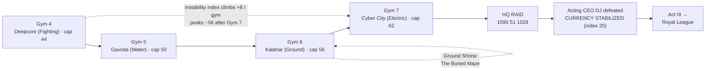
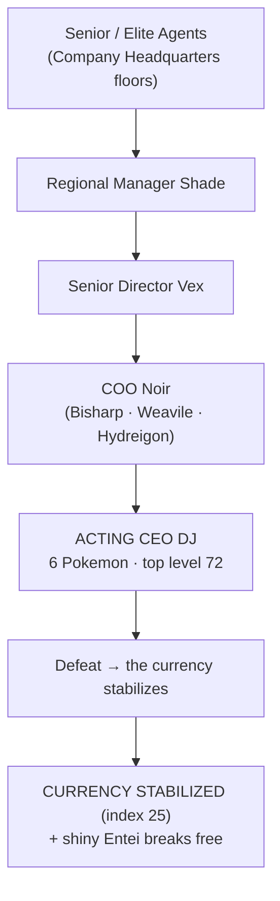

# Guidebook Act II — "The Company Closes In"

> [!CAUTION]
> **Major mid-game spoilers — Act II.** This page quotes memory fragments 4–7 verbatim (the hard turn of the amnesia arc, and where it points), walks the HQ raid floor by floor, and details Acting CEO DJ's full team. If you are playing (or watching) blind, walk gyms 4–7 with the spoiler-light **[[Guidebook Route Map]]** instead and come back after badge 7.

> **Gyms 4–7** · Deepcore City → Gaviota Port → Kalahar Reach → Cyber City → **the HQ Raid**
>
> This is the middle of the run, and it is where the campaign turns. The economy you've been living in starts to **feel wrong on purpose**, the people of The Company start to **recognize your face**, and the memory fragments stop being vague — by Gym 7 one of them puts your own signature in front of you. Act II ends not at a gym but in an office tower, with the **HQ Raid** and the first thing in this whole story you get to actually *fix*.

**Continues from:** [[Guidebook Act I]] · **Leads into:** [[Guidebook Act III]]
**See also:** [[Guidebook Overview]] · [[Guidebook Shrines]] · [[Commands]] · [[Architecture Data Flows]]

---

## What Act II is about

| Beat | Where it lands |
|------|----------------|
| **Recognition turns sharp** | NPCs go from "have we met?" to "you're supposed to be dead." Gated on your badge count. |
| **CobbleDollars feel broken** | The instability index climbs +8 per gym to its **peak (~56) after Gym 7**. Payouts come up short; the propaganda gets *nervous*. |
| **Wheat traders sour** | The "alternative currency" salesmen escalate from friendly trades → suspicious → **hostile ambush** as you liberate fields. |
| **The amnesia closes in** | Fragments 4–7 walk you from *the vault* → *the second signature* → *the boardroom* → **"You signed this charter."** |
| **The HQ Raid (climax)** | After Gym 7, storm `[1590 51 1028]`, fight up the org chart to **Acting CEO DJ**, and trigger the **CURRENCY STABILIZED** payoff. |

> [!NOTE]
> Instability numbers below assume you have **not** liberated wheat fields. Liberating fields pushes the index back down — Act II is a tug-of-war between the Company destabilizing and you fighting it back. See [Wheat War](#the-wheat-war-economy-in-act-ii).

---

## GYM 4 — Deepcore City *(Fighting 🥋 → cap 44)*

**Town center / battle area:** ~`[1033 129 3183]` · **Leader Bruno:** `[1045 129 3186]`

### What to expect
- **Type:** Fighting. The fielded ladder: **Black Belt Ryu** (Machop/Makuhita, Lv 31–32) → **Battle Girl Mika** (Meditite/Riolu, Lv 32) → **Apprentice Ken** (Machoke/Hariyama/Primeape, Lv 34–35) → **Leader Bruno** (**Lucario, Medicham, Machamp**, Lv 37–39 — ace 39, two above your entry cap). Bruno carries **2× Hyper Potion**. *(Martial Artist Kenji, Capoeira Rio, and Jr. Apprentice Striker are on the gym roster but not yet fielding teams in this build.)*
- **Reward of victory:** the **Fighting badge** raises your **level cap to 44** — your party can now train into the mid-40s. The badge also fires **memory fragment 4** and advances the Company's plot by one notch (each gym win nudges the instability index up by 8).
- A deep-cut mining city built into stone. Hardcore note: it's a vertical town — fall damage and lava are as dangerous as the gym.

### Story beat — the verifier
Defeating Bruno fires **Memory Fragment 4**, your first concrete glimpse of who you were:

> *A vault of nether stars. Cold. Humming.*
> *People trusted someone honest had counted them. They called you the verifier.*

This is the moment the economy plot stops being background flavor. You are starting to remember that you were the one everyone *trusted to count the money*. The town Archivist NPC can re-read this fragment any time.

### Recognition & villains here
By now the Company's people have shifted from polite confusion to unease. Grunts you meet around Act II towns are **Operatives / Compliance Officers / Market Analysts** (the corporate ladder is the difficulty curve). The first regional managers are already in play behind you — **Regional Manager Shade** unlocks after Gym 2, **Senior Director Vex** after Gym 4 (he needs the grunts behind him cleared through the Deepcore tier) — so the management tier is something you can be cleaning up *during* this stretch.

### Economy reading
After Bruno: **the instability index → ~32.** Quest payouts pay 75–100% of face value depending on the instability index — at 32, that's roughly an **8% haircut**. The per-payout line and the per-gym actionbar will say so out loud: *"the Company's ledgers waver."*

---

## GYM 5 — Gaviota Port *(Water 🌊 → cap 50)*

**Town center / battle area:** ~`[612 82 3533]` · **Leader Neptune:** `[624 82 3536]`

### What to expect
- **Type:** Water. The fielded ladder: **Sailor Marco** (Tentacool/Carvanha, Lv 38–39) → **Swimmer Coral** (Staryu/Shellder, Lv 39) → **Apprentice Marina** (Tentacruel/Sharpedo/Starmie, Lv 41–42) → **Leader Neptune** (**Cloyster, Lapras, Gyarados**, Lv 44–46 — ace 46). Neptune carries **2× Hyper Potion**. *(Fisherman Ivan, Surfer Paz, and Jr. Apprentice Tide are rostered but not yet fielding teams.)*
- **Reward of victory:** the **Water badge** raises your **level cap to 50.** Fires **memory fragment 5** and another +8 tick of the instability index.
- A coastal trading port — appropriately, the most commerce-heavy stop in Act II, and a good place to *feel* the currency wobble at the shops.

### Story beat — the second signature
**Memory Fragment 5** is the unsettling one:

> *Two signatures on every star-note.*
> *Double-signed, double-trusted. You cannot recall the second hand. You fear it was also yours.*

This is the lore engine spelled out: CobbleDollars are trusted because **two signatures** vouch for every nether-star reserve. You're remembering that you may have held *both pens* — the seed of the betrayal that's coming in Fragment 6.

### Economy reading
After Neptune: **the instability index → ~40.** The propaganda has fully shifted into its **Act 2 "nervous reassurance"** register — spokes-NPCs over-explain why prices are "adjusting," and **wheat traders** are now openly pitching an "alternative" currency. Payout haircut is now ~10%.

---

## ROUTES & THE GROUND SHRINE

### Between the towns — what to expect
There are **no safe respawns out here.** Towns and shrine sites are **safe zones** (hostile mob spawns suppressed, the Dark Urge silenced — Nuzlocke faint penalties, though, apply *everywhere*); everything between them is full-spawn wilderness. Treat every route as the most dangerous part of the run — this is hardcore, and a route mob can end the world as surely as a gym leader can.

This is also where you'll keep running into the **villain encounter web**: scattered Operatives and Senior Agents, and the **wheat traders** whose mood depends on how much of the monopoly you've broken (below).

### The Buried Maze — Ground Shrine
The **Ground Shrine** sits in the orbit of Kalahar Reach and the desert stretch. It is a **blind gauntlet** — start it from its altar NPC or pressure plate (`/cobblemon-initiative shrine ground start`).

| Property | Value |
|----------|-------|
| Name | **The Buried Maze** |
| Trial | Blind gauntlet |
| Effect | **Blindness** the whole way through — *"Half-strength. Half-sight."* |
| Earthquakes | every **45 seconds**, in a **20-block radius** |
| Objective | navigate blind, survive the quakes, and find **High Priest Terran** at the end |
| Escape | `/shrine-abort` at any time, no penalty |

> [!TIP]
> Shrines are **optional** elemental trials, not part of the gym gate. Full mechanics for all five live on [[Guidebook Shrines]]. Bring a Pokémon you can fight blind with — you won't see the terrain, and the earthquakes don't care.

---

## GYM 6 — Kalahar Reach *(Ground 🏜️ → cap 56)*

**Town center / battle area:** ~`[2073 126 4047]` · **Leader Gaia:** `[2085 126 4050]`

### What to expect
- **Type:** Ground. The fielded ladder: **Ruin Maniac Dustin** (Cubone/Phanpy, Lv 45) → **Hiker Boulder** (Sandshrew/Trapinch, Lv 44–45) → **Apprentice Terra** (Sandslash/Marowak/Donphan, Lv 47–48) → **Leader Gaia** (**Flygon, Hippowdon, Garchomp**, Lv 50–52 — ace 52). Gaia carries **2× Hyper Potion**. *(Archaeologist Juno, Prospector Vince, and Jr. Apprentice Dune are rostered but not yet fielding teams.)*
- **Reward of victory:** the **Ground badge** raises your **level cap to 56.** Fires **memory fragment 6** and another +8 to the instability index.
- A sun-bleached ruin-and-desert reach. The Ground Shrine's Buried Maze is thematically (and geographically) its neighbor.

### Story beat — the boardroom
**Memory Fragment 6** is the betrayal, half-seen:

> *A boardroom. Grey suits, all nodding.*
> *You held both keys to the ledger. They smiled. You should not have let them smile.*

This is the second signature from Fragment 5 paying off: **you held both keys.** You handed a circle of smiling executives the means to corrupt the very trust system you built. You're remembering being usurped — but not yet that it was *you* at the top.

### Recognition & villains here
This is roughly where the recognition arc tips into **alarm.** Where early grunts double-took, mid-arc Company staff are visibly rattled — *"you're supposed to be dead."* You are also at the point where the **wheat-trader ambush** can trigger: with **4+ fields liberated**, traders that used to deal with you turn **hostile** mid-trade (see below).

### Economy reading
After Gaia: **the instability index → ~48.** One gym from the peak. The shops feel actively unreliable now.

---

## GYM 7 — Cyber City *(Electric ⚡ → cap 62)* — **the hard turn**

**Town center / battle area:** ~`[1450 89 1182]` · **Leader Volt:** `[1462 89 1185]`

### What to expect
- **Type:** Electric. The fielded ladder: **Guitarist Amp** (Pikachu/Voltorb, Lv 50–51) → **Engineer Watt** (Magnemite/Electrike, Lv 51) → **Apprentice Surge** (Raichu/Magneton/Manectric, Lv 53–54) → **Leader Volt** (**Magnezone, Luxray, Electivire**, Lv 56–58 — ace 58). Volt carries **2× Hyper Potion**. *(Rocker Static, Mechanic Gigabyte, and Jr. Apprentice Voltz are rostered but not yet fielding teams.)*
- **Reward of victory:** the **Electric badge** raises your **level cap to 62** — and, critically, **unlocks the HQ Raid.**
- A neon corporate-tech city. Fitting: this is where The Company's grip on the narrative becomes literal.

### Story beat — "You signed this charter."
**Memory Fragment 7** is the inflection point of the entire amnesia arc:

> **You signed this charter. Your hand. Your seal.**
> *The Company verifies. Why does the word verifies feel like a knife?*

This is the beat the whole first half builds to. The audience now knows what the protagonist still won't quite let themselves know: **you didn't just work for The Company — you founded it.** The reveal itself is held until after the Royal League (see [[Guidebook Act III]]); Fragment 7 only puts the knife in your hand.

> [!IMPORTANT]
> If you're a returning player or watching the stream: **Gym 7 is the spoiler line.** Everything before it is breadcrumbs; everything after it is the protagonist walking back toward a throne they don't remember leaving.

### Economy reading — the peak
After Volt: **the instability index → ~56 (peak).** This is the worst the currency gets in normal play. Quest payouts pay 75–100% of face value depending on the instability index, and the peak lands you at an **86% rate — a 14% haircut** (the hard 75% floor only binds at a maxed-out index, which the story never reaches). The propaganda is at its most strained. This is by design — and it's about to be the setup for the only beat in Act II where you *fix* something.

### Tier 3 is still two badges away
The **Dark Urge whisper** system escalates with your **level cap**, not with the raid: tier 2 has been live since badge 6 (cap 56), and **tier 3** — the shadow-self voice dropping the vagueness for the founder's own cold logic — waits for **badge 9** (cap 74), deep in Act III. Act II is its last half-quiet stretch. (Mechanics: 12% chance on a faint **outside** a safe zone, 5-minute cooldown — see [[Architecture Data Flows]].)

---

## THE HQ RAID — climax of Act II

> **Location:** `[1590 51 1028]` · **Unlocks:** after Gym 7 + **4 liberated wheat fields** · **Boss:** Acting CEO DJ

This is not a gym. After the Electric Badge — and once you've **liberated 4 wheat fields** (DJ won't take the meeting while the fields still feed the Company; the quest HUD reads *"Liberate wheat fields, then raid HQ"* until then) — the HQ becomes assailable, and Act II resolves by **storming the office tower** and fighting up the org chart.

### The climb
The raid is a gauntlet up the Company's corporate ladder. The exact roster you face depends on your progress, but the structure is the ascent itself:

### Acting CEO DJ — what to expect
- A **6-Pokémon** ground-and-dark powerhouse, topping out around **level 72** (Persian, Nidoking, Golem, Rhyperior, **Tyranitar**, and a **shiny Entei** with Sacred Fire). Sand will be up; your cap is 62 — this is a real fight.
- DJ is the **Acting** CEO — a usurper keeping the seat warm. He is the public face of the destabilization, *not* the true power behind it. Beating him doesn't end the story; it ends the *bleeding*.
- **The spoils:** a **Master Ball**, **64 wheat** (the commodity, handed back), the post-raid Pokémart tier, and the stabilization beat below. His defeat also releases the **shiny Entei**, which "breaks free from The Company's control."

> [!NOTE]
> **Content status:** the HQ interior chain is authored but not yet placed — DJ, the three managers (Shade / Vex / Noir), and the mid-tier grunts have no bodies in the world and no live battle teams in this build. The raid's structure, gates, and rewards below are the shipped design; the fights themselves are still being wired.

> [!WARNING]
> **Hardcore reality check.** DJ's team is above your level cap, runs sandstorm chip damage, and a Choice-Band shiny Entei outspeeds and one-shots frail mons. Come full, scout safe-zone heals, and remember a faint here is permanent.

### The payoff — CURRENCY STABILIZED
Defeating DJ **clamps the instability index from its ~56 peak down to 25** — the single biggest, most *earned* swing in the game. (It only ever pushes the index *down*: if your field liberations already carried it below 25, the raid never undoes your work.) You get a beacon-chime title splash:

> **CURRENCY STABILIZED**
> *The Company's grip on the ledger loosens — for now.*
> `[Economy] CobbleDollar stability restored to 25/100.`

Mechanically your **payouts immediately recover** (the haircut drops from ~14% to ~6%). Narratively, this is the first thing in the whole story the protagonist gets to *fix* rather than just survive.

> [!NOTE]
> Stabilized to **25, not 0.** The Company is wounded, not beaten. The index holds at 25 through Gyms 8–10 — a reminder that the real rot is still in the Boardroom, waiting for [[Guidebook Act III]].

---

## The Wheat War economy in Act II

The Company's endgame is to **replace** CobbleDollars with a **wheat-backed currency they monopolize** — they occupy the wheat fields. Act II is where that conflict becomes interactive.

### Wheat traders — trade → recognize → ambush
Roaming **wheat traders** are the alternative currency made flesh. Their behavior escalates off the shared **liberation count**, in three suspicion tiers:

| Fields liberated | Trader behavior | Suspicion tier |
|:---:|------|------|
| **0–1** | Normal trades — they're just salesmen | *(none)* |
| **2–3** | **Recognition** — they start eyeing you, suspicious | *suspicious* |
| **4+** | **Hostile ambush** — they recognize the founder mid-trade and attack | *hostile* |

The escalation runs purely off the **liberation count** — the traders don't need to *see* you do it; the ledger tells them. The more of the monopoly you break, the more the Company's own field operatives realize *who you are* — and the more dangerous a "trade" becomes.

### Field liberation
**Liberating wheat fields** is how you fight the destabilization back. Each field follows the pattern taught at Firstfurrow: clear the Company detail at the fence, beat the site boss, and the field flips. Each liberation:
- Pushes the instability index **down by 6** (your quest payouts skew less, immediately).
- Refreshes the Pokémart and Granary to a cheaper **relief** catalog on the spot.
- Flips the field's banner to *Liberated* and makes it **safe farmland**.
- Counts on the HUD's *"Liberate the occupied fields"* line — and toward the **4-field gate** on DJ's door.

> [!NOTE]
> **Content status:** the liberation machinery itself is fully live — the counter, the index relief, the shop refresh, the zone flip, the trader escalation. What's missing is *placement*: only **Firstfurrow (farm 1)** on Harvest Road currently has a Company detail to beat, so the liberation count tops out at 1 for now. The 4-field HQ gate, the suspicious/hostile trader tiers, the Granary ambush, and the deeper relief pricing are all unreachable until the remaining fields get their garrisons. Treat the field counts on this page as the shipped design, one field of which is playable today.

---

## Act II progression at a glance

| # | Town | Type | Cap | Badge | Memory Fragment | Instability |
|:-:|------|------|:---:|----------|-----------------|:---:|
| 4 | Deepcore City | Fighting 🥋 | 44 | the Fighting badge | fragment 4 — *the verifier / nether-star vault* | → ~32 |
| 5 | Gaviota Port | Water 🌊 | 50 | the Water badge | fragment 5 — *two signatures, the second hand* | → ~40 |
| 6 | Kalahar Reach | Ground 🏜️ | 56 | the Ground badge | fragment 6 — *the boardroom, both keys* | → ~48 |
| 7 | Cyber City | Electric ⚡ | 62 | the Electric badge | **fragment 7 — "You signed this charter."** | → ~56 (peak) |
| — | **HQ Raid → Acting CEO DJ** | — | — | — | *(no fragment)* | **→ 25** |

*Level cap unlocks the moment you defeat that gym's leader — the badge is what unlocks the cap; the cap is always the highest you've achieved. Fragments fire once per badge and are re-readable via the town Archivist. Instability values assume no field liberation.*

---

## Quests in this act

Act II's spine lives on **[[Quests Main Story]]** — **The Wheat War** (liberate the occupied fields), **The HQ Raid** (Acting CEO DJ), and gyms 4–7 with their exact rosters and prize money. The war's first shots are fired back in wheat country: the traders, the Granary, and the greenhouse reveal are walked through on **[[Quests Hua Zhan City]]**, and the Firstfurrow liberation template (plus the Deng family's homecoming and the night watch over the first free harvest) on **[[Quests Harvest Road]]**. Town-by-town side quest pages for Deepcore, Gaviota, Kalahar, and Cyber City are still being authored — the full index is on **[[Quests Overview]]**.

---

## Quick reference

- **Check your standing:** `/cobblemon-initiative progress` (badges, defeated trainers, cap) and `/cobblemon-initiative levelcap`.
- **Quest HUD:** `/ca quest show|hide|refresh` — the sidebar's main line tracks your current objective; through Act II it walks you toward the HQ. Cycle the tracked side quest with **`]`** / **`[`** (aqua **▶** + JourneyMap waypoint).
- **Start the Ground Shrine:** `/cobblemon-initiative shrine ground start` · **bail out:** `/shrine-abort`.
- Full command list: [[Commands]]. How these systems wire together: [[Architecture Data Flows]].

---

**◀ Previous:** [[Guidebook Act I]] — gyms 1–3, the journey begins, the economy still feels stable.
**▶ Next:** [[Guidebook Act III]] — the Royal League, the Board of Directors, and the mirror battle against **The Founder**.
