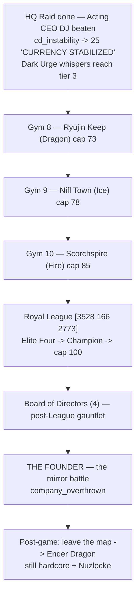
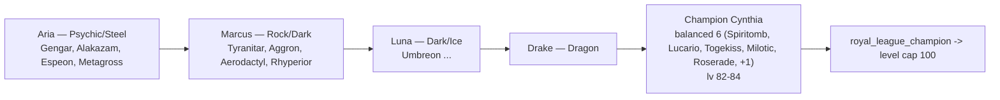
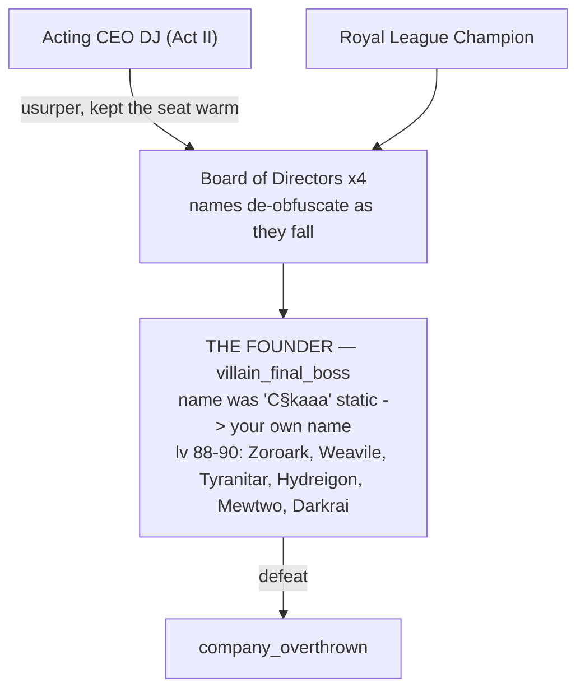

_Continued from [[Guidebook Act II]]. Elemental side-content lives in [[Guidebook Shrines]]._

# Guidebook Act III — "The Founder"

This is the hardcore climax. By now the currency is stable, the HQ has fallen, and **Acting CEO DJ** is beaten — but the seat he was keeping warm belongs to someone. The last three gyms close the level-cap ladder, the **Royal League** crowns you, and only then does the game stop hiding the answer the memory fragments have been circling since Cyber City: **you are The Founder.**

> **Spoiler posture.** This page lays out the *shape* of the ending so a streamer can pace it, without scripting the turn-by-turn. The reveal itself is held back in-game until after the League — keep it that way on stream.

---

## Where Act III sits

**Pacing note:** The HQ raid and DJ happen *during* the Act II window (after ~gym 7). Act III opens with the economy already stabilized at `cd_instability = 25`, which is why payouts feel honest again and the propaganda has stopped pretending. From here, the gyms are the disciplined ascent to a 100-cap; the story has already turned.

---

## The held-back reveal

The **Memory Fragment** system (one first-person flash per gym badge, tracked by the `memory_fragment` scoreboard = badges beaten) has been tightening since Act I. The Cyber City beat at gym 7 — *"You signed this charter."* — was the hard turn. Act III is the close, and it is deliberately **not** the reveal:

| Badge | Fragment beat |
|------:|---------------|
| 8 — Ryujin Keep | *"You built it."* |
| 9 — Nifl Town | *"They emptied you."* |
| 10 — Scorchspire | *"…face your own signature."* |

The fragments **circle** the truth and never close it. The actual *"it was you all along"* lands only after the Royal League / Board clearout, at The Founder. A town **Archivist** NPC can re-read any fragment you have unlocked if your audience missed one.

> Continuity rule from the Lore Bible: **never** name the protagonist as the Founder before Act III. Fragments 8–9 are dread, not disclosure.

---

# Gym 8 — Ryujin Keep (Dragon) → cap 73

- **Leader:** Ryujin · **Badge:** Dragon · **Level cap unlocked:** 73
- **Battle position:** ~`[2144 201 881]` (leader at `[2156 201 884]`) — a high keep.

**What to expect.** A draconic, hard-hitting gym at the top of the late game. With DJ already toppled, the economy is steady (`cd_instability` parked at 25), so battle payouts run near-full — the per-payout rate line stops nagging.

**Story beat.** Defeating Ryujin fires **frag_8 — "You built it."** This is where the protagonist's internal voice tips from confusion toward dreadful recognition. The **Dark Urge whisper** system is now at its highest tier (tier 3, unlocked once DJ fell): on a Pokémon faint **outside a safe zone**, a 12% roll (5-minute cooldown) can surface the shadow-self's coldest commentary — the founder's old "assets fail, you replace them" logic, set against the grief of a Nuzlocke run.

---

# Gym 9 — Nifl Town (Ice) → cap 78

- **Leader:** Boreas · **Badge:** Ice · **Level cap unlocked:** 78
- **Battle position:** ~`[3596 112 2028]` (leader at `[3608 112 2031]`).

**What to expect.** A frozen, far-flung town. Mechanically similar to gym 8 — clear the gym ladder, beat Boreas, take the cap. Recognition dialogue from any remaining Company stragglers is at its most raw here: their people don't ask *"have we met?"* anymore — they know exactly who you are, and some won't raise a hand against the founder.

**Story beat.** **frag_9 — "They emptied you."** The amnesia is now framed as something *done to you*, not merely lost. The cold is thematic: you are nearly at the answer and the world has gone quiet around it.

---

# Gym 10 — Scorchspire (Fire) → cap 85

- **Leader:** Vulcan · **Badge:** Fire · **Level cap unlocked:** 85
- **Battle position:** ~`[3688 100 4508]` (leader at `[3700 100 4511]`).

**What to expect.** The final gym, and the highest non-League cap (85). Vulcan is the last leader between you and the League. Treat this as the difficulty checkpoint before the Elite Four — your team should be League-ready coming out of the Scorchspire.

**Story beat.** **frag_10 — "…face your own signature."** The last fragment names the shape of the ending without naming the name. The League now stands between the player and the reveal — by design. *Earn the answer.*

---

# The Royal League — `[3528 166 2773]` → cap 100

Clearing all ten badges unlocks the League. Beating the Champion grants the `royal_league_champion` achievement and lifts the **level cap to 100**.

**Format.** Five sequential battles, GEN 9 singles, each gated on the previous (chain of `prerequisites`). Bring full restores — every member carries their own bag.

| Battle | Trainer | Theme | Note |
|--------|---------|-------|------|
| Elite 1 | Aria | Psychic / Steel | lv 72–74 |
| Elite 2 | Marcus | Rock / Dark | sand + hazards |
| Elite 3 | Luna | Dark / Ice | |
| Elite 4 | Drake | Dragon | |
| Champion | **Cynthia** | Balanced 6 | lv 82–84; rewards a Master Ball + netherite |

**What to expect.** This is a no-heal grind in the spirit of a real Elite Four run, made lethal by hardcore + Nuzlocke. There is no badge here — there is a crown. Becoming Champion is the surface story's victory; the reveal is what the surface story was hiding.

---

# Endgame — Board of Directors → The Founder

> **The reveal lives here.** After the League, the Boardroom opens. This is the payoff of the entire amnesia arc — pace it as the centerpiece of the finale, not a footnote.

### The Board of Directors (post-League gauntlet)

Four Board members — **Madeline, Matt, Micah, Lauren** — each gated on having beaten **both** Acting CEO DJ *and* the Champion (`prerequisites: ["villain_boss", "royal_champion"]`). Their names render under `§k` static until earned; the propaganda has fully corrupted by now (glitching slogans, the leaked cover-up: *"We told them the founder retired."*). Clearing all four is the lock on the final door.

### The Founder — the mirror battle

- **Who it is:** the player's **shadow self** — the cold founder who treated people as line items, the same voice that has been whispering on every faint. Inspired by the **Pokémon Red** mirror match: it should feel like fighting *yourself*, not slaying a monster.
- **The de-obfuscation:** the Founder's name shows as `§k` static (`C§kaaa`) until earned; design intent is that it resolves toward **the player's own name** as the Board falls and the truth lands.
- **The team (lv 88–90):** Zoroark (Illusion — fitting, for a self that wears your face), Weavile, Tyranitar, Hydreigon, and the signature legendaries **Mewtwo** and **Darkrai**. This is the hardest battle in the run.
- **Reward / flag:** beating The Founder grants **`company_overthrown`** — the Company is reclaimed, the economy is yours, and the protagonist is, at last, themselves.

---

# Post-game — leave the map, beat the Ender Dragon

The story does not end at the credits. With the Company overthrown, the reclaimed founder walks out of the curated **UPM map** into **generated Minecraft terrain** and attempts to beat **vanilla Minecraft — the Ender Dragon — still hardcore + Nuzlocke.** No safe zones out there; no script. The final image is the founder, finally whole, walking into the unknown.

### Battle Frontier

The **Battle Frontier** is post-Champion, optional, repeatable content — the place to keep battling once the campaign is done. (Its full roster is reserved for a later build; for now treat it as the endgame's stretch goal alongside the Dragon.)

---

## Streamer checklist for Act III

- [ ] Confirm DJ is already beaten and `cd_instability = 25` before opening Act III (Dark Urge tier 3 should be live).
- [ ] Land frag_8 → frag_9 → frag_10 on each gym leader defeat; offer the Archivist re-read for VOD viewers.
- [ ] Hold the "you are The Founder" reveal until **after** the League and the Board — don't let chat front-run it.
- [ ] Treat the Champion as the difficulty wall and The Founder (lv 88–90, Mewtwo + Darkrai) as the true wall.
- [ ] After `company_overthrown`: the run continues — pack for the overworld and the Ender Dragon.

---

**See also:** [[Guidebook Overview]] · [[Guidebook Act I]] · [[Guidebook Act II]] · [[Guidebook Shrines]] · [[Commands]] · [[Architecture Data Flows]]
