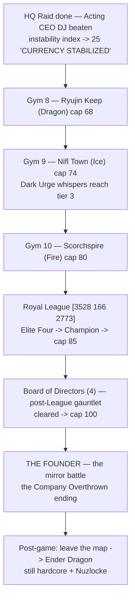
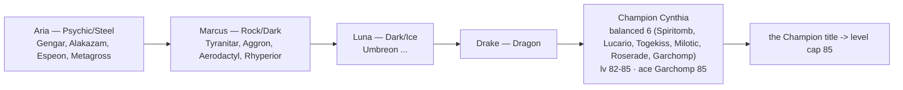
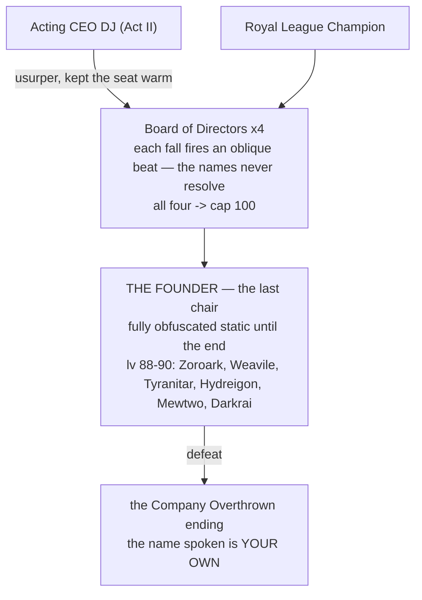

_Continued from [[Guidebook Act II]]. Elemental side-content lives in [[Guidebook Shrines]]._

# Guidebook Act III — "The Founder"

This is the hardcore climax. By now the currency is stable, the HQ has fallen, and **Acting CEO DJ** is beaten — but the seat he was keeping warm belongs to someone. The last three gyms push the cap to **80**, the **Royal League** crowns you at **85**, the **Board of Directors** holds the final cap of **100** — and only then does the game stop hiding the answer the memory fragments have been circling since Cyber City: **you are The Founder.**

> **Spoiler posture.** This page lays out the *shape* of the ending so a streamer can pace it, without scripting the turn-by-turn. The reveal itself is held back in-game until after the League — keep it that way on stream.

---

## Where Act III sits

**Pacing note:** The HQ raid and DJ happen *during* the Act II window (after ~gym 7). Act III opens with the economy already stabilized — the instability index parked at 25 — which is why payouts feel honest again and the propaganda has stopped pretending. From here, the gyms are the disciplined ascent through the endgame caps — 80 at the last badge, 85 at the crown, 100 when the Board is cleared; the story has already turned.

---

## The held-back reveal

The **Memory Fragment** system (one first-person flash per gym badge — the fragment count *is* your badge count) has been tightening since Act I. The Cyber City beat at gym 7 — *"You signed this charter."* — was the hard turn. Act III is the close, and it is deliberately **not** the reveal:

| Badge | Fragment beat |
|------:|---------------|
| 8 — Ryujin Keep | *"You did not just sign it. You built it."* |
| 9 — Nifl Town | *"They needed you gone, not dead. So they emptied you."* |
| 10 — Scorchspire | *"Everything points one direction now. Inward."* — *Beat the League. Then face the only signature you have not yet read: your own.* |

The fragments **circle** the truth and never close it. The actual *"it was you all along"* lands only after the Royal League / Board clearout, at The Founder. A town **Archivist** NPC can re-read any fragment you have unlocked if your audience missed one.

> Continuity rule from the Lore Bible: **never** name the protagonist as the Founder before Act III. Fragments 8–9 are dread, not disclosure.

---

# Gym 8 — Ryujin Keep (Dragon) → cap 68

- **Leader:** Ryujin · **Badge:** Dragon · **Level cap unlocked:** 68
- **Battle position:** ~`[2144 201 881]` (leader at `[2156 201 884]`) — a high keep.

**What to expect.** A draconic, hard-hitting gym at the top of the late game. The fielded ladder: **Dragon Tamer Ryu** (Dratini/Axew, Lv 56–57) → **Ace Trainer Drake** (Bagon/Gible, Lv 57) → **Apprentice Tatsu** (Dragonair/Fraxure/Shelgon, Lv 59–60) → **Leader Ryujin** (**Dragonite, Haxorus, Salamence**, Lv 62–64 — ace 64, two above your entry cap). With DJ already toppled, the economy is steady (the instability index parked at 25), so quest payouts run near-full — the per-payout rate line stops nagging.

**Story beat.** Defeating Ryujin fires **memory fragment 8 — "You did not just sign it. You built it."** This is where the protagonist's internal voice tips from confusion toward dreadful recognition. The **Dark Urge whisper** stays at tier 2 for one more badge — its final escalation is waiting at Nifl.

---

# Gym 9 — Nifl Town (Ice) → cap 74

- **Leader:** Boreas · **Badge:** Ice · **Level cap unlocked:** 74
- **Battle position:** ~`[3596 112 2028]` (leader at `[3608 112 2031]`).

**What to expect.** A frozen, far-flung town. The fielded ladder: **Skier Powder** (Sneasel/Swinub, Lv 62–63) → **Boarder Chill** (Snorunt/Spheal, Lv 63) → **Apprentice Glacier** (Weavile/Piloswine/Froslass, Lv 65–66) → **Leader Boreas** (**Mamoswine, Walrein, Glaceon**, Lv 68–70 — ace 70). Recognition dialogue from any remaining Company stragglers is at its most raw here: their people don't ask *"have we met?"* anymore — they know exactly who you are, and some won't raise a hand against the founder.

**Story beat.** **Memory fragment 9 — "They needed you gone, not dead. So they emptied you."** The amnesia is now framed as something *done to you*, not merely lost. The cold is thematic: you are nearly at the answer and the world has gone quiet around it. And this badge lifts the cap to **74** — over the Dark Urge's final threshold: the whispers reach **tier 3** here, the shadow-self's coldest register ("assets fail, you replace them"), on the same 12% roll / 5-minute cooldown as ever, on any faint outside a safe zone.

---

# Gym 10 — Scorchspire (Fire) → cap 80

- **Leader:** Vulcan · **Badge:** Fire · **Level cap unlocked:** 80
- **Battle position:** ~`[3688 100 4508]` (leader at `[3700 100 4511]`).

**What to expect.** The final gym, and the highest pre-League cap (80). The fielded ladder: **Kindler Blaze** (Growlithe/Vulpix, Lv 68–69) → **Fire Breather Pyra** (Magmar/Houndour, Lv 69) → **Apprentice Inferno** (Arcanine/Ninetales/Houndoom, Lv 71–72) → **Leader Vulcan** (**Magmortar, Typhlosion, Charizard**, Lv 74–76 — ace 76). Vulcan is the last leader between you and the League. Treat this as the difficulty checkpoint before the Elite Four — your team should be League-ready coming out of the Scorchspire.

**Story beat.** **Memory fragment 10 — "Everything points one direction now. Inward."** — *Beat the League. Then face the only signature you have not yet read: your own.* The last fragment names the shape of the ending without naming the name. The League now stands between the player and the reveal — by design. *Earn the answer.*

---

# The Royal League — `[3528 166 2773]` → cap 85

Clearing all ten badges unlocks the League. Beating the Champion grants the **Champion title** and lifts the **level cap to 85** — the final cap of 100 still waits in the Boardroom.

**Format.** Five sequential battles, GEN 9 singles, each door opening only when the previous combatant falls. Bring full restores — every member carries their own bag.

| Battle | Trainer | Theme | Note |
|--------|---------|-------|------|
| Elite 1 | Aria | Psychic / Steel | lv 72–74 · pays 5× Rare Candy |
| Elite 2 | Marcus | Rock / Dark | lv 74–76 · sand + hazards · 5× Rare Candy |
| Elite 3 | Luna | Dark / Ice | lv 76–78 · 5× Rare Candy |
| Elite 4 | Drake | Dragon | lv 78–80 · 5× Rare Candy |
| Champion | **Cynthia** | Balanced 6 — ace **Garchomp Lv 85** | lv 82–85; rewards a Master Ball + 3× Netherite Ingot |

**What to expect.** This is a no-heal grind in the spirit of a real Elite Four run, made lethal by hardcore + Nuzlocke. There is no badge here — there is a crown. Becoming Champion is the surface story's victory; the reveal is what the surface story was hiding.

> [!NOTE]
> **Content status:** the League's five battles are fully specced — teams, levels, prize money — but not yet wired in-world: the five combatants have no bodies placed and their live battle files are still empty placeholders. The support staff at the doors (the gatewarden, the badgekeeper, the archivist, the physician) are already standing.

---

# Endgame — Board of Directors → The Founder

> **The reveal lives here.** After the League, the Boardroom opens. This is the payoff of the entire amnesia arc — pace it as the centerpiece of the finale, not a footnote.

### The Board of Directors (post-League gauntlet)

Four Board members — their names never surface in-game, only static-obfuscated garble — each gated on having beaten **both** Acting CEO DJ *and* the Champion, fightable in any order. Each fields **six Pokémon at Lv 82–87** and carries held items; each pays **9,000 CD** flat plus **5× Rare Candy and 3× Diamond**. Their nameplates render as static-obfuscated garble — and **stay** static for the entire run: each emptied seat fires an oblique beat instead of a name (*"A seat empties…"* → *"Half the table is silent…"* → *"One chair left between you and the name…"* → *"The room is cleared. The static holds one name, and it is waiting for you."*). The propaganda has fully corrupted by now (glitching slogans, the leaked cover-up: *"We told them the founder retired."*). Clearing all four is the lock on the final door — and it unlocks the **final level cap of 100**, your training window before the mirror.

### The Founder — the mirror battle

- **Who it is:** the player's **shadow self** — the cold founder who treated people as line items, the same voice that has been whispering on every faint. Inspired by the **Pokémon Red** mirror match: it should feel like fighting *yourself*, not slaying a monster.
- **The name:** the Founder's nameplate is pure static and **never de-obfuscates** — not as the Board falls, not during the fight. The only time the Founder is ever named is *at the moment of defeat*, and the name the game speaks is **the player's own** — rendered live, whoever is standing there: *"The name on the chair was always \<you\>."*
- **The team (lv 88–90):** Zoroark (Illusion — fitting, for a self that wears your face), Weavile, Tyranitar, Hydreigon, and the signature legendaries **Mewtwo** and **Darkrai**. This is the hardest battle in the run. *(Design-canon note: the lore bible describes the Founder as a single **level-100 mirror** of the player; the shipped team is this six-mon Lv 88–90 placeholder — the true mirror mechanic is still to land.)*
- **Reward / ending:** beating The Founder pays **no prize money** — you don't get paid to reclaim yourself — and grants a **Master Ball, 2× Netherite Ingot, and 64 wheat**, plus the **Company Overthrown** ending. The Company is reclaimed, the economy is yours, and the protagonist is, at last, themselves. (The level-100 cap came from clearing the Board *before* this fight — the mirror grants nothing but the name.)

> [!NOTE]
> **Content status:** like the League, the Board and the Founder are fully specced but not yet wired in-world — no bodies placed, no live battle files. The reveal machinery (the oblique seat beats, the name-spoken-at-defeat) is shipped and waiting.

---

# Post-game — leave the map, beat the Ender Dragon

The story does not end at the credits. With the Company overthrown, the reclaimed founder walks out of the curated **UPM 2** world into **generated Minecraft terrain** and attempts to beat **vanilla Minecraft — the Ender Dragon — still hardcore + Nuzlocke.** No safe zones out there; no script. The final image is the founder, finally whole, walking into the unknown.

### Battle Frontier

The **Battle Frontier** is post-Champion, optional, repeatable content — designed for the **85–100 window**: the stretch between your Champion's cap and the Board-cleared cap, before and after the Boardroom falls. (Its full roster is reserved for a later build; for now treat it as the endgame's stretch goal alongside the Dragon.)

---

## Streamer checklist for Act III

- [ ] Confirm DJ is already beaten and the instability index reads 25 before opening Act III.
- [ ] Land memory fragments 8 → 9 → 10 on each gym leader defeat; offer the Archivist re-read for VOD viewers.
- [ ] Expect the Dark Urge to hit **tier 3 at the Nifl badge** (cap 74) — its coldest register, timed for the frozen leg of the run.
- [ ] Hold the "you are The Founder" reveal until **after** the League and the Board — don't let chat front-run it. The Board's names stay static all the way; only the mirror's defeat speaks a name, and it's yours.
- [ ] Confirm the **cap-100 unlock lands when the fourth Board seat empties** — that's the training window before the mirror.
- [ ] Treat the Champion as the difficulty wall and The Founder (lv 88–90, Mewtwo + Darkrai) as the true wall.
- [ ] After the Company is overthrown: the run continues — pack for the overworld and the Ender Dragon.

---

## Quests in this act

The endgame chain lives on **[[Quests Main Story]]**: gyms 8–10, **The Royal League** (Elite Four → Champion Cynthia, with per-battle prize money), **Hunt the Board of Directors**, and **Face The Founder**. Two loose ends are worth closing before the Boardroom: the Archivist's **Incomplete File** — its final stage pays the run's biggest back-pay once the HQ has fallen (see [[Quests Sango Town]]) — and the two **dex-unlock partners**, if the lab is still holding them for you ([[Quests Main Story]]).

---

**See also:** [[Guidebook Overview]] · [[Guidebook Act I]] · [[Guidebook Act II]] · [[Guidebook Shrines]] · [[Commands]] · [Architecture Data Flows](https://github.com/The-Company-Inc-Nerds/the-cobblemon-initiative/blob/main/docs/ARCHITECTURE_DATA_FLOWS.md)
