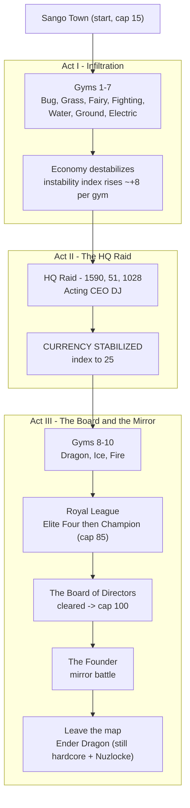

# Guidebook Overview

> A field guide for one trainer, one world, one run. This is a **single-player**, **hardcore + Nuzlocke** campaign played for a live Twitch + YouTube audience. There are no second chances — and the land knows more about you than you do.

> [!NOTE]
> **Light spoilers:** the act summaries and campaign diagram below name the Act II boss and the shape of the finale — never the reveal itself.

This Overview frames the whole campaign: who you are, the route you walk, the discipline that keeps you alive, and the systems you will meet along the way. The act-by-act pages go deeper:

- [[Guidebook Route Map]] — the linear walkthrough: every town, route, and shrine in the order you walk them.
- [[Guidebook Act I]] — Infiltration: gyms 1–7, the destabilizing economy, the wheat traders.
- [[Guidebook Act II]] — The HQ Raid and the turn of the currency.
- [[Guidebook Act III]] — The Royal League, the Board, the mirror, and what lies past the map.
- [[Guidebook Shrines]] — The five elemental trials, optional but pointed.
- Quest walkthroughs: [[Quests Overview]] · [[Quests Main Story]] · [[Quests Sango Town]] · [[Quests Blossom Path]] · [[Quests Takehara Falls]] · [[Quests Harvest Road]] · [[Quests Hua Zhan City]].

> **Note on detail.** This Overview and the act pages tell you *what to expect* at each town, route, and shrine — the story beats, the gym type and cap, the systems you will trip over there. For the **linear order — which town/route/shrine comes next** — see the [[Guidebook Route Map]].

---

## The Through-Line (no heavy spoilers)

You wake with nothing. No memory, no name you trust, no reason you can name — so you do what any trainer does: you start walking the gym route. From the starting town of **Sango**, ten gyms lie ahead in a fixed order, and beating their leaders is the whole journey on the surface.

Underneath it is a mystery. An organization called **The Company, Inc.** runs the region's money — it is the trusted verifier that everyone relies on to keep **CobbleDollars** honest. As you travel, that money starts to feel *off*: payouts come up short, prices drift, the numbers stop adding up. The Company's people keep doing double-takes when they see your face, as if they know you. They do. You don't — not yet.

The campaign is a slow recovery of who you were, delivered in **memory fragments** as you earn badges. The audience will piece it together before your character does. The truth is held back until late on purpose; this guide will not spoil it here. Walk the route, mind the stakes, and let the world tell you.

> **Tone:** reclamation, not heroism. You are not an outsider saving the land. You are someone taking back something you built and lost — morally smudged, hunted by an institution wearing the face of trust. Inspired by the **Dark Urge** (Baldur's Gate 3) and the **Pokémon Red** mirror finale.

---

## The Rules of Survival

Two disciplines define every minute of play. Internalize them before you leave Sango.

### Hardcore
One life. When you go down, the world ends and a new run begins. Hardcore is set on the world itself; treat every decision as final.

### Nuzlocke
Permadeath for your team, enforced by the mod:

- **On a Pokémon faint**, *you* take damage (scaled by party size or max health), and the fainted Pokémon may be removed from your party. This applies **everywhere** — town, shrine, or wilderness. There is no safe ground from grief.
- **If you flee a battle**, you pay a **sacrifice** — the game prompts you to select a Pokémon to give up. Flee (or forfeit a trainer battle) with only **one** Pokémon left and the run ends on the spot: *there is no escape.*
- **If a faint would kill you**, a custom **Pokéball death screen** replaces the vanilla one. Hardcore being hardcore, that is the end of the run.
- **Duplicates and edge cases** follow the run settings: duplicate captures can be auto-released, and catches can route straight to the PC or arrive at 0 HP, depending on the ruleset in force.
- **Safe zones** — towns, shrine grounds, and a few story sites — suppress **hostile mob spawns** and quiet the Dark Urge. They do **not** pause the faint penalties above. Routes announce themselves as zones too, but their spawns stay live; occupied farmland only becomes safe ground once you liberate it. Know where the line is before a battle, not after.

### The Dark Urge
When a Pokémon faints **outside** a safe zone, there is a small chance (around 12%, with a 5-minute cooldown) that a cold, first-person whisper surfaces — the voice of who you used to be, commenting on the loss as if your team were inventory. The whispers **escalate** as your level cap climbs: tier 1 arrives with your first badge (cap 22), tier 2 with your fourth (cap 44), and the darkest tier 3 with your eighth (cap 68). Every fainted partner is the argument between the griever you have become and the voice of who you used to be.

---

## Level-Cap Discipline

Your team is capped, and the cap is **earned**. Each gym leader you defeat unlocks a higher level cap (the cap is the highest you have achieved — it never drops). The world scales with your journey, so the discipline is to fight *at* the cap, not over-level past it. The route, in order:

| # | Town | Type | Gym Leader | Level Cap Unlocked |
|:-:|------|------|------------|:------------------:|
| — | **Sango Town** | — (start) | — | 15 (starting cap) |
| 1 | Takehara Falls | Bug 🐞 | Cicada | 22 |
| 2 | Hua Zhan City | Grass 🌿 | Blossom | 30 |
| 3 | Mystic Marsh | Fairy ✨ | Titania | 37 |
| 4 | Deepcore City | Fighting 🥋 | Bruno | 44 |
| 5 | Gaviota Port | Water 🌊 | Neptune | 50 |
| 6 | Kalahar Reach | Ground 🏜️ | Gaia | 56 |
| 7 | Cyber City | Electric ⚡ | Volt | 62 |
| 8 | Ryujin Keep | Dragon 🐉 | Ryujin | 68 |
| 9 | Nifl Town | Ice ❄️ | Boreas | 74 |
| 10 | Scorchspire | Fire 🔥 | Vulcan | 80 |
| — | **Royal League** | Elite Four + Champion | Aria · Marcus · Luna · Drake → Cynthia | 85 |
| — | **Board of Directors** | the last door before the Founder | — | **100** |

The starting cap of **15** is deliberate — it gates most pre-gym-1 evolutions, so even your starter waits for the first badge to grow up. The final cap of **100** does not come from the League: it unlocks only when the **Board of Directors** is cleared, the last gate before the Founder.

> [!IMPORTANT]
> **You fight every leader underleveled.** Each gym leader's ace sits at your **entry cap + 2** — aces run 17 / 24 / 32 / 39 / 46 / 52 / 58 / 64 / 70 / 76 down the route. That is the intended shape of a brutal hardcore Nuzlocke: the cap is a ceiling, and the leader is always above it.

Each gym is a small climb of its own — rank-and-file trainers, then a Jr. Apprentice, an Apprentice, and finally the Leader — with a reward and a **memory fragment** waiting on the leader's defeat. Every gym is *staffed* for that full seven-role ladder, but in the current build only Takehara Falls and Hua Zhan City field all seven battles; gyms 3–10 field four (two trainers, the Apprentice, and the Leader) while the remaining rungs are cast. Check your standing any time with `/ca progress` and `/ca levelcap`; see the full [[Commands]] reference.

---

## Systems You Will Meet

The campaign is carried by a handful of interlocking systems. Each is documented in depth on the [Architecture Overview](https://github.com/The-Company-Inc-Nerds/the-cobblemon-initiative/blob/main/docs/ARCHITECTURE_OVERVIEW.md) and [Architecture Data Flows](https://github.com/The-Company-Inc-Nerds/the-cobblemon-initiative/blob/main/docs/ARCHITECTURE_DATA_FLOWS.md) pages; here is what they *feel* like in play.

### Badges & Memory Fragments
Beating a gym leader unlocks the next level cap and fires a **memory fragment** — a short first-person flash of who you were. They start as formless unease and sharpen over the journey; the seventh ("you signed this charter") is the hard turn. A **town Archivist** NPC will re-read past fragments for you. Behind the scenes, the fragment count is simply your badge count — and it gates the lore as it deepens.

### The Destabilizing CobbleDollar Economy
The Company is the region's trusted currency verifier, and it is **abusing that trust**. Across the gym journey an **instability index** (0–100) climbs — roughly **+8 per gym** through gym 7 — and your **quest payouts** get skewed downward, paying 75–100% of face value depending on the index (battle prize money is always paid flat). Every skewed payout prints a receipt with a plain **"Verified Rate N%"** line — the Company's name appears on a receipt only at a handful of deliberate moments, when you are taking *its* money directly. You will *feel* the plot in your wallet long before you understand it. This is the engineered chaos The Company uses to push its own **wheat-backed** money. (It is a deliberate nod to the long-running community debate over the best item to anchor a Minecraft economy — The Company's answer is "whatever *we* control.")

The shops ride the same wave. The **Pokémart** runs a badge-tiered catalog — the opening tier sells basic balls and medicine, each badge widens it, and a post-raid tier opens once the HQ falls — with prices that swing with the index, so buying early is literally cheaper. The **Granary** company store refuses CobbleDollars entirely and sells goods *for wheat*, on a curve that peaks around gym 7. Liberating occupied fields claws the index back down and unlocks cheaper **relief** catalogs at both counters.

### Wheat Traders & Field Liberation
As money wobbles, **Company wheat traders** appear offering an "alternative" currency. Trade with them and the interaction escalates: trade → recognition → eventually a post-trade ambush as you start **liberating the wheat fields** they monopolize. Reclaiming fields restores prices and earns safe-farm ground. **Ten occupied fields** are garrisoned along the routes; **liberating any 6 opens the HQ raid.** The full rules — relief pricing, trader escalation, the gate — live on **[[Guidebook Wheat War]]**.

### Villain Recognition
The Company's people increasingly **recognize your face**. Early grunts manage a confused "have we met?"; mid-journey it sharpens to "you're supposed to be dead"; late, some refuse to raise a hand against you while others panic. The escalation is gated on your badge progress, so it tracks the same arc your memories do.

### Your Starter — and the Two You Didn't Pick
There is no vanilla starter screen. Your partner comes from **Professor Acacia** in Sango Town: her *"Choose a partner"* invitation brings out three candidates beside the lab — **Skiddo**, **Totodile**, and **Hisuian Growlithe**, each offered at Lv 5. Choose one; the other two *wait*. Fill your Pokédex and they become claimable: **15 unique catches** unlocks the second partner at **Lv 25** (about post-gym-2 pace), and **30 catches** unlocks the last at **Lv 40** (about post-gym-4 pace). In a hardcore Nuzlocke those are your two sanctioned extra lives — the *Dex-Unlock Partners* side quest tracks the thresholds on the HUD.

### The Quest HUD & Tracker
A togglable sidebar shows your current objective on its main line, with side-quest lines listed beneath it — all derived from your existing progress, no separate tracking to maintain. Toggle it with `/ca quest show`, `/ca quest hide`, and `/ca quest refresh`.

New in 0.5.0: a **quest tracker**. Press **`]`** / **`[`** to cycle which sidebar quest you are tracking — the tracked line gets an aqua **▶** marker, and the quest's *current stage* is published as a JourneyMap waypoint (or a light beam on the horizon when JourneyMap is absent). `/cobblemon-initiative track next|prev|clear|status` does the same from chat, and needs no OP.

### NPC Sight
Certain NPCs actually *see* you — a per-tick line-of-sight check determines whether an NPC can spot the player, which in turn can trigger dialogue, pursuit, or a one-time approach. Practically: line of sight matters. You can be noticed.

### Gym Set-Pieces
Every gym is a fight *and* a set-piece: a floating leader, vine walls, a tide clock, a mirror match, an overworld Ender Dragon, a stealth corridor, a heat gauge, and more. Each gym's rank-and-file trainers are spread through the room, and **beating them softens the leader**. All ten gimmicks (and the ladder-soften rule) are on **[[Guidebook Gym Mechanics]]**.

### Facilities
Three optional Company-run facilities: the **Stadium** (level-locked exhibition wagers — the one place Nuzlocke stakes are suspended), the **Daycare** (two custody slots, cap-clamped XP drip), and the **Safari** "Baiting Yards" (a lure-and-catch minigame where your party stays holstered). See **[[Guidebook Facilities]]**.

### Battle Frontier
The post-Champion endgame: **eight halls, eight Frontier Brains**, all level 100 — the Tower's greed climb, the Castle's real-money ledger, the Factory's borrowed teams, the Arcade's random Wheel, the Cave's sculk descent to Giratina, the Pyramid's shifting maze, the Market's con, and the Port's storm doubles. Each tests a different skill, and the design keeps the danger but drops the permadeath (you wager the stake, not your party). See **[[Guidebook Battle Frontier]]**.

### Shrines
Five optional elemental trials — parkour against the clock, a blind gauntlet, a staged boss rush — each a self-contained challenge. They are worth the detour. See [[Guidebook Shrines]].

---

## The Three Acts

The campaign is structured in three acts that map onto the gym route and what comes after.

- **Act I — Infiltration (gyms 1–7).** Walk the route, earn badges and caps, and watch the economy come apart. Grunts and management are scattered across routes and towns; wheat traders surface; the recognition arc warms up. The seventh badge is the inflection point. → [[Guidebook Act I]]
- **Act II — The HQ Raid.** With the journey at a boil, the path leads to **Company HQ** at `[1590 51 1028]`. Fight up through the org to **Acting CEO DJ** — a usurper keeping the seat warm. His defeat **stabilizes the currency** (the index snaps to 25) in a visible, earned "CURRENCY STABILIZED" beat, and the late-game stakes harden. → [[Guidebook Act II]]
- **Act III — The Board & The Mirror.** Clear gyms 8–10, then the **Royal League** (Elite Four → Champion) for the level-85 cap. Beyond that wait the **Board of Directors** — clearing all four seats unlocks the final **level-100** cap — and the true final battle, a mirror fight that pays off the whole amnesia arc. Win, and the map is no longer the limit: you leave the curated world for generated terrain and go after the **Ender Dragon**, still hardcore + Nuzlocke. → [[Guidebook Act III]]

---

## The Campaign Arc

---

## Quick Reference

- **Check your progress:** `/ca progress` · **Check your cap:** `/ca levelcap`
- **Quest HUD:** `/ca quest show | hide | refresh`
- **Track a quest:** `]` / `[` cycle the tracked sidebar quest · `/cobblemon-initiative track status`
- **Bail out of a shrine (no penalty):** `/shrine-abort`
- Full command list, including admin tooling: [[Commands]]
- How it all fits together under the hood: [Architecture Overview](https://github.com/The-Company-Inc-Nerds/the-cobblemon-initiative/blob/main/docs/ARCHITECTURE_OVERVIEW.md) · [Architecture Data Flows](https://github.com/The-Company-Inc-Nerds/the-cobblemon-initiative/blob/main/docs/ARCHITECTURE_DATA_FLOWS.md)

> **Where to next?** Start with [[Guidebook Act I]] and walk out of Sango. Watch your level cap, mind the safe-zone line, and pay attention to how people look at you.
