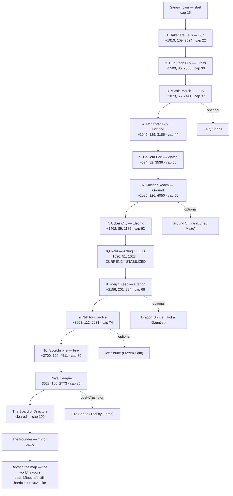

_The journey in order — every town, route, and shrine from Sango to the Founder, in the sequence you walk them._

> **Part of the campaign guide.** This is the **linear path**; for the *what-to-expect* detail at each stop see [[Guidebook Act I]], [[Guidebook Act II]], [[Guidebook Act III]], and [[Guidebook Shrines]]. Story framing lives in [[Guidebook Overview]].

> ⚠️ Hardcore + Nuzlocke: the gym order is **fixed** and the world scales to it. Fight *at* your level cap, treat each town's safe zone as your only breather, and remember the **five shrines are optional detours** — worth the loot, capable of ending your run. The Quest HUD (`/ca quest show`) always points at your current objective.

> [!NOTE]
> **Light spoilers:** so you can pace the run, this route names the Act II boss and the shape of the finale — never the reveal itself.

---

## Route at a glance

*Coordinates are gym-leader positions (≈ the town); they show direction of travel, not exact entrances. The HQ raid becomes available **after gym 7** — see the note in step 7.*

---

## The sequence

| # | Stop | Coords (≈) | Type | Cap after | Optional shrine | Act |
|:-:|------|-----------|------|:--------:|-----------------|:---:|
| — | **Sango Town** (start) | — | — | 15 | — | I |
| 1 | Takehara Falls | 1910, 109, 2524 | Bug 🐞 | 22 | — | I |
| 2 | Hua Zhan City | 1500, 86, 2053 | Grass 🌿 | 30 | — | I |
| 3 | Mystic Marsh | 1073, 65, 2441 | Fairy ✨ | 37 | **Fairy Shrine** | I |
| 4 | Deepcore City | 1045, 129, 3186 | Fighting 🥋 | 44 | — | II |
| 5 | Gaviota Port | 624, 82, 3536 | Water 🌊 | 50 | — | II |
| 6 | Kalahar Reach | 2085, 126, 4050 | Ground 🏜️ | 56 | **Ground Shrine** | II |
| 7 | Cyber City | 1462, 89, 1185 | Electric ⚡ | 62 | — | II |
| ★ | **Company HQ Raid** | 1590, 51, 1028 | Acting CEO DJ | — | — | II |
| 8 | Ryujin Keep | 2156, 201, 884 | Dragon 🐉 | 68 | **Dragon Shrine** | III |
| 9 | Nifl Town | 3608, 112, 2031 | Ice ❄️ | 74 | **Ice Shrine** | III |
| 10 | Scorchspire | 3700, 100, 4511 | Fire 🔥 | 80 | — | III |
| ☆ | **Royal League** | 3528, 166, 2773 | Elite Four → Champion | 85 | **Fire Shrine** *(post-Champion)* | III |
| ☆ | **The Board → The Founder** | — | Board of Directors, then the mirror | **100** *(Board cleared)* | — | III |
| ∞ | **Post-story** | beyond the map | open Minecraft — build, settle, explore (still hardcore + Nuzlocke) | — | — | III |

---

## Walk it, step by step

Each gym is its own small climb — rank-and-file trainers → Jr. Apprentice → Apprentice → **Leader**. The leader's defeat unlocks the next cap and fires a **memory fragment**. Detail for each leg is on the linked act page.

1. **Sango Town → Takehara Falls.** Leave the starting town and beat **Leader Cicada** (Bug). First Company grunts appear on the routes with confused "have we met?" double-takes. → cap **22**.
2. **→ Hua Zhan City.** Beat **Leader Blossom** (Grass). Wheat country — the first **Company wheat traders** surface, offering their "alternative" currency. → cap **30**.
3. **→ Mystic Marsh.** Beat **Leader Titania** (Fairy). **Optional:** the **Fairy Shrine** cult unlocks here (a raised, nicknamed, *shiny* lead + a solo battle — a late, deliberate project). → cap **37**. *End of the "still stable" feel.* See [[Guidebook Act I]].
4. **→ Deepcore City.** Beat **Leader Bruno** (Fighting). The CobbleDollar starts feeling *off*; payouts drift. → cap **44**. *Act II begins —* see [[Guidebook Act II]].
5. **→ Gaviota Port.** Beat **Leader Neptune** (Water). Recognition sharpens toward "you're supposed to be dead." → cap **50**.
6. **→ Kalahar Reach.** Beat **Leader Gaia** (Ground). **Optional:** the **Ground Shrine — Buried Maze** unlocks (half-HP, blind, random teleports — the single most run-ending shrine). → cap **56**.
7. **→ Cyber City.** Beat **Leader Volt** (Electric). The seventh badge is the **inflection point** — the "you signed this charter" memory fragment lands, instability nears its peak, and wheat traders are turning hostile. → cap **62**.
   - ★ **The HQ Raid opens.** With seven badges — and **6 wheat fields liberated** (the raid is hard-gated: starve the monopoly first) — the trail leads to **Company HQ `[1590 51 1028]`**. Descend to **Acting CEO DJ** at the basement bottom; his defeat triggers **"CURRENCY STABILIZED"** (instability snaps to 25). This is the Act II climax — do it around now (a few of its prerequisites expect you to have pressed on toward gym 8). Full beat: [[Guidebook Act II]].
8. **→ Ryujin Keep.** Beat **Leader Ryujin** (Dragon). **Optional:** the **Dragon Shrine — Hydra Gauntlet** (three battles, full heal between — the safest shrine). → cap **68**. *Act III —* see [[Guidebook Act III]].
9. **→ Nifl Town.** Beat **Leader Boreas** (Ice). **Optional:** the **Ice Shrine — Frozen Path** (timed parkour, 180s — now with an ice-floor hazard off the safe path). → cap **74**.
10. **→ Scorchspire.** Beat **Leader Vulcan** (Fire), the final gym. → cap **80**. *(The Fire Shrine is **not** the Scorchspire detour — its cult only answers to a Champion; see step 11.)*
11. **→ Royal League `[3528 166 2773]`.** The Elite Four (Aria · Marcus · Luna · Drake) then **Champion Cynthia**. Victory unlocks the level-**85** cap — and the **Fire Shrine — Trial by Flame** cult (tight 120s parkour, the **best-paying shrine**: Master Ball + Netherite) will now speak to you.
12. **→ The Board of Directors → The Founder.** The post-League gauntlet: empty all four Boardroom seats to unlock the final level-**100** cap, then face the **mirror battle** that pays off the whole amnesia arc. *(Spoiler-light by design — let it land in play.)*
13. **→ Beyond the map.** The Founder is the last fight — the Ender Dragon already fell at the Ryujin rift, so there's no post-game boss to chase. With the Company overthrown, walk off the edge of the curated world into open, generated terrain and just *live* — build, mine, settle, explore, survive — still hardcore, still Nuzlocke. The world is finally yours.

---

## Reminders for the road

- **Track the goal:** `/ca quest show` (the sidebar HUD) always names your current objective and progress on its main line. Toggle off for overlays with `/ca quest hide`.
- **Track a side quest:** cycle the tracked quest with **`]`** / **`[`** — the tracked line gets an aqua **▶** and its current stage lands as a JourneyMap waypoint (or a light beam without JourneyMap). `/cobblemon-initiative track status` lists what's live.
- **Shrines are detours, not steps** — none are required. Match a shrine to its element's gym (Fire waits for the Champion), and read [[Guidebook Shrines]] before you commit; `/shrine-abort` is your panic button.
- **Faint penalties follow you everywhere** — no zone pauses them. Towns, shrines, the HQ, and the Frontier suppress hostile mob spawns and the whispers; the routes between are announced zones whose spawns stay fully live, and occupied farmland only becomes safe ground once you liberate it. Ambushes and mobs are route problems; grief is a global one.
- **Don't over-level.** The cap is a ceiling *and* a target; the world is tuned for an at-cap team — every leader's ace sits **two levels above your cap**.

> **See also:** [[Guidebook Overview]] · [[Guidebook Act I]] · [[Guidebook Act II]] · [[Guidebook Act III]] · [[Guidebook Shrines]] · [[Commands]]
