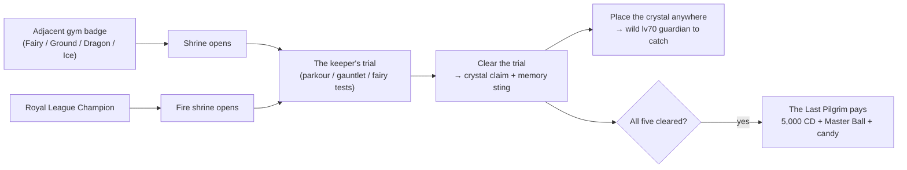

_Optional side-content for the brave. Five elemental shrines, five trials, five crystals — and one wandering pilgrim who pays out if you clear them all. Not one of them is required to beat the campaign._

> **Part of the campaign guide.** See [[Guidebook Overview]] for the full route, [[Guidebook Nobles]] for the other optional legendary system (a separate roster — the shrine crystals summon their *own* guardians, no overlap with the nobles), and [Architecture Overview](https://github.com/The-Company-Inc-Nerds/the-cobblemon-initiative/blob/main/docs/ARCHITECTURE_OVERVIEW.md) for how the shrine engine fits the rest of the mod.

**Status:** ✅ Done · 🚧 WIP (partial) · ❌ Not yet implemented — as of the 2026-07-21 audit.

---

## What the shrines are

Scattered across the UPM 2 map are **five elemental shrines** — Fairy, Ground, Dragon, Ice, and Fire. Each is a self-contained optional trial: a robed **Shrine Keeper** and a **signature elemental challenge**, rewarded with an **elemental crystal**. They are **pure side-content** — nothing in the main story gates on them, and the gym route never demands you clear one.

Each shrine **opens once you beat the adjacent gym leader**:

| Shrine | Opens after | Leader |
|---|---|---|
| **Fairy** ✨ | Mystic Marsh (Gym 3) | High Priestess Aurora |
| **Ground** 🏜️ | Kalahar Reach (Gym 6) | High Priest Terran |
| **Dragon** 🐉 | Ryujin Keep (Gym 8) | High Priest Draconis |
| **Ice** ❄️ | Nifl Town (Gym 9) | High Priest Glacius |
| **Fire** 🔥 | **the Royal League** (you must be Champion) | High Priest Ignis |

Fire is the exception: its ash-priests *"only open to a champion,"* so the caldera stays sealed until you clear the [[Royal League|Guidebook Route Map]]. Every other shrine answers to the badge next door.

Why bother?

- **An elemental shrine crystal** — one per shrine, claimed from the keeper once you clear its trial. Place it anywhere in the world and it summons a **wild level-70 legendary guardian** for you to battle and catch: Fire → **Ho-Oh**, Ground → **Landorus**, Ice → **Glastrier**, Dragon → **Kyurem**, Fairy → **Xerneas**. These are the shrines' *own* roster — entirely separate from the [[nobles|Guidebook Nobles]], no overlap. (One-shot item, EPIC rarity — see the tooltip's *"use with caution."*)
- **A one-time "memory fragment"** on your *first* shrine cleared — the keepers half-remember something older than your badges.
- **A per-shrine completion** and a golden **title splash**: _"Challenge Complete!"_
- **The Five Keepers capstone** — clear all five and a wandering pilgrim pays out **5,000 CobbleDollars, a Master Ball, and a stack of Rare Candy**.

> [!WARNING]
> **Shrines are dangerous on a hardcore Nuzlocke run.** The shrine grounds suppress hostile mob spawns and the Dark Urge whisper — but **Nuzlocke faint damage applies everywhere**, shrine grounds included, and the *trials themselves* — falling parkour, hazard-floor ice, blind teleport mazes, solo battles — can absolutely end your run. None of this is mandatory. Treat shrines as a flex, not a checkbox.

---

## The shape of a shrine

Every shrine follows a **two-beat structure** — a trial, then a crystal. There's no ladder of grunts to grind through. What tends each shrine depends on the element:

- **Fairy** and **Dragon** are single-keeper shrines: the **High Priest/Priestess** both starts the trial *and* hands over the crystal.
- **Ground, Ice, and Fire** are **two-NPC** shrines: a robed **Acolyte** (Acolyte of the Deep / Frost / Flame) stands at the shrine mouth and starts the trial; the **High Priest** waits at the far end to hand over the crystal.

On top of that, each shrine plays a **reveal cutscene the first time you cross into its zone** (`fire_shrine_reveal`, `ice_shrine_reveal`, etc.) — it fires automatically, once, before you ever talk to anyone.

1. **The trial.** Speak to the trial's starter — the **Acolyte** at Ground/Ice/Fire, or the **Keeper** themselves at Fairy/Dragon — and a **Begin-Trial** button starts the shrine's elemental challenge: parkour, dark gauntlet, hydra gauntlet, or bond-test depending on the element. For **two** of the five (Fairy and Ground) a keeper *is* the trial's final obstacle: the challenge ends in a solo/hidden battle against them (both are **Singles**). For the **other three** (Dragon, Ice, Fire) the trial is the gauntlet or the course itself, and the finishing keeper never draws a Pokémon — they are the trial's voice, not a fight.
2. **The crystal.** Clear the trial and the finishing keeper hands you that shrine's **crystal** (once), the shrine registers as cleared, and — if it's your first — a one-time recognition sting fires. The keepers speak to you as an *old presence*, something the land half-remembers; none of them ever names a name.

> **Bail out any time:** `/shrine-abort` (no OP needed) clears the active trial and all its effects with **zero penalty**. You can walk back in and restart whenever you like. Starting a trial while one is already active simply resets the old one. See [[Commands]] for the full shrine command tree.

*(For how one config model and one manager drive all five shrine trials under the hood, see the shrine challenge flow on [Architecture Data Flows](https://github.com/The-Company-Inc-Nerds/the-cobblemon-initiative/blob/main/docs/ARCHITECTURE_DATA_FLOWS.md).)*

---

## The five trials

There are **four trial styles** across the five shrines:

| Trial style | Shrine(s) | What you face |
|------|---------|----------------------|
| Fairy tests | Fairy | A bonded-lead gauntlet — friendship, fullness, nickname, shiny, then a solo battle |
| Blind gauntlet | Ground | Half health + perpetual blindness + periodic earthquake teleports, then the keeper in the dark |
| Hydra gauntlet | Dragon | Three sequential head-battles (two Doubles, one Singles), fully healed between stages; the keeper never fights |
| Timed parkour | Ice, Fire | A wall-clock countdown — cross the frozen / burning path before it claims you |

Whichever way it ends, completion pays the same: crystal, memory sting (first clear only), the *"Challenge Complete!"* splash, and a step toward the Five Keepers capstone.

---

### Fairy Shrine — "Tests of the Heart" ✨

| | |
|---|---|
| **Status** | ✅ Done |
| **Opens after** | Mystic Marsh (Gym 3) |
| **Leader** | High Priestess Aurora — start the trial and claim the crystal at her altar **@ 951 3 2715** |
| **Trial** | Fairy tests — bonded, shiny, solo lead |

**The trial:** the only non-combat-first shrine. You bring your **lead Pokémon** to Aurora's altar and prove your bond through a series of tests — friendship, fullness, a nickname, shininess — before the final check: your candidate must be your **only** party member. Pass it and the shrine registers that exact Pokémon, then sends you to battle Aurora **alone, with the bond as your only weapon.**

**Tips**
- The shiny requirement makes this a *late, deliberate* project for a Pokémon you've raised, nicknamed, and bonded with — not a walk-up.
- **Solo party is a real risk:** the final battle is one Pokémon against the High Priestess. On a Nuzlocke, losing it is permanent. Make sure it can carry the fight before you commit.
- Box your other Pokémon to satisfy the solo check; you can re-form your party the moment the battle resolves.

### Ground Shrine — "The Buried Maze" 🏜️

| | |
|---|---|
| **Status** | ✅ Done |
| **Opens after** | Kalahar Reach (Gym 6) |
| **Leader** | High Priest Terran — waits in the dark at the gauntlet's end **@ 1901.6 81 4073.2**; the trial starts with the Acolyte of the Deep at the mouth **@ 1903.4 113.5 4009** |
| **Trial** | Dark gauntlet |

**The trial — the most physically dangerous shrine.** The **Acolyte of the Deep** at the shrine mouth opens the dark for you. On start the engine halves your health, **blinds you** (re-applied so it never fades), and runs an **earthquake** that periodically teleports you a random distance across the horizontal plane. You win by finding and defeating **High Priest Terran** somewhere in the dark (a **Singles** battle). `/shrine-abort` removes the blindness instantly.

> [!CAUTION]
> **The earthquake randomizes your X/Z but leaves your Y unchanged.** If the maze sits over a drop, void, lava, or uneven terrain, you can be thrown blind into a fall — and you started at **half health**. On a hardcore run this is the single most likely shrine to kill you. Consider skipping it if your run can't afford the gamble.

**Tips**
- Move slowly and hug walls — blindness here is permanent until you abort or finish.
- Expect to be relocated at intervals; don't build a mental map you can't recover from a teleport.
- The half-health start is not restored mid-trial. Any chip damage on top of it puts you close to the edge.

### Dragon Shrine — "Hydra Gauntlet" 🐉

| | |
|---|---|
| **Status** | ✅ Done |
| **Opens after** | Ryujin Keep (Gym 8) |
| **Leader** | High Priest Draconis — starts the gauntlet and hands over the crystal at his altar **@ 2004 71 919** |
| **Trial** | Hydra gauntlet |

**The trial:** the three heads of the hydra — **Alpha, Beta, then Omega** — sequential staged battles you must clear in order, with your **entire party fully healed between heads**. Draconis himself never fights; he starts the gauntlet and hands over the crystal at the end. The first two heads (Alpha, Beta) are **Doubles**; the final head (Omega) is a **Singles** duel — so bring a bench that can switch between both.

**Tips**
- This is the most *battle-pure* shrine — no environmental tricks, just the triple gauntlet. The danger is purely Nuzlocke risk on the battles themselves.
- Healing between stages means you can afford chip damage on the early heads; what matters is winning, not winning clean.
- Bring a deep, type-prepared bench that is legal for **both** doubles (Alpha/Beta) and singles (Omega). The shrine keeps the mobs and whispers out, but a faint still deals its Nuzlocke damage.

### Ice Shrine — "The Frozen Path" ❄️

| | |
|---|---|
| **Status** | ✅ Done |
| **Opens after** | Nifl Town (Gym 9) |
| **Leader** | High Priest Glacius — waits at the far end with the crystal **@ 3618.6 65 1937.3**; the trial starts with the Acolyte of the Frost at the base **@ 3668.5 98 1998.6** |
| **Trial** | Timed parkour (hazard ice) |

**The trial:** the **Acolyte of the Frost** at the base sends you off; reach the summit before the cold claims you — a parkour race against a **wall-clock timer**, with a twist: **the ice itself is a hazard.** Only the recorded safe path across the frozen floor is honest ground; step onto ice *off* that path and the shrine punishes you — freezing damage, a glass-crack, and an instant teleport back to the start. Tag the finish before the clock runs out, where **High Priest Glacius** hands over the crystal.

**Tips**
- The hazard floor means the *route* matters more than pace. Learn the safe line before you commit to speed.
- **Timing out is harmless to progress** — the trial just resets. What ends a hardcore run here is the chip damage of repeated hazard hits stacking onto a fall.
- Walk the course once gently before racing it.

### Fire Shrine — "Trial by Flame" 🔥

| | |
|---|---|
| **Status** | ✅ Done |
| **Opens after** | **the Royal League** (Champion required) |
| **Leader** | High Priest Ignis — waits at the summit with the crystal **@ 3498.6 51 4702.5**; the trial starts with the Acolyte of the Flame at the caldera base **@ 3584 96 4672.3** |
| **Trial** | Timed parkour (speed) |

**The trial:** the **Acolyte of the Flame** starts you on the same parkour engine as the Ice shrine, but tighter — a straight race to the summit *before the fire consumes you*, where **High Priest Ignis** waits with the crystal. This is the endgame shrine: the ash-priests won't even look at you until you wear the League crown.

**Tips**
- The tight timer tempts riskier jumps, which is exactly when hardcore runs die. Know the route before you start the clock; there's no penalty for a few practice resets.
- Ignis is a post-league keeper — his team runs hot to match. See the shared **parkour safety** notes below.

---

## The Five Keepers capstone — ✅ Done

Claim all five shrine crystals and a **Last Pilgrim** — a wandering figure near the Fairy shrine approach **@ 945 9 2712** — acknowledges the collection and pays out a **one-time capstone**: **5,000 CobbleDollars, a Master Ball, and a stack of Rare Candy** (10), with a streamable *"FIVE KEEPERS ANSWER"* title card. The Master Ball alone is run-defining on a Nuzlocke (a guaranteed catch on something you'd never otherwise risk).

> **Note:** the 5,000 is a *face* value — like every mod-routed CobbleDollar payout it runs through the Company's skim, so at peak currency instability you may actually pocket as little as 75% (~3,750). The Master Ball and candy are delivered flat.

Each of the five host towns has a **rumor hub** (its arrival nurse or guide) that points you toward the nearest shrine once you've earned the gate. If you're wondering where a shrine is, ask around town.

**Rules of thumb for a hardcore Nuzlocke:**

- **Lowest risk:** Dragon (battle-only, heals between heads — bring a doubles bench).
- **Skill, not luck:** Ice / Fire (forgiving resets — but stay on the safe line and mind the tight Fire timer).
- **Commitment risk:** Fairy (a solo battle with a shiny you can't afford to lose).
- **Don't unless you're sure:** Ground (half health + blindness + random teleports over unknown terrain).
- **Best single reward:** the Five Keepers capstone — but that means clearing all five, Ground included.

---

## Hardcore safety checklist

- **`/shrine-abort` is your panic button.** No permission, no penalty, instant effect-cleanup. Use it the moment a trial turns against you.
- **Parkour (Ice/Fire):** the timer never kills you — the fall does, and on the Frozen Path so does the **off-path ice** (freeze damage + a punishment teleport back to the start). Walk the route first; reset for free. Never take the "tight" jump when the safe jump still beats the clock.
- **Dark gauntlet (Ground):** you start at **half HP**, **blind**, and get **teleported** at intervals. If there's any drop near the maze, that teleport can throw you into it. This trial is genuinely run-ending — skip it if a death here would hurt.
- **Hydra gauntlet (Dragon):** three heads — Alpha and Beta are **Doubles**, Omega is **Singles**; the keeper never fights. Bring a bench legal for both. You heal between heads, but a lost Pokémon is a lost Pokémon.
- **Fairy tests:** the final fight is **solo**. On a Nuzlocke, the candidate Pokémon is alone and irreplaceable. Don't commit until it can clearly win.
- **The grounds quiet the world, not the rules.** Standing at the shrine suppresses hostile spawns and the whispers — Nuzlocke faint damage still applies everywhere.

---

## Related pages

- [[Guidebook Overview]] — the full campaign route and how shrines slot in
- [[Guidebook Nobles]] — the other optional legendary system; a completely separate roster (Groudon/Kyogre/Rayquaza and the three birds) from the shrine crystals' guardians (Ho-Oh/Landorus/Glastrier/Kyurem/Xerneas)
- [[Commands]] — `/cobblemon-initiative shrine` and `/shrine-abort`
- [Architecture Overview](https://github.com/The-Company-Inc-Nerds/the-cobblemon-initiative/blob/main/docs/ARCHITECTURE_OVERVIEW.md) · [Architecture Data Flows](https://github.com/The-Company-Inc-Nerds/the-cobblemon-initiative/blob/main/docs/ARCHITECTURE_DATA_FLOWS.md) — the shrine engine, the subsystem map, and the challenge flow
- [[Guidebook Act II]] · [[Guidebook Act III]] — the main-story beats the shrines sit beside
