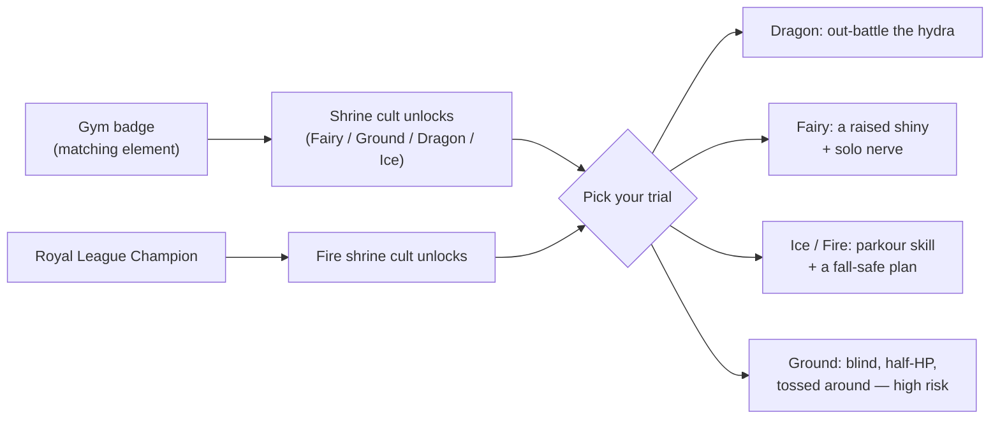

_Optional side-content for the brave. Five elemental shrines, five trials, five crystals — and not one of them is required to beat the campaign._

> **Part of the campaign guide.** See [[Guidebook Overview]] for the full route, and [Architecture Overview](https://github.com/The-Company-Inc-Nerds/the-cobblemon-initiative/blob/main/docs/ARCHITECTURE_OVERVIEW.md) for how the shrine engine fits the rest of the mod.

---

## What the shrines are

Scattered across the UPM 2 map are **five elemental shrines** — Dragon, Fairy, Ice, Fire, and Ground. Each is guarded by a small cult (four cultists and a robed leader) and wrapped around a **single self-contained challenge**. They are **pure side-content**: nothing in the main story gates on them, and the gym route never demands you clear one.

The cults themselves are a short bracket: the four cultists chain in pairs (the third only fights you after the first, the fourth after the second), and the leader waits until both back-rank cultists are down. Each cultist pays **3× Ultra Ball** on defeat.

Why bother?

- **An elemental shrine crystal** — a trophy item, one per shrine.
- **A bonus loot stack** on the High Priest's defeat. Most shrines drop **10× Rare Candy + 5× Diamonds**. The **Fire shrine is the prize** — its leader, High Priest Ignis, drops a **Master Ball + a Netherite Ingot**.
- A completion achievement per shrine and a golden **title splash**: _"Challenge Complete!"_

> [!WARNING]
> **Shrines are dangerous on a hardcore Nuzlocke run.** The shrine grounds suppress hostile mob spawns and the Dark Urge whisper — but **Nuzlocke faint damage applies everywhere**, shrine grounds included, and the *trials themselves* — falling parkour, hazard-floor ice, blind teleport mazes, solo battles — can absolutely end your run. None of this is mandatory. Treat shrines as a flex, not a checkbox.

> [!NOTE]
> **Content status (0.5.0):** the five shrine *challenges* — the parkour clocks, the gauntlets, the fairy tests — are live engine content. The shrine **cult battles** (all five leaders and their cultists) are not yet fightable in this build: their battle teams are unfinished placeholders. The Dragon shrine's three hydra stages have their staged teams specced, but advancing the gauntlet depends on those battles existing. The rewards and gating documented on this page are the shipped design.

---

## The four trials

Every shrine wraps exactly **one self-contained trial**, started from its altar NPC or pressure plate (`/cobblemon-initiative shrine <id> start`). There are **four trial styles** across the five shrines:

| Trial style | Shrines | What you face |
|------|---------|----------------------|
| Staged battle gauntlet | Dragon | Sequential trainer battles; **full party heal between stages** |
| Bond trials | Fairy | Five tests of your lead Pokémon's bond, then a solo battle |
| Timed parkour | Ice, Fire | A wall-clock countdown; reach the finish line in time |
| Blind gauntlet | Ground | Half health + perpetual blindness + periodic earthquake teleports |

The parkour clocks and the blind gauntlet's hazards run live the whole time you're inside; the battle-driven trials advance the moment you win the next fight. Whichever way it ends, completion pays the same way: crystal, loot, achievement, and the *"Challenge Complete!"* splash.

> **Bail out any time:** `/shrine-abort` (no OP needed) clears the active challenge and all its effects with **zero penalty**. You can walk back in and restart whenever you like. Starting a shrine while one is already active simply resets the old one. See [[Commands]] for the full shrine command tree.

*(For how one config model and one manager drive all five shrines under the hood, see the shrine challenge flow on [Architecture Data Flows](https://github.com/The-Company-Inc-Nerds/the-cobblemon-initiative/blob/main/docs/ARCHITECTURE_DATA_FLOWS.md).)*

---

## The Five Shrines

### Dragon Shrine — "Hydra Gauntlet" 🐉

| | |
|---|---|
| **Element** | Dragon |
| **Trial** | Staged battle gauntlet |
| **Guardian** | High Priest Draconis |
| **Reward** | Dragon Shrine Crystal · 10× Rare Candy · 5× Diamond |

**The trial:** Three staged trainer battles back to back — the "three heads" of the hydra. You must defeat each in order.

**The mercy:** Between heads, **your entire party is fully healed**. You don't get to swap items or rest, but every stage starts you fresh.

**Tips**
- This is the most *battle-pure* shrine — no environmental tricks, just a triple gauntlet. The danger is purely Nuzlocke risk on the battles themselves.
- The shrine grounds keep the mobs and the whispers out, but they do **not** soften a faint — the Nuzlocke damage still lands on you, and a Pokémon lost in a Nuzlocke run is still a Pokémon lost. Bring a deep, type-prepared bench.
- Healing between stages means you can afford to take some chip damage on head 1 and 2; what matters is winning, not winning clean.

### Fairy Shrine — "Five Tests of the Heart" ✨

| | |
|---|---|
| **Element** | Fairy |
| **Trial** | Bond trials |
| **Guardian** | High Priestess Aurora |
| **Reward** | Fairy Shrine Crystal · 10× Rare Candy · 5× Diamond |

**The trial:** The only non-combat-first shrine. You bring your **lead Pokémon** to the altar and prove your bond through five tests, run via `/cobblemon-initiative shrine fairy test <testName>`:

| Test | Checks | Requirement |
|------|--------|-------------|
| `friendship` | Friendship value | ≥ **160** |
| `fullness` | Current fullness | ≥ **50** (feed it first) |
| `nickname` | Has a nickname | Any non-blank nickname |
| `shiny` | Is shiny | Must be **shiny** |
| `resolve` | **All four, plus solo party** | The gate |

The first four tests are **feedback-only** — run them freely to check where your Pokémon stands; they don't lock anything in. The fifth, **`resolve`**, is the real gate: it re-checks all four conditions **and** that the candidate is your **only** party member. Pass it and the shrine registers that exact Pokémon, then sends you to battle **High Priestess Aurora — alone, with the bond as your only weapon.** If your registered Pokémon isn't leading the party when that battle ends, the Trial of Resolve fails and you re-run `resolve` to retry.

**Tips**
- The shiny requirement is the steep one — this shrine is realistically a *late, deliberate* project for a shiny you've raised, nicknamed, and bonded with.
- **Solo party is a real risk:** the resolve battle is one Pokémon against the High Priestess. On a Nuzlocke run, losing it is permanent. Make sure it can carry the fight before you commit.
- Box your other Pokémon to satisfy the solo check; you can re-form your party the moment the battle resolves.

### Ice Shrine — "The Frozen Path" ❄️

| | |
|---|---|
| **Element** | Ice |
| **Trial** | Timed parkour |
| **Guardian** | High Priest Glacius |
| **Reward** | Ice Shrine Crystal · 10× Rare Candy · 5× Diamond |
| **Time limit** | **180 seconds** |

**The trial:** Reach the summit before the cold claims you. A parkour race against a **wall-clock timer** — with a twist the other parkour shrine doesn't have: **the ice itself is a hazard.** Only one recorded safe path across the frozen floor is honest ground; step onto any ice *off* that path and the shrine punishes you — freezing damage, a glass-crack sound, and an instant teleport back to the start tile (the start tile is always safe). Tag the finish before the clock hits zero; you'll get countdown warnings at 60s, 30s, 10s, 5s, 3, 2, 1.

**Tips**
- 180 seconds is the *generous* parkour timer (Fire is tighter) — but the hazard floor means the route matters more than the pace. Learn where the safe line runs before you commit to speed.
- **Timing out is harmless to progress** — the challenge just resets and you can restart. What ends a hardcore run here is the chip damage of repeated hazard hits stacking onto a fall — the punishment teleport itself is survivable, but it *hurts*.
- The safe path is authored per-world by the showrunner (and the whole hazard has a master toggle), so walk the course once gently before racing it.

### Fire Shrine — "Trial by Flame" 🔥

| | |
|---|---|
| **Element** | Fire |
| **Trial** | Timed parkour |
| **Guardian** | High Priest Ignis |
| **Reward** | **Fire Shrine Crystal · Master Ball · Netherite Ingot** |
| **Time limit** | **120 seconds** |

**The trial:** Same engine as the Ice shrine, but **tighter** — 120 seconds to the summit "before the fire consumes you."

**Why this one matters:** Fire is the **best-paying shrine.** The Master Ball alone is run-defining for a Nuzlocke (a guaranteed catch on something you'd never otherwise risk), and the Netherite Ingot is rare hardcore loot. If you clear one shrine, make it this one.

**Tips**
- 120s leaves little slack — know the route before you start the clock. There's no penalty for a few practice resets.
- See the shared **parkour safety** notes below; Fire's tighter timer tempts riskier jumps, which is exactly when hardcore runs die.

### Ground Shrine — "The Buried Maze" 🏜️

| | |
|---|---|
| **Element** | Ground |
| **Trial** | Blind gauntlet |
| **Guardian** | High Priest Terran |
| **Reward** | Ground Shrine Crystal · 10× Rare Candy · 5× Diamond |
| **Target** | Defeat **High Priest Terran** in the dark |

**The trial — the most physically dangerous shrine.** On start the engine:

1. **Halves your health.**
2. **Blinds you**, and **re-applies blindness every 5 seconds** so it never fades — you are effectively sightless for the whole maze.
3. Runs an **earthquake every 45 seconds**: an explosion sound, brief nausea, and a **random teleport up to 20 blocks** in the horizontal plane with a randomized facing.

You win by finding and defeating **High Priest Terran** somewhere in the dark. `/shrine-abort` removes the blindness and nausea instantly.

> [!CAUTION]
> **The earthquake teleport keeps your Y unchanged but randomizes X/Z by up to 20 blocks.** If the maze sits over a drop, void, lava, or uneven terrain, you can be thrown blind into a fall — and you started this trial at **half health**. On a hardcore run this is the single most likely shrine to kill you. Consider clearing this one **in creative-safe conditions** or skipping it entirely if your run can't afford the gamble.

**Tips**
- Move slowly and hug walls — blindness here is permanent until you abort or finish.
- Expect to be relocated every 45 seconds; don't build a mental map you can't recover from a teleport.
- The half-health start is not restored mid-trial. If you take *any* chip damage on top of it, you're close to the edge.

---

## When to attempt each shrine

Four of the five cults are gated behind the matching gym leader: **Fairy** behind Mystic Marsh, **Ground** behind Kalahar Reach, **Dragon** behind Ryujin Keep, **Ice** behind Nifl Town. The **Fire** cult is the exception — it answers only to a **Champion**: it unlocks after the Royal League, not after Scorchspire. In practice you'll be ready for a given shrine's *combat* around the time you've earned the gate — but the **environmental hazards** (falls, hazard ice, blind teleports, solo battles) scale with your nerve, not your level cap.

**Rules of thumb for a hardcore Nuzlocke:**

- **Lowest risk:** Dragon (battle-only, heals between stages).
- **Best payoff:** Fire (Master Ball + Netherite) — post-Champion only, and mind the tight timer and the fall.
- **Skill, not risk:** Ice (long timer, forgiving resets — but stay on the safe line; the off-path ice bites).
- **Commitment risk:** Fairy (solo battle with a Pokémon you can't afford to lose).
- **Don't unless you're sure:** Ground (half health + blindness + random teleports over unknown terrain).

---

## Hardcore safety checklist

- **`/shrine-abort` is your panic button.** No permission, no penalty, instant effect-cleanup. Use it the moment a trial turns against you.
- **Parkour (Ice/Fire):** the timer never kills you — the fall does, and on the Frozen Path so does the **off-path ice** (freeze damage + a punishment teleport back to the start). Walk the route first; the engine lets you reset for free. Consider a feather-fall / slow-fall buffer if your run allows, and never take the "tight" jump when the safe jump still beats the clock.
- **Dark gauntlet (Ground):** you start at **half HP**, **blind**, and get **teleported up to 20 blocks every 45s**. If there's any drop near the maze, that teleport can throw you into it. This trial is genuinely run-ending — skip it if a death here would hurt.
- **Fairy resolve:** this is a **solo battle**. On a Nuzlocke, the candidate Pokémon is alone and irreplaceable for the fight. Don't run `resolve` until that Pokémon can clearly win.
- **The grounds quiet the world, not the rules.** Standing at the shrine suppresses hostile spawns and the whispers — Nuzlocke faint damage still applies. A Pokémon lost in a shrine battle, the faint damage it deals you, or a player death from a fall all count exactly the same as anywhere else.

---

## Related pages

- [[Guidebook Overview]] — the full campaign route and how shrines slot in
- [Architecture Overview](https://github.com/The-Company-Inc-Nerds/the-cobblemon-initiative/blob/main/docs/ARCHITECTURE_OVERVIEW.md) · [Architecture Data Flows](https://github.com/The-Company-Inc-Nerds/the-cobblemon-initiative/blob/main/docs/ARCHITECTURE_DATA_FLOWS.md) — the shrine engine, the subsystem map, and the challenge flow
- [[Commands]] — `/cobblemon-initiative shrine`, `/shrine-abort`, and the Fairy `test` subcommands
- [[Guidebook Act II]] · [[Guidebook Act III]] — the main-story beats the shrines sit beside
