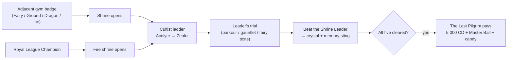

_Optional side-content for the brave. Five elemental shrines, five trials, five crystals — and one wandering pilgrim who pays out if you clear them all. Not one of them is required to beat the campaign._

> **Part of the campaign guide.** See [[Guidebook Overview]] for the full route, [[Guidebook Nobles]] for the other optional trial system (two of the birds hatch straight out of these shrines), and [Architecture Overview](https://github.com/The-Company-Inc-Nerds/the-cobblemon-initiative/blob/main/docs/ARCHITECTURE_OVERVIEW.md) for how the shrine engine fits the rest of the mod.

---

## What the shrines are

Scattered across the UPM 2 map are **five elemental shrines** — Fairy, Ground, Dragon, Ice, and Fire. Each is a self-contained optional trial: a short **cultist ladder** guarding a robed **Shrine Leader**, wrapped around a **signature elemental challenge**. They are **pure side-content** — nothing in the main story gates on them, and the gym route never demands you clear one.

Each shrine **opens once you beat the adjacent gym leader**:

| Shrine | Opens after | Leader |
|---|---|---|
| **Fairy** ✨ | Mystic Marsh (Gym 3) | High Priestess Aurora |
| **Ground** 🏜️ | Kalahar Reach (Gym 6) | High Priest Terran |
| **Dragon** 🐉 | Ryujin Keep (Gym 8) | High Priest Draconis |
| **Ice** ❄️ | Nifl Town (Gym 9) | High Priest Glacius |
| **Fire** 🔥 | **the Royal League** (you must be Champion) | High Priest Ignis |

Fire is the exception: its ash-priests *"only open to a champion,"* so the caldera stays sealed until you clear the [[Royal League|Guidebook Route Map]]. Every other shrine answers to the badge next door.

Why bother?

- **An elemental shrine crystal** — one per shrine, granted once when you beat its leader. (The crystal is also the alternate launcher for that shrine's noble — see [[Guidebook Nobles]].)
- **A one-time "memory fragment"** on your *first* shrine leader defeated — the keepers half-remember something older than your badges.
- **A per-shrine completion** and a golden **title splash**: _"Challenge Complete!"_
- **The Five Keepers capstone** — clear all five and a wandering pilgrim pays out **5,000 CobbleDollars, a Master Ball, and a stack of Rare Candy**.

> [!WARNING]
> **Shrines are dangerous on a hardcore Nuzlocke run.** The shrine grounds suppress hostile mob spawns and the Dark Urge whisper — but **Nuzlocke faint damage applies everywhere**, shrine grounds included, and the *trials themselves* — falling parkour, hazard-floor ice, blind teleport mazes, solo battles — can absolutely end your run. None of this is mandatory. Treat shrines as a flex, not a checkbox.

---

## The shape of a shrine

Every shrine follows the same three-beat structure:

1. **The cultist ladder.** Two acolytes stand between you and the leader — an **Acolyte** (rung 1) and a **Zealot** (rung 2). You must beat the first before the second will fight, and both before the leader will face you. Each cultist pays a small purse plus **3× Ultra Ball** on defeat.
2. **The leader's trial.** The Shrine Leader has a **Begin-Trial** button that starts the shrine's elemental challenge — parkour, gauntlet, or bond-test depending on the element. Clear the trial and the leader's battle unlocks.
3. **The keeper battle.** Beat the Shrine Leader to complete the shrine: you're granted the **crystal** (once), the shrine registers as cleared, and — if it's your first — a one-time recognition sting fires. The keepers speak to you as an *old presence*, something the land half-remembers; none of them ever names a name.

> **Bail out any time:** `/shrine-abort` (no OP needed) clears the active trial and all its effects with **zero penalty**. You can walk back in and restart whenever you like. Starting a trial while one is already active simply resets the old one. See [[Commands]] for the full shrine command tree.

*(For how one config model and one manager drive all five shrine trials under the hood, see the shrine challenge flow on [Architecture Data Flows](https://github.com/The-Company-Inc-Nerds/the-cobblemon-initiative/blob/main/docs/ARCHITECTURE_DATA_FLOWS.md).)*

---

## The five trials

There are **four trial styles** across the five shrines:

| Trial style | Shrine(s) | What you face |
|------|---------|----------------------|
| Fairy tests | Fairy | A bonded-lead gauntlet — friendship, fullness, nickname, shiny, then a solo battle |
| Blind gauntlet | Ground | Half health + perpetual blindness + periodic earthquake teleports, then the keeper in the dark |
| Hydra gauntlet | Dragon | A staged three-heads battle gauntlet, healed between stages, capped by the keeper |
| Timed parkour | Ice, Fire | A wall-clock countdown — cross the frozen / burning path before it claims you |

Whichever way it ends, completion pays the same: crystal, memory sting (first clear only), the *"Challenge Complete!"* splash, and a step toward the Five Keepers capstone.

---

### Fairy Shrine — "Tests of the Heart" ✨

| | |
|---|---|
| **Opens after** | Mystic Marsh (Gym 3) |
| **Leader** | High Priestess Aurora |
| **Ladder** | Fae Acolyte Pixie → Fae Zealot |
| **Trial** | Fairy tests — bonded, shiny, solo lead |

**The trial:** the only non-combat-first shrine. You bring your **lead Pokémon** to Aurora's altar and prove your bond through a series of tests — friendship, fullness, a nickname, shininess — before the final check: your candidate must be your **only** party member. Pass it and the shrine registers that exact Pokémon, then sends you to battle Aurora **alone, with the bond as your only weapon.**

**Tips**
- The shiny requirement makes this a *late, deliberate* project for a Pokémon you've raised, nicknamed, and bonded with — not a walk-up.
- **Solo party is a real risk:** the final battle is one Pokémon against the High Priestess. On a Nuzlocke, losing it is permanent. Make sure it can carry the fight before you commit.
- Box your other Pokémon to satisfy the solo check; you can re-form your party the moment the battle resolves.

### Ground Shrine — "The Buried Maze" 🏜️

| | |
|---|---|
| **Opens after** | Kalahar Reach (Gym 6) |
| **Leader** | High Priest Terran |
| **Ladder** | Earth Acolyte Clay → Earth Zealot |
| **Trial** | Dark gauntlet |

**The trial — the most physically dangerous shrine.** On start the engine halves your health, **blinds you** (re-applied so it never fades), and runs an **earthquake** that periodically teleports you a random distance across the horizontal plane. You win by finding and defeating **High Priest Terran** somewhere in the dark. `/shrine-abort` removes the blindness instantly.

> [!CAUTION]
> **The earthquake randomizes your X/Z but leaves your Y unchanged.** If the maze sits over a drop, void, lava, or uneven terrain, you can be thrown blind into a fall — and you started at **half health**. On a hardcore run this is the single most likely shrine to kill you. Consider skipping it if your run can't afford the gamble.

**Tips**
- Move slowly and hug walls — blindness here is permanent until you abort or finish.
- Expect to be relocated at intervals; don't build a mental map you can't recover from a teleport.
- The half-health start is not restored mid-trial. Any chip damage on top of it puts you close to the edge.

### Dragon Shrine — "Hydra Gauntlet" 🐉

| | |
|---|---|
| **Opens after** | Ryujin Keep (Gym 8) |
| **Leader** | High Priest Draconis |
| **Ladder** | Dragon Acolyte Wyrm → Dragon Zealot Scale |
| **Trial** | Hydra gauntlet |

**The trial:** the three heads of the hydra — sequential staged battles you must clear in order, with your **entire party fully healed between heads**. The hydra and Draconis both fight in **pairs (Doubles)**, so field a party built for two-on-two before you begin.

**Tips**
- This is the most *battle-pure* shrine — no environmental tricks, just a triple gauntlet and the keeper. The danger is purely Nuzlocke risk on the battles themselves.
- Healing between stages means you can afford chip damage on the early heads; what matters is winning, not winning clean.
- Bring a deep, type-prepared, doubles-legal bench. The shrine keeps the mobs and whispers out, but a faint still deals its Nuzlocke damage.

### Ice Shrine — "The Frozen Path" ❄️

| | |
|---|---|
| **Opens after** | Nifl Town (Gym 9) |
| **Leader** | High Priest Glacius |
| **Ladder** | Frost Acolyte Neve → Frost Zealot |
| **Trial** | Timed parkour (hazard ice) |

**The trial:** reach the summit before the cold claims you — a parkour race against a **wall-clock timer**, with a twist: **the ice itself is a hazard.** Only the recorded safe path across the frozen floor is honest ground; step onto ice *off* that path and the shrine punishes you — freezing damage, a glass-crack, and an instant teleport back to the start. Tag the finish before the clock runs out.

**Tips**
- The hazard floor means the *route* matters more than pace. Learn the safe line before you commit to speed.
- **Timing out is harmless to progress** — the trial just resets. What ends a hardcore run here is the chip damage of repeated hazard hits stacking onto a fall.
- Walk the course once gently before racing it.

### Fire Shrine — "Trial by Flame" 🔥

| | |
|---|---|
| **Opens after** | **the Royal League** (Champion required) |
| **Leader** | High Priest Ignis |
| **Ladder** | Flame Acolyte Pyra → Flame Zealot Cinder |
| **Trial** | Timed parkour (speed) |

**The trial:** same parkour engine as the Ice shrine, but tighter — a straight race to the summit *before the fire consumes you.* This is the endgame shrine: the ash-priests won't even look at you until you wear the League crown.

**Tips**
- The tight timer tempts riskier jumps, which is exactly when hardcore runs die. Know the route before you start the clock; there's no penalty for a few practice resets.
- Ignis is a post-league keeper — his team runs hot to match. See the shared **parkour safety** notes below.

---

## The Five Keepers capstone

Clear all five shrine leaders and a **Last Pilgrim** — a wandering figure near the Fairy shrine approach — acknowledges the collection and pays out a **one-time capstone**: **5,000 CobbleDollars, a Master Ball, and a stack of Rare Candy**, with a streamable *"FIVE KEEPERS ANSWER"* title card. The Master Ball alone is run-defining on a Nuzlocke (a guaranteed catch on something you'd never otherwise risk).

Each of the five host towns has a **rumor hub** (its arrival nurse or guide) that points you toward the nearest shrine once you've earned the gate. If you're wondering where a shrine is, ask around town.

**Rules of thumb for a hardcore Nuzlocke:**

- **Lowest risk:** Dragon (battle-only, heals between heads — bring a doubles bench).
- **Skill, not luck:** Ice / Fire (forgiving resets — but stay on the safe line and mind the tight Fire timer).
- **Commitment risk:** Fairy (a solo battle with a shiny you can't afford to lose).
- **Don't unless you're sure:** Ground (half health + blindness + random teleports over unknown terrain).
- **Best single reward:** the Five Keepers capstone — but that means clearing all five, Ground included.

---

## Hardcore safety checklist

- **`/shrine-abort` is your panic button.** No permission, no penalty, instant effect-cleanup. Use it the moment a trial turns against you.
- **Parkour (Ice/Fire):** the timer never kills you — the fall does, and on the Frozen Path so does the **off-path ice** (freeze damage + a punishment teleport back to the start). Walk the route first; reset for free. Never take the "tight" jump when the safe jump still beats the clock.
- **Dark gauntlet (Ground):** you start at **half HP**, **blind**, and get **teleported** at intervals. If there's any drop near the maze, that teleport can throw you into it. This trial is genuinely run-ending — skip it if a death here would hurt.
- **Hydra gauntlet (Dragon):** the hydra and Draconis fight in **pairs** — field a doubles-legal party. You heal between heads, but a lost Pokémon is a lost Pokémon.
- **Fairy tests:** the final fight is **solo**. On a Nuzlocke, the candidate Pokémon is alone and irreplaceable. Don't commit until it can clearly win.
- **The grounds quiet the world, not the rules.** Standing at the shrine suppresses hostile spawns and the whispers — Nuzlocke faint damage still applies everywhere.

---

## Related pages

- [[Guidebook Overview]] — the full campaign route and how shrines slot in
- [[Guidebook Nobles]] — the other optional trial system; Articuno and Moltres launch straight from the Ice and Fire shrine keepers
- [[Commands]] — `/cobblemon-initiative shrine` and `/shrine-abort`
- [Architecture Overview](https://github.com/The-Company-Inc-Nerds/the-cobblemon-initiative/blob/main/docs/ARCHITECTURE_OVERVIEW.md) · [Architecture Data Flows](https://github.com/The-Company-Inc-Nerds/the-cobblemon-initiative/blob/main/docs/ARCHITECTURE_DATA_FLOWS.md) — the shrine engine, the subsystem map, and the challenge flow
- [[Guidebook Act II]] · [[Guidebook Act III]] — the main-story beats the shrines sit beside
