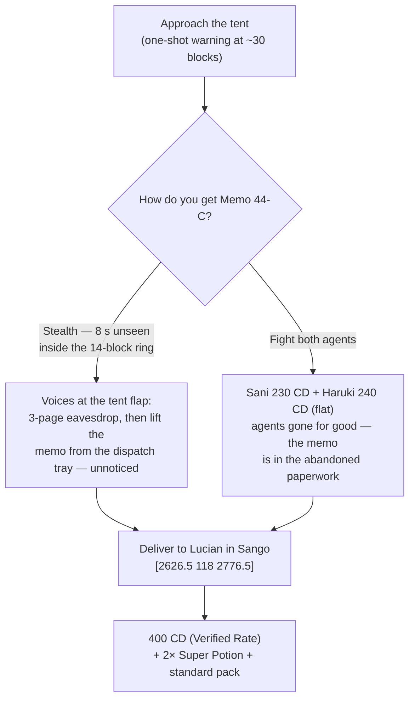

# Quests: Blossom Path

> *"VERIFICATION IS VOLUNTARY. COMPLIANCE IS APPRECIATED."* — posted at the checkpoint tent, Blossom Path

**Blossom Path** is the meadow road between **Sango Town** and **Takehara Falls** — roughly the band from x 1923–2530, z 2564–2925. It is your first route, your first wild catches, your first trainer ambushes, and the Company's politest outpost. This page covers every quest that lives **on the path itself**. The town at either end has its own page: **[[Quests Sango Town]]** and **[[Quests Takehara Falls]]**. The road beyond Takehara (Harvest Road) is covered in **[[Quests Harvest Road]]**.

**Status:** ✅ Done · 🚧 WIP (partial) · ❌ Not yet implemented — as of the 2026-07-21 audit.

> [!WARNING]
> **Spoilers — Act I.** One quest here, **Per My Last Memo**, delivers an Act I story revelation about The Company's history (and yours). That section carries its own callout — skip it if you want the tent to surprise you.

> [!IMPORTANT]
> **Blossom Path is not a safe zone.** Wild encounters, full hostile mob spawns, and two Company field agents sit directly on the road. In hardcore + Nuzlocke, the walk to gym 1 is already the game. Travel in daylight until your team is settled, and remember: the checkpoint grunts run **Lv 13–15 teams against your starting cap of 15**.

> [!NOTE]
> **How quest pay works.** Quest payments print a receipt with a **Verified Rate** line — as the CobbleDollar index destabilizes, the rate falls as low as **75% of face value**. Battle prize money is always paid **in full** *(flat)*. Training packs: **minor** = 3× Exp. Candy XS + 1× S; **standard** = 2× Exp. Candy S + 1× M; **major** = 1× Exp. Candy L + 1 random vitamin. Full tier table on **[[Quests Sango Town]]**.

---

## Blossom Path at a Glance

| Quest | Status | Giver | Battles? | Repeatable | On the quest HUD |
|-------|:------:|-------|:--------:|:----------:|:----------------:|
| Quarterly Sprint | 🚧 WIP | Petal Courier Mio | no | first win one-time, daily rematch | yes — *"Ring the bell at the Takehara arch"* [1924 110 2584] |
| Head Count | 🚧 WIP | Field Researcher Ume | optional wager | one-time | yes — *"Log a verified capture for Ume"* |
| Blossom Path Regulars | — | Jabari / Ayo / Zola / Kwame | 4 battles | one-time each | no |
| Per My Last Memo | — | auto — the checkpoint tent | optional | one-time | yes — *"Ears on the checkpoint tent"* |
| Know Your Customer | — | Femi (after badge 1) | optional | one-time | no |
| Roadside Work Orders | 🚧 WIP | Forewoman Tetsu (+ Apiarist Sumi) | no | one-time each | Night Shift only |

---

## Quarterly Sprint — Mio's race to the bell

> 🚧 WIP · **Giver:** Petal Courier Mio at the painted start line, Sango-side mouth of the path @ ~2505 71 2850 · **No battles, no entry fee — ever** · **First win one-time; paid rematch daily** · HUD waypoint: the delivery bell at the Takehara arch [1924 110 2584]

**How it starts:** Talk to Mio and press **"Race the bell."** Free.

### Walkthrough
1. A **120-second** notched bossbar starts (audio pings at 60/30/10/5/3/2/1 s) for the roughly **580-block** run. *(The paid daily rematch runs a tighter **100-second** bar.)*
2. Run Blossom Path west and **enter the bell zone at the Takehara arch** — a 12×12 area around [1924 110 2584], any height — before the bar drains.
3. **Win:** *DELIVERED* fanfare and pay. **Timeout:** *MISSED THE BELL* — you are returned to the start line, nothing lost, free retry (a daily claim is never consumed by failing).
4. After the first win, Mio offers **"Run the morning route — 150 CD purse"** once per Minecraft day (resets at dawn). Press the button *before* racing to arm the paid run.

### Rewards
| Result | Payout |
|--------|--------|
| **First win** | **500 CD** *(Verified Rate)* + **2× Exp. Candy XS** + **1× Heal Ball** + **major pack** |
| **Daily rematch** | **150 CD** *(Verified Rate)* — deliberately below the cheapest trainer prize, so it never becomes a money printer |
| **Timeout** | Nothing lost |

> [!CAUTION]
> The racing line runs straight through wild-encounter grass **and past the checkpoint tent**. The timer is not the hard part of this quest in a hardcore Nuzlocke — the road is. Clear or scout the route before you commit to a sprint.

---

## Head Count — the Blossom Path census

> 🚧 WIP · **Giver:** Field Researcher Ume at a folding table mid-meadow @ VERIFY (she's Company-*contracted*, cheerful, and not a villain — look for the table, there's no waypoint to it) · **One optional wager battle** · **One-time** · HUD line: *"Log a verified capture for Ume"*

**How it starts:** Talk to Ume and press **"Join the census"** (the Verified Biomass Census). She fronts your supplies immediately.

### Walkthrough
1. **Accept:** receive **2× Poké Ball + 1× Heal Ball** up front — the route-1 catching tutorial.
2. **Catch one wild Pokémon anywhere on Blossom Path.** Any species; you keep it — she only wants the data point.
3. Return and press **"I caught one on this route."** (This is on your honor — nothing verifies the catch. In a Nuzlocke, your first catch on the route is the one that counts anyway.)
4. **"Collect the survey fee — 250 CD":** the payout prints a full Company payroll receipt in chat — and the **PAYEE line reads [UNVERIFIED] in bold red**. It is the first on-screen admission that the system does not know who you are.
5. **Optional post-payout wager:** **"Take the field wager — stake 300 CD."** The stake is charged up front, then you battle her field subjects — **Doduo Lv 12 / Bidoof Lv 12** — for a **900 CD purse**.

### Choices & consequences
- **Decline** (*"Not my clipboard"* / *"The data can wait"*) — free; both the census and the wager stay open.
- **Wager math:** win = net **+600 CD** *(flat)*; lose = the stake *"goes to science"* (net −300). One win only. Doduo/Bidoof at Lv 12 are safe under the starting cap of 15 with any settled team.

### Rewards
- Census fee: **250 CD** *(Verified Rate)* + **minor pack** + the fronted balls.
- Wager: **900 CD** *(flat)* battle purse on a 300 CD stake.

> [!NOTE]
> Ume's clipboard includes an unexplained *"Grain Suitability Index"* column. File that away.

---

## Blossom Path Regulars — the route battles

> **Givers:** four local duelists working the meadow pinch points · **4 battles** · **One-time each** (pursuit ends permanently once beaten) · Not HUD-tracked

All four play by the **eye-contact rule** — cross their sightline (about 8 blocks) and the battle walks up to you. Two of them will not take no for an answer.

| Trainer | Where | Team | Prize *(flat)* | Declinable? |
|---------|-------|------|:--------------:|:-----------:|
| **Jabari** | west picnic pinch (meadow) | Paras 9 / Zigzagoon 10 | 150 CD | yes |
| **Bird Keeper Ayo** | mid-route, long sightline | Pidgey 11 / Starly 12 | 200 CD | **no** |
| **Zola** | between the others, near the river/flower edge | Hoppip 11 / Sentret 12 | 220 CD | **no** |
| **Bird Keeper Kwame** | the Takehara arch [~1923, 2584] | Spearow 12 / Taillow 13 | 250 CD + 1× Super Potion (first win) | yes |

### Notes
- **Ayo and Zola are spotters** — once seen, the fight is on. Routing around their sightlines is the only skip.
- **Kwame is worth beating for the intel:** his win line delivers the gym-1 tip — *birds beat the bugs at the falls*. He can also be detoured around entirely.
- All teams sit at Lv 9–13, under the starting cap of 15. Roughly **820 CD** *(flat)* total on the route — your first real bankroll.

---

## Per My Last Memo — the checkpoint eavesdrop

> **Giver:** nobody — the quest is the **Voluntary Verification Checkpoint** itself, a pop-up tent at the route pinch run by field agents **Sani** and **Haruki** · **Battles optional** · **One-time** · HUD line: *"Ears on the checkpoint tent"*

> [!WARNING]
> **Spoilers: Act I — the run's first erasure document.** The memo you lift here ends with the line the whole campaign hangs on. Skip this section to hear it cold.

**How it starts:** Automatic. Your first approach within about 30 blocks of the tent fires a one-shot warning — *"Verification is voluntary. Compliance is appreciated."* — and lights the HUD line.

> [!NOTE]
> **Tracker note:** the HUD line has **no waypoint for the tent yet** — the checkpoint is a pop-up and its spot isn't pinned on the map. Look for it at the narrow pinch of the path between Sango and Takehara; you will not miss the warning when you're close.

### Walkthrough
1. **At the tent** (within 14 blocks) an **EYES ON YOU / CLEAR** actionbar meter mirrors the two agents' real line of sight.
2. **Stealth path:** hold position **unseen for 8 continuous seconds** (a visible 8→1 countdown; being seen or leaving the ring resets it). *"Voices at the tent flap"* — move in near the left-flank agent and the overheard chain opens: a 3-page eavesdrop that ends, over head-office letterhead, with *"Reminder from head office — there was never a founder. Distribution ends."*
3. Press **"Lift Memo 44-C from the dispatch tray."** The checkpoint never notices.
4. **Fight path** (equally valid): battle both agents instead —
   - **Sani:** Zubat 15 / Rattata 14 — **230 CD** *(flat)*, 100 CD fee if you lose.
   - **Haruki:** Poochyena 13 / Grimer 14 — **240 CD** *(flat)*, 110 CD fee if you lose.
   Both agents leave for good, and you recover Memo 44-C from the abandoned paperwork. This clears the checkpoint **permanently**.
5. **Deliver:** *"Hand over Memo 44-C"* to **Lucian Scrollkeeper** in Sango [2626.5 118 2776.5].

### Choices & consequences
- **Eavesdrop vs fight:** both work, both are one-time. Stealth leaves the checkpoint (and its later story business) standing; fighting pays ~470 CD extra but removes the tent from the world.
- **The 120 CD "processing fee"** at the desk buys a polite *"verified in absentia"* line — pure flavor, grants nothing, required by nothing.
- **The Dead Letter crossover:** carrying Uncle Marlow's Dead Letter past the tent triggers a contraband scan — surrender it, pay a **250 CD** handling fee to keep it, or refuse and fight. Full consequences on **[[Quests Sango Town]]** under *No Such Recipient*.

> [!CAUTION]
> **This is the most dangerous optional fight on the route.** Sani's Zubat is Lv 15 — *at* your pre-badge cap — and confuse/poison chip is exactly how early Nuzlocke runs end. The agents are always polite and never force a battle; pre-badge, stealth is the veteran play.

### Rewards
- Turn-in at Lucian: **400 CD** *(Verified Rate)* + **2× Super Potion** + **standard pack**.
- Fight path adds **230 + 240 CD** *(flat)* in prizes.

---

## Know Your Customer — the door-to-door survey

> **Giver:** Femi, a clipboard canvasser behind a survey table at the Sango approach (east end of the path) · **One optional battle** · **One-time** · Not HUD-tracked

**How it starts:** Talk to him — he never ambushes. Before your first badge he only says the district *"is not yet scheduled."* The encounter opens **after you beat the Takehara Falls gym**.

### Walkthrough
1. Answer the Resident Verification survey: household size, nether star holdings, and *"one final item on the last page."*
2. The last page is a **sketch** — and you match it. It is stapled to a do-not-engage memo. Choose.
3. Beat him and the clipboard man stops coming around Sango — he leaves the route for good.

### Choices & consequences
| Fork | Outcome |
|------|---------|
| **"Face him"** | Battle: Sentret 14 / Meowth 15 → **460 CD** *(flat)* + **2× Super Potion**; he leaves permanently |
| **"Decline the interview — pay 150 CD"** | A processing fee *"applied with verified gratitude"*; the encounter stays available |
| **"Walk away"** | Free, no consequence |

> [!NOTE]
> If you skipped every fight on the road, this may legitimately be your **first open battle against The Company** — it has no prerequisites beyond badge 1.

---

## Roadside Work Orders — Night Shift, Inventory, The Cutting

> 🚧 WIP · **Giver:** Forewoman Tetsu at the Blossom Path Waystation work board, mid-route @ 2185 64 2786 (Inventory is subcontracted to **Apiarist Sumi**, whose emptied apiary is the meadow just east) · **No battles** · **One-time each** · HUD tracks the Night Shift only (waypoint [2185 64 2786])

**How it starts:** Talk to Tetsu at the posted work-order board — her road crew was decommissioned, but the work orders still stand. Three contracts; take any or all, in any order.

### The contracts
1. **Night Shift:** sign the contract, then cull **8 hostiles** (zombies, skeletons, spiders) on Blossom Path **after dark**. At 8 the shift auto-completes — *"NIGHT SHIFT: 8 of 8 verified"* — then report to Tetsu. Pays **300 CD** *(Verified Rate)* + **2× Potion**. (Re-signing while active does not reset your tally.)
2. **Inventory (Sumi):** bring Apiarist Sumi **3 honey bottles** from the wild hives east of the waystation. She trades a **female Combee, Lv 8** + **1× Heal Ball** — no cash. The gender matters: female Combee is the Vespiquen line, evolving at 21, just past the starting cap.
3. **The Cutting:** mine **12 coal** from the marked rock cutting on the falls side of the road and hand it to Tetsu. Short sacks are refused with a hint. Pays **250 CD** *(Verified Rate)* + **3× Exp. Candy XS**.

### Completion bonus
All three done: Tetsu signs the road off *"as maintained by unverified persons"* — **1× Golden Apple**.

> [!TIP]
> The Night Shift stacks neatly with other after-dark errands: spiders drop the string Fisherman Genji wants in Takehara, and the wild hives feed both Sumi here and Beekeeper Masumi's honeycomb order up the road (see **[[Quests Takehara Falls]]**).

---

## The Path as a Pantry

Several town quests send you back here to forage — worth batching into one trip:

| For | Gather on Blossom Path | Quest page |
|-----|------------------------|------------|
| Dr. Asha's clinic shelf | 8 Oran + 4 Pecha + 2 Cheri berries | [[Quests Sango Town]] — *Preferred Provider* |
| Fisherman Genji's rods | 8 String (spiders, after dark) | [[Quests Takehara Falls]] — *Out of Office* |
| Beekeeper Masumi | 8 Honeycomb (wild nests; spiders after dark) | [[Quests Takehara Falls]] — *Sweetwater Futures* |
| Apiarist Sumi | 3 Honey Bottles (hives east of the waystation) | this page — *Roadside Work Orders* |

---

## See also

- **[[Quests Sango Town]]** — everything back in town, including the two quests whose paper crosses this road (the Dead Letter and Memo 44-C both file at Lucian's desk).
- **[[Quests Takehara Falls]]** — the arch at the west end of this path is the gym-1 town.
- **[[Quests Harvest Road]]** — the next road, where The Company stops being polite.
- **[[Guidebook Act I]]** — act-level walkthrough, safe-zone rules, and Nuzlocke cautions.
