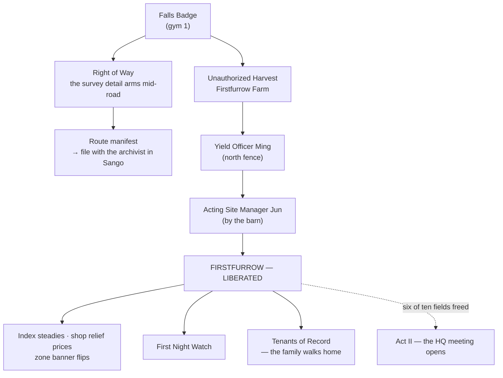

# Quests: Harvest Road

> *The crop stands horizon to horizon and not one person on this road will say its name. The Company calls it the asset, the yield, the parcel. The Dengs call it home.*

**Harvest Road** runs from Takehara Falls east to Hua Zhan City, straight through occupied farm country. It is where The Company stops smiling from behind a desk and starts working in the open — and where you get your first chance to take something back.

> [!CAUTION]
> **Spoilers — Act I villain operations, and the setup for Act II.** This page covers the Company's field details, the first farm liberation, and the arc that eventually opens the Act II raid on Company HQ. If you want the road unspoiled, walk it once first.

> [!NOTE]
> **How rewards are listed.** Battle prize money is paid **flat**. Quest payouts print a receipt and pay the **Verified Rate** — 75–100% of face value depending on the CobbleDollar instability index. Amounts below are face value.
> **Training packs:** *minor* = 3× Exp. Candy XS + 1× Exp. Candy S · *standard* = 2× Exp. Candy S + 1× Exp. Candy M · *major* = 1× Exp. Candy L + 1 random vitamin.

> [!IMPORTANT]
> **Not a safe zone.** Full mob spawns, day and night. Content on this road fights at **Lv 18–23** — tuned for the badge-1 window (cap 22) into badge-2 (cap 30). Both Company details arm only **after your first badge**; a fresh trainer is never ambushed here.

---

**Status:** ✅ Done · 🚧 WIP (partial) · ❌ Not yet implemented — as of the 2026-07-21 audit.

## Quest index

| Quest | Giver | Kind | Tracked on HUD | Headline reward |
|-------|-------|------|:--:|-----------------|
| [Right of Way](#right-of-way) | *(auto — the survey detail)* | two battles + paper trail | yes | 600 CD in prizes + 250 CD filing |
| [Unauthorized Harvest](#unauthorized-harvest-the-firstfurrow-liberation) | *(auto — the occupied farm)* | two battles, the liberation | yes (arc line) | 800 CD in prizes + a free field |
| [First Night Watch](#first-night-watch) ✅ Done | The gate lantern @ 1601.6 90 2480.8 | timed night defense | yes | 500 CD + major pack |
| [Tenants of Record](#tenants-of-record) ✅ Done | Old Deng @ 1478 90 2440 | errand + homecoming | yes | 380 CD + hamper |
| [Harvest Road Regulars](#harvest-road-regulars-route-battles) | Mirek · Xu Jianyu | route battles | no | 230 / 300 CD |
| [Luo Shiming's Wager](#luo-shimings-wager) | Harvest Hand Luo Shiming | wager battle | no | 380 CD (120 at risk) |

---

## The liberation arc — how the road fits together

The Company's escalation on this stretch is deliberate: the polite desk (the Blossom Path checkpoint), then the open road (a survey detail with a wagon of paperwork), then an occupied farm with a family camped outside its own fence. Beating the farm detail flips the field — the first move in a region-wide fight.

**What liberating a field changes**, every time:

- The **Liberate the occupied fields** tracker line ticks up (counted out of six).
- The CobbleDollar index **steadies** — quest payouts take a smaller haircut at the Verified Rate.
- Poké Mart prices drop to a **relief tier** immediately.
- The zone banner over the farm flips to **Liberated**.
- The wheat traders in the cities *notice*. At 2–3 freed fields they turn suspicious of your face; at 4+ they turn hostile — and 4 freed fields is what finally gets you a meeting at Company HQ (Act II).

> [!NOTE]
> **As shipped:** **Firstfurrow is the only field that can currently be liberated.** The tracker counts toward six and the HQ meeting requires four — the remaining five field liberations are still being authored, so the Act II gate cannot yet be opened in-game. Firstfurrow is the template every later farm will reuse: clear the perimeter, then flip the field.

---

## Right of Way

|  |  |
|---|---|
| **Giver** | Auto — a Company survey detail on the mid-road straightaway: **Yong**, Corridor Assessor [1558 88 2378]; **Lei**, Logistics Escort [1563 88 2382]; their survey wagon between them [1560 88 2380] |
| **Location** | Harvest Road, mid straightaway; the manifest files with **Lucian the archivist** in Sango [2626 118 2776] |
| **Start** | Auto-arms once you hold the Falls Badge. Yong hails you politely; Lei watches the road. Before badge 1 the pair stands passive |
| **Repeatable** | One-time |
| **Tracker** | Yes |

### Walkthrough

1. **Yong, the Corridor Assessor**, hails you as *data* passing through his corridor. Battle is opt-in — Murkrow 19 / Koffing 20. Walking away (*Proceed as data*) is free. Beat him and he leaves the road.
2. **Lei, the Logistics Escort**, is not polite. Cross his sightline and he walks you down — **no decline**. Houndour 19 / Scraggy 20. This is the run's first true villain ambusher; route around his line of sight or come loaded.
3. With **both** agents down, the wagon unseals: **Take the route manifest** — a written book grading every Harvest Road smallholding for *acquisition readiness*. Firstfurrow is already struck through: **COMPLETED**.
4. Bring the manifest to **Lucian** in Sango and file it.

### Forks

- Declining Yong's hail is free; Lei cannot be declined once he's marked you.
- The manifest can sit in the wagon (or your pack) as long as you like — the filing waits.

### Rewards

- **Yong:** **260 CD** flat (he charges a 100 CD fee if he beats you). **Lei:** **340 CD** flat.
- **Filing the manifest:** **250 CD** (Verified Rate) + minor training pack.

> [!NOTE]
> **As shipped:** in the current build the detail may remain passive even after badge 1 — the sight wiring is completed per-world at placement. If neither agent reacts to you, that world isn't armed yet.

---

## Unauthorized Harvest (the Firstfurrow liberation)

|  |  |
|---|---|
| **Giver** | Auto — the occupied farm itself: **Ming**, Yield Officer, at the north fence gap [1586 90 2487]; **Jun**, Acting Site Manager, mid-field by the barn [1603 90 2488] |
| **Location** | Firstfurrow Farm, Harvest Road (the fenced fields roughly x 1547–1615, z 2459–2495) |
| **Start** | Approach the north fence — Ming hails you: *"this is a managed agricultural asset."* Battles are opt-in; walking away is free |
| **Repeatable** | One-time |
| **Tracker** | Yes — liberating lights the arc line *Liberate the occupied fields* |

The road's backbone. A family used to farm this field; Ming's phrasing is that they *"have been transitioned."* They're camped a few hundred blocks west — see [Tenants of Record](#tenants-of-record).

### Walkthrough

1. **Clear the gate:** beat **Ming** — Herdier 19 / Koffing 19. He leaves. His defeat is the hard gate for the manager; Jun takes no unscheduled meetings while the perimeter holds.
2. **Take the field back:** beat **Jun** — Mightyena 20 / Watchog 21.
3. Jun drops **Transition Order 7-A** (a written book) as the field flips: **FIRSTFURROW — LIBERATED**. All the liberation effects listed above land at once, permanently.
4. **The paper trail (optional):** show Transition Order 7-A to **Old Deng** at the roadside camp — *"the passive voice does all the lifting"* — and/or file it with **Lucian** in Sango.

### Forks

- Both battles are opt-in with a free walk-away. Losing costs the posted fees (Ming 100 CD, Jun 150 CD) and nothing else — come back stronger.
- Deng first or Lucian first — the filing pays the same either way.

### Rewards

- **Ming:** **280 CD** flat. **Jun:** **520 CD** flat.
- **Filing the Transition Order:** **200 CD** (Verified Rate) + minor training pack.
- **Systemic:** the index relief, shop relief tier, the Liberated banner — and two follow-up quests unlock on this road the moment the field is free.

---

## First Night Watch — ✅ Done

|  |  |
|---|---|
| **Giver** | The **gate lantern** on the Firstfurrow gate post @ 1601.6 90 2480.8, just inside the west fence — with a note in Old Deng's handwriting |
| **Location** | Firstfurrow Farm (you must stay inside the fence line for the whole watch) |
| **Start** | Requires a **liberated Firstfurrow**. Interact with the lantern — *Light the lantern* only works at **dusk**; by day it politely refuses |
| **Repeatable** | One-time (retry any dusk until won) |
| **Tracker** | Yes |

The first free harvest needs one night of standing guard.

### Walkthrough

1. Light the lantern at dusk: **STAND THE WATCH — hold the field until first light.** A red bossbar counts down a **fixed ~2-minute watch** (2400 ticks); scripted hostile pulses hit the field every couple of seconds so it's a real defense, not a sparse walled-farm trickle. (Natural dawn also ends the watch early as a safety.)
2. Stay inside the farm fence for the whole watch. Zombies, skeletons, spiders, and creepers you cull inside the envelope go on the ledger.
3. Step outside the fence and a **10-second grace warning** starts — get back in or the watch fails *soft*: no damage, no cost, the lantern simply relights next dusk.
4. Hold to the end → **FIRST LIGHT.** The Dengs bring in the first free yield.

### Forks

- The only branch is the cull ledger: **8+ kills** on the night earns a bonus Heal Ball. The base pay is identical either way.
- Failing costs nothing, ever — this quest cannot hurt a hardcore run except the ordinary way: at night, in the open, on your own feet.

### Rewards

- **500 CD** (Verified Rate — the top of the route's pay band; it is the hardest work on the road) + major training pack + a breakfast hamper (6× Bread, 4× Oran Berry, 1× Potion).
- **8+ culls:** 1× Heal Ball.

> [!TIP]
> Logging out mid-watch is safe — the watch picks back up where it was when you return.

---

## Tenants of Record — ✅ Done

|  |  |
|---|---|
| **Giver** | **Old Deng** @ 1478 90 2440, displaced Firstfurrow patriarch — with **Granny Yun** and **Deng Haoran** |
| **Location** | Roadside camp west of Firstfurrow: Old Deng [1478 90 2440], Granny Yun [1476 90 2437]; Haoran fifty paces east at the fence [1496 88 2454] |
| **Start** | Auto — Old Deng flags you down as you pass the camp |
| **Repeatable** | One-time |
| **Tracker** | Yes |

The family the Company *"transitioned"* off Firstfurrow, camped within sight of their own fence. The quest is small on purpose — a favor *"the size of a pail"* — until it isn't.

### Walkthrough

1. **The supper pail:** carry Haoran's supper (a pail of stew) up the road to him at the fence.
2. Haoran, fed, pitches his **supper-money battle** — fully optional: Lillipup 19 / Phanpy 20, prize **260 CD** flat. One win only: *"One a day. Pride compounds worse than interest."*
3. **Granny Yun** thanks the pail-carrier — *"feeding the person who fed the boy is how a camp balances its books."*
4. **The deed:** Old Deng entrusts you with the Firstfurrow **deed copy** (optional; a written book listing four holders — the last one *"verified away"*). Refusing is fine: *"Then it waits. Paper is patient."* He then points you at the officer on the fence and the manager by the barn — [Unauthorized Harvest](#unauthorized-harvest-the-firstfurrow-liberation).
5. **After the liberation:** Haoran reports the fence is clear. Old Deng's *Walk the family home* sends all three Dengs through the north fence gap — title card: **Firstfurrow — The family walks home.**
6. Come back later for the codas: Haoran walking every row twice, Granny Yun's kitchen that *"smells right again,"* Old Deng fussing that his gate hangs half a thumb off level.

### Forks

- Refuse the pail or the deed — both offers stay open indefinitely.
- Haoran's battle is opt-in and stays available until won once.
- Carrying **Transition Order 7-A**? *Show him the Company order* — Old Deng reads it aloud and points you at the archivist's filing desk in Sango.

### Rewards

- **Homecoming:** **380 CD** (Verified Rate — *"the first honest sale of the season"*; the haircut shorting it is the point) + standard training pack + a hamper (8× Bread, 6× Oran Berry, 1× Potion).
- **Haoran's battle:** **260 CD** flat.
- The deed copy is a keepsake — no cash, and worth keeping anyway.

---

## Harvest Road Regulars (route battles)

|  |  |
|---|---|
| **Giver** | **Scarecrow Wrangler Mirek** [1400 88 2336] at the Takehara approach; **Kite Runner Xu Jianyu** [1492 91 2318] on the high ledge |
| **Location** | Harvest Road |
| **Start** | Mirek: talk, fully opt-in. Xu Jianyu: cross his sightline and he comes down — **no decline** |
| **Repeatable** | One-time each |
| **Tracker** | No |

| Trainer | Team | Prize | Notes |
|---------|------|:-----:|-------|
| Mirek | Hoothoot 18, Taillow 19 | 230 CD | Decline-able. His free *Ask about the road ahead* carries the **gym-2 type tip**: the glass-garden city ahead wilts to fire, wings, or bugs. |
| Xu Jianyu | Pidgeotto 20, Fletchinder 21 | 300 CD | The route spotter — *"Eye contact is a contract out here."* His kites marked you three bends back. Routing wide is the only skip. |

Both have something new to say once the first field is free — the banner flip is the talk of the road. Mirek's grievance (forty scarecrows built, paid in Company vouchers) is texture, not a quest.

---

## Luo Shiming's Wager

|  |  |
|---|---|
| **Giver** | **Harvest Hand Luo Shiming** — a picker paid in Company vouchers |
| **Location** | East leg of Harvest Road, near the Hua Zhan gate [1650 88 2520] |
| **Start** | Talk — fully opt-in, free decline (*Keep your coin*) |
| **Repeatable** | Decline freely and return; one win closes it |
| **Tracker** | No |

His day-pay is the crew's last real coin, and he needs it doubled before the city gate tolls.

### Walkthrough

1. Take the wager: **Drilbur 22 / Deerling 23** (autumn coat).
2. **Win:** his stake is yours — **380 CD** flat. **Lose:** he takes **120 CD** — *"it buys a real dinner tonight."*
3. Beaten, he warns you about the city ahead, which settles its debts *"in leaves and glass."* Once a field is free, he'll note the first liberated farm is *"hiring at honest rates."*

> [!TIP]
> Lv 22–23 against a badge-1 cap of 22 — this is the road's stiffest fight and it's tuned for the badge-2 window. Nothing forces it; take it on the way *back* if the gate battle looks ugly.

---

## Also on this stretch

- **Grain In, Goods Out (The Miller Walk)** starts at the mill just inside Hua Zhan City and sends you back out among the traders — see **[[Quests Hua Zhan City]]**.
- The **Voluntary Verification Checkpoint** and the rest of the Sango-side road content live on **[[Quests Blossom Path]]**.

---

⬅️ **[[Quests Takehara Falls]]** · ➡️ **[[Quests Hua Zhan City]]** · **[[Guidebook Act I]]** · **[[Home]]**
