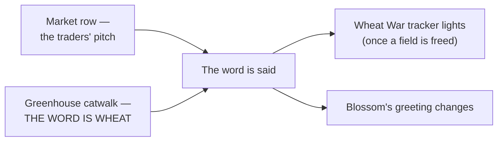

# Quests: Hua Zhan City

> *A garden city in the middle of a monoculture. A glass tower on one side, four living gardens on the other, and a market where the price of a hoe gets quoted in sheaves before anyone admits what the sheaves are.*

**Hua Zhan City** is the second gym town — the last living garden on the circuit, ringed by the Company's fields. You arrive with the Falls Badge (cap **22**); the **Bloom Badge** raises the cap to **30**. It is also the city where the villain plot finally gets its name said out loud.

> [!IMPORTANT]
> **This district is under active revision.** This page documents **what ships today.** Known-open items in the current build: the **gym leader has no in-world body yet** (an open casting decision may put the West Hill groundskeeper in the role), the gym's **Jr. Apprentice and Apprentice are not yet placed**, the **greenhouse docent is not yet placed** (the tour's visitor kit can't currently be collected), and the **nurse casting may change**. Expect this page to move.

> [!CAUTION]
> **Spoilers — Act I, major plot.** Hua Zhan is where the Company's plan is named on camera, and one quest here steals a document carrying the run's first hard Act II hook. Read no further if you want the reveal clean.

> [!NOTE]
> **How rewards are listed.** Battle prize money is paid **flat**. Quest payouts print a receipt and pay the **Verified Rate** — 75–100% of face value depending on the CobbleDollar instability index. Most receipts are unbranded; a few arrive on **Company letterhead**, and those are flagged below. Amounts are face value.
> **Training packs:** *minor* = 3× Exp. Candy XS + 1× Exp. Candy S · *standard* = 2× Exp. Candy S + 1× Exp. Candy M · *major* = 1× Exp. Candy L + 1 random vitamin.

---

## Quest index

| Quest | Giver | Kind | Tracked on HUD | Headline reward |
|-------|-------|------|:--:|-----------------|
| [The Four Gardens Pilgrimage](#the-four-gardens-pilgrimage) | Garden Master Wei | battle circuit | yes — *Garden seals n/4* | Leaf Stone + 300 CD |
| [The Garden Gym (Gym 2)](#gym-2--the-garden-gym-bloom-badge) | Leader Blossom | gym ladder | main quest | **Bloom Badge → cap 30**, 1800 CD |
| [Greenspace 7, Under-Performing](#greenspace-7-under-performing-the-gym-gate-audit) | Yan, Yield Analyst | stealth or battle | yes | the report + up to 480 CD |
| [Verified Growth (the Greenhouse Tour)](#verified-growth-the-greenhouse-tour) | Bo → Wen | tour, **the reveal** | yes | the truth + a visitor kit |
| [Wheat Traders & the Granary](#wheat-traders--the-granary) | Ping · Feng | economy loop | no | trade goods; late-game ambushes |
| [Grain In, Goods Out](#grain-in-goods-out-the-miller-walk) | Guo the Miller | walking survey | yes | 300 CD + miller's dozen |
| [Adjusted Retail (the Price Check)](#adjusted-retail-the-price-check) | Kaito Zhang | market survey | yes — *Price checks noted n/3* | 260 CD (Company receipt) |
| [Minutes of the Quarterly Review](#minutes-of-the-quarterly-review) | *(auto — the branch office)* | stealth | yes | 400 CD + the minutes |
| [Out of Network (the Clinic Beat)](#out-of-network-the-clinic-beat) | Nurse Anong | fetch + service | yes | 240 CD + clinic bundle |

> [!TIP]
> **Level context.** The gardens fight at Lv 14–16, the gym interior at 18–24 (Blossom's ace Lv 24 = your entry cap + 2), the audits and office at 23–26. Everything is tuned to be fought under your cap — the run's standing rule.

---

## The Four Gardens Pilgrimage

|  |  |
|---|---|
| **Giver** | **Garden Master Wei** — the old-botany master, Blossom's teacher — at the West Hill Garden [1404 105 2054] |
| **Location** | Four living garden stations across the city (below) |
| **Start** | Talk to Wei: *walk the four gardens... warden first, plaque second.* The tracker lights at your first seal |
| **Repeatable** | One-time |
| **Tracker** | Yes — *Garden seals n/4* |

Blossom keeps her gym the old way: her four wardens hold four living gardens scattered through the city. Beat a warden, press the station plaque beside them, earn the seal — **any order**.

| Station | Warden | Team | Coordinates |
|---------|--------|------|-------------|
| Moss Court | Gardener Lin | Oddish, Tangela — Lv 14 | [1450 93 2052] |
| Orchard Rows | Botanist Mei | Budew 14, Chikorita 15 | [1432 85 1964] |
| Water Terrace | Horticulturist Fang | Seedot, Bellsprout — Lv 15 | [1478 87 2098] |
| Still Pond | Ranger Xiu | Sunkern, Lotad — Lv 16 | [1484 87 2160] |

### Walkthrough

1. Beat each warden, then press the plaque beside them — the seal only presses once its warden is beaten. A toast counts your seals; at 4/4 it points you home.
2. Return to Wei → *Receive the blessing of the four gardens.* His handoff sends you to Blossom: *"tell her the hill sent you."*
3. *(Optional)* **Groundskeeper Aya** at the west stair [1382 93 2060] offers an exhibition match — the Sudowoodo gag (Sudowoodo 22 / Tangela 21). One-time, prize **300 CD** flat + 1× Super Potion.

> Ranger Xiu's Still Pond carries the run's quietest line — she asks what you see in the pond mirror, and waits longer than is comfortable for the answer.

### Rewards

- **The blessing:** 1× **Leaf Stone** (the earned evolution stone — real money for the Gloom/Weepinbell lines) + 2× Super Potion + **300 CD** flat.
- Each warden also pays the gym's trainer reward (2× Potion) — they **are** gym trainers 1–4, so the pilgrimage doubles as your gym prep.
- Completing the pilgrimage earns you Blossom's respect — she greets a pilgrim differently before the fight.

> [!NOTE]
> **As shipped:** the pending casting decision (Aya as gym leader) would change her exhibition role here. Documented as authored today: Aya is the optional exhibition, Blossom is the leader.

---

## Gym 2 — The Garden Gym (Bloom Badge)

|  |  |
|---|---|
| **Giver** | **Leader Blossom**; the Hua Zhan Gym Guide [1492 86 2050] explains the rules and points at both the greenhouse tour and the pilgrimage |
| **Location** | The gym hall at ~[1501 86 2054] (waypoint [1504 86 2042]); the gate audit and rezoning notice board stand just outside |
| **Start** | Talk to Blossom — the challenge is offered directly; her pre-battle line changes with what you've seen in her city |
| **Repeatable** | One-time |
| **Tracker** | Main quest line — *Defeat the Hua Zhan City Gym* |

### The ladder

| Stage | Trainer | Team | Levels |
|-------|---------|------|:------:|
| Trainers 1–4 | The four garden wardens (see [the Pilgrimage](#the-four-gardens-pilgrimage)) | Oddish/Tangela · Budew/Chikorita · Seedot/Bellsprout · Sunkern/Lotad | 14–16 |
| Jr. Apprentice | Lian | Gloom, Weepinbell | 18 |
| Apprentice | Sakura *(doubles)* | Roselia, Bayleef, Jumpluff, Leafeon | 20–21 |
| **Leader** | **Blossom** | **Tropius, Leafeon, Roserade, Venusaur** | **22–24** |

### Walkthrough

1. Clear the four wardens out in the gardens — each battle gates only on itself, so the "ladder" is soft. The pilgrimage does this for you.
2. Beat **Jr. Apprentice Lian**, then **Apprentice Sakura** (doubles) inside the gym building — the formal prerequisites for badge credit.
3. Challenge **Leader Blossom**. Her ace Venusaur sits at Lv 24 against your cap of 22. Watch the status spores.

### Her pre-battle line — four ways in

All flavor, one battle: she greets you differently if you've **heard the pitch or toured the greenhouse**, **read the rezoning notice** at her gate, or **finished the pilgrimage** — and she has a special thank-you if you've already **freed a field** on Harvest Road.

### Rewards

- **Blossom:** **1800 CD** prize (flat) + the **Bloom Badge**:
  - Level cap rises to **30**.
  - Poké Mart badge-2 shelf opens (Ultra/Dusk/Quick/Timer/Repeat/Dive balls at Kaito's).
  - **Memory fragment 2** fires.
  - The CobbleDollar index takes another knock (**instability +8**).
- **Lian & Sakura:** 2× Super Potion each. Wardens: 2× Potion each.
- Beat Blossom **and** the gym-gate analyst (either order) and you compose the *Greenspace 7 — retained* ending: the garden is saved from rezoning, and Blossom has an epilogue for you.

> [!NOTE]
> **As shipped:** Lian, Sakura, and **Leader Blossom herself have no in-world bodies yet** — their teams and dialogue are authored, but the gym interior cannot currently be fought end-to-end. The wardens, the guide, the gate audit, and the pilgrimage are all live. This is the top item on the district's revision list.

---

## Greenspace 7, Under-Performing (the gym-gate audit)

|  |  |
|---|---|
| **Giver** | **Yan**, Yield Analyst — grey suit, clipboard, dispatch tray — at the gym gate [1505 86 2043], beside the rezoning notice board |
| **Location** | The Hua Zhan gym gate; the report files with **Lucian the archivist** in Sango [2626 118 2776] |
| **Start** | Auto — approaching the gate fires a one-shot note and lights the tracker: *The gym gate audit — get the draft* |
| **Repeatable** | One-time |
| **Tracker** | Yes |

The Company is valuing Blossom's garden as an under-performing asset — *"the resident Venusaur produces no auditable yield"* — and the draft recommendation is sitting in Yan's dispatch tray.

### Getting the report — two ways

- **Eavesdrop (free):** hold position within earshot for **8 unseen seconds** — an ON THE RECORD / OFF THE RECORD meter shows his sightline; being seen just resets the count. Then approach again for the overheard three-parter (Greenspace 7 vs. Greenhouse Annex B, 400 trays a week) and *Lift the Yield Report from the dispatch tray*.
- **Battle the assessor (opt-in):** Raticate 23 / Drowzee 24 — prize **480 CD** flat + 2× Super Potion. Withdrawn, he lets you take the report from the tray anyway.

### Walkthrough

1. Read the **rezoning notice board** at the gate while you're there — Blossom reacts to a challenger who's seen what's posted on her own door.
2. Get **Yield Report RZ-7** by either path above.
3. File it with **Lucian** in Sango. This filing pays nothing — *"this one files itself."*
4. **After you take the Bloom Badge**, return to Yan: Greenspace 7 has been refiled — *brand asset, heritage class, retained. The garden stays.* → *Accept the 150 CD goodwill disbursement.*

### Forks

- Eavesdrop / battle / **pay 150 CD to decline the survey** (*"non-engagement consideration"* — a pure cost) / simply walk past. All four "fit on the form"; only the first two get you the report.

### Rewards

- The report itself (a keepsake with the rezoning math), up to **480 CD** + 2× Super Potion from the optional battle, and **150 CD** goodwill after the badge.

---

## Verified Growth (the Greenhouse Tour)

|  |  |
|---|---|
| **Giver** | **Bo**, the south-gate greeter (Company PR) → **Wen**, the greenhouse docent |
| **Location** | The Company greenhouse — the glass tower (waypoint [1482 87 2166]); the catwalk at the top |
| **Start** | Bo hails arrivals off Harvest Road; the tracker line *Tour the Verified Growth greenhouse* lights when you enter the city |
| **Repeatable** | One-time |
| **Tracker** | Yes |

The Company's public face in Hua Zhan: a free, cheerful, three-floor PR tour of the Verified Growth facility. Take it. The top floor is the single most important view in Act I.

### Walkthrough

1. **Lobby:** docent Wen starts the tour (optional — the reveal doesn't require the guided version).
2. **Ground floor:** ornamental botany. It's lovely. It's set dressing.
3. **Mezzanine — the seed vault:** the archivist **Shu** reads the dispatch board aloud: **all ten farm names** on the region's roads, *"One seed source. One buyer. One crop."* On the founding documents beside it: a rectangle of cleaner paper where a signature page used to be.
4. **The catwalk:** step out over the growing floor. One crop, horizon to horizon, under glass — and the run finally says it: **THE WORD IS WHEAT. Ten fields. One crop. One buyer.**
5. The catwalk **overseer, Rong**, blocks the exit bureaucratically: pay a **150 CD escorted-exit fee**, or *Walk back down* for free. Either way, officially, *"you saw ferns."*
6. Return to Wen for your stamp → *Accept the visitor kit.*

### Why this quest matters

The reveal is the payload — the vista, not the docent. Hearing the word here (or from the market traders — either works) is what lights the **Wheat War** tracker line once a field is freed, changes Blossom's pre-battle greeting, and reframes every unlabeled "asset" you've walked past since Sango. See **[[Quests Harvest Road]]** for what to do about it.

### Rewards

- **Visitor kit:** 2× Great Ball + 2× Bread (*"the Company pays goodwill in its own crop"*). No cash — the reveal is the reward.

> [!NOTE]
> **As shipped:** docent **Wen is not yet placed in the world**, so the stamp and visitor kit can't currently be collected — the greeter, the mezzanine archivist, the overseer, and the catwalk reveal itself are all live.

---

## Wheat Traders & the Granary

|  |  |
|---|---|
| **Giver** | **Ping** (wheat trader, market row) and **Feng** (the Granary keeper); a second trader, **Tau**, works Kalahar Reach far up the route |
| **Location** | Hua Zhan market row + the silo district |
| **Start** | Walk-up merchants, always open |
| **Repeatable** | Trading is the ongoing loop; the late-game ambushes are one-time |
| **Tracker** | No |

The other half of the reveal — and the villain economy you can actually shop at.

### The pitch and the store

- **Ping's pitch:** *"Back your savings in something you can hold... wheat does not lie."* Hearing it counts the same as the catwalk reveal.
- **The scrip loop:** the wheat traders run their own currency. Sell them a batch of **wheat** and they pay in **Company Wheat Scrip** (a gold-named note); spend that scrip on their goods. It's a closed company economy — the scrip is a marked item, so ordinary paper won't pass as payment, and the notes are worth nothing anywhere else. Backing your savings in something you can hold, indeed.
- **The Granary** is a company store in the oldest sense: *"We do not take CobbleDollars here — grain in, goods out."* Stock improves with your badges, and prices are quoted **in wheat** — they swing with the index (a Rare Candy has ranged from 20 sheaves down to 12 at peak instability). For scale: the bank rate values wheat around 25 CD.

### How they turn on you

The traders keep books on faces. As fields are liberated across the region:

- **2–3 fields freed:** both still trade, but the small talk gets pointed — *"You keep matching the descriptions a little more each week."*
- **4+ fields freed:** the trader refuses to sell and the **Grain Buyer** steps out — Miltank 38 / Tauros 39, prize **400 CD** + 2× Net Ball. The Granary keeper, greed beating caution, **will still trade with you** — and about fifteen seconds after the sale, retrieval is *initiated*: Staraptor 43 / Honchkrow 44, prize **600 CD** + 2× Dusk Ball. Beat it once and the keeper never files on you again.

> [!NOTE]
> **As shipped:** only one field can currently be liberated (see **[[Quests Harvest Road]]**), so the suspicious and hostile tiers are **not yet reachable** in-game. Documented here because the dialogue and both ambush battles are fully authored and waiting on the remaining farms.

---

## Grain In, Goods Out (The Miller Walk)

|  |  |
|---|---|
| **Giver** | **Guo the Miller** — the last independent mill in wheat country |
| **Location** | The Mill (waypoint [1538 86 2001]); the survey stops are the market row and the Granary |
| **Start** | Talk to Guo → *I will run your survey* |
| **Repeatable** | One-time |
| **Tracker** | Yes |

Guo doesn't need convincing — he needs a witness. He pays you to hear the open pitch and see the company store *with your own eyes*.

### Walkthrough

1. Stand at **Ping's stall** in the market row long enough to hear the grain pitch.
2. Stand at **Feng's Granary** long enough to see the grain-in-goods-out counter working.
3. Return to Guo → *Take the survey fee.* He makes you watch the receipt as it prints: *"read the yellow rate — that is the fee for being believed."* The shortfall on your own payout **is** his point, delivered mechanically.

### Rewards

- **300 CD** (Verified Rate, unbranded receipt — the haircut is the storytelling) + standard training pack + the **miller's dozen** (6× Bread + 4× Oran Berry — *"the one coin the Company has not adjusted yet"*).

### Forks

- None. Post-quest, with two badges he shares a secondhand pointer up Harvest Road; with two fields freed he notes the index *breathed out* — and warns that the Grain Buyer has started asking about your face.

---

## Adjusted Retail (the Price Check)

|  |  |
|---|---|
| **Giver** | **Kaito Zhang** — the east-market Poké Mart keeper (waypoint [1544 86 2059]) |
| **Location** | Three market stalls (below) |
| **Start** | Talk to Kaito **twice** — the offer opens after your first badge, once the index has moved and the tickets have been re-stickered → *Take the price check* |
| **Repeatable** | One-time |
| **Tracker** | Yes — *Price checks noted n/3* |

Kaito's shelf prices ride the index and he knows it. He wants the drift documented by somebody the stallholders will talk to.

### Walkthrough — three stalls, any order

1. **Linh Hua**, produce, east market [1544 86 2060] — the crate that was 50 is now 52 and climbing.
2. **Wei Shun**, tools [1482 87 2096] — the 200 hoe is 208, and the Company rep at his shoulder quotes the price **in sheaves, unprompted**. (Yes — before anyone official has said the word. Note it.)
3. **Mei Lin**, southwest lane [1432 90 2152] — the counter-beat: her *unverified* stall didn't move at all.
4. Hand the notes to Kaito. He flips his VERIFIED sign face-down — **ADJUSTED FOR RETAIL** — and points at the yellow rate line on your own payout receipt.

### Rewards

- **260 CD** — paid on **Company letterhead**, one of the few branded receipts in the region; the *Verified Rate* haircut printing on a Company form is the joke — + minor training pack + a small candy keepsake (3× Exp. Candy XS).

> [!TIP]
> The mart itself is the standard region shop: plain Poké Balls at 2000 CD before badges, and every price ticket in the building drifts about **+0.5% per index point**. Buying early in the run is literally cheaper. Freed fields claw prices back down.

---

## Minutes of the Quarterly Review

|  |  |
|---|---|
| **Giver** | Nobody — the Company's Eastern District **branch office** itself. Staff: receptionist **Ning** (ground floor), analyst **Lan** (mezzanine), Branch Manager **Chen Bao** (top floor) |
| **Location** | The branch office tower, eastern district (~[1536 99 1996] at the top); the minutes file with **Lucian** in Sango |
| **Start** | Auto — your first approach earns the warning: *"Floor privileges are assigned, not assumed."* No sign-up; reaching the top-floor landing starts the clock |
| **Repeatable** | One-time |
| **Tracker** | Yes |

The quarterly review is being read aloud behind the top-floor door. You are not on the distribution list.

### Walkthrough

1. Climb the tower and hold the **door-side landing** by the manager's office for **8 continuous unseen seconds** — an EYES ON YOU / CLEAR meter mirrors the staff's sightlines; being spotted only resets the count and dents your style.
2. The meeting comes through the door: fields at quota, greenhouse dispatch ahead of plan, *"confidence recalibration"* in the eastern district — and a closing item over **Regional Manager Shade's** signature: ***"Reminder — there was never a founder."*** The **Quarterly Minutes** land in your inventory.
3. Never sighted at all during the visit? You earn the **OFF THE ORG CHART** banner — cosmetic, and worth it.
4. Deliver the minutes to **Lucian** in Sango. She reads the dragged signature twice.

### Forks

- **Lan's Customer Confidence Challenge** *(optional, mezzanine)*: stake **150 CD** up front, battle her Kadabra 25 / Gothorita 26. Win: **300 CD** prize + 2× Great Ball + the BILLABLE HOURS banner (net +150). Lose: the stake is gone. One adjustment per quarter.
- Keep the minutes as long as you like — the filing waits.
- Chen Bao never battles. The manager does not handle field matters personally. Remember the name on the signature instead.

### Rewards

- **Filing the minutes:** **400 CD** (Verified Rate) + 2× Super Potion + standard training pack.

> [!CAUTION]
> This is the first hard **Act II** hook in the run — a name above yours on the org chart. What Shade manages, and from where, is Act II's problem.

> [!NOTE]
> **As shipped:** the receptionist and analyst are new bodies pending placement — until the office is fully staffed in a world, the sightline game is thinner than authored.

---

## Out of Network (the Clinic Beat)

|  |  |
|---|---|
| **Giver** | **Nurse Anong** — the Pokémon Center nurse who turned down the Company sponsorship folder |
| **Location** | Hua Zhan Pokémon Center [1534 93 2006] (Mei Lin in the southwest lane points walk-ins here) |
| **Start** | Talk twice — introduce yourself, then the restock ask opens |
| **Repeatable** | Restock one-time; healing always |
| **Tracker** | Yes |

Since she said no, her shipments arrive *"adjusted — short two boxes, re-verified, nothing actionable."* The shelf needs stocking the unofficial way.

### Walkthrough

1. Gather **6× Oran Berry + 4× Cheri Berry** from the wild growth around the city (Cobblemon berries — the bushes, not vanilla sweet-berries).
2. Bring them in: *I brought the berries — six oran, four cheri.*
3. Her closing line points at the rate stamp on your own receipt: *"that is what adjusted looks like when it happens to a whole town at once."*

### Rewards

- **Restock:** 2× Super Potion + 1× Full Heal + minor training pack + **240 CD** (Verified Rate).
- **Ongoing:** *Heal my team — 100 CD* — the paid full-party heal, same price as every nurse on the route.

> [!NOTE]
> **As shipped:** the berry count is on the honor system — she shelves what you actually hand over. And the district revision list includes a possible **nurse recast** (Mei Lin from the price check taking the counter), so the name behind this desk may change.

---

## Where to next

The Bloom Badge takes your cap to **30**, the word is out, and the first field is (or should be) free behind you. The road ahead bends south toward **Mystic Marsh** and the Fairy gym — and everything the Company does from here on happens with your face on file.

⬅️ **[[Quests Harvest Road]]** · **[[Quests Takehara Falls]]** · **[[Guidebook Act I]]** · **[[Home]]**
