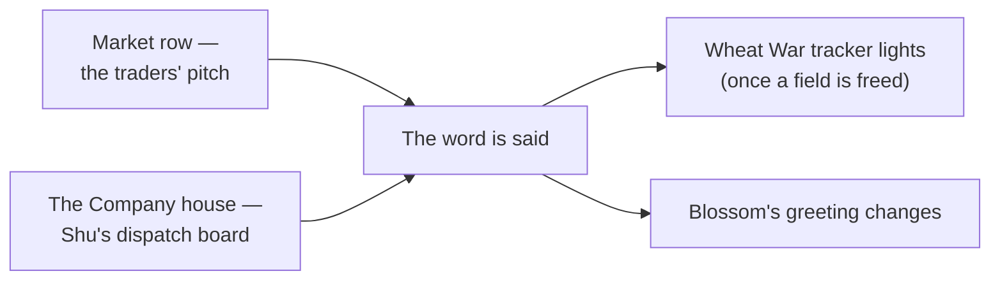

# Quests: Hua Zhan City

> *A garden city in the middle of a monoculture. Four stone wardens over four old gardens, a Company house that keeps its glass on the inside, and a market where the price of a hoe gets quoted in sheaves before anyone admits what the sheaves are.*

**Hua Zhan City** is the second gym town — the last living garden on the circuit, ringed by the Company's fields. You arrive with the Falls Badge (cap **22**); the **Bloom Badge** raises the cap to **30**. It is also the city where the villain plot finally gets its name said out loud.

> [!IMPORTANT]
> **This district is under active revision.** This page documents **what ships today** (as of the 2026-07-24 rework). The gym is now a **four-statue pilgrimage + Leader Blossom** — the old jr-apprentice/apprentice ladder was removed, and the four wardens are now **carved stone statues** (not people) that wake to battle. Known-open items: the greenhouse "docent" Wen is **unplaced**, the greenhouse cast may need **relocating to the Company house**, and the four statue **block positions** want an in-world check. See [Open items](#open-items) at the bottom.

> [!CAUTION]
> **Spoilers — Act I, major plot.** Hua Zhan is where the Company's plan is named on camera, and one quest here steals a document carrying the run's first hard Act II hook. Read no further if you want the reveal clean.

> [!NOTE]
> **How rewards are listed.** Battle prize money is paid **flat**. Quest payouts print a receipt and pay the **Verified Rate** — 75–100% of face value depending on the CobbleDollar instability index. Most receipts are unbranded; a few arrive on **Company letterhead**, and those are flagged below. Amounts are face value.
> **Training packs:** *minor* = 3× Exp. Candy XS + 1× Exp. Candy S · *standard* = 2× Exp. Candy S + 1× Exp. Candy M · *major* = 1× Exp. Candy L + 1 random vitamin.

**Status:** ✅ Done · 🚧 WIP (partial) · ❌ Not yet implemented

---

## Quest index

| Quest | Giver | Kind | Tracked on HUD | Headline reward |
|-------|-------|------|:--:|-----------------|
| [The Four Wardens Pilgrimage](#the-four-wardens-pilgrimage) | Garden Master Wei | battle circuit | yes — *Warden seals n/4* | Leaf Stone + 300 CD |
| [The Garden Gym (Gym 2)](#gym-2--the-garden-gym-bloom-badge) | Leader Blossom | gym leader | main quest | **Bloom Badge → cap 30**, 1800 CD |
| [Greenspace 7, Under-Performing](#greenspace-7-under-performing-the-gym-gate-audit) | Yan, Yield Analyst | stealth or battle | yes | the report + up to 480 CD |
| [Verified Growth (the Company House)](#verified-growth-the-company-house) | Bo, greeter | flavor + **the reveal** | no | the truth (spoken) |
| [Wheat Traders & the Granary](#wheat-traders--the-granary) | *(the wheat economy)* | economy loop | no | trade goods; late-game ambushes |
| [Grain In, Goods Out](#grain-in-goods-out-the-miller-walk) | Guo the Miller | walking survey | yes | 300 CD + miller's dozen |
| [Adjusted Retail (the Price Check)](#adjusted-retail-the-price-check) | Kaito Zhang | market survey | yes — *Price checks noted n/3* | 260 CD (Company receipt) |
| [Minutes of the Quarterly Review](#minutes-of-the-quarterly-review) | *(auto — the branch office)* | stealth | yes | 400 CD + the minutes |
| [Out of Network (the Clinic Beat)](#out-of-network-the-clinic-beat) | Nurse Mei Lin | fetch + service | yes | 240 CD + clinic bundle |

> [!TIP]
> **Level context.** The four stone wardens fight at Lv 18–21, Blossom's team runs Lv 22–25 (ace Venusaur Lv 25 = your entry cap + 3), the audits and office at 23–26. Everything is tuned to be fought under your cap — the run's standing rule.

---

## The Four Wardens Pilgrimage

|  |  |
|---|---|
| **Status** | ✅ Done |
| **Giver** | **Garden Master Wei** — the old-botany master, Blossom's teacher — at the West Hill Garden **@ 1404 105 2054** |
| **Location** | Four carved stone wardens scattered across the city (below) |
| **Start** | Talk to Wei (or the Gym Guide): *walk to the four wardens... wake each, best it, press the seal.* This sets the pilgrimage and lights the tracker |
| **Repeatable** | One-time |
| **Tracker** | Yes — *Warden seals n/4* |

Blossom keeps her gym the old way. The old botany carved **four stone wardens** across the city — three of soft things and one of iron. Each is a **statue**, dormant to passers-by. Once Wei has sent you, a warden will **wake into a battle**; beat it and press the seal cut into its pedestal — **any order** across the four. *You cannot wake a warden before speaking to Wei.*

| Warden | Spot | Team (Lv) |
|---|---|---|
| **Warden of the Old Bough** *(the eldest)* | ~[1457 103 2098] — up the oldest tree, on a branch | Shroomish 19 · Tangela 20 |
| **Warden of the Gate Garden** *(the threshold)* | ~[1452 90 2026] — the little garden at the gym gate | Cottonee 19 · Petilil 20 |
| **The Stone Knight** *(the iron)* | ~[1480 87 2113] — the square, town centre | Bellsprout 20 · Ferroseed 21 |
| **Warden of the Quiet Garden** *(the humble)* | ~[1539 85 2027] — the small garden | Lombre 21 · Sunkern 21 |

> Re-themed to their spots on 2026-07-24 (the statues were swapped to showrunner-placed locations, so the old garden names no longer fit). Internal ids/skins/seal-tags keep the old `moss/orchard/terrace/pond` handles — players never see them. Coords want an in-world block check.

### Walkthrough

1. Talk to **Wei** (or the **Gym Guide**) first — this arms the pilgrimage. Until then the wardens are just plaques to read.
2. Find each warden → *Ready a Pokéball — wake the warden.* Beat it, then *Press your hand to the seal.* A toast counts your seals; at 4/4 it points you home.
3. Return to Wei → *Receive the blessing of the four wardens.* His handoff sends you to Blossom: *"tell her the hill sent you."*
4. *(Optional)* **Groundskeeper Aya** at the west stair [1382 93 2060] offers an exhibition — the Sudowoodo gag (Sudowoodo 22 / Tangela 21). One-time, prize **300 CD** flat + 1× Super Potion. *(This is the same Aya who is Blossom in disguise — the exhibition is available before you finish the pilgrimage; once all four seals are pressed and you speak to her again, she drops the broom and reveals herself as the gym leader.)*

> **The Stone Knight** carries the run's quietest line — its polished stone visor holds a face this stone almost knew, a heartbeat before its owner arrives. (The amnesia beat, moved off the old pond onto the knight's mirror-bright visor.)

### Rewards

- **The blessing:** 1× **Leaf Stone** (real money for the Gloom/Weepinbell lines) + 2× Super Potion + **300 CD** flat.
- The statues themselves pay no cash — the reward is the seal and the wake-burst; the pilgrimage is your gym prep and the only gate on Blossom.
- Completing the pilgrimage earns you Blossom's respect — she greets a pilgrim differently before the fight.

---

## Gym 2 — The Garden Gym (Bloom Badge)

|  |  |
|---|---|
| **Status** | ✅ Done (see [Open items](#open-items) re: the wheat gate) |
| **Giver** | **Leader Blossom** (revealed from **Groundskeeper Aya** at the West Hill stair **@ 1382 93 2060**); the Hua Zhan Gym Guide [1492 86 2050] explains the rules and points at the pilgrimage |
| **Location** | Blossom spawns at the West Hill stair on the reveal |
| **Start** | Press all four warden seals, then speak to Aya again — she reveals herself as Blossom and the challenge opens. Her pre-battle line changes with what you've seen in her city |
| **Repeatable** | One-time |
| **Tracker** | Main quest line — *Defeat the Hua Zhan City Gym* |

There is **no interior trainer ladder** — the four stone wardens *are* the gym's pre-leader battles, and Blossom is the fight after. She was rebuilt as a full six.

| Stage | Trainer | Team | Levels |
|-------|---------|------|:------:|
| Wardens 1–4 | The four stone wardens (see [the Pilgrimage](#the-four-wardens-pilgrimage)) | 2-mon Grass teams — Shroomish/Tangela · Cottonee/Petilil · Bellsprout/Ferroseed · Lombre/Sunkern | 19–21 |
| **Leader** | **Blossom** | **Sunflora, Leafeon, Tropius, Roserade, Vileplume, Venusaur** | **22–25** |

Blossom runs a **sun team**: Sunflora leads with Sunny Day to switch on everyone's Chlorophyll, then Leafeon and Venusaur clean up while Roserade lays Spikes and the whole team spreads Sleep Powder / Stun Spore / Effect Spore. Bring a Fire, Flying, Ice, Bug, or Poison answer and mind the status.

### Her pre-battle line — three ways in

All flavor, one battle: she greets you differently if you've **heard the wheat pitch or visited the Company house**, or **finished the pilgrimage** — and she has a special thank-you if you've already **freed a field** on Harvest Road.

### Rewards

- **Blossom:** **1800 CD** prize (flat) + the **Bloom Badge**:
  - Level cap rises to **30**.
  - Poké Mart badge-2 shelf opens (Ultra/Dusk/Quick/Timer/Repeat/Dive balls at Kaito's).
  - **Memory fragment 2** fires.
  - The CobbleDollar index takes another knock (**instability +8**).
- Beat Blossom **and** the gym-gate analyst (either order) and you compose the *Greenspace 7 — retained* ending: the garden is saved from rezoning, and Blossom has an epilogue for you.

> [!WARNING]
> **Under review:** the gym currently *also* enforces the Minecraft-flavor **"grow and harvest a wheat crop"** step (`mc_locked`) before Blossom will fight — so today the pilgrimage alone does not open the gym. Pending a decision on whether that gate stays for gym 2 (it can be switched off with `cfg_gym_gate_off`).

---

## Greenspace 7, Under-Performing (the gym-gate audit)

|  |  |
|---|---|
| **Status** | ✅ Done |
| **Giver** | **Yan**, Yield Analyst — grey suit, clipboard, dispatch tray — at the gym gate **@ ~1505 86 2043** |
| **Location** | The Hua Zhan gym gate; the report files with **Lucian the archivist** in Sango [2626 118 2776] |
| **Start** | Auto — approaching the gate fires a one-shot note and lights the tracker: *The gym gate audit — get the draft* |
| **Repeatable** | One-time |
| **Tracker** | Yes |

The Company is valuing Blossom's garden as an under-performing asset — *"the resident Venusaur produces no auditable yield"* — and the draft recommendation is sitting in Yan's dispatch tray.

### Getting the report — two ways

- **Eavesdrop (free):** hold position within earshot for **8 unseen seconds** — an ON THE RECORD / OFF THE RECORD meter shows his sightline; being seen just resets the count. Then approach again for the overheard three-parter (Greenspace 7 vs. Greenhouse Annex B, 400 trays a week) and *Lift the Yield Report from the dispatch tray*.
- **Battle the assessor (opt-in):** Raticate 23 / Drowzee 24 — prize **480 CD** flat + 2× Super Potion. Withdrawn, he lets you take the report from the tray anyway.

### Walkthrough

1. Get **Yield Report RZ-7** by either path above.
2. File it with **Lucian** in Sango. This filing pays nothing — *"this one files itself."*
3. **After you take the Bloom Badge**, return to Yan: Greenspace 7 has been refiled — *brand asset, heritage class, retained. The garden stays.* → *Accept the 150 CD goodwill disbursement.*

### Forks

- Eavesdrop / battle / **pay 150 CD to decline the survey** (*"non-engagement consideration"* — a pure cost) / simply walk past. All four "fit on the form"; only the first two get you the report.

### Rewards

- The report itself (a keepsake with the rezoning math), up to **480 CD** + 2× Super Potion from the optional battle, and **150 CD** goodwill after the badge.

---

## Verified Growth (the Company House)

|  |  |
|---|---|
| **Status** | 🚧 Flavor beat (de-quested 2026-07-24) |
| **Giver** | **Bo**, the south-gate greeter (Company PR); the reveal is spoken by **Shu**, the archivist, over her dispatch board |
| **Location** | The **Company house**, down the south lane (not a glass tower — the old three-floor "tour" was cut) |
| **Start** | None — walk in. Bo hails arrivals off Harvest Road and points you at the gym (and, for the curious, the house) |
| **Repeatable** | One-time reveal |
| **Tracker** | No (the old *Tour the greenhouse* tracker line was removed) |

The Company's public face in Hua Zhan is a **house** down the south lane — "verified growth, verified value," a docent for a front room, and a back room that is not on the brochure. There is no tour to complete and no visitor kit to collect; the point is the **word**, and you can hear it here or from the wheat traders.

### The cast (all flavor)

- **Bo** — the south-gate greeter. Welcomes arrivals, points at the gym, mentions the house.
- **Wen** — the docent. Front-room PR spiel; points you at the back room. *(Currently unplaced — see [Open items](#open-items).)*
- **Shu** — the archivist, at the **dispatch board**: **all ten farm names**, *"one seed source, one buyer, one crop."* Say the crop out loud and the run finally names it — **THE WORD IS WHEAT. Ten fields. One crop. One buyer.**
- **Rong** — the back-office overseer. *"You were not cleared for the back office."* Pay a **150 CD escorted-exit fee** or walk yourself out. Either way, *"you saw ferns."*

### Why it matters

Hearing the word here (or from the market traders) lights the **Wheat War** tracker line once a field is freed, changes Blossom's pre-battle greeting, and reframes every unlabeled "asset" you've walked past since Sango. See **[[Quests Harvest Road]]**.

```mermaid
flowchart LR
    T["Market row —<br/>the traders' pitch"] --> W["The word is said"]
    C["The Company house —<br/>Shu's dispatch board"] --> W
    W --> HUD["Wheat War tracker lights<br/>(once a field is freed)"]
    W --> BL["Blossom's greeting changes"]
```

---

## Wheat Traders & the Granary

|  |  |
|---|---|
| **Status** | 🚧 WIP (economy loop; ambush tiers gated on freed fields) |
| **Location** | Hua Zhan market row (Auntie Song, Bo Huan, Madam Qiu) + the wider wheat economy on **[[Quests Harvest Road]]** |
| **Tracker** | No |

The in-town **market traders** — Auntie Song, Bo Huan, and Madam Qiu — run ordinary walk-up shops (apricorns, berries, mints), and one of them will give you the wheat pitch: *"back your savings in something you can hold."* Hearing it counts the same as the house reveal. The **Company Wheat Scrip** loop and the **Granary** ambush battles (the Grain Buyer / retrieval crews that turn on you once 4+ fields are freed) live on the Harvest Road route — documented under **[[Quests Harvest Road]]** — and are reachable only as the wheat war opens up.

---

## Grain In, Goods Out (The Miller Walk)

|  |  |
|---|---|
| **Status** | ✅ Done |
| **Giver** | **Guo the Miller** — the last independent mill in wheat country — at the Mill **@ 1538 86 2001** |
| **Location** | The Mill; the survey stops are the market row and the wheat store |
| **Start** | Talk to Guo → *I will run your survey* |
| **Repeatable** | One-time |
| **Tracker** | Yes |

Guo doesn't need convincing — he needs a witness. He pays you to hear the open pitch and see the company store *with your own eyes*.

### Walkthrough

1. Stand at the **wheat trader's stall** long enough to hear the grain pitch.
2. Stand at the **wheat store** long enough to see grain-in-goods-out working.
3. Return to Guo → *Take the survey fee.* He makes you watch the receipt as it prints: *"read the yellow rate — that is the fee for being believed."* The shortfall on your own payout **is** his point, delivered mechanically.

### Rewards

- **300 CD** (Verified Rate, unbranded receipt) + standard training pack + the **miller's dozen** (6× Bread + 4× Oran Berry — *"the one coin the Company has not adjusted yet"*).

---

## Adjusted Retail (the Price Check)

|  |  |
|---|---|
| **Status** | ✅ Done |
| **Giver** | **Kaito Zhang** — keeps a counter in the front of his house on the east market street **@ ~1530 84 2076** |
| **Location** | Three market stalls (below) |
| **Start** | Talk to Kaito **twice** — the offer opens after your first badge, once the index has moved and the tickets have been re-stickered → *Take the price check* |
| **Repeatable** | One-time |
| **Tracker** | Yes — *Price checks noted n/3* |

Kaito's shelf prices ride the index and he knows it. He wants the drift documented by somebody the stallholders will talk to.

### Walkthrough — three stalls, any order

1. **Linh Hua**, produce, east market — the crate that was 50 is now 52 and climbing.
2. **Wei Shun**, tools — the 200 hoe is 208, and the Company rep at his shoulder quotes the price **in sheaves, unprompted**. (Yes — before anyone official has said the word. Note it.)
3. **Mei Lin**, southwest lane — the counter-beat: her *unverified* stall didn't move at all.
4. Hand the notes to Kaito. He flips his VERIFIED sign face-down — **ADJUSTED FOR RETAIL** — and points at the yellow rate line on your own payout receipt.

### Rewards

- **260 CD** — paid on **Company letterhead**, one of the few branded receipts in the region — + minor training pack + a small candy keepsake (3× Exp. Candy XS).

> [!TIP]
> The counter is the standard region shop: plain Poké Balls at 2000 CD before badges, and every ticket drifts about **+0.5% per index point**. Buying early in the run is literally cheaper. Freed fields claw prices back down.

---

## Minutes of the Quarterly Review

|  |  |
|---|---|
| **Status** | ✅ Done |
| **Giver** | Nobody — the Company's Eastern District **branch office** itself. Staff: receptionist **Ning** (ground floor **@ 1540 86 2001**), analyst **Lan** (mezzanine **@ 1532 93 2005**), Branch Manager **Chen Bao** (top floor **@ 1536 99 1996**) |
| **Location** | The branch office, eastern district; the minutes file with **Lucian** in Sango [2626 119 2777] |
| **Start** | Auto — your first approach earns the warning: *"Floor privileges are assigned, not assumed."* Reaching the top-floor landing starts the clock |
| **Repeatable** | One-time |
| **Tracker** | Yes |

The quarterly review is being read aloud behind the top-floor door. You are not on the distribution list.

### Walkthrough

1. Climb and hold the **door-side landing** by the manager's office for **8 continuous unseen seconds** — an EYES ON YOU / CLEAR meter mirrors the staff's sightlines; being spotted only resets the count.
2. The meeting comes through the door: fields at quota, dispatch ahead of plan, *"confidence recalibration"* — and a closing item over **Regional Manager Shade's** signature: ***"Reminder — there was never a founder."*** The **Quarterly Minutes** land in your inventory.
3. Never sighted at all? You earn the **OFF THE ORG CHART** banner — cosmetic, and worth it.
4. Deliver the minutes to **Lucian** in Sango. She reads the dragged signature twice.

### Forks

- **Lan's Customer Confidence Challenge** *(optional, mezzanine)*: stake **150 CD** up front, battle her Kadabra 25 / Gothorita 26. Win: **300 CD** + 2× Great Ball + the BILLABLE HOURS banner (net +150). Lose: the stake is gone.
- Chen Bao never battles. Remember the name on the signature instead.

### Rewards

- **Filing the minutes:** **400 CD** (Verified Rate) + 2× Super Potion + standard training pack.

> [!CAUTION]
> This is the first hard **Act II** hook in the run — a name above yours on the org chart. What Shade manages, and from where, is Act II's problem.

---

## Out of Network (the Clinic Beat)

|  |  |
|---|---|
| **Status** | ✅ Done |
| **Giver** | **Nurse Mei Lin** — the Pokémon Center nurse who turned down the Company sponsorship folder — at the Center counter **@ 1534 93 2006** |
| **Location** | Hua Zhan Pokémon Center [1534 93 2006] |
| **Start** | Talk twice — introduce yourself, then the restock ask opens |
| **Repeatable** | Restock one-time; healing always |
| **Tracker** | Yes |

Since she said no, her shipments arrive *"adjusted — short two boxes, re-verified, nothing actionable."* The shelf needs stocking the unofficial way.

### Walkthrough

1. Gather **6× Oran Berry + 4× Cheri Berry** from the wild growth around the city (Cobblemon berries — the bushes, not vanilla sweet-berries).
2. Bring them in: *I brought the berries — six oran, four cheri.*
3. Her closing line points at the rate stamp on your own receipt: *"that is what adjusted looks like when it happens to a whole town at once."*

### Rewards

- **Restock:** 2× Super Potion + 1× Full Heal + minor training pack + **240 CD** (Verified Rate).
- **Ongoing:** *Heal my team — 100 CD* — the paid full-party heal + PC access.

> [!NOTE]
> There is also a separate market-stall civilian named **Mei Lin** in the southwest lane (the price-check counter-beat) — the "Nurse" title keeps the healer distinct.

---

## Open items

- **Greenhouse docent Wen is unplaced** — he exists in data but spawns nowhere; place him at the Company house or cut him.
- **Relocate the greenhouse cast** (Shu, Rong, and Wen) to the actual Company house on the south lane — their old bodies were pinned to the cut glass-tower floors.
- **Verify the four warden block positions** in-world (the `y103` Old Bough is up a tree — easy to be off).
- **Decide the `mc_locked` wheat gate** for gym 2 (see the Gym section warning).
- **Playtest Blossom** at the Lv-25 cap.

---

## Where to next

The Bloom Badge takes your cap to **30**, the word is out, and the first field is (or should be) free behind you. The road ahead bends south toward **Mystic Marsh** and the Fairy gym — and everything the Company does from here on happens with your face on file.

⬅️ **[[Quests Harvest Road]]** · **[[Quests Takehara Falls]]** · **[[Guidebook Act I]]** · **[[Home]]**
