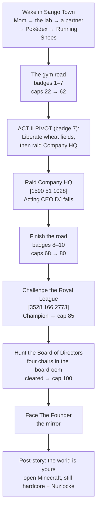

# Quests: Main Story

> *Every step of this road has been walked before — by someone with your stride, your habits, and a signature you have not read yet. The region remembers the route even when you don't. Follow the top line.*

This is the complete walkthrough of the **main quest line** — the pinned `▶` line at the top of the quest sidebar — from waking up in Sango Town to the last chair in the boardroom, and what comes after.

> [!CAUTION]
> **Full-campaign spoilers — Acts I, II, and III.** This page names the villain organization's leadership, walks the endgame gates, and spells out the identity of the final boss and the ending. If you are playing (or watching) blind, stop here and use the spoiler-safe **[[Guidebook Overview]]** and **[[Guidebook Route Map]]** instead (the act guidebooks are act-gated companions — read each only after you clear that act).

For how the sidebar and tracker work, see **[[Quests Overview]]**. Side quests live on the area pages: [[Quests-Sango Town]] · [[Quests Blossom Path]] · [[Quests Harvest Road]] · [[Quests-Takehara Falls]] · [[Quests-Hua Zhan City]].

---

## The Shape of the Line

The main story is one line that keeps rewriting itself. In order:

Two structural rules to know up front:

- **After badge 7, the raid outranks the road.** The top line switches to the wheat fields and HQ, and stays there until Acting CEO DJ falls — gyms 8–10 wait their turn on the sidebar (you can still fight them).
- **The HQ raid has a hard gate:** at least **6 of the 10 liberated wheat fields**. DJ does not take meetings while the fields still answer his memos.

### The rules you're playing under — level caps

The whole run is paced by a **level cap ladder**. Experience is clamped at the cap (a rare candy used at cap is politely refunded, and the actionbar tells you when you're capped). Every **gym leader's ace sits two levels above your entry cap** — you fight every leader underleveled. That is the design, not a mistake.

| Milestone | Cap |
|-----------|:---:|
| Start of the run | **15** |
| Badges 1–10 | **22 / 30 / 37 / 44 / 50 / 56 / 62 / 68 / 74 / 80** |
| Royal League Champion | **85** |
| Board of Directors cleared | **100** |

The starting cap of 15 is deliberately brutal: it holds most starters *unevolved* into gym 1 (Totodile wants Lv 18 for Croconaw). Badge 1 opens the door.

### What every badge pays

Each gym leader's defeat grants, in one packet:

- A **flat prize** (battle money never takes the payout haircut),
- the **level cap raise**,
- a **memory fragment** — a first-person flash of a life you don't remember (ten in total, one per badge; the first is titled *"...have we met before?"*),
- a **new Pokémart tier** (better balls and medicine),
- and — **gyms 1–7 only** — a jolt to the CobbleDollar: each of those badges pushes the instability index up 8 points, and your *quest* payout rate down with it. The Company reacts to your progress in your wallet.

---

# ACT I

## Waking in Sango Town — the Opening Chain

> **Givers:** Nalia (Mom) at [2607.5 109 2847.5] and Professor Acacia at the Sango lab [2674.5 128 2901.5] · **No battles. No money.** Just the three things every trainer leaves home with.

Mom finds *you* — she walks up the first time she spots you after you wake. She is warm, worried, and lying to somebody on your behalf: **grey-suited strangers have been asking after you by name.** Tell her *"I am ready to do something"* and the chain begins.

1. **Talk to Mom.** She sends you up to Professor Acacia at the lab. Sidebar: *Talk to Mom → Visit Professor Acacia at the lab.*
2. **Visit Acacia** at [2674.5 128 2901.5] and press **"Choose a partner."** Three partner candidates appear beside her — this happens once, so take your time.
3. **Choose your starter.** Talk to one of the three and take it at **Lv 5**:
   - **Skiddo** (Grass)
   - **Totodile** (Water)
   - **Hisuian Growlithe** (Fire — the Pokémon you receive is genuinely Hisuian, even if the candidate standing in the lab renders as a regular Growlithe on some setups)

   Every offer has a **"Keep looking"** button — browsing is free. The one you choose leaves with you; **the other two stay at the lab** (see *Dex-Unlock Partners* below — nothing here is missable).
4. **Take the Pokédex** from Acacia (press "Take the Pokedex"). She tells you plainly: fill it — **15 entries unlock a second partner, 30 the last** — and show your mother before leaving town. Her lore branch *"Who were the people who found me?"* is worth the detour: grey suits, and questions nobody in Sango wants to answer.
5. **Return to Mom** and show her the Pokédex. Press **"Take the Running Shoes"** — unbreakable boots with **+30% movement speed** while worn. Her send-off points you **west along the Blossom Path to Takehara Falls**, gym 1.

> [!TIP]
> **Rewards recap:** starter at Lv 5, the Pokédex, and the Running Shoes. Wear the shoes forever — walking in them is roughly vanilla sprinting, and they're the only speed source in the run. Every "Not just yet" button in the chain is a harmless close; you can't lock yourself out of anything.

### Dex-Unlock Partners — the other two starters

The two partners you passed over wait at the lab, and your Pokédex is the key:

| Threshold | What happens |
|-----------|--------------|
| **15 unique species caught** (~post-gym-2 pace) | See Acacia — the second partner becomes claimable at **Lv 25** |
| **30 unique species caught** (~post-gym-4 pace) | See Acacia again — the last partner becomes claimable at **Lv 40** |

Which of the two you claim second versus third is a free choice. The sidebar lights *"A second partner awaits — see Prof. Acacia"* when a threshold trips. In a hardcore Nuzlocke, these are the run's two sanctioned extra lives — and when the last one leaves, *"the lab is empty now."*

---

## Gym 1 — Takehara Falls (Bug 🐞)

> **Leader Cicada** · flowerbed arena at [1910 109 2524] · prize **1200 CD** · cap → **22** · memory fragment 1

The only gym whose ladder is spelled out to your face — Cicada's greeting *is* the walkthrough: *the tower, then Sora, then Aiko, then me.*

| Gate | Who | Teams |
|------|-----|-------|
| **1. The tower — optional, every win softens the ladder** | Bug Catcher Koji & Entomologist Yuki (floor 1), Bug Maniac Shin & Youngster Taro (floor 2), tower at x2055 | Caterpie/Weedle, Spinarak/Ledyba (~Lv 9); Nincada/Surskit, Burmy/Combee (~Lv 10) |
| **2. Jr. Apprentice Sora** — among the flowerbeds [1903 109 2521] | Sora | Beedrill/Beautifly ~Lv 12 |
| **3. Apprentice Aiko** — greenhouse center, **doubles** | Aiko | Butterfree/Beedrill/Yanma/Ninjask, Lv 14–15 |
| **4. Leader Cicada** | Cicada | Scolipede 16, Heracross 16, Vespiquen 17, **Yanmega 17 (ace)** — 3× Full Restore |

- The tower is **entirely optional** — you can walk straight to Sora. But every tower name you cross off *softens the ladder above*: beat **one** tower trainer and Sora's team fights tired (their training potential drained); beat **two** and Aiko's does; sweep **all four** and even **Leader Cicada's** team comes in drained. Skipping the tower means fighting everyone at full strength — the classic hardcore gambit. Clearing all four also quietly qualifies you for a bonus, and staying **unseen** in the tower qualifies you for a different one — see *Performance Review* on [[Quests-Takehara Falls]].
- Ace Lv 17 against your cap of 15: the underleveled-leader rule, introduced immediately.
- **On the badge:** cap 22, the first memory fragment (*"...have we met before?"*), Pokémart tier 1 — and the CobbleDollar takes its first +8 hit. The Company noticed.

## Gym 2 — Hua Zhan City (Grass 🌿)

> **Leader Blossom** · gym at ~[1501 86 2054] · prize **1800 CD** · cap → **30** · memory fragment 2

The gym *is* the town: Blossom's four wardens hold four living garden stations scattered through the city, and each doubles as a station of the **Four Gardens Pilgrimage** (worth doing — a Leaf Stone; see [[Quests-Hua Zhan City]]).

| Gate | Who | Teams |
|------|-----|-------|
| **1. The Four Gardens wardens** (any order) | Gardener Lin — Moss Court [1450 93 2052]; Botanist Mei — Orchard Rows [1432 85 1964]; Horticulturist Fang — Water Terrace [1478 87 2098]; Ranger Xiu — Still Pond [1484 87 2160] | Oddish/Tangela 14; Budew/Chikorita 14–15; Seedot/Bellsprout 15; Sunkern/Lotad 16 |
| **2. Jr. Apprentice Lian** [1490 86 2054] | Lian | Gloom/Weepinbell Lv 18 |
| **3. Apprentice Sakura** — **doubles** [1495 86 2056] | Sakura | Roselia/Bayleef/Jumpluff 20, Leafeon 21 |
| **4. Leader Blossom** | Blossom | Tropius 22, Leafeon 22, Roserade 23, **Venusaur 24 (ace)** |

- Blossom's pre-battle line changes with what you've seen around town — the wheat pitch, the greenhouse tour, the rezoning notice on her gym gate, or a completed pilgrimage — flavor only; all roads lead to the same battle.
- **Post-badge:** beat the Yield Analyst auditing her garden (the *Greenspace 7* side quest) and return for the epilogue — the garden gets refiled *"retained."* One garden, saved from a spreadsheet.
- **On the badge:** cap 30, fragment 2, mart tier 2, +8 to the index.

> [!WARNING]
> **Build status (0.5.0-alpha.1):** the four wardens are placed in the world; Lian, Sakura, and Leader Blossom herself do not have bodies placed yet. Their battles are configured but not yet standing in the gym.

## Gym 3 — Mystic Marsh (Fairy ✨)

> **Leader Titania** · [1073 65 2441] · prize **2400 CD** · cap → **37** · memory fragment 3

- **Gates:** Fairy Tale Girl Luna (~24–25) and Hex Maniac Stella (~25), then Apprentice Faye (27–28), then Titania.
- **Titania:** Clefable 30, Mawile 31, **Gardevoir 32 (ace)**.
- Fragment 3 is where the early game's "stable" feeling ends — see [[Guidebook Act I]] for the tone shift.

> [!WARNING]
> **Build status:** gyms 3–10 follow the same pattern — the leader, apprentice, and two gym trainers have configured battles but **no NPCs placed in the world yet**, and each of these gyms currently fields 4 of its 7 planned roster slots. Numbers below are the shipped battle data.

---

# ACT II

## Gym 4 — Deepcore City (Fighting 🥋)

> **Leader Bruno** · [1045 129 3186] · prize **2800 CD** · cap → **44** · memory fragment 4

- Black Belt Ryu (~31–32) and Battle Girl Mika (~32) → Apprentice Ken (34–35) → Bruno: Lucario/Medicham/Machamp, Lv 37–39 (**ace 39**).

## Gym 5 — Gaviota Port (Water 🌊)

> **Leader Neptune** · [624 82 3536] · prize **3200 CD** · cap → **50** · memory fragment 5

- Sailor Marco (~38–39) and Swimmer Coral (~39) → Apprentice Marina (41–42) → Neptune: Cloyster/Lapras/Gyarados, Lv 44–46 (**ace 46**).

## Gym 6 — Kalahar Reach (Ground 🏜️)

> **Leader Gaia** · [2085 126 4050] · prize **3700 CD** · cap → **56** · memory fragment 6

- Ruin Maniac Dustin (~45) and Hiker Boulder (~44–45) → Apprentice Terra (47–48) → Gaia: Flygon/Hippowdon/Garchomp, Lv 50–52 (**ace 52**).

## Gym 7 — Cyber City (Electric ⚡) — the pivot

> **Leader Volt** · [1462 89 1185] · prize **4300 CD** · cap → **62** · memory fragment 7

- Guitarist Amp (~50–51) and Engineer Watt (~51) → Apprentice Surge (53–54) → Volt: Magnezone/Luxray/Electivire, Lv 56–58 (**ace 58**).
- **Badge 7 is the story's hinge.** The moment it lands, the top line of the sidebar stops pointing at gyms and starts pointing at **the wheat fields and Company HQ**. This is also the instability peak (~56 on the index — quest payouts around 86% of face value). It gets better the old-fashioned way: by taking things back.

---

## The Wheat War — Liberate the Occupied Fields

> **Starts:** the moment someone finally says the word to you *and* you've freed your first field. The sidebar line reads **"Liberate the occupied fields n/6."**

The Company's plan, in one sentence: crash the CobbleDollar and replace it with a wheat monopoly. For the entire early game, no Company employee will say the word — it's *the asset, the yield, the crop*. Two places break the silence:

- **The wheat traders** in Hua Zhan's market row: *"back your savings in something you can hold."*
- **The Verified Growth greenhouse catwalk** in Hua Zhan: one crop, horizon to horizon. *"THE WORD IS WHEAT — Ten fields. One crop. One buyer."* (See [[Quests-Hua Zhan City]].)

### Liberating a field — the Firstfurrow template

The first liberation is a taught, complete loop on Harvest Road (walked in full on [[Quests Harvest Road]] as *Unauthorized Harvest*):

1. **Clear the perimeter** — beat the Yield Officer, **Ming**, at the north fence gap [1586 90 2487] (Herdier/Koffing ~19; 280 CD). The manager takes no unscheduled meetings until the fence is quiet.
2. **Take the field back** — beat Acting Site Manager **Jun** mid-field by the barn [1603 90 2488] (Mightyena/Watchog ~20–21; **520 CD**, and he drops **Transition Order 7-A**, a document the Sango archivist will pay to file).
3. **The field flips.** The zone banner reads *Liberated*, the family camped up the road walks home, and two follow-up side stories open on the spot (*First Night Watch*, *Tenants of Record*).

### What each liberation does

- **The money steadies:** the instability index drops 6 — every quest receipt in the region immediately pays a better rate.
- **Shops relax:** liberation unlocks cheaper relief pricing at the marts.
- **The traders notice:** at **2–3 fields** the wheat traders turn suspicious — *"you keep matching the descriptions a little more each week."* At **4+** they turn hostile: the Grain Buyer stops selling and starts an ambush (~Lv 38–39), and trading at the Granary at all becomes a trap worth springing exactly once.
- **The door opens:** **6 liberated fields** is the hard gate on the HQ raid.

> [!WARNING]
> **Build status:** of the six fields on the counter, **only Firstfurrow can currently be liberated** — the remaining field garrisons are not yet placed. Until they are, the 4-field HQ gate cannot be satisfied in normal play. This is the single biggest known gap between Act I and Act II in the current build.

---

## The HQ Raid — Acting CEO DJ

> **Company HQ [1590 51 1028]** · Gates: **7 badges** and **6 liberated fields** · prize **8000 CD**

The sidebar walks you there: *"Liberate wheat fields, then raid HQ"* becomes *"Raid Company HQ [1590 51 1028]"* once the sixth field is free. Below six fields, DJ's only line is a refusal: *"Come back when the fields stop answering our memos."*

**The chain up the tower:**

| Floor | Opponent | Levels |
|-------|----------|--------|
| The gauntlet | Company grunts — Field Agents through Elite Agents | ~13–15 up to ~60–66 |
| Management | Regional Manager **Shade** | 35–36 |
| Management | Senior Director **Vex** | 47–49 |
| Management | COO **Noir** | 62–65 |
| The Boardroom | **Acting CEO DJ** — six Pokémon | **68–72** |

DJ recognizes you. Not as a threat — as the rightful owner. His parting line on defeat: *"Keeping it warm... It was always going to be yours again."*

**On victory:**
- **8000 CD** prize, plus a **Master Ball**, **64 wheat** (petty, perfect), and a new post-raid Pokémart tier.
- **The CobbleDollar stabilizes** — the instability index is clamped down to 25 and stays there (it never rises again; if your liberations already pushed it lower, it keeps your better number).
- The top line hands you back to the remaining gyms — badges 8–10 no longer shake the currency. The Company has bigger problems now.
- The Sango archivist's file — the run-spine side quest — can finally be closed (see *The Incomplete File* on [[Quests-Sango Town]]).

> [!WARNING]
> **Build status:** DJ and the entire HQ interior chain (Shade, Vex, Noir, the grunt gauntlet) are fully written and configured, but not yet placed or battle-wired in the world. Combined with the wheat-war gap above, Act II is not yet playable end-to-end in 0.5.0-alpha.1.

---

# ACT III

## Gyms 8–10 — Finishing the Road

| # | Gym | Leader | Gates | Leader team | Prize | Cap |
|:-:|-----|--------|-------|-------------|:-----:|:---:|
| 8 | Ryujin Keep (Dragon 🐉) [2156 201 884] | **Ryujin** | Dragon Tamer Ryu (~56–57), Ace Trainer Drake (~57), Apprentice Tatsu (59–60) | Dragonite/Haxorus/Salamence 62–64, **ace 64** | 4900 CD | **68** |
| 9 | Nifl Town (Ice ❄️) [3608 112 2031] | **Boreas** | Skier Powder (~62–63), Boarder Chill (~63), Apprentice Glacier (65–66) | Mamoswine/Walrein/Glaceon 68–70, **ace 70** | 5400 CD | **74** |
| 10 | Scorchspire (Fire 🔥) [3700 100 4511] | **Vulcan** | Kindler Blaze (~68–69), Fire Breather Pyra (~69), Apprentice Inferno (71–72) | Magmortar/Typhlosion/Charizard 74–76, **ace 76** | 6000 CD | **80** |

Memory fragments 8–10 land here — the last one points *inward*. With **ten badges and DJ down**, the top line flips: **"Challenge the Royal League."**

## The Royal League — Elite Four & Champion

> **[3528 166 2773]** — five halls in a row. Roland Badgekeeper checks all ten badges at the door. Entry cap: **80**.

A strict sequential gauntlet — each door opens only when the last one falls:

| Order | Opponent | Levels | Prize | Also pays |
|:-----:|----------|:------:|:-----:|-----------|
| 1 | Elite Four **Aria** — *"Shadows test the nerve before the mind."* | 72–74 | 5000 CD | 5× Rare Candy |
| 2 | Elite Four **Marcus** | 74–76 | 6500 CD | 5× Rare Candy |
| 3 | Elite Four **Luna** | 76–78 | 8000 CD | 5× Rare Candy |
| 4 | Elite Four **Drake** | 78–80 | 9500 CD | 5× Rare Candy |
| 5 | **Champion Cynthia** — six Pokémon, **Garchomp Lv 85 ace** | 82–85 | 12000 CD | Master Ball + 3× Netherite Ingot |

**Beating Cynthia makes you Champion: level cap → 85** — and opens the last hunt. The Battle Frontier is also designed for this 85–100 window if you want to sharpen up first.

> [!WARNING]
> **Build status:** the five League combatants are configured (teams, prizes, gates) but not yet placed or battle-wired; the support NPCs at the League (gatewarden, badgekeeper, archivist, physician) are already standing.

## Hunt the Board of Directors

> **The Boardroom, Company HQ [1590 51 1028]** · Gate: **you must be Champion** · four battles, any order

Return to the boardroom as Champion. Four Board members still hold the table — their nameplates are static, each name collapsed to a single letter and a smear of interference. At the far end sits a fifth figure who is *all* static, and it will not take a meeting until the table is empty. Each of these four was part of the vote that erased you.

- **Each member:** four Pokémon at **Lv 83–85**, 3× Full Restore. **Any order** — they each gate on BOTH your Champion title and Acting CEO DJ's defeat — clear the HQ raid before the tower opens.
- **Each victory pays:** **9000 CD**, 5× Rare Candy, 3× Diamond — and one more chair goes quiet. The room narrates the countdown: *"A seat empties..."* → *"Half the table is silent..."* → *"One chair left between you and the name..."* → *"The room is cleared. The static holds one name, and it is waiting for you."*
- **All four down:** the final **level cap 100** unlocks — your training window before the mirror. The top line flips one last time: **"Face The Founder."**

## Face The Founder — the Mirror

> **The last chair in the Boardroom** · Gate: all four Board members defeated · prize: **0 CD**

Approach the end chair. The figure's nameplate is pure static, and the monologue lands the run's thesis:

> *"There is no one behind this desk but the two of us, and we have the same face... The Company is a building. I am what is actually wrong."*

**The Founder is you** — the amnesiac former CEO's shadow self, the mirror battle the whole run has been walking toward. Canonically this is a single **level 100** mirror of yourself.

**On victory:**
- **0 CobbleDollars.** Deliberate. You do not get paid to reclaim yourself.
- **Master Ball, 2× Netherite Ingot, 64 wheat** — the last word on the commodity that started this.
- **The name reveal:** the only name the Founder ever speaks aloud is *your own* — *"The name on the chair was always* ⟨you⟩*."* The chair, the name, and the debt are yours.
- The epilogues open — including Mom's homecoming: *"in this kitchen you are just mine."* She never learns the rest. Nobody tells her.

> [!WARNING]
> **Build status:** the Founder's battle currently ships a placeholder six-Pokémon team at Lv 88–90; the canonical single-Pokémon level-100 mirror mechanic is not yet implemented, and the Board/Founder bodies are not yet placed. Treat the mirror as design canon, the placeholder as the current build.

---

## After the Credits

The Founder is the last fight. The dragon already fell mid-journey — the Ender Dragon was the Ryujin Keep rift boss at gym 8, torn into the overworld above the keep and slain there to earn the Dragon badge — so there is no post-game boss left to hunt. What remains is not a goal. It's a life.

The top line has one more line in it, and it isn't an objective: **"Beyond the map — the world is yours."**

The custom map ends; generated Minecraft doesn't. With the Company overthrown and the self you lost finally whole, you walk off the edge of the curated **UPM 2** region into open, generated terrain — and just *live*. Build, mine, settle, explore, survive. **Still hardcore, still Nuzlocke** — but no script, no gates, no safe zones, nothing left to reclaim. The cap is 100, the Company is a building you already own, and the last image of the run is the founder walking free into an open world that is finally theirs, not the Company's.

---

## See also

- **[[Quests Overview]]** — the quest system: sidebar, tracker, receipts, training packs, and the full quest index.
- **[[Guidebook Act I]]** / **[[Guidebook Act II]]** / **[[Guidebook Act III]]** — the spoiler-managed strategy companions.
- **[[Guidebook Route Map]]** — every location above, in travel order.
