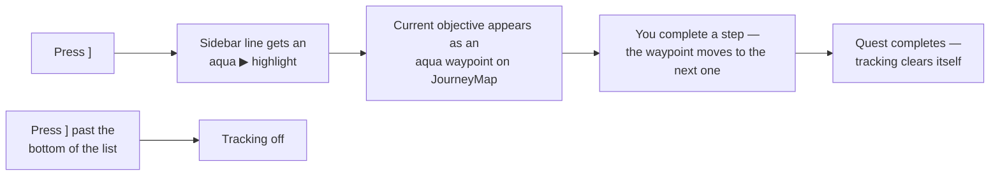

# Quests: Overview

> *Work is never hard to find here. Somebody always needs a letter carried, a fence watched, a price checked twice. Just read the receipt before you pocket it — the rate line is the only sentence in this region that never lies.*

The region runs on paperwork, and so does your journey: **26 tracked quests with 57 tracked objectives**, from the main badge road down to a bread round on your mother's lane. This page explains the quest *system* — the sidebar, the tracker, how you get paid, and the rules every quest plays by — and ends with an **index of every quest** pointing to its area page.

For the story walkthrough, see **[[Quests Main Story]]**. For the areas: **[[Quests-Sango Town]]** · **[[Quests Blossom Path]] · [[Quests Harvest Road]]** · **[[Quests-Takehara Falls]]** · **[[Quests-Hua Zhan City]]**.

> [!NOTE]
> **Spoiler policy.** This page stays spoiler-light: the quest index names late-game main-story quests inside a collapsed section, and area pages carry their own spoiler callouts. If you want to go in blind, read only the system sections and the Act I rows.

---

## The Quest Sidebar

Your quest log is the **sidebar on the right of the screen**. It is always live — no journal to open.

- **The top line is the main story.** It is pinned first, marked with a `▶`, and rewrites itself as the campaign moves — from *"Talk to Mom"* on day one all the way to the endgame. It always tells you the single next thing the story wants.
- **Side-quest lines stack beneath it** in a fixed order. A line **appears the moment a quest becomes active** (taking a job, being hailed on the road, crossing a threshold) and **disappears on its own when the quest is done**. You never manage the list.
- **Some lines carry live counters** — *"Liberate the occupied fields 0/6"*, *"Garden seals 2/4"*, *"Price checks noted 1/3"*. These update in place as you progress.
- The sidebar shows up to **15 lines** and refreshes about once a second.

| Command | What it does |
|---------|--------------|
| `/ca quest show` | Display the quest sidebar |
| `/ca quest hide` | Hide it (clean-screen recording) |
| `/ca quest refresh` | Force a redraw from current state |

See [[Commands]] for the full command reference.

---

## The Quest Tracker

New in 0.5.0: you can **track** any quest on the sidebar and get a live waypoint to its current objective.

### The keys

| Key | Action |
|:---:|--------|
| **`]`** | Track the next quest down the sidebar (starts at the top if nothing is tracked) |
| **`[`** | Track the previous quest up the list |

Both keys are rebindable under **Options → Controls → Cobblemon Initiative**.

### How it behaves

- **The tracked line is highlighted** with an aqua `▶ ` prefix on the sidebar. (The main-story line already carries its own `▶`, so tracking it looks unchanged — that's by design.)
- **The waypoint follows your progress.** Each quest is broken into tracked objectives; the tracker resolves *which step you are on right now* and puts the waypoint there. Hand in a delivery and the marker jumps to the next stop on its own.
- **With JourneyMap installed** (it ships with the pack), the objective shows as an **aqua waypoint** on the map and minimap for the current session. **Without it**, a column of white light marks the objective in the world instead.
- **Some objectives have no map position** — "talk around town" style steps. Tracking still works; you'll see *"(no waypoint for this objective)"* until the quest reaches a placeable step.
- **Cycling off:** pressing `]` past the bottom of the list (or `[` past the top) turns tracking off — the actionbar confirms *"Quest tracking off."*
- **Auto-clear:** when the tracked quest completes and its line leaves the sidebar, tracking clears itself — *"Quest tracking cleared — objective complete."*
- **It survives relogs.** Your tracked quest is remembered per world.

### Tracker commands

The keys are shortcuts for a player-facing command — no operator permission needed:

| Command | What it does |
|---------|--------------|
| `/cobblemon-initiative track next` | Same as `]` |
| `/cobblemon-initiative track prev` | Same as `[` |
| `/cobblemon-initiative track clear` | Stop tracking |
| `/cobblemon-initiative track status` | List all active quests, with the tracked one marked |

> [!TIP]
> Type the **full** `/cobblemon-initiative track ...` command — the short `/ca` alias is an admin shortcut and won't accept `track` without operator permission. The `]` / `[` keys already do the right thing.

---

## Getting Paid — Receipts and the Verified Rate

Quest money in this region does not arrive at face value. It arrives **with a receipt**.

- **Quest payouts are skewed by the state of the CobbleDollar.** When a quest pays you, chat prints a receipt: the face value, the current **Verified Rate**, and what you were actually paid. The rate floats between **100% and 75%** depending on how unstable the currency is.
- **What moves the rate:** every one of the **first seven gym badges** shakes the currency a little further (worst case around gym 7, when payouts run at roughly **86%** of face value). Every **wheat field you liberate** claws some stability back. After the events at the end of Act II the index settles and payouts recover to roughly **94% or better** for the rest of the run.
- **Battle prize money never skews.** What a trainer wagers, you receive in full — only *quest* payouts ride the rate.
- **Some money is deliberately honest.** Neighbors pay flat — the lane's care package and a farmer's handshake money arrive un-adjusted, and that is the point.

> [!IMPORTANT]
> **Read the letterhead.** By default the receipt is **unbranded** — just a rate and a number. On a handful of occasions the receipt arrives on **Company letterhead** ("Company Verified Rate"). Those are the moments the Company itself is paying you — signing their census waiver, selling them documents, taking their tournament purse, doing their retail audit. When the envelope is *exactly three percent light*, that isn't a bug. That's the receipt telling you whose money you took.

---

## Training Packs

Completing quests doesn't just pay cash — one-time completions also grant a **training pack**, sized to the job. Vitamins enter the economy *only* through packs, and the vitamin in a pack is random (HP Up, Protein, Iron, Calcium, Zinc, or Carbos, equal odds).

| Tier | Contents | Earned by |
|------|----------|-----------|
| **Minor** | 3× Exp. Candy XS + 1× Exp. Candy S | Small errands — berry runs, sample gathering, short filings (~250 CD class) |
| **Standard** | 2× Exp. Candy S + 1× Exp. Candy M | Real jobs — deliveries past trouble, stealth carries, collection quests (~300–400 CD class) |
| **Major** | 1× Exp. Candy L + 1 random vitamin | The big one-time feats — first tournament wins, all-night watches, standing between suits and a mayor (~500–600 CD class) |
| **Grand** | 1× Rare Candy + 1× Exp. Candy XL + 1× PP Up + 1 random vitamin | **One quest in the game.** The archivist's file, closed at the very end of its run-long chain. |

> [!NOTE]
> **Packs ride one-time completions only.** Repeatable payouts — daily runs, rematch purses, re-entries — pay money or potions and nothing else. In a hardcore Nuzlocke there is deliberately **no experience farm loop**.

---

## One-Time, Daily, Repeatable

Almost every quest in the region is **one-time**: it latches on completion and its rewards can never double-pay. The exceptions are deliberate and deliberately small:

| Kind | Examples | Rule |
|------|----------|------|
| **Daily** | Mio's morning delivery route (150 CD), Dr. Asha's clinic prescription (1 Potion) | Once per Minecraft day, resets at dawn |
| **Re-entry** | The Sango Classic fishing derby (200 CD repeat purse vs a 150 CD entry), the Cascade gold-time run (300 CD, needs a badge) | Pay/qualify each attempt; money only |
| **Services** | Nurse heals (flat **100 CD**, every town), shops, the Granary's grain-for-goods counter | Always available; these are the money *sinks* |

Every repeat purse is tuned **below the cheapest trainer battle prize** — nothing on this list is a money printer.

> [!TIP]
> **Failure is usually soft.** Timers, stealth checks, and night watches almost never cost you anything but time: a missed bell teleports you back to the start, a spotted carry just resets the count, a broken watch relights the lantern next dusk. The quests that can genuinely hurt you are the ones with **battles** in them — and this is still a hardcore Nuzlocke.

---

# Quest Index

Every quest, its giver, the hook, and what it pays — linked to the page that walks it in full.

## Main Story — [[Quests Main Story]]

The pinned top line of the sidebar, from waking up in Sango Town to the end of the campaign. Full spoiler-gated walkthrough on its page.

| Quest | Giver | Hook | Rewards |
|-------|-------|------|---------|
| Waking in Sango Town (opening chain) | Mom & Professor Acacia | Grey suits have been asking after you by name. Start with breakfast. | Starter (Lv 5), Pokédex, Running Shoes |
| Dex-Unlock Partners | Professor Acacia | The two partners you passed over wait at the lab — fill the Pokédex to claim them | 2nd starter at Lv 25, 3rd at Lv 40 |
| Gym 1 — Takehara Falls (Bug 🐞) | Leader Cicada | The tower, then Sora, then Aiko, then me | 1200 CD · cap → 22 |
| Gym 2 — Hua Zhan City (Grass 🌿) | Leader Blossom | The last living garden on the circuit | 1800 CD · cap → 30 |
| Gym 3 — Mystic Marsh (Fairy ✨) | Leader Titania | The marsh keeps its own counsel | 2400 CD · cap → 37 |
| Gym 4 — Deepcore City (Fighting 🥋) | Leader Bruno | Strength the Company can't buy | 2800 CD · cap → 44 |
| Gym 5 — Gaviota Port (Water 🌊) | Leader Neptune | The sea does not verify | 3200 CD · cap → 50 |
| Gym 6 — Kalahar Reach (Ground 🏜️) | Leader Gaia | Old earth, older grudges | 3700 CD · cap → 56 |
| Gym 7 — Cyber City (Electric ⚡) | Leader Volt | The story's pivot — everything changes after this badge | 4300 CD · cap → 62 |
| Gym 8 — Ryujin Keep (Dragon 🐉) | Leader Ryujin | The keep above the clouds | 4900 CD · cap → 68 |
| Gym 9 — Nifl Town (Ice ❄️) | Leader Boreas | The cold audit | 5400 CD · cap → 74 |
| Gym 10 — Scorchspire (Fire 🔥) | Leader Vulcan | The tenth and final badge | 6000 CD · cap → 80 |
| The Royal League | Elite Four & Champion Cynthia | Five doors at [3528 166 2773]; ten badges to open the first | 5000–12000 CD per battle · cap → 85 |

<b>Act II–III main-story quests (villain-plot spoilers)</b>

| Quest | Giver | Hook | Rewards |
|-------|-------|------|---------|
| The Wheat War | The occupied fields | Someone finally says the word out loud. Then you take the fields back, fence by fence. | Per field: steadier money, cheaper shops |
| The HQ Raid | Acting CEO DJ | The chair is waiting — but the fields have to stop answering memos first | 8000 CD · Master Ball · the currency stabilizes |
| Hunt the Board of Directors | Four names reduced to static | Empty the table so the last chair will talk | 9000 CD + 5× Rare Candy + 3× Diamond each · final cap → 100 |
| Face The Founder | The figure in the end chair | One battle, one outcome, one name | **0 CD** — you don't get paid to reclaim yourself |

## Sango Town — [[Quests-Sango Town]]

| Quest | Giver | Hook | Rewards |
|-------|-------|------|---------|
| The Sango Classic | Deka | 150 CD entry, 120 seconds, three fish off the pond | 500 CD + major pack first win; 200 CD repeats |
| Long-Term Growth Vehicle | Deka | A fully verified investment opportunity. It is a Magikarp. | Magikarp Lv 5 (costs 500 CD) |
| The Shorefront Invitational | Harbourmaster Tayo | A three-round dock bracket; the champion's envelope arrives exactly 3% light | 600 CD purse + major pack + Heal Ball |
| No Such Recipient | Uncle Marlow | Thirty-one years on the route, one letter that never delivered | Wingull Lv 12 (deliver fork) + standard pack |
| The Incomplete File | Lucian Scrollkeeper | The archive has a you-shaped hole in it — a three-stage chain spanning the whole run | 300 + 300 + 600 CD, then **4000 CD + grand pack** |
| Per My Last Memo | The checkpoint tent | Eight unseen seconds buys you the conversation at the tent flap | 400 CD + standard pack at turn-in |
| Off the Record | Lucian Scrollkeeper | Two quiet carries past the auditors — then get counted on purpose | 550+ CD + standard pack (+ Heal Ball clean sweep) |
| Pending Review | Imani, the census desk | Sign the Field Liability Policy. Or don't. | 500 CD + ID (sign) *or* the Elder's field kit (refuse); major pack either way |
| The Lane Looks After Its Own | Oma | A bread round on Mom's lane | ~600 CD flat + supplies + optional free Eevee (1/20 shiny) |
| Adjunct Faculty | Assistants Miri & Raan | The lab's grant went in for verification and came back as a very polite silence | 250 CD + minor pack each |
| In-Kind Exchange | Old Sefu | One joke fish for another — the only exchange the Company can't see | Feebas Lv 10 |
| Preferred Provider | Dr. Asha | Restock the clinic's empty shelf; heals are 100 CD now | Potions + minor pack + 250 CD; daily prescription |
| Shops & services | The Pokémart, Deka, Dr. Asha | The money sink — stock and prices grow with your badges | — |

## The Roads — Blossom Path & Harvest Road — [[Quests Blossom Path]] · [[Quests Harvest Road]]

| Quest | Giver | Hook | Rewards |
|-------|-------|------|---------|
| Head Count | Field Researcher Ume | Catch one, self-report, and read the payee line on your first payroll receipt | 250 CD + minor pack; optional 900 CD wager |
| Per My Last Memo | The verification checkpoint | *"Verification is voluntary. Compliance is appreciated."* | 400 CD + standard pack (also listed under Sango) |
| Know Your Customer | Femi, door-to-door | A survey with a sketch stapled to the last page (after badge 1) | 460 CD + potions (fight fork) |
| Blossom Path Regulars | Four locals | Eye contact is a contract out here | 150–250 CD flat prizes |
| Roadside Work Orders | Forewoman Tetsu | Three contracts on a decommissioned road crew's board | 550 CD + items + female Combee Lv 8; golden apple for all three |
| Right of Way | A survey wagon mid-road | Two agents grading every smallholding for acquisition (after badge 1) | 600 CD in prizes + 250 CD filing |
| Unauthorized Harvest | The occupied Firstfurrow Farm | Clear the fence, then take the field back — the first liberation | 800 CD in prizes; the money steadies region-wide |
| First Night Watch | The gate lantern at Firstfurrow | Hold the freed field from dusk to first light | 500 CD + major pack + breakfast hamper |
| Tenants of Record | Old Deng's roadside camp | Carry a supper pail up the road. Later, walk the family home. | 380 CD + standard pack + hamper |
| Harvest Road Regulars | Mirek & Xu Jianyu | The kites marked you three bends back | 230–300 CD flat |
| Luo Shiming's Wager | Luo Shiming | The crew's last real coin, doubled or gone before the gate tolls | 380 CD win / −120 CD loss |

## Takehara Falls — [[Quests-Takehara Falls]]

| Quest | Giver | Hook | Rewards |
|-------|-------|------|---------|
| Cascade Ascent | Falls Warden Shou | Base to crest in ninety seconds; every missed jump lands in water | 500 CD + major pack; 300 CD gold-time repeats |
| Quarterly Sprint | Petal Courier Mio | Race the delivery bell down Blossom Path (~580 blocks, 180 seconds) | 500 CD + major pack; 150 CD daily |
| Sting Operation | Beekeeper Tomo | Four "asset under valuation" seals on the hive line; the fourth is guarded | 350 CD + standard pack + honey; post-badge encore |
| Notice of Non-Compliance | Printmaker Mei | Paste three moth prints back up while the canvasser's eyes are elsewhere | 400 CD + standard pack + Heal Ball |
| Natural History | Curator Kenji & Sayuri | Six bones for the plinth — and one de-extinction per fiscal era | 400 CD + standard pack; Kabuto *or* Anorith Lv 10 |
| Stakeholder Alignment | Two suits on the gym roof | Step between the Site Assessors and the mayor | 460 CD prize + 600 CD thanks + major pack |
| Performance Review | Nobody announces it | Ghost the gym tower unseen — or sweep all four trainers | 400–600 CD + major pack (hidden stealth meta) |
| Sweetwater Futures | Beekeeper Masumi | The Company bought her hives in perpetuity. Nobody contracted the wild nests. | 300 CD + standard pack + female Combee Lv 12 |
| The De-Acquisition Desk | Trader Mayu | Your Paras for an Elekid named Surcharge | Elekid Lv 12 |
| Out of Office | Fisherman Genji | Eight string restrings two rods — one of them yours. Then, a wager. | Poké Rod + 300 CD + standard pack; 200 CD wager |
| Canvasser Patrol | Kazuo | Answer for the postings (after badge 1) — or buy "administrative clearance" | 280 CD flat |
| Nurse Lila | The Pokémon Center | *"The invoice arrives pre-verified."* | Full heal, 100 CD per visit |

## Hua Zhan City — [[Quests-Hua Zhan City]]

| Quest | Giver | Hook | Rewards |
|-------|-------|------|---------|
| Adjusted Retail | Kaito Zhang, martkeeper | Note three price tickets. The numbers moved overnight — except at the unverified stall. | 260 CD (Company-branded receipt) + two packs |
| Greenspace 7, Under-Performing | The Yield Analyst at the gym gate | The garden is being valued as an under-performing asset | Yield report + optional 480 CD battle; 150 CD goodwill later |
| Verified Growth (the Greenhouse Tour) | The Company's south-gate greeter | Three floors of ferns and one catwalk view you won't forget | Visitor kit — and a word gets said out loud |
| Grain In, Goods Out | Guo the Miller | Hear the pitch, see the company store, collect your fee on camera | 300 CD + standard pack + miller's dozen |
| Minutes of the Quarterly Review | Nobody — a top-floor door | Eight unseen seconds outside the branch manager's office | 400 CD + standard pack; optional 300 CD wager |
| The Four Gardens Pilgrimage | Garden Master Wei | Four wardens, four seals, one blessing — warden first, plaque second | Leaf Stone + 300 CD + 2× Super Potion |
| Wheat Traders & The Granary | Ping & Feng | Grain in, goods out — and prices that watch your face back | Trading economy; late-game ambush purses |
| Out of Network | Nurse Anong | The unsponsored clinic's shipments keep arriving "adjusted" | 240 CD + items + minor pack; 100 CD heals |

---

## See also

- **[[Quests Main Story]]** — the full spoiler-gated main-line walkthrough.
- **[[Guidebook Overview]]** — the campaign at a glance; **[[Guidebook Route Map]]** for the road itself.
- **[[Commands]]** — quest HUD and tracker command reference.
