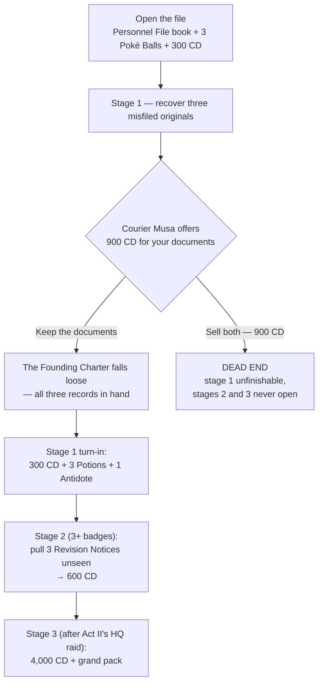

# Quests: Sango Town

> *"The grey suits came around again, asking after you by name. I told them I have never seen you before in my life. Now sit down, eat something — and then go see the Professor."* — Nalia, at her kitchen door

**Sango Town** is where you wake up, and it is the densest quest hub in the game — a whole neighborhood of jobs, favors, wagers, and paperwork before you ever see a gym. This page covers every quest that **starts inside Sango Town**. The road west is covered in **[[Quests Blossom Path]]**; the first gym town in **[[Quests Takehara Falls]]**. For the act-level overview, see **[[Guidebook Act I]]**.

**Status:** ✅ Done · 🚧 WIP (partial) · ❌ Not yet implemented — as of the 2026-07-21 audit.

> [!WARNING]
> **Spoilers — Act I Company presence, and one Act II gate.** Most Sango quests only show The Company's polite face. Two sections go further: **The Incomplete File** describes a stage that only unlocks in **Act II** (and a choice that can permanently lock you out of it), and **No Such Recipient** brushes the Act I erasure mystery. Those sections carry their own callouts.

> [!NOTE]
> **How quest pay works.** Most quest payments print a receipt with a rate line — the **Verified Rate**. As the CobbleDollar index destabilizes (every early gym badge shakes it; every liberated field steadies it), the rate falls as low as **75% of face value**. Battle prize money is always paid **in full**. Rewards below are marked *(Verified Rate)* or *(flat)* accordingly. Most receipts carry no letterhead; when The Company itself pays you, the receipt does — and those are called out.

### Training packs

Several quests pay a training pack on top of cash. The tiers:

| Pack | Contents |
|------|----------|
| **Minor** | 3× Exp. Candy XS + 1× Exp. Candy S |
| **Standard** | 2× Exp. Candy S + 1× Exp. Candy M |
| **Major** | 1× Exp. Candy L + 1 random vitamin (HP Up / Protein / Iron / Calcium / Zinc / Carbos) |
| **Grand** | 1× Rare Candy + 1× Exp. Candy XL + 1× PP Up + 1 random vitamin |

---

## Sango at a Glance

| Quest | Giver | Battles? | Repeatable | On the quest HUD |
|-------|-------|:--------:|:----------:|:----------------:|
| The Opening Chain | Nalia (Mom) + Prof. Acacia | no | one-time | yes (main line) |
| Dex-Unlock Partners | Prof. Acacia | no | one-time | yes |
| The Lane Looks After Its Own | Oma | no | one-time | yes |
| Pending Review | Imani (census desk) | no | one-time | no |
| Off the Record | Lucian Scrollkeeper | 4 battles | one-time | yes |
| The Incomplete File | Lucian Scrollkeeper | no | one-time | yes |
| No Such Recipient | Uncle Marlow | optional | one-time | yes |
| The Sango Classic (derby) | Deka | no | re-enterable | yes |
| Long-Term Growth Vehicle | Deka | no | one-time | no |
| The Waterside Invitational | Pondwarden Tayo | 3 rounds | purse one-time | yes |
| In-Kind Exchange | Old Sefu | no | one-time | no |
| Adjunct Faculty | Miri & Raan | no | one-time | no |
| Preferred Provider (clinic) | Dr. Asha | no | mixed | yes |
| Shops & Services | Pokémart / Dr. Asha | no | repeatable | no |

---

## The Opening Chain — Waking in Sango Town

> **Giver:** Nalia (Mom) at [2607.5 109 2847.5] and Professor Acacia at the Sango lab [2674.5 128 2901.5] · **No battles** · **One-time**

**How it starts:** Automatic. Mom spots you and walks up (she has eyes on the lane out to about 12 blocks) after you wake. Talk to her and pick *"I am ready to do something."*

### Walkthrough
1. **Talk to Mom.** She warns that grey-suited strangers have been asking after you **by name**, and sends you to Professor Acacia at the lab. The HUD walks every step from here.
2. **Visit Professor Acacia** at the Sango lab [2674.5 128 2901.5]. Press **"Choose a partner"** — three starter stand-ins appear beside her (once per world).
3. **Talk to one of the three stand-ins** — **Skiddo** (Grass), **Totodile** (Water), or **Hisuian Growlithe** (Fire) — and take your **Lv 5 partner**. The chosen stand-in departs; the other two keep waiting at the lab (see [Dex-Unlock Partners](#dex-unlock-partners--the-second-and-third-starter) below — nothing is missable).
4. **Talk to Acacia again** and press **"Take the Pokédex."** She tells you to fill it — 15 entries unlock a second partner, 30 the last — and to show your mother before leaving town.
5. **Return to Mom** and show her the Pokédex. Press **"Take the Running Shoes"**, then head west along Blossom Path toward Takehara Falls.

### Choices & consequences
- **Starter choice is not a trap.** The two you skip stay claimable later via the Pokédex ladder.
- Every step's **"Not just yet" / "Keep looking"** button just closes the dialog — no consequence.
- The **"Who were the people who found me?"** line on Acacia (and the stand-ins) opens the grey-suits lore branch. Free, and worth hearing.

### Rewards
- **Starter Pokémon at Lv 5** (Skiddo / Totodile / Hisuian Growlithe).
- **Pokédex.**
- **Running Shoes** — unbreakable leather boots, **+30% movement speed** while worn (walking in them is roughly vanilla sprint). No CobbleDollars anywhere in the chain.

> [!NOTE]
> The Growlithe **given** to you is genuinely **Hisuian**. The stand-in at the lab may render as a base-form Growlithe depending on your resource packs — the Pokémon in your party is the real thing.
>
> Mom's dialog keeps warming as your journey goes on — come back to the kitchen between badges. She keeps lying to the grey suits about you.

---

## Dex-Unlock Partners — the second and third starter

> **Giver:** Professor Acacia + the remaining starter stand-ins, Sango lab [2674.5 128 2901.5] · **No battles** · **One-time each**

**How it starts:** Automatic. When your Pokédex reaches **15 unique caught species**, the HUD line *"A second partner awaits — see Prof. Acacia"* lights. (Your caught count is checked every couple of seconds — a fresh catch registers almost immediately.)

### Walkthrough
1. Catch Pokémon until your Pokédex shows **15 unique caught species** (roughly post-gym-2 pace).
2. Talk to Acacia — **"See the partner"** unlocks the second choice.
3. Talk to either remaining stand-in and claim it at **Lv 25**.
4. Catch up to **30 unique caught species** (roughly post-gym-4 pace) and see Acacia again to unlock the last.
5. Claim the final stand-in at **Lv 40**. *The lab is empty now.*

### Choices & rewards
- Which leftover starter you take second vs third is **free choice** — the second claim is always Lv 25, the third always Lv 40, regardless of species.
- In a hardcore Nuzlocke these are the run's sanctioned **extra lives**: Lv 25 sits under the badge-2 cap (30), Lv 40 under the badge-4 cap (44).

> [!TIP]
> The starting level cap is **15** — Totodile's evolution at 18 is locked until your first badge. Plan your early team around the cap ladder (15 → 22 → 30 → …); see **[[Guidebook Act I]]**.

---

## The Lane Looks After Its Own — Oma's bread round

> ✅ **Done** · **Giver:** Oma, the widow at her fence on Nalia's lane (west gate) @ VERIFY · **No battles, no fail state** · **One-time** · HUD-tracked

**How it starts:** Talk to Oma and press **"Take the basket."**

### Walkthrough
1. **Deliver bread to Fara** at her spot on the lane [2632 112 2806]. She plants a small worry: her change came up one coin short at the money changer.
2. **Deliver to Kele at the water.** He offers a **free Eevee (Lv 5) with a boosted 1/20 shiny chance** — a foundling kit the lane can't keep, *"a hundred shapes sleeping in one small fox."* Optional; you can take just the bread.
3. **Deliver to Dakarai at the end house.** He presses **400 CD** (flat) into your hand.
4. **Return to Oma at the west gate:** *"Accept the care package."*

### Rewards
- En route: **400 CD** (flat) from Dakarai; optional **free Eevee Lv 5 (1/20 shiny)** from Kele.
- Care package: **3 Potions + 8 Oran Berries + 2 Poké Balls + 16 Bread + 200 CD** (flat — *"neighbor money"*, deliberately never skewed). The bread is from Nalia, handed over on her behalf.

> [!TIP]
> This is the densest free supply drop in Sango — roughly **600 CD** plus potions and balls for a walk down one lane. Do it first. Kele's gift is now a free **Eevee with a boosted (1/20) shiny chance** — so the Magikarp for [In-Kind Exchange](#in-kind-exchange--old-sefus-feebas-trade) (and the Victini flag) must be **bought from Deka** (500 CD).

---

## Pending Review — the census desk (sign or refuse)

> **Giver:** Imani, the Resident Verification Drive census taker, Sango town square (Elder Sentinel pays the refuse fork elsewhere in town) · **No battles** · **One-time** · Not HUD-tracked

**How it starts:** Talk to Imani. Say *"I do not have a name"* — your face *"resembles a profile the branch flagged once; head office closed that profile."* Then the Field Liability Policy is read to you.

### Walkthrough
1. **Hear the Field Liability Policy** — the hardcore + Nuzlocke ruleset delivered as HR-speak, read on behalf of Dr. Asha "in a medical voice." Section 4: a fainted partner is a non-recoverable asset. Section 7: fleeing surrenders one registered asset. Section 9: trainer death voids all coverage.
2. **Choose at the signature line:** *Sign the waiver* or *Refuse to sign*. Either way your file is "forwarded to the Takehara branch."
3. **If you refused:** the next time you talk to **Elder Sentinel**, he hands you his field kit unprompted — *"The old town does not sign."*
4. **Either fork:** return to the desk for the 3-question **satisfaction survey** (every answer is a flavor of "Very Satisfied") — small participation gift.

### Choices & consequences
| Fork | You get |
|------|---------|
| **Sign** | **Major pack + 500 CD** paid on **Company letterhead** (skew applies) + a Provisional Resident ID (keepsake paper) |
| **Refuse** | **Major pack + 2 Potions + 1 Antidote** from Elder Sentinel — deliberately balanced; refusing only costs you the 500 CD stipend and the ID |
| **Survey** (either fork) | 1× Exp. Candy XS |

> [!NOTE]
> While you're near the square: both town elders (Nuru and Sentinel) will talk old-town history for free — the founder-erasure pages (*"Why do you go pale when I say it?"*) are Sango's big early story beat and cost nothing.

---

## Off the Record — clearing the Company's lane crew

> **Giver:** Lucian Scrollkeeper, Sango lane between the lab and the west gate [2626.5 118 2776.5] — a quiet **"A word, off the record?"** button on his menu · **4 battles** · **One-time** · HUD-tracked

**How it starts:** After your **third gym badge**, Lucian has had enough of the grey suits working the Sango lanes. He asks you, off the record, to run **four Company agents** out of town. You battle each one; a defeated agent packs up and despawns for good.

### Walkthrough
1. **Tunde** — working the wheat field. Beat him and he clears out.
2. **Musa** — the courier at the cart. Beat him and the cart empties.
3. **The square auditors — Bomani and Jelani** — the two grey suits who patrol the census desk. Beat each in turn; both leave for good.
4. **Debrief at Lucian:** with all four gone, press *"Collect — off the record."*

### Rewards
- Debrief: **300 CD** *(Verified Rate)* + **standard pack**, always.
- **Clean-sweep bonus:** clear all four and Lucian hands over the *OFF THE RECORD* title card.

> [!NOTE]
> The surveyor **Binta** is **not** part of this quest — she stays the Company's watcher for [The Incomplete File](#the-incomplete-file--lucians-personnel-file) stealth stage.

---

## The Incomplete File — Lucian's personnel file

> **Giver:** Lucian Scrollkeeper [2626.5 118 2776.5] — walking within about 6 blocks of him auto-opens *"a vacuum in the file"* · **No battles** · **One-time** · HUD-tracked

> [!WARNING]
> **Spoilers: Act II.** This quest's final stage is gated behind the climax of Act II (the raid on Company HQ). It also contains the one choice in Sango that can **permanently** cost you the biggest payout in Act I. Read on informed.

This is the run-spine sidequest — Lucian opens a personnel file on the nameless stranger, and closing it takes the whole campaign.

### Walkthrough
1. **Open the file.** Press *"Open my file"* — you receive the **Personnel File** (a writable book that doubles as your run's death ledger: *"Section: Partners, Deceased. One page per loss. Remove none."*) plus **3 Poké Balls + 300 CD** *(Verified Rate — "a records-fee refund you never paid")*.
2. **Stage 1 — three misfiled originals:**
   - **Portrait Backing** — a chest on the Company courier cart at the north end of town; walk up to it at [2591 111 2815].
   - **Ledger Page** — a barrel by the farm fountain on the south side [2584 107 2925].
   - **Founding Charter** — held by Company courier **Musa**, camped beside that same cart [2592 111 2815]. See the fork below.
3. **Stage 1 turn-in:** with all three, *"Hand Lucian the three records"* — **300 CD** *(Verified Rate)* + **3 Potions + 1 Antidote** (she earmarks the antidote for Cicada's Scolipede).
4. **Stage 2 (requires 3+ badges):** pull **3 Revision Notices** — gym-entrance wall, shore-warehouse door, town-hall board — while the Company **Surveyor** (she patrols the Blossom Path side, 24-block sightline) does **not** see you holding a pulled notice. Getting spotted fires *LOGGED*, resets all three boards, and costs nothing — free retry, zero damage. Turn-in: **600 CD** *(Verified Rate)*.
5. **Stage 3 (after Act II's HQ raid):** *"Let her close the file"* — she files it *"under a name she declines to read aloud."* **4,000 CD** *(Verified Rate)* + **grand pack**.

### Choices & consequences

> [!CAUTION]
> **The courier's 900 CD offer is a permanent dead end.** With the Portrait Backing and Ledger Page in hand, Musa offers *"Sell both documents — 900 CobbleDollars"* (paid on Company letterhead). Take it and stage 1 can **never** be completed: no stage-1 payout, stages 2 and 3 never open, no grand pack, and the Founding Charter is lost. Lucian will only say: *"you had the whole of it in your hands, and chose the money."* Preserving pays **300 + 600 + 4,000 CD plus two training packs** — the sale is never worth it.

- **The preserve fork:** press *"Keep the documents"* — the Founding Charter falls loose from Musa's satchel. This is the path that keeps the whole chain alive.
- Lucian's desk is also the **turn-in point for most Company paper** you'll lift across Act I (Memo 44-C, the Dead Letter, route manifests, transition orders, quarterly minutes) — and her badge-gated lore shelf opens more pages as you progress.

---

## No Such Recipient — Marlow's dead letter

> **Giver:** Uncle Marlow, retired Company courier (31 years on the Sango route), mailbag by his door a few houses from Nalia's [2656.5 106 2897.5] · **Battles optional** · **One-time** · HUD-tracked

> [!WARNING]
> **Spoilers: Act I Company presence.** The delivery route crosses the Company checkpoint on Blossom Path.

**How it starts:** Talk to Marlow; press *"Take the dead letter to the archivist."* You receive the **Dead Letter** and Marlow warns about *"grey suits on Blossom Path."*

### Walkthrough
1. **Carry the Dead Letter toward Lucian** [2626.5 118 2776.5].
2. **The interception:** if you cross the **Voluntary Verification Checkpoint** on Blossom Path while carrying it, the agents flag you for *"unverified correspondence."* Your options: **surrender it**, **pay a 250 CD handling fee** (they stop flagging you; the letter stays yours), or **battle** (see [[Quests Blossom Path]] for the agents' teams — Lv 13–15, genuinely dangerous under the starting cap of 15).
3. **Deliver to Lucian** (or report the loss if you surrendered).
4. **Return to Marlow** — *"Tell Marlow how it ended."*

### Choices & consequences
| Fork | Outcome |
|------|---------|
| **Deliver** (sneak past, pay the fee, or beat both agents) | Lucian pays **300 CD** *(Verified Rate)* + **standard pack**; Marlow's thanks: **Wingull Lv 12** (*"the last flier on the Sango route"*) + **2 Antidotes** |
| **Surrender at the checkpoint** | Quest still closes — Marlow pays the courier's due: **150 CD** *(Verified Rate)* + **2 Antidotes**. The cautious hardcore play is never punished — but you forfeit the Wingull |

---

## The Sango Classic — the fishing derby

> ✅ **Done** · **Giver:** Deka, the derby keeper at the Sango fishing pond [2570.5 111 2856.5] · **No battles** · **First win one-time, re-enterable after** · HUD-tracked

**How it starts:** Talk to Deka. Take his **free spare fishing rod** first (one-time offer — this also lights the HUD hint), then press **"Enter the Classic — 150 CD."**

### Current rules
- Entry: **150 CD** per attempt.
- Timer: **95 seconds** — about a minute and a half (a notched "THE SANGO CLASSIC" bossbar, with warnings at 60/30/10 s).
- Goal: hand in **3 fish** before the bar empties. **Cod, salmon, pufferfish, and tropical fish all count**, in any mix.
- The count is taken **from your inventory at hand-in**, not at the moment of catch — return to Deka while the timer runs and press *"Hand in the catch."* Fewer than 3 shows your count and lets you keep casting.
- A win removes **exactly 3 fish** (cod first, then salmon, pufferfish, tropical).
- Only one quarter runs at a time.

### Rewards
| Result | Payout |
|--------|--------|
| **First win** | **500 CD** *(Verified Rate)* + **major pack** + **Poké Rod** + 2 Poké Balls + 5 Oran Berries — *RECORD QUARTER* |
| **Repeat wins** | **200 CD** *(Verified Rate)* against the 150 entry — a ritual purse, not a money printer |
| **Timeout** | Lose only the entry fee; free re-entry, zero damage |

> [!NOTE]
> The entry fee comes out of whatever you have — your balance stops at zero, it never goes negative. The champion's bonus ball is deliberately *not* here; the [Invitational](#the-waterside-invitational--the-pondside-tournament) hands out a **Net Ball**.

---

## Long-Term Growth Vehicle — Deka's "other fish"

> **Giver:** Deka (the Magikarp-salesman side of the same NPC), Sango pond [2570.5 111 2856.5] · **No battles** · **One-time** · Not HUD-tracked

**How it starts:** From Deka's menu, press **"Ask about the other fish."**

1. Hear the pitch: *"a long-term growth vehicle, fully verified by me; past performance no guarantee of future results."*
2. **"Buy the growth vehicle — 500 CD":** you receive a **Magikarp Lv 5** and **1 Oran Berry** (*"complimentary onboarding berry"*).
3. Post-sale the button becomes *"How is my investment doing"* — a permanent no-refunds page.

**Fork:** *"Just the derby, thanks"* declines with no consequence; the offer stays open.

> [!TIP]
> **Deka's 500 CD Magikarp is now the only Magikarp source** (Kele's lane gift became an Eevee). You need it for Old Sefu's trade **and** for the Victini flag — his sales pitch is a joke you pay to be in, but there is no free fish anymore. (Gyarados at 20, though. *"At level twenty you will name a lake after me."*)

---

## The Waterside Invitational — the pondside tournament

> **Giver:** Pondwarden Tayo at the waterside signup desk; barked around the pond by **Kofi**, the wandering crier · **3 battle rounds** · **Purse one-time; the final is refightable** · HUD-tracked
>
> *Reskinned in 0.5.0-alpha.4: Sango is savanna, so the "shorefront/docks/harbour" dressing became a pondside lakeshow — Harbourmaster Tayo → **Pondwarden Tayo**, Dockhand Lumo → **Reedhand Lumo**. The event stays in Sango (it is level-locked to Act 1); a separate cap-58 Gaviota fishing hub is planned later.*

**How it starts:** Talk to Tayo and press **"Pay the 150 CD entry."** (Kofi's bark says "two rounds" — he undersells it. The bracket is three.)

### The bracket
| Round | Opponent | Team | Prize *(flat)* |
|:-----:|----------|------|:--------------:|
| 1 | Reedhand **Lumo** — first along the bank [2604 110 2822] | Wingull Lv 8, Magikarp Lv 9 | 100 CD |
| 2 | Net-Mender **Kima** — mid-bank | Corphish Lv 10, Shellos Lv 11 | 150 CD |
| Final | Pondwarden **Tayo** | Tentacool Lv 12, Krabby Lv 13 | the champion purse (below) |

### The champion purse
Beat Tayo in the final and he pays out **on the spot** — no envelope to collect, no podium, no liaison to chase across town. Press **"Take the champion purse"** right there at the pondside:

- **Major pack** + **600 CD** paid on **Company letterhead** + **1 Net Ball** + **2 Exp. Candy XS**.
- The purse arrives *"exactly three percent light."* That is not a joke line — it is the Verified Rate landing on a Company payout, visibly.

### Choices & notes
- Asking Tayo *"The purse was light"* earns a perfectly circular non-explanation.
- Tayo will *"Run the final back"* any time (weekly-ladder flavor) — refightable, but the purse is claimed once.
- Walk away whenever you like — *"the water does not hold grudges and neither does the bracket"* — but the entry is not refunded.
- All three rounds sit at Lv 8–13, comfortably under the starting cap of 15.

---

## In-Kind Exchange — Old Sefu's Feebas trade

> **Giver:** Old Sefu, retired angler, by the pond (he wanders the waterside) · **No battles** · **One-time** · Not HUD-tracked

**How it starts:** Talk to Sefu; press **"Trade your Magikarp for the Feebas."**

1. Hear the pitch: one joke fish for another — *"the only kind of exchange the Company cannot see."* Zero CobbleDollars change hands, by design.
2. Confirm the trade: your **Magikarp is removed** from your party and **Feebas Lv 10** takes its place.

**Reward:** Feebas Lv 10 — the start of a Milotic project. Costs nothing (but your Magikarp).

> [!NOTE]
> **Fixed in 0.5.0-alpha.4:** the trade now genuinely **takes the Magikarp** — it uses the mod's species-verified `trade` command (Cobblemon API), which finds the Magikarp in *any* party slot, removes exactly it, and no-ops safely if you have none. Was honor-system before. The Magikarp comes from **Deka's 500 CD sale** — Kele's lane gift is an Eevee now, so there's no free one.

---

## Adjunct Faculty — the defunded lab assistants

> **Givers:** Assistant **Miri** (collections — house near the shore) and Assistant **Raan** (geology — the rocky inland edge) · **No battles, no fail states** · **One-time each** · Not HUD-tracked

Two independent fetch quests. Their grant *"went in for verification and came back as a very polite silence."*

1. **Miri:** gather **16 kelp** from the shallows off the Sango shore; press *"Hand over 16 kelp."*
2. **Raan:** gather **16 coal + 8 raw iron** from the caves; hand in coal and iron separately (any order), then press *"Collect the survey fee."*

**Rewards:** each assistant pays identically — **minor pack + 250 CD** *(Verified Rate)*. **500 CD and two packs total** for both.

> [!NOTE]
> The hand-in buttons unlock while you are actually holding the goods. Both assistants mention a third colleague and a completion bonus "when all three of us have our samples" — no third assistant currently exists; the 250 CD each is the real money.

---

## Preferred Provider — Dr. Asha's clinic

> **Giver:** Dr. Asha, the Sango clinic [2677.5 118 2931.5], up the way from the lab · **No battles** · **Supply run one-time; prescription daily; heals repeatable** · HUD line: *"Clinic list: 1 oran, 1 pecha, 1 cheri"*

**How it starts:** Talk to Dr. Asha, *"Ask about the empty shelf"* (her supplier was "consolidated for verification"), then *"I will gather the berries."* Healing is available from the very first conversation.

### Walkthrough
1. **Healing (always):** *"Heal my team — 100 CD."* Full party heal, flat fee. This one **is** balance-checked: an empty wallet gets *"Payment declined. The Center does not extend credit."* and no heal.
2. **Supply run:** forage **Blossom Path** for **1 Oran + 1 Pecha + 1 Cheri berry** — one of each. Hand all three in with a single button.
3. **"Take the clinic bundle"** once the berries are shelved.
4. **Daily prescription:** stocking the shelf unlocks *"Collect the daily prescription"* — **1 Potion per day**, forever. This is the run's only sanctioned daily item drip.

### Rewards
- Bundle (one-time): **4 Potions + 2 Antidotes + 1 X Defence + minor pack + 250 CD** *(Verified Rate)*.
- Prescription: **1 Potion/day**.
- Heals: cost **100 CD** each — the same fee as Nurse Lila in Takehara and the Hua Zhan nurse.

> [!TIP]
> The clinic sells nothing, and potions cost 300 CD at the mart while quests pay 200–600 CD — in this economy, **consumables come from quests, not shops**. Keep the clinic stocked and collect the prescription whenever you pass through.

---

## The Silent Apprentice — Kesi's boy at the tower *(hidden — Victini)*

> **Giver:** Kesi at the granary points you to him · **Hidden secret** · One-time · Not HUD-tracked

Kesi, who owns the Sango granary (his family's — *not* the Company's), keeps a quiet apprentice named **Victor** at the top of the old grain tower. The boy has never spoken a word, but the harvest has been unnaturally good since he arrived. Climb up and Victor says nothing — he only studies you a moment, or looks straight through you.

Victor is **Victini in hiding**, and he reveals himself only to someone who walked Sango clean of the Company. With **all** of the following done, talking to Victor transforms him — he despawns in a flourish, a Victini appears in his place, and taking its hand adds **Victini at Level 15** to your party:

- Heard about him from **Kesi** — ask *"Lucky how?"* at the granary
- Completed **[The Incomplete File](#the-incomplete-file--lucians-personnel-file)** — filed the founder's papers with Lucian instead of selling them to the courier
- Completed **[The Lane Looks After Its Own](#the-lane-looks-after-its-own--omas-bread-round)**
- **Refused** the census at **[Pending Review](#pending-review--the-census-desk-sign-or-refuse)**
- **Bought Deka's Magikarp** (500 CD) — faith in a fish the world calls worthless, the same "worth from worthlessness" that Victini itself is

Sell the papers or sign the census and Victor stays silent forever. Victini is the reward for siding **fully** against the Company across Sango *and* believing a worthless thing can be a Victory. **Elder Nuru** gives a token **3 oran berries** for the anti-Company trio alone (papers / lane / census — she does not care about the fish): deliberately underwhelming, because the real prize is the one nobody tells you about.

> [!NOTE]
> *Testing aid:* `/cobblemon-initiative debug victini` (OP-only) prints a ✔/✗ for each of the **five** conditions and the overall verdict. Gate revised in 0.5.0-alpha.4 onto the three accessible anti-Company quests (was tied to Off the Record, which is easy to miss) plus the Kesi hint and the Magikarp-faith flag.

---

## Sango Shops & Services

> **Where:** the Sango Pokémart (the resident Meowth marks it) · **Repeatable** · This is the money **sink**

Baseline day-one stock and prices:

| Item | Price (CD) |
|------|:----------:|
| Poké Ball | 2,000 |
| Cherish Ball | 2,000 |
| Premier Ball | 2,000 |
| Potion | 300 |
| Super Potion | 700 |
| Antidote | 250 |
| Paralyze Heal | 250 |

- **The starter mart sells only these three balls** — Poké Ball, Cherish Ball, and Premier Ball. **Heal Balls and Safari Balls are never stocked, at any tier.**
- **Stock re-tiers on every gym win:** Great Balls at badge 1 (6,000), Ultra/Dusk/Quick/Timer/Repeat/Dive at badge 2 (8,000–10,000), apricorn balls at badge 3 (6,000), and so on.
- **Prices ride the instability index:** roughly **+0.5% per index point**. The index climbs +8 with each early gym badge — **buying early is literally cheaper** — and liberating fields later claws it back.
- Planning baselines: heal **100 CD**, Poké Ball **2,000 CD**, Potion **300 CD**.

---

## See also

- **[[Quests Blossom Path]]** — the road west: the checkpoint, the census meadow, the courier race, and the route battles.
- **[[Quests Takehara Falls]]** — gym 1 and the falls-town quest slate.
- **[[Guidebook Act I]]** — the act-level walkthrough and Nuzlocke cautions.
- **[[Commands]]** — quest HUD toggles (`/ca quest show|hide|refresh`).
