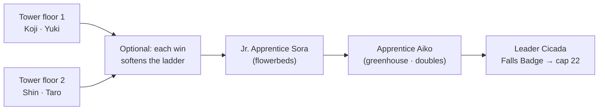

# Quests: Takehara Falls

> *Record under audit. Plinth pending re-verification. Asset under valuation. Every notice in this town is stapled over something older — and the paper underneath is always more interesting.*

**Takehara Falls** is the first gym town of the run — a waterfall town with a bug gym, a museum with an empty plinth, an apiary the Company already bought, and a print stall that refuses to stay covered. You arrive with a level cap of **15**; the **Falls Badge** raises it to **22**.

This page lists every quest and paid encounter in and around Takehara Falls. For where the town sits in the campaign, see **[[Guidebook Act I]]**. Coming from Sango? The road quests are on **[[Quests Blossom Path]]**; the road *out* of town is **[[Quests Harvest Road]]**.

> [!WARNING]
> **Spoilers — Act I.** This page documents The Company's presence around Takehara Falls — field agents, a canvasser, and an audit or two. Nothing beyond Act I is spoiled.

> [!NOTE]
> **How rewards are listed.** Battle prize money is paid **flat** — trainers pay exactly what they promise. Quest payouts route through a paymaster that prints a receipt and pays the **Verified Rate**: 75–100% of face value, depending on how unstable the CobbleDollar index currently is. Amounts below are face value. Most receipts are unbranded; the handful that arrive on Company letterhead are worth reading twice.
> **Training packs:** *minor* = 3× Exp. Candy XS + 1× Exp. Candy S · *standard* = 2× Exp. Candy S + 1× Exp. Candy M · *major* = 1× Exp. Candy L + 1 random vitamin (HP Up / Protein / Iron / Calcium / Zinc / Carbos).

---

## Quest index

| Quest | Giver | Kind | Tracked on HUD | Headline reward |
|-------|-------|------|:--:|-----------------|
| [The Brood Tower (Gym 1)](#gym-1--the-brood-tower-falls-badge) | Leader Cicada | gym ladder | main quest | **Falls Badge → cap 22**, 1200 CD |
| [Performance Review](#performance-review-ghost-or-sweep--the-hidden-gym-meta) | *(nobody announces it)* | hidden stealth meta | hidden | 400–600 CD + gear |
| [Cascade Ascent](#cascade-ascent) | Falls Warden Shou | timed climb | yes | 500 CD + major pack |
| [Quarterly Sprint](#quarterly-sprint) | Petal Courier Mio | timed race | yes | 500 CD + major pack |
| [Sting Operation](#sting-operation-asset-under-valuation) | Beekeeper Tomo | walk + optional battle | yes | 350 CD + hive goods |
| [Notice of Non-Compliance](#notice-of-non-compliance) | Printmaker Mei | stealth pasting | yes | 400 CD + Heal Ball |
| [Natural History](#natural-history-museum-bones--fossil-revival) | Curator Kenji + Sayuri | dig & donate | yes | 400 CD + one fossil revival |
| [Stakeholder Alignment](#stakeholder-alignment-the-mayors-roof) | *(roof scene)* | doubles battle | no | 460 + 600 CD |
| [Sweetwater Futures](#sweetwater-futures-beekeeper-masumi) | Beekeeper Masumi | fetch | no | 300 CD + a queen Combee |
| [The De-Acquisition Desk](#the-de-acquisition-desk-trader-mayu) | Trader Mayu | trade | no | Elekid Lv 12 |
| [Out of Office](#out-of-office-fisherman-genji) | Fisherman Genji | fetch + wager | no | Poké Rod + 300 CD |
| [Canvasser Patrol](#canvasser-patrol-kazuo) | Kazuo | optional battle | no | 280 CD |
| [Nurse Lila](#nurse-lila--paid-heal) | Nurse Lila | service | — | full heal, costs 100 CD |

> [!TIP]
> **Level context.** Everything in town fights at Lv 9–17 against your starting cap of **15** — Cicada's ace is Lv 17, so the leader is fought *over* your cap. That is by design: every leader on the route sits at your entry cap + 2.

---

## Gym 1 — The Brood Tower (Falls Badge)

|  |  |
|---|---|
| **Giver** | Leader Cicada; the Takehara Gym Guide explains the rules |
| **Location** | Gym tower floors 1–2 at [2055 138 2428]–[2055 151 2501]; garden ladder outdoors — Sora [1903 109 2521], Aiko [1904 109 2521], Cicada [1910 109 2524] |
| **Start** | Talk to any of them — Cicada's own greeting spells out the ladder: *the tower, then Sora, then Aiko, then me* |
| **Repeatable** | One-time |
| **Tracker** | Main quest line — *Defeat the Takehara Falls Gym* |

### The ladder

| Stage | Trainer | Team | Levels |
|-------|---------|------|:------:|
| Tower, floor 1 | Bug Catcher Koji [2055 138 2428] | Caterpie, Weedle | 9 |
| Tower, floor 1 | Entomologist Yuki [2055 138 2501] | Spinarak, Ledyba | 9 |
| Tower, floor 2 | Bug Maniac Shin [2055 151 2428] | Nincada, Surskit | 10 |
| Tower, floor 2 | Youngster Taro [2055 151 2501] | Burmy, Combee | 10 |
| Jr. Apprentice | Sora — among the flowerbeds | Beedrill, Beautifly | 12 |
| Apprentice | Aiko — greenhouse center *(doubles: four partners, two at a time)* | Butterfree, Beedrill, Yanma, Ninjask | 14–15 |
| **Leader** | **Cicada** — the arena up the falls | **Scolipede, Heracross (Lum Berry), Vespiquen (Leftovers), Yanmega (Choice Scarf)** | **16–17** |

### Walkthrough

1. *(Optional)* Talk to the **Gym Guide** for the badge / level-cap / hardcore briefing.
2. *(Optional)* Climb the gym tower. Every tower trainer you beat **drains the ladder above**: one win and Sora's team fights with its training potential zeroed; two and Aiko's does; all four and Leader Cicada's own team comes in drained. Skip the tower entirely if you want the ladder at full strength — or sweep it for the bonus (see [Performance Review](#performance-review-ghost-or-sweep--the-hidden-gym-meta)).
3. The apprentices are **not in the gym** — beat **Jr. Apprentice Sora** in the flowerbeds (singles), then **Apprentice Aiko** in the greenhouse center (doubles).
4. Challenge **Leader Cicada** at the arena up the falls. She carries **3× Full Restore** — chip damage alone will not close it, and her Lv 17 Yanmega on a Choice Scarf outspeeds anything at your cap.

### Rewards

- **Tower trainers:** 2× Potion each. **Sora & Aiko:** 2× Super Potion each.
- **Cicada:** **1200 CD** prize (flat) + the **Falls Badge**:
  - Level cap rises to **22**.
  - The Poké Mart's badge-1 shelf opens (Great Balls and better stock).
  - Your first **memory fragment** fires — *"...have we met before?"*
  - The CobbleDollar index takes its first knock (**instability +8**) — the Company reacts to losing a town. Watch the yellow rate line on your next quest receipt.

### Forks

- The tower gate is **any 2 of 4** — you may skip two tower trainers entirely.
- No other branches; the ladder order (tower → Sora → Aiko → Cicada) is enforced by each trainer's willingness to fight.

---

## Performance Review (Ghost or Sweep) — the hidden gym meta

|  |  |
|---|---|
| **Giver** | Nobody announces it — the four tower trainers double as watchers, and the result resolves itself |
| **Location** | The gym tower; the Sweep bonus is claimed at the Gym Guide |
| **Start** | Automatic — it is running the moment you set foot in the tower |
| **Repeatable** | One-time |
| **Tracker** | Hidden (a red **EYES ON YOU** warning flashes each time you're spotted) |

The tower trainers are also **sight sentries**. Every time one of them gets eyes on you, the engagement *goes on the books* — an on-screen warning tells you so. The count is final the moment the Falls Badge lands (nobody can see into Cicada's chamber).

### The two outcomes

- **GHOST** — you beat Cicada without a single sentry ever seeing you: the **Silent Stakeholder** cache lands in your bag automatically. 1× Dusk Ball + the **Auditor's Lens** (a spyglass — *"Sees everything. Reports nothing."*) + **400 CD** (Verified Rate) + a major training pack.
- **SWEEP** — you were seen, but you cleared **all four** tower trainers: ask the Gym Guide about the **Verification Bonus** after the badge. **600 CD** (Verified Rate) + 4× Exp. Candy XS + a major training pack.

The two are mutually exclusive and deliberately equal in value — audit-proof stealth and a full ladder clear are both "compensable performance."

> [!NOTE]
> **As shipped:** two pieces of this quest are still being wired. The Gym Guide's Verification Bonus offer is not yet reachable in the current build, and in a world where the tower watchers haven't been armed by the showrunner, nobody is ever marked as seen — every player Ghosts by default.

---

## Cascade Ascent

|  |  |
|---|---|
| **Giver** | Falls Warden Shou |
| **Location** | The Plunge Pool at the base of the falls; the finish is a marker at the crest |
| **Start** | Talk to Shou → *Attempt the Ascent — ninety seconds* |
| **Repeatable** | First clear one-time; a 60-second **gold run** repeats after it |
| **Tracker** | Yes — *Base to crest before the clock dies* |

### Walkthrough

1. Talk to Shou at the plunge pool. (Ask about the record board — the standing record is marked **RECORD UNDER AUDIT**, and its holder apparently *never existed*.)
2. Start the **90-second climb**. A countdown bar runs with audio pings at 60/30/10/5/3/2/1s. The course is built so every missed jump lands in water — no fall damage.
3. Reach the crest marker before the clock dies.
4. Time out = free retry. No teleport, no damage, no cost — walk back down and go again.
5. After your first clear (and with at least one badge), Shou offers the **gold time**: the same climb in **60 seconds**, repeatable.

### Rewards

- **First clear:** **500 CD** (Verified Rate receipt) + major training pack + 2× Super Potion + 1× Emerald (*"the color of the Takehara badge"*).
- **Gold run (repeatable):** **300 CD** (Verified Rate), money only — no repeat items.

> [!NOTE]
> The gold-time victory line congratulates you on behalf of "Ayame" — the warden's nameplate reads **Shou**. Known naming bug. Also, the crest marker is placed per-world by the showrunner; if the start warns loudly that no finish exists, that world isn't set up yet.

---

## Quarterly Sprint

|  |  |
|---|---|
| **Giver** | Petal Courier Mio |
| **Location** | Starts at the Sango-side mouth of Blossom Path (start line ~[2505 71 2850]); finishes at the **delivery bell** at the Takehara arch [1924 110 2584] |
| **Start** | Talk to Mio → *Race the bell* (always free to enter) |
| **Repeatable** | First win one-time; a paid **morning route** repeats once per day |
| **Tracker** | Yes — *Ring the bell at the Takehara arch* |

### Walkthrough

1. Take the race at the start line. A **180-second** countdown bar starts (pings at 60/30/10/5/3/2/1s).
2. Run the ~580-block Blossom Path route west and enter the bell zone at the Takehara arch before the bar drains.
3. Make it → **DELIVERED**. Miss it → you're teleported back to the start line, nothing lost, free retry.
4. After the first win, Mio offers *Run the morning route — 150 CD purse*, once per Minecraft day (resets at dawn).

### Rewards

- **First win:** **500 CD** (Verified Rate) + 2× Exp. Candy XS + 1× Heal Ball + major training pack.
- **Daily rematch:** **150 CD** (Verified Rate) — deliberately below the cheapest trainer prize, so it never becomes a money printer.

> [!CAUTION]
> Blossom Path is **not** a safe zone. Wild encounters and the verification checkpoint sit directly on the racing line — in hardcore Nuzlocke, *that* is the real difficulty of a 3-minute sprint. See **[[Quests Blossom Path]]** for what's waiting on the route.

---

## Sting Operation (Asset Under Valuation)

|  |  |
|---|---|
| **Giver** | Beekeeper Tomo |
| **Location** | The hive trees at the Blossom Arch — Takehara end of Blossom Path [~1920 105 2570] |
| **Start** | Talk to Tomo → *Walk the hive line* |
| **Repeatable** | One-time (plus a one-time post-badge follow-up) |
| **Tracker** | Yes — *Walk the four seals with Tomo* |

The Company stapled **"asset under valuation"** seals to Tomo's hive trees. He'd like them off.

### Walkthrough

1. Pry **seal one** (the first tree), **seal two** (the barcoded landing board), and **seal three** (the "productive partnership" print) — in order, with Tomo. You can leave and resume at any seal.
2. **Seal four is guarded.** An Asset Valuation Field Agent stands in front of it. Clear him one of two ways (below), then pry the seal.
3. Behind seal four: **Field Memo 7-12** — honey **REJECTED** (*"assets mobile and armed"*), a different crop **APPROVED** (*"proceed to Hua Zhan"*). Take it; it's a keepsake, and it's the run's first written pointer at what the Company is actually planting.
4. Turn in with Tomo.
5. **After you beat Cicada**, come back once more for the *first harvest of the free market*.

### Forks

- **Fight the Field Agent** — Poochyena 12 / Grimer 13. Prize **280 CD** flat + 2× Poké Ball.
- **Cite his own do-not-disturb notice back at him** — a talk-past. No battle, no prize, same result.

### Rewards

- **Main turn-in:** **350 CD** (Verified Rate) + 3× Honey Bottle + 8× Honeycomb + 2× Potion + standard training pack.
- **Post-badge follow-up:** **350 CD** (Verified Rate) + 4× Honey Bottle + 8× Honeycomb.

> [!NOTE]
> No gift Pokémon here — the Combee lives with [Beekeeper Masumi](#sweetwater-futures-beekeeper-masumi) instead.

---

## Notice of Non-Compliance

|  |  |
|---|---|
| **Giver** | Printmaker Mei |
| **Location** | Print stall by the gym entrance, in eyeshot of the canvasser's patrol loop |
| **Start** | Talk to Mei → *Take the three moth prints* |
| **Repeatable** | One-time |
| **Tracker** | Yes — *Paste three moth prints unseen* |

The Company glued **"Verified Trust, Verified Value"** notices over Mei's moth-wing prints at three spots in town. She wants her art back up — while the Company's canvasser isn't looking.

### Walkthrough

1. From Mei's counter, watch **Kazuo the canvasser** walk his loop (gym entrance → falls overlook → bridge).
2. When his eyes are elsewhere, paste **print one** (gym entrance), **print two** (falls overlook), **print three** (bridge mural) — the checks happen at the moment you commit each paste.
3. Caught mid-paste? He lectures you, the paste is voided, and you retry freely. Nobody gets hurt over paper — but a scolding does cost you the "clean run" flourish.
4. All three up → collect pay from Mei. Under board three, the old bridge mural shows a **face painted out twice**; the print guild's ledger page for that year is missing. File that away.

### Forks

- **Clean run vs. scolded run** — *identical payout*, different turn-in dialogue. The stealth is for pride (and the audience).

### Rewards

- **400 CD** (Verified Rate) + 3× Potion + 1× Heal Ball + standard training pack.

> [!NOTE]
> **As shipped:** the stealth check only bites once the canvasser is placed and watching in your world — in an unprepared world every paste counts as unseen. The tracker waypoint for this quest also currently points at ground level (y 64) rather than the town terraces; trust the descriptions, not the marker.

---

## Natural History (museum bones + fossil revival)

|  |  |
|---|---|
| **Giver** | Curator Kenji (brush, directions, revival bench); **Sayuri** takes the donation by the bone statue [~1870 114 2330] |
| **Location** | Takehara Museum of Natural History [1902 114 2337]; dig site on the strata shelf below the falls |
| **Start** | Talk to Kenji → *Take the field brush* |
| **Repeatable** | One-time (donation and revival each) |
| **Tracker** | Yes — *Six bones complete the exhibit* |

The museum's centerpiece plinth was relabeled **PENDING RE-VERIFICATION** by head office. The curator would like a skeleton that head office cannot repossess.

### Walkthrough

1. Take the **field brush** from Kenji; he points you to the soft pale gravel on the strata shelf below the falls.
2. **Brush the dig site** — a ring of 10 suspicious gravel. Most blocks yield bones or pottery sherds; four fossil types (Dome, Claw, Cover, Armor) are the rare pulls. Blocks do **not** regenerate.
3. Bring **six bones** to **Sayuri** by the bone statue → *Donate six specimen bones*. Short of six, she counts twice and sends you back — nothing is consumed.
4. *(Optional)* **Fossil revival** at Kenji's bench: bring a **Dome** or **Claw** fossil. *"The board authorizes one de-extinction per fiscal era."*

### Forks

- **Dome Fossil → Kabuto Lv 10** or **Claw Fossil → Anorith Lv 10** — mutually exclusive, one revival per run.
- **Cover/Armor fossils:** hold them. The lab that reads those plates is in Cyber City, six badges up the road.

### Rewards

- **Donation:** **400 CD** (Verified Rate) + standard training pack + 2× Poké Ball.
- **Revival:** the fossil is consumed; Kabuto **or** Anorith joins at Lv 10.

> [!NOTE]
> The dig site is placed per-world by the showrunner (and can be refreshed with a new ring once mined out). Two small shipped quirks: the short-count line calls the curator "Tamiko" (his nameplate is Kenji), and a couple of Sayuri's *ask-about* buttons may open nothing — the answers live with Kenji.

---

## Stakeholder Alignment (the mayor's roof)

|  |  |
|---|---|
| **Giver** | Nobody — you walk in on it. Two grey suits, **Noboru** [2014 169 2466] and **Chiyo** [2014 169 2464], flanking the Mayor |
| **Location** | The gym roof balcony |
| **Start** | Climb to the roof and talk to Noboru → *Step between the suits and the mayor*. Available from the moment you arrive — no badge needed |
| **Repeatable** | One-time |
| **Tracker** | No |

A *closed stakeholder alignment session*: an eleven-page proposal to divert the falls into "certified irrigation channels" for agricultural yield optimization, and a mayor being talked into signing it.

### Walkthrough

1. Opt into the **doubles battle** against the two Site Assessors — they fight as one team: Zubat 13 / Meowth 14 / Grimer 14 / Drowzee 15.
2. Win, and both suits clear out of town for good.
3. Talk to the Mayor → *Accept the thanks of Takehara Falls*. His parting line is worth hearing: the delegation heading to the next city *"signed their water over months ago."*

### Forks

- *Back down the stairs* — declining leaves the scene waiting. No fail state.
- The Mayor's *Keep it for the town* defers his thanks — claimable any time later.

### Rewards

- **Battle:** **460 CD** flat.
- **Mayor's thanks:** **600 CD** (Verified Rate) + major training pack + 2× Super Potion + 1× Great Ball.

> [!TIP]
> Noboru does a double-take mid-negotiation — *"Do I know you from somewhere? ...never mind what the memo said."* The recognition flickers start here and only get louder. See **[[Guidebook Act I]]**.

---

## Sweetwater Futures (Beekeeper Masumi)

|  |  |
|---|---|
| **Giver** | Beekeeper Masumi |
| **Location** | The Terrace Apiary [~1835 105 2483] — her Combee companion marks the spot |
| **Start** | Talk — the turn-in unlocks once you're holding 8 honeycomb |
| **Repeatable** | One-time |
| **Tracker** | No |

Two Field Agents forward-purchased Masumi's **entire hive yield in perpetuity**. Nobody contracted the *wild* nests.

### Walkthrough

1. Shear **8 honeycomb** — easiest from the two smoke-calmed nests over her terrace campfires; more hang wild along Blossom Path (spiders after dark).
2. Hand them over. The town's honey orders go out under the table.
3. Then the real offer: her contracted hives *"can no longer legally house a second queen."* → **Take in the queen** — a **female Combee, Lv 12**, joins your team. Deferrable with *Not yet — my team is full*; the offer keeps until taken.

### Rewards

- **Turn-in:** consumes 8× Honeycomb; pays **300 CD** (Verified Rate) + standard training pack.
- **The queen:** female Combee Lv 12 — the **Vespiquen** line, precious in a hard run. (Cicada's own Vespiquen hatched on this terrace.)

---

## The De-Acquisition Desk (Trader Mayu)

|  |  |
|---|---|
| **Giver** | Trader Mayu — ex-Company procurement |
| **Location** | The Falls Bridge |
| **Start** | Talk — one listing today: your Paras for her Elekid |
| **Repeatable** | One-time |
| **Tracker** | No |

Mayu names ex-contract Pokémon for the line item that bought them. The Elekid is called **Surcharge** — *"he came with hidden costs"* — collateral on a power contract out of Cyber City.

### Walkthrough

1. Agree to the exchange. She doesn't take handoffs — she *witnesses departures*: open your party and **release your Paras** back to the falls yourself.
2. Confirm the release → **Elekid Lv 12** joins.

### Rewards

- Elekid Lv 12. No money.

> [!NOTE]
> The Paras side of the trade is **honor-system** — nothing verifies you owned or released one. It's your run; the audience is watching.

---

## Out of Office (Fisherman Genji)

|  |  |
|---|---|
| **Giver** | Fisherman Genji — ex-Company auditor, *"made redundant by the water"* (his Psyduck idles nearby, [~1893 105 2470]) |
| **Location** | The Plunge Pool |
| **Start** | Talk — bring him 8 string and he restrings two rods, one for you |
| **Repeatable** | Rod one-time; the wager repeats until you win it |
| **Tracker** | No |

### Walkthrough

1. Farm **8 string** from Blossom Path spiders after dark.
2. Hand them in (short counts get a recount) → your rod + pay.
3. With the rod done, his **200 CD friendly wager** opens: his two river-dwellers (Poliwag 13 / Goldeen 13) vs. your team. *"One wager a visit."*

### Forks

- **Take the wager** — 200 CD at risk both ways. Lose and he keeps the stake (*"a consulting fee. No hard feelings, and no refunds"*) — but you can re-wager on a later visit. **Win once** and the offer permanently retires into ledger talk.
- Decline and stay friends.

### Rewards

- **Rod turn-in:** consumes 8× String; gives 1× **Poké Rod** + **300 CD** (Verified Rate) + standard training pack.
- **Wager win:** **200 CD** flat.

---

## Canvasser Patrol (Kazuo)

|  |  |
|---|---|
| **Giver** | Kazuo — the Company canvasser whose notices you may have been peeling |
| **Location** | Patrol loop: gym entrance → falls overlook → bridge, sweeping past Mei's stall |
| **Start** | Talk to him (he also happens to be the live obstacle for [Notice of Non-Compliance](#notice-of-non-compliance)) |
| **Repeatable** | Battle one-time; the "fee" is not gated |
| **Tracker** | No |

### Forks

- ***Answer for the postings*** — an opt-in battle, only offered **after you hold the Falls Badge**. Meowth 13 / Koffing 14, prize **280 CD** flat, one win only. He does **not** leave town after losing — the patrol (and Mei's stealth game) continues.
- ***Purchase administrative clearance — 150 CD*** — a fee for a polite line. Pure flavor.
- Say nothing and move on.

> [!WARNING]
> The 150 CD clearance is a **cost with no gate**: the button can be pressed repeatedly, and it "succeeds" even if your wallet can't cover it. There is nothing to buy here. Spend it on Potions.

---

## Nurse Lila — paid heal

|  |  |
|---|---|
| **Giver** | Nurse Lila, Pokémon Center (a Chansey wanders the lobby, [~1900 113 2609]) |
| **Location** | Takehara Falls Pokémon Center |
| **Start** | Talk → *Heal my team — 100 CD* |
| **Repeatable** | Always |
| **Tracker** | — |

A full party heal for a flat **100 CD**. The charge is real and checked — a broke player gets *"Payment declined. The Center does not extend credit."* and no heal. Her small talk is the whole economy in miniature: *"it is per-visit now... adding up is rather the point these days."*

---

## Ambient town life

Not quests — but worth a hello. Three resident Pokémon appear around town as you explore, each with a keeper and one line: the **Chansey** in the Pokémon Center lobby, **Masumi's Combee** at the terrace apiary, and **Genji's Psyduck** at the plunge pool (*"audit season never really ended for either of them"*). Sayuri wanders the museum between donations.

---

## Not in this town

Three nearby quests are often mistaken for Takehara content:

- **Head Count** (the meadow census) and the **Voluntary Verification Checkpoint** belong to the road — see **[[Quests Blossom Path]]**.
- **Adjusted Retail** (the price check) and **Greenspace 7, Under-Performing** (the gym-gate audit) belong to the next city — see **[[Quests Hua Zhan City]]**.

---

⬅️ **[[Quests Blossom Path]]** · ➡️ **[[Quests Harvest Road]]** · **[[Guidebook Act I]]** · **[[Home]]**
